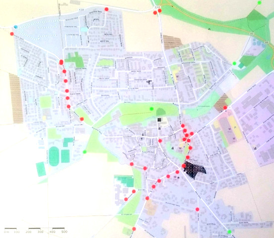

# [ADFC Ortsgruppe Hemmingen/Pattensen](http://adfc-hemmingen-pattensen.github.io/)

## [Mängelkarte für Hemmingen und Pattensen](http://adfc-hemmingen-pattensen.github.io/MaengelHemPat.html)

Für Details bitte auf die **Markierungen klicken**, im Pop-Up Fenster wird dann ein Link zu weiteren Details angezeigt.

### Details in Mängelliste

Die Mängelkarte gibt nur einen groben Überblick. Details und mögliche Maßnahmen sind in den Mängelliste für 

- [Mängelliste Hemmingen](http://adfc-hemmingen-pattensen.github.io/MaengellisteHem/) und 
- [Mängelliste Pattensen](http://adfc-hemmingen-pattensen.github.io/MaengellistePat/) beschrieben.

### Legende

- Rot - Gefahr
- Blau - Unbequem
- Grün - Erledigt oder kurzfristige Zusage
- Violet - Wunsch

**<a href="http://umap.openstreetmap.fr/de/map/untitled-map_84202">Vollbildanzeige</a>** - Ein Service von [umap](https://umap.openstreetmap.fr/de/), ein OpenStreetMap Projekt

<iframe width="100%" height="1000px" frameBorder="0" src="https://umap.openstreetmap.fr/de/map/untitled-map_84202?scaleControl=false&miniMap=false&scrollWheelZoom=false&zoomControl=true&allowEdit=false&moreControl=true&datalayersControl=true&onLoadPanel=undefined&captionBar=false#12/52.25/9.77"></iframe>

<!--Karte ändern? *Nur für Eingeweihte* Bitte Passwort eingeben: <input id='password' type='text'  />
<a href="http://umap.openstreetmap.fr/en/map/anonymous-edit/84202%3Aph6FODg7dYzrRQ52fIZQAQ8cMEU" onclick="javascript:return validatePass()">und Click hier</a>
-->

<!-- [*Karte ändern (Nur für Experten)*](http://umap.openstreetmap.fr/en/map/anonymous-edit/84202%3Aph6FODg7dYzrRQ52fIZQAQ8cMEU)
-->
<!-- Clone 20160510 http://umap.openstreetmap.fr/en/map/anonymous-edit/84746%3AuOs5nHOnczbDxX4cLp4u4mhcuCg -->
<!-- Clone 201605xx -->

### Schadenmeldungen

- Hemmingen: [Schadenmeldungen](https://www.stadthemmingen.de/hemminger-sein/maengel-schaden-melden/)
  - Radwegeführung Stadtbahnbaustelle

> Beschwerden bitte direkt am Infrastrukturgesellschaft (Infra), *Bürgersprechstunden: Mittwochs, 15 bis 17 Uhr* im Büro Göttinger Landstraße > 44 (neben Volksbank) in Hemmingen-Westerfeld melden.
> 
> 
> 
> - Info: https://www.infra-hannover.de/hemmingenwesterfeld/
> - Email: https://www.infra-hannover.de/kontakt/
- Pattensen:
[Ideen-Anregungen-Beschwerden](https://www.pattensen.de/B%C3%BCrger-Familie/Ideen-Anregungen-Beschwerden)
- Hannover: [Ideen und Beschwerden](https://e-government.hannover-stadt.de/impulsweb.nsf/)
- Laatzen:[Sags uns einfach](https://www.laatzen.de/de/sags-uns-einfach.html)
- ADFC Hemmingen / Pattensen: Kontakt Jens Spille, E-Mail: <j.spille@adfc-hannover.de>

### Info-Stand
Am verkaufsoffenen Sonntag, den 10. April 2016 am Rewe-Center, hatte der **ADFC einen Infostand** aufgebaut. Die Besucher konnten mithilfe von Klebepunkten positive und auch kritische Radwegeführungen in Pattensen markieren. 

----
tschuess
