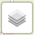
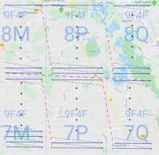

## [ADFC Ortsgruppe Hemmingen/Pattensen](http://adfc-hemmingen-pattensen.github.io/)

## [Mängelliste für Hemmingen](http://adfc-hemmingen-pattensen.github.io/MaengellisteHem)

> Letzte Änderung: LetzteAenderung  
> Autor: Jens Spille

Die Radverkehrsmängel und Verbesserungsvorschläge, die auf dieser Seite gelistet sind, beziehen sich auf unsere [Mängelkarte](http://adfc-hemmingen-pattensen.github.io/MaengelHemPat.html). Somit steht einmal zur Übersicht die Mängelkarte und andererseits diese Liste zur Verfügung. 

**Kurzbedienung der Karte**

>   Vollbildanzeige  
>   Auswahl der angezeigten Elemente

<iframe width="100%" height="830px" frameBorder="0" allowfullscreen=true src="https://adfc-hemmingen-pattensen.github.io/MaengelkarteHem/ADFC-Map.html"></iframe>

# Akute Schadenmeldungen

- Stadt Hemmingen: [https://www.stadthemmingen.de/hemminger-sein/maengel-schaden-melden/](https://www.stadthemmingen.de/hemminger-sein/maengel-schaden-melden/)
- Radwegeführung Stadtbahnbaustelle

> Beschwerden bitte direkt am Infrastrukturgesellschaft (Infra), *Bürgersprechstunden: Mittwochs, 15 bis 17 Uhr* im Büro Göttinger Landstraße > 44 (neben Volksbank) in Hemmingen-Westerfeld melden.
> 
> 
> 
> - Info: https://www.infra-hannover.de/hemmingenwesterfeld/
> - Email: https://www.infra-hannover.de/kontakt/

- Meldungen an den ADFC Hemmingen / Pattensen

> Bitte Ortsbeschreibung, Mangel und mögliche Maßnahme an 

# PlusCode (Open Location Code)

Zur lokalen Identifizierung der Position verwenden wir den Plus Code [https://plus.codes/](https://plus.codes/). Statt in Längen- und Breitengraden wird die Erde dabei in Bereiche aufgeteilt, die wieder in Unterbereiche aufgeteilt werden usw.
Das erlaubt es Positionen grob zu gruppieren. 

Hemmingen liegt auf den Gebieten 9F4F**7M**, 9F4F**7P**, 9F4F**7Q**, 9F4F**8M**, 9F4F**8P**, 9F4F**8Q** die jeweils wieder in 20 x 20 Untergebiete aufgeteilt sind usw. So befindet sich zum Beispiel die Fahrrad-Selbsthilfewerkstatt auf den Gebiet [9F4F**8P**9F](https://plus.codes/9F4F8P9F). Die kleinsten Bereiche sind ca. 3 x 3 Meter groß und werden mit zwei weitere Ziffern versehen [9F4F8P9F**+J9**](https://plus.codes/9F4F8P9F+J9). Die ersten vier Ziffern 9F4F beschreiben den Bereich um Hannover, diese Ziffern werden hier weggelassen. Auch [Google Maps](https://www.google.com/maps/search/?api=1&query=9F4F8P9F%2BJ9) lässt den PlusCode zur Positionsbestimmung zu.

Wenn man die Positionen Alphabetisch sortiert bilden die Positionen einen Zick-Zack Kurs auf der Karte ab, und zwar beginnend unter links bis ober rechts auf der Karte.

# Mängelliste

---

