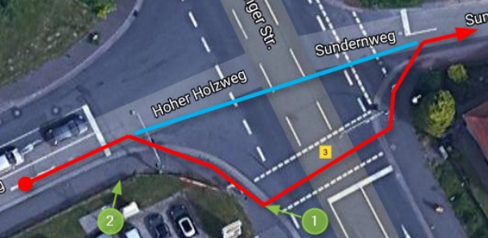
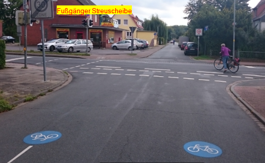
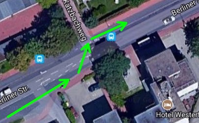
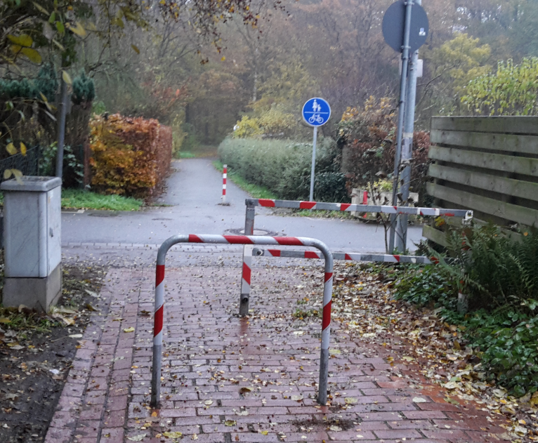
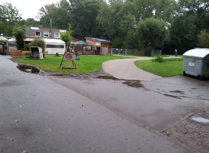
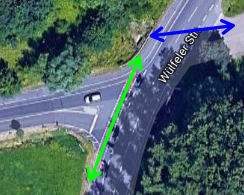

## [ADFC Ortsgruppe Hemmingen/Pattensen](http://adfc-hemmingen-pattensen.github.io/)

## [Mängelliste für Hemmingen](http://adfc-hemmingen-pattensen.github.io/MaengellisteHem)

> Letzte Änderung: LetzteAenderung  
> Autor: Jens Spille

Die Radverkehrsmängel und Verbesserungsvorschläge, die auf dieser Seite gelistet sind, beziehen sich größtenteils auf unsere [Mängelkarte](http://adfc-hemmingen-pattensen.github.io/MaengelHemPat.html) (Übersicht). Somit steht einmal zur Übersicht die Mängelkarte zur Verfügung, andererseits steht diese Liste mit detaillierteren Angaben zur Verfügung. 

Link zur [**Mängelkarte**](http://adfc-hemmingen-pattensen.github.io/MaengelHemPat.html)  

## Übersicht

- [ADFC Ortsgruppe Hemmingen/Pattensen](#adfc-ortsgruppe-hemmingenpattensen)
    - [Mängelliste für Hemmingen](#mängelliste-für-hemmingen)
    - [Übersicht](#übersicht)
    - [Open Location Code](#open-location-code)
- ["Stadtgespräch" der Grünen Ortsgruppe](#stadtgespräch-der-grünen-ortsgruppe)
- [An der K227 fehlt ein Radweg](#an-der-k227-fehlt-ein-radweg)
    - [OLC 7M8V+Q4](#olc-7m8vq4)
- [Lücke von Pattenser Feldweg nach Hiddestorf](#lücke-von-pattenser-feldweg-nach-hiddestorf)
    - [OLC 7PMQ+G5](#olc-7pmqg5)
- [Weg an Arnumer Landwehr nass und rutschig](#weg-an-arnumer-landwehr-nass-und-rutschig)
    - [OLC 7PXX+MM](#olc-7pxxmm)
- [Radweg zwischen Harkenbleck und Reden - Bankett ist abgesackt](#radweg-zwischen-harkenbleck-und-reden---bankett-ist-abgesackt)
    - [OLC 7QPG+76](#olc-7qpg76)
- [Pfad von Loydbrunnenweg bis zur Ihme ist sanierungsbedürftig](#pfad-von-loydbrunnenweg-bis-zur-ihme-ist-sanierungsbedürftig)
    - [OLC 8M7R+VR](#olc-8m7rvr)
- [Umbau Arnum Mitte - Shared Space](#umbau-arnum-mitte---shared-space)
    - [OLC 8P2Q+XR](#olc-8p2qxr)
- [Bockstraße bis Beethovenstraße - Lückenschluss fehlt](#bockstraße-bis-beethovenstraße---lückenschluss-fehlt)
    - [OLC 8P2H+WH](#olc-8p2hwh)
- [Kreuzung B3 (alt) - Zwischen Hoher Holzweg und Im Sundern - Unklare Verkehrsführung](#kreuzung-b3-alt---zwischen-hoher-holzweg-und-im-sundern---unklare-verkehrsführung)
    - [OLC 8P5M+RG](#olc-8p5mrg)
- [Kreuzung Mutter Buermann - Querungshilfe fehlt](#kreuzung-mutter-buermann---querungshilfe-fehlt)
    - [OLC 8P77+W8](#olc-8p77w8)
- [Ausfahrt auf die Freda-Wüsthoff-Straße - unübersichtlich](#ausfahrt-auf-die-freda-wüsthoff-straße---unübersichtlich)
    - [OLC 8P7G+46](#olc-8p7g46)
- [Bankett B3 zwischen Westerfeld und Arnum ist abgesackt](#bankett-b3-zwischen-westerfeld-und-arnum-ist-abgesackt)
    - [OLC 8P7J+98](#olc-8p7j98)
- [Alle 3 Kreisel mit Radwege Rot Markierung versehen](#alle-3-kreisel-mit-radwege-rot-markierung-versehen)
    - [OLC 8P89+C7](#olc-8p89c7)
- [Deveser Straße zur Radfahrstraße umwidmen](#deveser-straße-zur-radfahrstraße-umwidmen)
    - [OLC 8P96+3V](#olc-8p963v)
- [Radweg Weetzener Landstraße - Löcher, Brüche und Unebenheiten](#radweg-weetzener-landstraße---löcher-brüche-und-unebenheiten)
    - [OLC 8P9M+QW](#olc-8p9mqw)
- [Im Hammfeld - Einige Unebenheiten](#im-hammfeld---einige-unebenheiten)
    - [OLC 8P9X+G7](#olc-8p9xg7)
- [Querung Brot Henke](#querung-brot-henke)
    - [OLC 8PCW+5H](#olc-8pcw5h)
- [Dorfstraße - Enge Fahrbahn - Tempo 30 u. Überholverbot](#dorfstraße---enge-fahrbahn---tempo-30-u-überholverbot)
    - [OLC 8PCX+H4](#olc-8pcxh4)
- [Saarstraße - Zugang Deveser Straße](#saarstraße---zugang-deveser-straße)
    - [OLC 8PFC+M26](#olc-8pfcm26)
- [Berliner Straße - Linksseitiger Radweg Katzbachweg - Querung ohne Führung](#berliner-straße---linksseitiger-radweg-katzbachweg---querung-ohne-führung)
    - [OLC 8PFG+4G](#olc-8pfg4g)
- [Berliner Straße - Radwegebenutzungspflicht überprüfen](#berliner-straße---radwegebenutzungspflicht-überprüfen)
    - [OLC 8PFH+FM](#olc-8pfhfm)
- [Geradeausfahrer aus Dorle-und-Albrecht-Heuer-Weg werden ignoriert](#geradeausfahrer-aus-dorle-und-albrecht-heuer-weg-werden-ignoriert)
    - [OLC 8PFJ+M8](#olc-8pfjm8)
- [Bordsteinabsenkung zwischen Berliner Straße u. Döhrener Straße notwendig](#bordsteinabsenkung-zwischen-berliner-straße-u-döhrener-straße-notwendig)
    - [OLC 8PFW+JW](#olc-8pfwjw)
- [Döhrener Straße Seniebachbrücke - unangenehme Höhenunterschiede](#döhrener-straße-seniebachbrücke---unangenehme-höhenunterschiede)
    - [OLC 8PFX+Q2](#olc-8pfxq2)
- [Eine Fahrradstraße die keine sein darf](#eine-fahrradstraße-die-keine-sein-darf)
    - [OLC 8PGG+VC](#olc-8pggvc)
- [Orientierungshilfe zur gefahrlosen Umfahrung der Stadtbahn Baustelle](#orientierungshilfe-zur-gefahrlosen-umfahrung-der-stadtbahn-baustelle)
    - [OLC 8PGF+2H](#olc-8pgf2h)
- [Engstelle nach Umbau Stadtbahnverlängerung](#engstelle-nach-umbau-stadtbahnverlängerung)
    - [OLC 8PGF+J2](#olc-8pgfj2)
- [Berliner Straße - Einmündung Hohe Bünte begradigen](#berliner-straße---einmündung-hohe-bünte-begradigen)
    - [OLC 8PGR+7W](#olc-8pgr7w)
- [Berliner Straße - Haltestelle KGS - Konflikt zwischen Wartenden und Radfahrern](#berliner-straße---haltestelle-kgs---konflikt-zwischen-wartenden-und-radfahrern)
    - [OLC 8PGV+4C](#olc-8pgv4c)
- [Am Siek - Drängelgitter abbauen](#am-siek---drängelgitter-abbauen)
    - [OLC 8PHG+RW](#olc-8phgrw)
- [Hohe Bünte - Verbindung Fahrradstraße zum Radweg optimieren](#hohe-bünte---verbindung-fahrradstraße-zum-radweg-optimieren)
    - [OLC 8PJR+55](#olc-8pjr55)
- [Hemminger Kirchweg nahe Osterbrückenweg - Bruchkante](#hemminger-kirchweg-nahe-osterbrückenweg---bruchkante)
    - [OLC 8PPQ+5H](#olc-8ppq5h)
- [Lücke Wilkenburg - Grassdachhaus](#lücke-wilkenburg---grassdachhaus)
    - [OLC 8Q59+JP](#olc-8q59jp)
- [Leinebrücke zum Grassdachhaus](#leinebrücke-zum-grassdachhaus)
    - [OLC 8Q5G+](#olc-8q5g)
- [Querung Dörrieweg - Kösterecke - Bordsteinabsenkung](#querung-dörrieweg---kösterecke---bordsteinabsenkung)
    - [OLC 8Q63+HP](#olc-8q63hp)
- [Ortsdurchfahrt Wilkenburg - Radweg-Nichtradweg-Radweg](#ortsdurchfahrt-wilkenburg---radweg-nichtradweg-radweg)
    - [OLC 8Q64+XF](#olc-8q64xf)
- [L 389 gefährliche Schlaglöcher im Radweg - Sturzgefahr](#l-389-gefährliche-schlaglöcher-im-radweg---sturzgefahr)
    - [OLC 8Q84+6P](#olc-8q846p)
- [Hotel zur Post - Gefährliche Einfädelung und spitzwinklig Querung](#hotel-zur-post---gefährliche-einfädelung-und-spitzwinklig-querung)
    - [OLC 8Q92+PM](#olc-8q92pm)
- [Wilkenburger Spinne - Gefährliche Zweirichtungsquerung](#wilkenburger-spinne---gefährliche-zweirichtungsquerung)
    - [OLC 8Q94+VR](#olc-8q94vr)
- [Orientierungslos am Ortseingang - fehlende Ortstafeln](#orientierungslos-am-ortseingang---fehlende-ortstafeln)
    - [OLC 8Q98+W4](#olc-8q98w4)
- [Wilkenburger Spinne - Zeichen für KFZ aus Richtung Süden - Achtung Radfahrer](#wilkenburger-spinne---zeichen-für-kfz-aus-richtung-süden---achtung-radfahrer)
    - [OLC 8Q94+WW](#olc-8q94ww)
- [Radweg Wilkenburger Spinne bis Ziegenbocksbrücke - bei Nässe rutschig](#radweg-wilkenburger-spinne-bis-ziegenbocksbrücke---bei-nässe-rutschig)
    - [OLC 8QC7+2M](#olc-8qc72m)
- [Wilkenburger Starße - Kritik an Verkehrszeichen](#wilkenburger-starße---kritik-an-verkehrszeichen)
    - [OLC 8QF6+GV](#olc-8qf6gv)
- [Radwegverschwenkung und Einengung auf Brücke](#radwegverschwenkung-und-einengung-auf-brücke)
    - [OLC 8QH3+R4](#olc-8qh3r4)

## Open Location Code

Um eine Zuordnung der Mängel und Verbesserungsvorschläge zu ermöglichen, ist jeder **Pin** und jede **Linie** auf der Mängelkarte mit einer eindeutigen Bezeichnung versehen.

Als Bezeichner wird der [Open Location Code](https://de.wikipedia.org/wiki/Open_Location_Code) verwendet. Der Open Location Code (OLC) gibt geographische Koordinaten an. Gegenüber der konventionellen Schreibweise in Winkelgrad ist er kompakt, eindeutig, und leicht an die erforderliche Genauigkeit anzupassen. OLC wird auch als [**"Plus Codes"**](https://plus.codes/9F4F8P9F+J9) bezeichnet.

So befindet sich zum Beispiel die Fahrrad-Selbsthilfewerkstatt mit den Ziffern [**9F4F8P9F+J9**](https://plus.codes/9F4F8P9F+J9) an der den geographische Koordinaten 52.319063 Grad Nord und 9.723438 Grad Ost (Heinrich-Hertz-Straße 23, 30966 Hemmingen, Deutschland). Das erste Ziffernpaar des Open Location Codes zerlegt den Globus in 20 × 20 Grad große Flächen. Norddeutschland liegt im Sektor 9F. 

 

Jedes weitere OLC-Ziffernpaar „zwanzigselt“ den bis dahin definierten Bereich in jeder Dimension. Die Ziffern 9F4F beschreiben den Bereich um Hannover den Area Code. Der Area Code wird hier weggelassen, da ohnehin klar ist, welcher Ort gemeint ist.

 

Zum Auffinden des Bereichs gibt man zum Beispiel die Ziffern '9F4F8P9F+J9' auf der Webseite [https://plus.codes](https://plus.codes/9F4F8P9F+J9) ein. 

# "Stadtgespräch" mit dem Ortsverband Bündnis 90 / die Grünen

Am 2019-09-09 bei strömenden Regen hatte die Ortsverband Bündnis 90/die Grünen im Rahmen der Reihe "Stadtgespräch" zu einem "Stadtgespräch on tour" zum Thema "Fahrradverkehr" in Hemmingen eingeladen. In diesem Zusammenhang entstand die folgende Mängeltour [PDF](0000+00_Mängeltour.pdf).

# An der K227 fehlt ein Radweg
## OLC 7M8V+Q4

| Kurzbeschreibung | An der K227 fehlt ein Radweg                                                                 |
| ---------------: | -----------------------                                                                      |
| Mängelkarte      | [Link](http://umap.openstreetmap.fr/en/map/adfc-hemmingen-pattensen_84202#13/52.2690/9.6937) |
| Einstelldatum    | 2017-09-13                                                                                   |
| Status           | Der Verwaltung bekannt                                                                       |
| Autor            | Jens Spille                                                                                  |
| Ort              | Hemmingen - Verbindung Hiddestorf (L389) - Lüdersen - K227                                   |
| Fahrtrichtung    | In beiden Richtungen                                                                         |
| Verantwortlich   | Kreisstraße - Region Hannover                                                                |

### Ist Zustand/Mangel/Gefahr

Entlang der K227 fehlt ein Radweg. Die Straße ist schmal und es ist 2013 zu einem [tödlichen Unfall](https://www.presseportal.de/blaulicht/pm/66841/2396843) einer 24-jährige Radfahrerin gekommen.

### Mögliche Maßnahmen

Bau eines Radweges.

### Status

# Lücke von Pattenser Feldweg nach Hiddestorf
## OLC 7PMQ+G5

| Kurzbeschreibung | Lücke von Pattenser Feldweg nach Hiddestorf                                                  |
| ---------------: | -----------------------                                                                      |
| Mängelkarte      | [Link](http://umap.openstreetmap.fr/de/map/adfc-hemmingen-pattensen_84202#15/52.2861/9.7442) |
| Einstelldatum    | 2015                                                                                         |
| Status           | offen                                                                                        |
| Autor            | Radverkehrskonzept                                                                           |
| Ort              | Pattenser Feldweg nach Hiddestorf                                                            |
| Fahrtrichtung    | In beiden Richtungen                                                                         |
| Verantwortlich   | Stadt Hemmingen                                                                              |

### Ist Zustand/Mangel/Gefahr

Geforderter Lückenschluss aus Radverkehrskonzept 2015.

### Mögliche Maßnahmen
Verbindung herstellen

### Status
Aus Radverkehrskonzept 2015 bekannt.

# Weg an Arnumer Landwehr nass und rutschig
## OLC 7PXX+MM

| Kurzbeschreibung | Weg an Arnumer Landwehr nass und rutschig                                                    |
| ---------------: | -----------------------                                                                      |
| Mängelkarte      | [Link](http://umap.openstreetmap.fr/de/map/adfc-hemmingen-pattensen_84202#15/52.2990/9.7526) |
| Einstelldatum    | 2019-01-23                                                                                   |
| Status           | offen                                                                                        |
| Autor            | 23. RadelTreff                                                                               |
| Ort              | Osterbruchweg - Verlängerung an der Arnumer Landwehr                                                      |
| Fahrtrichtung    | In beiden Fahrtrichtungen                                                                    |
| Verantwortlich   | Stadt Hemmingen                                                                              |

### Ist Zustand/Mangel/Gefahr
Der Osterbruchweg - in der Verlängerung an der Arnumer Landwehr - ist bei Regen schlammig. Es besteht Rutschgefahr.

### Mögliche Maßnahmen
Neues Mineralgemisch aufbringen und regelmäßig von Laub befreien, bevor es zerfällt.

### Status

# Radweg zwischen Harkenbleck und Reden - Bankett ist abgesackt
## OLC 7QPG+76

| Kurzbeschreibung | Radweg zwischen Harkenbleck und Reden - Bankett ist abgesackt                                 |
| ---------------: | -----------------------                                                                       |
| Mängelkarte      | [Link](https://umap.openstreetmap.fr/en/map/adfc-hemmingen-pattensen_84202#15/52.2869/9.7769) |
| Einstelldatum    | 2017-09-10                                                                                    |
| Status           | offen                                                                                         |
| Autor            | Jens Spille                                                                                   |
| Ort              | Verbindung zwischen Harkenbleck und Reden                                                     |
| Fahrtrichtung    | In beiden Richtungen                                                                          |
| Verantwortlich   | Region Hannover                                                                               |

### Ist Zustand/Mangel/Gefahr
Sturzgefahr am Radwegrand, da das Bankett abgesackt ist. 

### Mögliche Maßnahmen
Bankett auffüllen und befestigen.

### Status

# Pfad von Loydbrunnenweg bis zur Ihme ist sanierungsbedürftig
## OLC 8M7R+VR

| Kurzbeschreibung | Pfad von Loydbrunnenweg bis zur Ihme ist sanierungsbedürftig                                 |
| ---------------: | -----------------------                                                                      |
| Mängelkarte      | [Link](http://umap.openstreetmap.fr/de/map/adfc-hemmingen-pattensen_84202#15/52.3150/9.6952) |
| Einstelldatum    | 2019-01-23                                                                                   |
| Status           | offen                                                                                        |
| Autor            | Jens Spille                                                                                  |
| Ort              | Devese, Loydbrunnenweg bis zur Ihme                                                          |
| Fahrtrichtung    | In beiden Fahrrichtungen                                                                     |
| Verantwortlich   | Hier Stadt Hemmingen                                                                         |

### Ist Zustand/Mangel/Gefahr
Der Weg entlang der Ihme, auf dem Gebiet Ronnenberg, wurde im Sommer 2019 saniert. Jetzt fehlt noch die Verbindung zwischen diesem Weg und dem Loydbrunnenweg - der Teil des Weges auf Hemminger Gebiet.

### Mögliche Maßnahmen
Ertüchtigung des Weges

### Status

# Umbau Arnum Mitte - Shared Space
## OLC 8P2Q+XR 

| Kurzbeschreibung | Umbau Arnum Mitte - Shared Space                                                              |
| ---------------: | -----------------------                                                                       |
| Mängelkarte      | [Link](https://umap.openstreetmap.fr/en/map/adfc-hemmingen-pattensen_84202#15/52.3022/9.7435) |
| Einstelldatum    | 2019-03-17                                                                                    |
| Status           | offen                                                                                         |
| Autor            | ADFC Team                                                                                     |
| Ort              | Arnum Mitte                                                                                   |
| Fahrtrichtung    | In allen Richtungen                                                                           |
| Verantwortlich   | Stadt Hemmingen                                                                               |

### Ist Zustand/Mangel/Gefahr
Die Bundesstraße 3 in Arnum Mitte soll nach Fertigstellung der B3-Neu zurückgebaut werden. 

### Mögliche Maßnahmen
Der ADFC Hemmingen/Pattensen plädiert für einen "gemeinsamen Raum" im Zentrumsbereich - auch "Shared-Space" genannt - von der Einmündung Klapperweg auf die Göttinger Strasse im Norden bis zur Einmündung Harkenblecker Weg im Süden. 

Der Bereich selber sollte nicht mehr streng unterteilt sein nach Verkehrsflächen für die einzelnen Nutzergruppen und muss durch eine deutliche Kennzeichnung von der übrigen Straßengestaltung - bestehend aus zwei Fahrspuren mit Fahrrad-Schutzstreifen - getrennt werden, zum Beispiel durch 
eine besondere Pflasterung und Stadttore.  

Die Ausgestaltung muss an die zu erwartenden Verkehrsdichte angepasst werden und eventuell Schutzräume für Fußgänger sowie Querungshilfen für Kinder beinhalten. Der Kfz-Verkehr sollte durch die Umgestaltung in seinen Verhaltensweisen so beeinflusst werden, dass sich eine langsamere, aber stetige und reibungslose Verkehrsabwicklung einstellt. Es soll damit erreicht werden dass der Weg über die Umgehungsstraße die attraktivere Alternative als Verbindung in der Nord-Süd-Achse wird. 

In der Ortschaft Bohmte (Nds.), einer Stadt mit etwa 12.600 Einwohnern (2016) in der Nähe von Osnabrück, wird dieses "Shared-Space" - Konzept nach niederländischen Vorbildern seit vielen Jahren erfolgreich angewendet.  

Im Verkehrsschwerpunkt am zentralen Platz in Bohmte überlagern sich zwei Kreuzungen, die von täglich 12.000 Fahrzeugen passiert werden. Shared-Space ist keine "Spielstraße" und durchaus für Arnum umsetzbar. Gerne würden wir eine gemeinsame Exkursion mit allen Interessierten nach Bohmte durchführen. 

Der ADFC Hemmingen/Pattensen fordert einen Gemeinschaftsraum statt einer Verkehrs-Trasse. Ziel ist eine Gestaltung des Straßenraumes, die intuitiv zu einer langsameren Fahrweise und einer stärkeren gegenseitigen Rücksichtnahme anhält. Dieses schließt rollenden und parkenden Verkehr sowie Räume zum Verweilen und Kommunizieren mit ein. 

[ADFC-Stellungnahme_Städtebauliche-Sanierung-Arnum-Mitte.pdf](8P2Q+XR_ADFC-Stellungnahme_Städtebauliche-Sanierung-Arnum-Mitte.pdf)

### Status
- 2019-03-17 - Jens Spille - ADFC-Stellungsnahme wurde als Stellungsnahme an den Bürgermeister, die Verwaltung und die Fraktionen geschickt.
- 2019-09-26 - Jens Spille - [Konzeptplanung Ortsdurchfahrt Arnum](https://www.stadthemmingen.de/allris/vo020.asp?VOLFDNR=1299) der Stadt Hemmingen. Was hier als Shared-Space beschrieben wird entspricht nicht unseren Vorstellungen.

# Bockstraße bis Beethovenstraße - Lückenschluss fehlt
## OLC 8P2H+WH

| Kurzbeschreibung | Bockstraße bis Beethovenstraße - Lückenschluss fehlt                                         |
| ---------------: | -----------------------                                                                      |
| Mängelkarte      | [Link](http://umap.openstreetmap.fr/de/map/adfc-hemmingen-pattensen_84202#16/52.3027/9.7287) |
| Einstelldatum    | 2015                                                                                         |
| Status           | offen                                                                                        |
| Autor            | Radverkehrskonzept                                                                           |
| Ort              | Bockstraße bis Beethovenstraße                                                               |
| Fahrtrichtung    | In beiden Richtungen                                                                         |
| Verantwortlich   | Stadt Hemmingen                                                                              |

### Ist Zustand/Mangel/Gefahr
Geforderter Lückenschluss aus Radverkehrskonzept 2015.

### Mögliche Maßnahmen
Verbindung herstellen

### Status
Aus Radverkehrskonzept 2015 bekannt.

# Kreuzung B3 (alt) - Zwischen Hoher Holzweg und Im Sundern - Unklare Verkehrsführung
## OLC 8P5M+RG

| Kurzbeschreibung | Kreuzung B3 (alt) - Zwischen Hoher Holzweg und Im Sundern - Unklare Verkehrsführung          |
| ---------------: | -----------------------                                                                      |
| Mängelkarte      | [Link](http://umap.openstreetmap.fr/de/map/adfc-hemmingen-pattensen_84202#16/52.3097/9.7331) |
| Einstelldatum    | 2018-01-05 Stellungsnahme vom VEP2030                                                        |
| Status           | Vorschlag                                                                                    |
| Autor            | Jens Spille                                                                                  |
| Ort              | Kreuzung B3 (alt) / Hoher Holzweg                                                            |
| Fahrtrichtung    | Alle                                                                                         |
| Verantwortlich   | Hemmingen (in Zukunft)                                                                       |

### Ist Zustand/Mangel/Gefahr

Vom Hohen Holzweg kommend gibt es keinen Radweg zur Ampel. Unklare Verkehrsführung für Radfahrer, da die Streuscheibe der Ampel (LSA) eine kombinierte Fußgänger und Radfahrer Ampel ist. Wenn Radfahrer vor der Shell Tankstelle stehen, besteht eine Gefahr durch Rechtsabbieger. Verwirrung durch ungünstige Verkehrsführung.

Radfahrer aus Hoher Holzweg in Richtung Sundernweg richten sich teilweise nach der LSA mit der gemeinsamen Streuscheibe für Fuß- und Radverkehr. Dazu wechseln sie von der Fahrbahn Hoher Holzweg auf den Gehweg mit Hochbord, um die Fussgänger-Furt an der LSA zu benutzen. Rechts abbiegende Autofahrer aus Hoher Holzweg übersehen leicht die Fußgänger und Radfahrer, da ein Schild den Blick versperrt.

Das Radfahren auf dem Gehweg auf der linken Seite zwischen Gartenstraße/Mühlenweg und der Shell-Tankstelle ist nicht freigegeben. Einen sicheren Übergang von der Gartenstraße auf den kombinierten Fuss-Radweg auf der rechten Fahrbahnseite gibt es nicht, deshalb fahren die Schüler, linksseitig auf den Fußweg, um dann die LSA Hoher Holzweg - Sundernweg zu benutzen. In umgekehrter Richtung ist der Fußweg an der B3 für Radfahrer freigegeben durch das Zusatzschild "Fahrrad frei".

### Mögliche Maßnahmen

Eine Radfahrerfurt nahe der Fahrbahn einrichten (blaue Linie). -  Überweg in Höhe Gartenstraße einrichten.

### Status

- 2018-01-05 J. Spille: Verbesserungsvorschlag wurde in unserer Stellungsnahme vom VEP2030 wiederholt.
- 2018-11 J. Spille: Vorschlag wurde im Rahmen einer Ortsbegehung wiederholt.
- 2018-11 J. Spille: Alles ist offen. Hier könnte evtl. auch ein Kreisverkehr entstehen.
- 2019-09-26-Do - Jens Spille - Es wurde wieder ein Kreisverkehr vorgeschlagen. Radverkehrsführung auf Fahrbahn "Konzept für Arnum Mitte".

# Kreuzung am Hotel "Mutter Buermann" - Querungshilfe fehlt
## OLC 8P77+W8

| Kurzbeschreibung | Kreuzung am Hotel "Mutter Buermann" - Querungshilfe fehlt                                               |
| ---------------: | -----------------------                                                                      |
| Mängelkarte      | [Link](http://umap.openstreetmap.fr/de/map/adfc-hemmingen-pattensen_84202#15/52.3150/9.7132) |
| Einstelldatum    | 2017-12-05-Di                                                                                |
| Status           | Verbesserungsvorschlag                                                                       |
| Autor            | Jens Spille                                                                                  |
| Ort              | Devese K 221 / Stadtweg                                                                       |
| Fahrtrichtung    | Von West nach Ost                                                                            |
| Verantwortlich   | Region                                                                                       |

### Ist Zustand/Mangel/Gefahr
Radfahrende auf der Strasse "Vorm Dorfe" aus Richtung Westen müssen ungesichert die Fahrbahn kreuzen, um auf den linksseitigen Radweg zu gelangen. Radfahrende haben keine vernünftige Alternative um die Fahrbahn sicher zu queren.

### Mögliche Maßnahmen

Angebot einer Alternative - z.B. indirektes Abbiegen.

### Status

- 2018-01-05 J. Spille: Verbesserungsvorschlag wurde in unserer Stellungsnahme vom VEP2030 vorgestellt. 
- 2018-10 J.Spille: Der Ortsverband BÜNDNIS 90/DIE GRÜNEN haben ein Gesprächsangebot gemacht.

# Ausfahrt auf die Freda-Wüsthoff-Straße - unübersichtlich
## OLC 8P7G+46

| Kurzbeschreibung | Ausfahrt auf die Freda-Wüsthoff-Straße - unübersichtlich                                       |
| ---------------: | -----------------------                                                                        |
| Mängelkarte      | [Link](http://umap.openstreetmap.fr/de/map/adfc-hemmingen-pattensen_84202#17/52.31272/9.72787) |
| Einstelldatum    | 2015                                                                                           |
| Status           | offen                                                                                          |
| Autor            | Radverkehrskonzept                                                                             |
| Ort              | Feld südöstlich Freda-Wüsthoff-Straße                                                          |
| Fahrtrichtung    | In beiden Richtungen                                                                           |
| Verantwortlich   | Stadt Hemmingen                                                                                |

### Ist Zustand/Mangel/Gefahr
Ausfahrt auf die Freda-Wüsthoff-Straße ist unübersichtlich.

### Mögliche Maßnahmen
1. Sichtdreieck herstellen. Hecke kürzen.
2. Warnschilder - Achtung Radfahrer aufstellen.

### Status

- 2019-09-09 Jens Spille - Im Stadtgespräch mit Bündnis 90 / Die Grünen erörtert.

# Bankett B3 zwischen Westerfeld und Arnum ist abgesackt
## OLC 8P7J+98

| Kurzbeschreibung | Bankett B3 zwischen Westerfeld und Arnum ist abgesackt                                       |
| ---------------: | -----------------------                                                                      |
| Mängelkarte      | [Link](http://umap.openstreetmap.fr/en/map/adfc-hemmingen-pattensen_84202#15/52.3114/9.7325) |
| Einstelldatum    | 2017-09-10                                                                                   |
| Status           | Ist der Verwaltung bekannt                                                                   |
| Autor            | Jens Spille                                                                                  |
| Ort              | B3 Verbindung zwischen Arnum und Hemmingen Westerfeld                                        |
| Fahrtrichtung    | In beiden Richtungen                                                                         |
| Verantwortlich   | In Zukunft Stadt Hemmingen                                                                   |

### Ist Zustand/Mangel/Gefahr
Sturzgefahr am Radwegrand, da das Bankett versackt ist. 

### Mögliche Maßnahmen
Bankett auffüllen

### Status
- 2019 - Jens Spille - Radweg soll saniert werden, wegen Beleuchtung.

# Radweg-Querungen aller 3 Kreisel mit rote Markierung versehen
## OLC 8P89+C7

| Kurzbeschreibung | Radweg-Querungen aller 3 Kreisel mit rote Markierung versehen                                |
| ---------------: | -----------------------                                                                      |
| Mängelkarte      | [Link](http://umap.openstreetmap.fr/en/map/adfc-hemmingen-pattensen_84202#16/52.3164/9.7182) |
| Einstelldatum    | 2019-07-03                                                                                   |
| Status           | offen                                                                                        |
| Autor            | 25. RadelTreff                                                                               |
| Ort              | Devese - 3 Kreisel                                                                           |
| Fahrtrichtung    | In allen Fahrtrichtungen                                                                     |
| Verantwortlich   | Region Hannover                                                                              |

### Ist Zustand/Mangel/Gefahr
Mehr Aufmerksamkeit durch KFZ Fahrer gewünscht. Erhöhung der Sicherheit. 

### Mögliche Maßnahmen
Radweg-Querungen aller 3 Kreisel mit rote Markierung versehen

### Status

#  Deveser Straße zur Radfahrstraße umwidmen
## OLC 8P96+3V

| Kurzbeschreibung | Deveser Straße zur Radfahrstraße umwidmen                                                    |
| ---------------: | -----------------------                                                                      |
| Mängelkarte      | [Link](http://umap.openstreetmap.fr/de/map/adfc-hemmingen-pattensen_84202#14/52.3197/9.7219) |
| Einstelldatum    | 2019-07-03                                                                                   |
| Status           | offen                                                                                        |
| Autor            | 25. RadelTreff                                                                               |
| Ort              | Deveser Straße                                                                               |
| Fahrtrichtung    | In beiden Richtungen                                                                         |
| Verantwortlich   | Regionstraße                                                                                 |

### Ist Zustand/Mangel/Gefahr
Die Deveser Straße hat jetzt und auch später wenig KFZ Verkehr und ist sehr gut geeignet den Radverkehr zu fördern.

### Mögliche Maßnahmen
Zur Steigerung des Radverkehrs wird vorgeschlagen die Deveser Straße zur Radfahrstraße umzuwidmen.

### Status

# Radweg Weetzener Landstraße - Löcher, Brüche und Unebenheiten
## OLC 8P9M+QW

| Kurzbeschreibung | Radweg Weetzener Landstraße - Löcher, Brüche und Unebenheiten                                |
| ---------------: | -----------------------                                                                      |
| Mängelkarte      | [Link](http://umap.openstreetmap.fr/de/map/adfc-hemmingen-pattensen_84202#15/52.3189/9.7349) |
| Einstelldatum    | 2019-06-03                                                                                   |
| Status           | Verbesserungskonzept durch Region vorgestellt                                                |
| Autor            | RADar!                                                                                       |
| Ort              | Weetzener Landstraße - östlich B3 (alt)                                                      |
| Fahrtrichtung    | In beiden Fahrtrichtungen                                                                    |
| Verantwortlich   |                                                                                              |

### Ist Zustand/Mangel/Gefahr
Über das Portal RADar! wurde eine neue Meldung eingestellt. ID: 2019-19750

Loch, Unebenheit, Bruch oder Riss im Oberbau erhöht Sturzrisiko. Der Radweg entlang der Weetzener Landstraße zwischen B3 und Hemmingen Dorf ist in einem sehr schlechten Zustand. Neben den Abbrüchen und Versackungen sind auch die Risse zwischen den Abschnitten teilweise schmerzhafte "Stauchstellen" für die Wirbelsäule.

### Mögliche Maßnahmen
Sanierung und Verbreiterung

### Status
- 2018-08-23 - Jens Spille - Herr Vinken (Region Hannover) informiert über die Planungsabsichten der Region Hannover, als zuständige Straßenbaulastträgerin, die Weetzener Landstraße (K 221) zwischen der Einmündung Dorfstraße und dem Kreisverkehr Marie-Curie-Straße/ Alfred-Bentz-Straße umzugestalten. Der Bereich wird in insgesamt 5 Abschnitte unterteilt. Die Planung wird stufenweise umgesetzt.  

[Umgestaltung Weetzener Landstraße (K221) (4579 KB)](https://www.stadthemmingen.de/allris/to020.asp?TOLFDNR=8080)

# Im Hammfeld - Einige Unebenheiten
## OLC 8P9X+G7 

| Kurzbeschreibung | Im Hammfeld - Einige Unebenheiten                                                            |
| ---------------: | -----------------------                                                                      |
| Mängelkarte      | [Link](http://umap.openstreetmap.fr/de/map/adfc-hemmingen-pattensen_84202#15/52.3185/9.7483) |
| Einstelldatum    | 2019-05-27                                                                                   |
| Status           | offen                                                                                        |
| Autor            | RADar!                                                                                       |
| Ort              | Hemmingen - Im Hammfeld                                                                      |
| Fahrtrichtung    | In beiden Richtungen                                                                         |
| Verantwortlich   |                                                                                              |

### Ist Zustand/Mangel/Gefahr
Über RADar! wurde eine neue Meldung eingestellt.  ID: 2019-19311

Adresse: Im Hammfeld, Hemmingen, Wilkenburg, Hemmingen, Region Hannover, Niedersachsen, 30966, Deutschland

Meldungsgrund: Loch

### Mögliche Maßnahmen
Ausbesserung

### Status

# Querung Brot Henke
## OLC 8PCW+5H

| Kurzbeschreibung | Querung Brot Henke                                                                             |
| ---------------: | -----------------------                                                                        |
| Mängelkarte      | [Link](http://umap.openstreetmap.fr/en/map/adfc-hemmingen-pattensen_84202#17/52.32053/9.74647) |
| Einstelldatum    | 2017-09-10                                                                                     |
| Status           | Zustand bekannt - Region will Inkuktionsschleife einbauen.                                     |
| Autor            | Jens Spille                                                                                    |
| Ort              | Hemmingen (Altes Dorf) -  Weetzener Landstraße (K221) - Kreuzung - Im Dorfeld                  |
| Fahrtrichtung    | Im Dorffeld folgend - Nord-Süd und Süd-Nord                                                    |
| Verantwortlich   | Region Hannover                                                                                |

### Ist Zustand/Mangel/Gefahr

Radfahrer die die K211 überqueren möchten müssen sich häufig zwischen den stauenden Fahrzeugen auf der K221 drängeln.

Die Querung der K 221 (aus und in die Fahrradstraße) ist zu Stoßzeiten schwierig, da sich auf der K221 
längere Rückstaus bilden. Das führt dazu, dass Radfahrer den Drücker der Fußgängerampel betätigen, und mit dem Grün 
der Fußgänger-Ampel die K221 überqueren. Dazu müssen sie, wenn sie von Norden kommen, die Gegenfahrtrichtung auf 
Im Dorffeld überqueren.

### Mögliche Maßnahmen
Extra Radfahrer-Ampel. Am besten als Dunkel-Dunkel Ampel geschaltet, damit in ruhigen Zeiten ein zügiges Überqueren möglich wird und keine Rotlicht-Sünder herangezogen werden.

### Status

- 2019 - Jens Spille - Region hat Plan zum Umbau vorgelegt.

[Umgestaltung Weetzener Landstraße (K221) (4579 KB)](https://www.stadthemmingen.de/allris/to020.asp?TOLFDNR=8080)

# Dorfstraße - Enge Fahrbahn - Tempo 30 u. Überholverbot
## OLC 8PCX+H4

| Kurzbeschreibung | Dorfstraße - Enge Fahrbahn - Tempo 30 u. Überholverbot                                       |
| ---------------: | -----------------------                                                                      |
| Mängelkarte      | [Link](http://umap.openstreetmap.fr/de/map/adfc-hemmingen-pattensen_84202#15/52.3219/9.7505) |
| Einstelldatum    | 2019-09-23                                                                                   |
| Status           | offen                                                                                        |
| Autor            | Jens Spille                                                                                  |
| Ort              | Hemmingen Dorf - Dorfstraße                                                                  |
| Fahrtrichtung    | In beiden Richtungen                                                                         |
| Verantwortlich   | Region Hannover                                                                              |

### Ist Zustand/Mangel/Gefahr
Die Dorfstraße ist unübersichtlich und eng. Ein Überholen, auch von Fahrrädern mit einem Abstand von mindestens 1,5 m, ist nicht sicher möglich. 

### Mögliche Maßnahmen
Wir fordern Tempo 30 und ein Überholverbot von Fahrrädern. 

Nach der StVO Novelle von 2019 soll mit der Einführung eines neuen Verkehrszeichens die zuständigen Straßenverkehrsbehörden in Zukunft ein Überholverbot von einspurigen Fahrzeugen (u. a. Fahrrädern) für mehrspurige Kraftfahrzeuge z. B. an Engstellen anordnen können.

[Überholverbot von Fahrrädern und anderen einspurigen Fahrzeugen](https://www.bmvi.de/SharedDocs/DE/Artikel/StV/stvo-novelle.html)

### Status
- 2019-09-09 Jens Spille - Im Stadtgespräch mit Bündnes 90 / Die Grünen erörtert.

# Saarstraße - Zugang Deveser Straße  
## OLC 8PFC+M26

| Kurzbeschreibung | Drängelgitter                                                                                |
| ---------------: | -----------------------                                                                      |
| Mängelkarte      | [Link](http://umap.openstreetmap.fr/de/map/adfc-hemmingen-pattensen_84202#16/52.3240/9.7209) |
| Einstelldatum    | 2019-09-23                                                                                   |
| Status           | offen                                                                                        |
| Autor            | Jens Spille                                                                                  |
| Ort              | Durchgang Saarstraße -  Deveser Straße                                                       |
| Fahrtrichtung    | In beiden Richtungen                                                                         |
| Verantwortlich   | Stadt Hemmingen                                                                              |

### Ist Zustand/Mangel/Gefahr
Umlaufgitter verhindern das Durchkommen von Fahrrädern mit Anhänger und Lastenräder. 

ERA: "Poller sind unzulässig, wo Verkehrsteilnehmer gefährdet oder der Verkehr erschwert werden kann. Sie müssen nachts und bei schlechten Sichtverhältnissen ausreichend erkennbar sein."

### Mögliche Maßnahmen
Umlaufgitter entfernen, evtl. Verengung auf mindestens 2 m, um KFZ Verkehr zu verhindern.

### Status

# Berliner Straße - Linksseitiger Radweg Katzbachweg - Querung ohne Führung 
## OLC 8PFG+4G

| Kurzbeschreibung | Berliner Straße - Linksseitiger Radweg Katzbachweg - Querung ohne Führung                      |
| ---------------: | -----------------------                                                                        |
| Mängelkarte      | [Link](http://umap.openstreetmap.fr/en/map/adfc-hemmingen-pattensen_84202#17/52.32309/9.72669) |
| Einstelldatum    | 2017-09-10                                                                                     |
| Status           | offen                                                                                          |
| Autor            | Jens Spille                                                                                    |
| Ort              | Hemmingen Westerfeld - Berliner Straße (Höhe Katzbachweg)                                      |
| Fahrtrichtung    | In Richtung Ost                                                                                |
| Verantwortlich   | Hemmingen                                                                                      |

### Ist Zustand/Mangel/Gefahr
Radfahrer von der B3 kommend und auf der rechten Seite den Radweg fahrend, müssen ab dem Katzbachweg die linksseitigen verpflichtenden Radweg benutzen. Es gibt keinerlei Führung oder Hilfsmittel um hier die Berliner Straße gefahrlos zu überqueren. Insbesondere von hinten kommenden B3 Rechtsabbieger können schnell übersehen werden.

Radfahrer die aus Richtung Norden von der B3 (alt) kommen, dürfen nicht links bleiben, obwohl Sie 200 Meter später links fahren müssen.

#### Radverkehrskonzept Hemmingen - 6.1.3 Radverkehrsführung Berliner Straße
Die Berliner Straße in Hemmingen-Westerfeld stellt eine wichtige Ost-
West-Verbindung dar und hat aufgrund der anliegenden KGS auch für den
Schulverkehr eine gewisse Bedeutung. Im Straßenzug ist überwiegend
Stadt Hemmingen – Radverkehrskonzept 27
eine Geschwindigkeit von 30 km/h angeordnet. Die Radfahrenden werden
auf einem auf der nördlichen Seite verlaufenden benutzungspflichtigen
gemeinsamer Geh- und Radweg in beiden Fahrtrichtungen geführt.

In Anpassung an die rechtlichen Gegebenheiten und vor dem Ziel den
Radverkehr komfortabel und sicher zu führen, wird empfohlen, die Benutzungspflicht
des gemeinsamen Geh- und Radweges aufzuheben. Für die
Radfahrenden wird eine Führung auf der Fahrbahn empfohlen. Am südlichen
Fahrbahnrand der Berliner Straße ist die Einrichtung eines einseitigen
Schutzstreifens mit einer Mindestbreite von 1,50 m vorzusehen. Der Einsatz
von Schutzstreifen ist vom Verkehrsaufkommen und der Fahrbahnbreite
abhängig. Aufgrund der zur Verfügung stehenden Fahrbahnbreite ist
dies für die nördliche Seite nicht möglich. Somit soll der Radfahrende in
westliche Richtung im Mischverkehr auf der Fahrbahn fahren. Ergänzend
kann der nördliche Seitenraum richtungsbezogen für den Radverkehr freigegeben
werden.

### Mögliche Maßnahmen

1. Aufhebung der Benutzungspflicht
2. Radfahrerfurt über Berliner Straße

### Status

# Berliner Straße - Radwegebenutzungspflicht überprüfen
## OLC 8PFH+FM

| Kurzbeschreibung | Berliner Straße - Radwegebenutzungspflicht überprüfen                                        |
| ---------------: | -----------------------                                                                      |
| Mängelkarte      | [Link](http://umap.openstreetmap.fr/de/map/adfc-hemmingen-pattensen_84202#15/52.3230/9.7308) |
| Einstelldatum    | 2019-06-03                                                                                   |
| Status           | offen                                                                                        |
| Autor            | RADar!                                                                                       |
| Ort              | Berliner Straße zwischen Katzbachweg und Köllnbrinkweg                                       |
| Fahrtrichtung    | In beiden Richtungen - Insbesondere in Richtung Osten                                        |
| Verantwortlich   | Stadt Hemmingen                                                                              |

### Ist Zustand/Mangel/Gefahr
Über RADar! wurde eine neue Meldung eingestellt.  ID: 2019-19545

Adresse: Berliner Straße, Hemmingen, Wilkenburg, Hemmingen, Region Hannover, Niedersachsen, 30966, Deutschland

Meldungsgrund: Radwegbenutzungspflicht überprüfen

Weitere Angaben: Nur zwischen Katzbachweg und Köllnbrinkweg ist für Fahrtrichtung nach Osten ein linksseitiger Radweg vorgeschrieben. Als Radfahrer von Penny kommend muss ich also für diesen Bereich auf die Linke Seite wechseln und danach wieder auf die Rechte Seite fahren, auch wenn sich auf dem Fußweg (Fahrrad frei) zu viele Fußgänger befinden. Warum ist hier die Linke Seite vorgeschrieben?

### Mögliche Maßnahmen
Radwegebenutzungspflicht aufheben.

### Status

# Geradeausfahrer aus Dorle-und-Albrecht-Heuer-Weg werden ignoriert
## OLC 8PFJ+M8

| Kurzbeschreibung | Geradeausfahrer aus Dorle-und-Albrecht-Heuer-Weg werden ignoriert                              |
| ---------------: | -----------------------                                                                        |
| Mängelkarte      | [Link](http://umap.openstreetmap.fr/en/map/adfc-hemmingen-pattensen_84202#17/52.32444/9.73265) |
| Einstelldatum    | 2017-09-10                                                                                     |
| Status           | Verwaltung bekannt                                                                             |
| Autor            | Jens Spille                                                                                    |
| Ort              | Hemmingen - Westerfeld - Berliner Straße - Köllnbringweg/Dorle-und-Albrecht-Heuer-Weg          |
| Fahrtrichtung    | Aus Dorle-und-Albrecht-Heuer-Weg in Richtung Köllnbringweg                                     |
| Verantwortlich   | Hemmingen                                                                                      |

### Ist Zustand/Mangel/Gefahr
Der Dorle-und-Albrecht-Heuer-Weg ist zwar eine kleine, aber zulässige Autostraße. Fahrzeuge (inkl. Radfahrer) die aus dieser Straße kommen und geradeaus in den Köllnbringweg fahren wollen, haben vor den Linksabbiegern aus dem Köllnbringweg Vorrang. Dieses ist den meisten Autofahrern nicht bewusst. Einige Radfahrer benutzen den benachbarten Fußgängerüberweg, das wird von einigen Autofahrern auch so erwartet. 

### Mögliche Maßnahmen
Hinweisschilder "Achtung Gegenverkehr" und Radfahrerfurt.

### Status

- 2019-09-09 Jens Spille - Im Stadtgespräch mit Bündnes 90 / Die Grünen erörtert.

# Bordsteinabsenkung zwischen Berliner Straße u. Döhrener Straße notwendig
## OLC 8PFW+JW

| Kurzbeschreibung | Bordsteinabsenkung zwischen Berliner Straße u. Döhrener Straße notwendig                       |
| ---------------: | -----------------------                                                                        |
| Mängelkarte      | [Link](http://umap.openstreetmap.fr/en/map/adfc-hemmingen-pattensen_84202#18/52.32412/9.74778) |
| Einstelldatum    | 2018-09-15                                                                                     |
| Status           | Bauamt bekannt                                                                                 |
| Autor            | Jens Spille                                                                                    |
| Ort              | Berliner Straße - Döhrener Straße                                                              |
| Fahrtrichtung    | In beiden Richtungen                                                                           |
| Verantwortlich   | Hemmingen                                                                                      |

### Ist Zustand/Mangel/Gefahr

Die Auffahrt auf den Radweg Berliner Straße aus dem Dorf kommend ist schwierig, da die Bordsteinabsenkung nur in Richtung Döhren existiert. 

### Mögliche Maßnahmen
Bordstein Abflachung

### Status
- 2018-11-27 J. Spille: Es ist geplant den Radweg an der Berliner Straße zu verbreitern. Im Zuge dieser Maßnahme wird es eine Absenkung geben.
- 2019-09-09 Jens Spille - Im Stadtgespräch mit Bündnes 90 / Die Grünen erörtert.

# Döhrener Straße Seniebachbrücke - unangenehme Höhenunterschiede
## OLC 8PFX+Q2

| Kurzbeschreibung | Döhrener Straße Seniebachbrücke - unangenehme Höhenunterschiede                                |
| ---------------: | -----------------------                                                                        |
| Mängelkarte      | [Link](http://umap.openstreetmap.fr/en/map/adfc-hemmingen-pattensen_84202#18/52.32471/9.74824) |
| Einstelldatum    | Stadtradeln 2019                                                                               |
| Status           | offen                                                                                          |
| Autor            | RADar!                                                                                         |
| Ort              | Döhrener Straße                                                                                |
| Fahrtrichtung    | In beiden Richtungen                                                                           |
| Verantwortlich   | Region                                                                                         |

### Ist Zustand/Mangel/Gefahr
Über RADar! wurde eine neue Meldung eingestellt. ID: 2019-19544

Adresse: Hemminger Kirchweg, Wilkenburg, Hemmingen, Region Hannover, Niedersachsen, 30966, Deutschland

Meldungsgrund: Übergänge mit zu großen Höhenunterschieden (z. B. Bordsteine)

weitere Angaben: Bei der Reparatur der Brücke wurde auf Kosten der Radfahrer die Autofahrbahn sehr eben gestaltet. Radfahrer dagegen versprühen sehr unangenehme Höhenunterschiede, insbesondere bei Geschwindigkeiten von mehr als 20 km /h. Der Übergang müsste in einem flacheren Winkel und ohne Übergang erfolgen. Vor der Reparatur war der Radweg eben, ohne jede Erhöhung.

### Mögliche Maßnahmen
Der Übergang müsste in einem flacheren Winkel und ohne Übergang erfolgen.

### Status

# Eine Fahrradstraße die keine sein darf
## OLC 8PGG+VC

| Kurzbeschreibung | Eine Fahrradstraße die keine sein darf                                                          |
| ---------------: | -----------------------                                                                         |
| Mängelkarte      | [Link](https://umap.openstreetmap.fr/en/map/adfc-hemmingen-pattensen_84202#17/52.32704/9.72654) |
| Einstelldatum    | 2019-10-20                                                                                      |
| Status           | offen                                                                                           |
| Autor            | Jens Spille                                                                                     |
| Ort              | Köllnbrinkweg zwischen Rathausplatz und Grundschule                                             |
| Fahrtrichtung    | In beiden Richtungen                                                                            |
| Verantwortlich   | Stadt Hemmingen                                                                                 |

### Ist Zustand/Mangel/Gefahr

Im Köllnbrinkweg zwischen Weidenkamp und Grundschule gibt es ein Konfliktpotential zwischen KFZ und Fahrrädern. Durch die parkenden Autos am Rand wird durch entgegenkommende Fahrzeuge bzw. überholende Fahrzeuge der geforderte Mindest-Seitenabstand von 1.5 Meter oft/meist nicht eingehalten.

In der [HannoRad Ausgabe 2019-3](https://www.hannorad.de/wp-content/uploads/hannorad2019-3.pdf) steht ein Artikel zur Fahrradstraße Kleefelder Straße in Hannover. Diese darf keine Fahrradstraße mehr sein, da durch die parkenden Autos die Straße zu schmal ist. Die verbleibenden, etwas mehr als 3 Meter reichen nicht aus, um als Fahrradstraße mit KFZ frei zu dienen. Einfach nur blaue Schilder aufhängen und baulich nichts zu verändern reicht nicht aus.

### Mögliche Maßnahmen

- In gleicher Richtung: Überholverbot von Zweirädern für KFZ.
- In entgegengesetzter Richtung: Ideen werden gesucht, so das Radfahrer (u.a. Grundschüler) nicht zwischen parkenden Autos oder dem Bordstein und entgegenkommende Fahrzeuge "gequetscht" werden.

### Status
- 2016-10-20 Jens Spille - Eintrag auf dieser Seite.

# Orientierungshilfe zur gefahrlosen Umfahrung der Stadtbahn Baustelle
## OLC 8PGF+2H

| Kurzbeschreibung | Orientierungshilfe zur gefahrlosen Umfahrung der Stadtbahn Baustelle                         |
| ---------------: | -----------------------                                                                      |
| Mängelkarte      | [Link](https://umap.openstreetmap.fr/en/map/adfc-hemmingen-pattensen_84202#15/52.3224/9.7277) |
| Einstelldatum    | 2019-06-01                                                                                   |
| Status           | offen                                                                                        |
| Autor            | Jens Spille                                                                                  |
| Ort              | Orte um Stadtbahn Baustelle                                                                  |
| Fahrtrichtung    | In Richtung Baustelle                                                                        |
| Verantwortlich   | Unbekannt                                                                                    |

### Ist Zustand/Mangel/Gefahr
Der ADFC Hemmingen/Pattensen möchte sowohl ortskundigen als auch ortsfremden Radfahrenden eine Orientierungshilfe zur gefahrlosen Umfahrung der Stadtbahn Baustelle geben. Dazu schlagen wir vor, Infotafeln an den Zufahrten zur Baustelle, an Sammelpunkten wie Rathausplatz und Einkaufzentren aufzustellen und den Inhalt sowohl Online als auch per Pressemitteilung zu verbreiten.

Die Umleitungen verlaufen auf den Strecken, die Sie auch als Umleitung gekennzeichnet haben bzw. über die Fahrradstraßen. Die Empfehlungen sollten sich auf keinen Fall widersprechen.

### Mögliche Maßnahmen
Hier ein erster Entwurf, basierend auf der OpenStreetMap Karte, die nur den Hinweis  „© OpenStreetMap-Mitwirkende“ verlangt. Vielleicht möchten Sie auch selber einen Entwurf auf Basis der LGLN Karte erstellen.

### Status
- 2016-06-01 Jens Spille - An Verwaltung Stadt Hemmingen gemeldet.

# Engstelle nach Umbau Stadtbahnverlängerung
## OLC 8PGF+J2

| Kurzbeschreibung | Enge Fahrbahn                                                                                |
| ---------------: | -----------------------                                                                      |
| Mängelkarte      | [Link](http://umap.openstreetmap.fr/de/map/adfc-hemmingen-pattensen_84202#16/52.3265/9.7222) |
| Einstelldatum    | 2019-09-23                                                                                   |
| Status           | offen                                                                                        |
| Autor            | Jens Spille                                                                                  |
| Ort              | Göttinger Landstraße - nördlich Kirchdamm                                                    |
| Fahrtrichtung    | In Richtung Norden                                                                           |
| Verantwortlich   | Unbekannt                                                                                    |

### Ist Zustand/Mangel/Gefahr
Nach dem Umbau der B3 alt wegen der Stadtbahnverlängerung wird es für den Radverkehr eng.
Vorgesehen ist eine Fahrbahnbreite von 3.00 m mit einem Schutzstreifen von 1.50 m und Parkstreifen von 2.00 m.
Der KFZ Verkehr kann wegen der Gleiskörpers nicht nach links ausweichen. Wir haben 2014 vorgeschlagen:

> Einwand: Heutige Fahrzeuge, sogenannte SUVs und Vans, sind teilweise breiter als 2.00 m und 
auch Lieferfahrzeuge werden hier halten und in den Schutzstreifen hinein ragen. Wir fordern, 
die Verbreiterung der Parkbuchten und einen Sicherheitsstreifen. 
> Vorschlag: Eine Verbreiterung der Parkbuchten auf mindestens 2,30 m. Weiterhin eine 
Verbreiterung des östlichen Schutzstreifens auf 1,75 m. Wir würden eine Reduzierung des westlichen Schutzstreifens auf 1,50 m gerne in Kauf nehmen. Wir brauchen einen Sicherheitsstreifen zu sich plötzlich öffnende KFZ-Türen.

Dieses wurde damals abgelehnt. 

### Mögliche Maßnahmen

Jetzt fordert die Novelle der StvO 2019 einen Überholabstand von 1.5 m zwischen Radfahrenden und dem KFZ Verkehr. Dieses kann aufgrund der baulichen Gegebenheiten nicht gewährleistet werden. Wir fordern deshalb ein Überholverbot von Radfahrenden. 

Damit hat der Radfahrende zu mindestens die Möglichkeit einen, von Gerichten geforderten, Sicherheitsabstand von 0,8 bis 1,2 m zu parkenden Fahrzeugen einzuhalten und gleichzeitig eine gesetzliche Sicherheit nicht durch überholende Fahrzeuge bedrängt zu werden. 

### Status

# Berliner Straße - Einmündung Hohe Bünte begradigen
## OLC 8PGR+7W

| Kurzbeschreibung | Berliner Straße - Einmündung Hohe Bünte begradigen               |
| ---------------: | -----------------------                                          |
| Mängelkarte      | [Link](?)                                                        |
| Einstelldatum    | 2017-09-10                                                       |
| Status           | offen                                                            |
| Autor            | Jens Spille                                                      |
| Ort              | Hemmingen - Westerfeld - Berliner Straße - Einmündung Hohe Bünte |
| Fahrtrichtung    | In beiden Richtungen                                             |
| Verantwortlich   | Stadt Hemmingen                                                  |

### Ist Zustand/Mangel/Gefahr
Radfahrer auf dem gemeinsamen, einseitigen, zweirichtungs Rad- und Fußweg, müssen in der Einmündung Hohe Bünte der eingerückten Furt folgen. Hinzu kommt das die Radfahrerfurt sehr schmal und nur einseitig vom Zebrastreifen angeordnet ist. Damit ist der Radfahrer nicht mehr im Sichtfeld des von der Berliner Straße kommenden rechts abbiegenden Autofahrer.

### Mögliche Maßnahmen
Straßenbegleitende Radwegeführung

### Status
- 2019-09-09 Jens Spille - Im Stadtgespräch mit Bündnes 90 / Die Grünen erörtert.

# Berliner Straße - Haltestelle KGS - Konflikt zwischen Wartenden und Radfahrern
## OLC 8PGV+4C

| Kurzbeschreibung | Berliner Straße - Haltestelle KGS - Konflikt zwischen Wartenden und Radfahrern                 |
| ---------------: | -----------------------                                                                        |
| Mängelkarte      | [Link](http://umap.openstreetmap.fr/en/map/adfc-hemmingen-pattensen_84202#17/52.32550/9.74439) |
| Einstelldatum    | Stadtradeln 2019                                                                               |
| Status           | offen                                                                                          |
| Autor            | RADar!                                                                                         |
| Ort              | Berliner Straße - Haltestelle KGS                                                              |
| Fahrtrichtung    | Alle                                                                                           |
| Verantwortlich   | Stadt Hemmingen                                                                                |

### Ist Zustand/Mangel/Gefahr
Über RADar! wurde eine neue Meldung eingestellt. ID: 2019-19547

Adresse: Berliner Straße, Hemmingen, Wilkenburg, Hemmingen, Region Hannover, Niedersachsen, 30966, Deutschland

Meldungsgrund: Unfallschwerpunkt

Weitere Angaben: Den Trampelpfad bei der Bushaltestelle Börie als Radweg ausbauen (direkter Weg zur KGS). Wenn man als Fußgänger in den Bus steigen will, ist es sehr unangenehm, wenn die vielen Schüler die aus der Börie kommen zwischen den wartenden Passanten hindurchkurven.

### Mögliche Maßnahmen
Trampelpfad bei der Bushaltestelle Börie als Radweg ausbauen.

### Status
- 2019-09-09 Jens Spille - Im Stadtgespräch mit Bündnes 90 / Die Grünen erörtert.

# Am Siek - Drängelgitter abbauen
## OLC 8PHG+RW

| Kurzbeschreibung | Am Siek - Drängelgitter abbauen                                                                |
| ---------------: | -----------------------                                                                        |
| Mängelkarte      | [Link](http://umap.openstreetmap.fr/en/map/adfc-hemmingen-pattensen_84202#17/52.32962/9.72934) |
| Einstelldatum    | 2017                                                                                           |
| Status           | Gemeldet                                                                                       |
| Autor            | Jens Spille                                                                                    |
| Ort              | Hemmingen, Am Siek                                                                             |
| Fahrtrichtung    | Alles                                                                                          |
| Verantwortlich   | Stadt Hannover                                                                                 |

### Ist Zustand/Mangel/Gefahr

Umlaufgitter verhindern das Durchkommen von Fahrrädern mit Anhänger und Lastenräder. 

ERA "Empfehlungen für Radverkehrsanlagen": "Poller sind unzulässig, wo Verkehrsteilnehmer gefährdet oder der Verkehr erschwert werden kann. Sie müssen nachts und bei schlechten Sichtverhältnissen ausreichend erkennbar sein."

### Mögliche Maßnahmen
Umlaufgitter entfernen, evtl. Verengung auf mindestens 2 m, um KFZ Verkehr zu verhindern.

Beispiel Weserradweg.

Evtl. rote Furt über Klewertweg. Vorfahrt ändern. Um bessere Sichtverhältnisse zu gewähren.

### Status
- 2019-09-09 Jens Spille - Im Stadtgespräch mit Bündnes 90 / Die Grünen erörtert.
- 2019-09-21 Jens Spille - siehe auch [https://www.adfc.de/artikel/umgang-mit-pollern-und-umlaufsperren](https://www.adfc.de/artikel/umgang-mit-pollern-und-umlaufsperren)

# Hohe Bünte - Verbindung Fahrradstraße zum Radweg optimieren
## OLC 8PJR+55

| Kurzbeschreibung | Hohe Bünte - Verbindung Fahrradstraße zum Radweg optimieren                                  |
| ---------------: | -----------------------                                                                      |
| Mängelkarte      | [Link](http://umap.openstreetmap.fr/en/map/adfc-hemmingen-pattensen_84202#16/52.3303/9.7440) |
| Einstelldatum    | Stadtradeln 2019                                                                             |
| Status           | Hohe Bünte                                                                                   |
| Autor            | RADar!                                                                                       |
| Ort              | Hohe Bünte - Nähe Freibad                                                                    |
| Fahrtrichtung    | Alle                                                                                         |
| Verantwortlich   | Stadt Hemmingen                                                                              |

### Ist Zustand/Mangel/Gefahr
Meldung per Radar! ID: 2019-19546

Adresse: Hohe Bünte, Wilkenburg, Hemmingen, Region Hannover, Niedersachsen, 30966, Deutschland

Meldungsgrund: Auffahrt auf Radweg nur mit Umweg möglich

Weitere Angaben: Wenn man aus Ricklingen kommt, und vor der Shinebar auf die Straße fahren möchte (Fahrradstraße) muss man unglücklich um die Ecke kurven.

### Mögliche Maßnahmen

Verbindung verbessern

### Status
- 2019-09-21 Jens Spille - Erste Meldung gab es schon 2017 von M. Schröder.

# Hemminger Kirchweg nahe Osterbrückenweg - Bruchkante
## OLC 8PPQ+5H

| Kurzbeschreibung | Hemminger Kirchweg nahe Osterbrückenweg - Bruchkante                                         |
| ---------------: | -----------------------                                                                      |
| Mängelkarte      | [Link](http://umap.openstreetmap.fr/en/map/adfc-hemmingen-pattensen_84202#16/52.3361/9.7388) |
| Einstelldatum    | 2019-05-27-Mo                                                                                |
| Status           | Gemeldet                                                                                     |
| Autor            | RADar!                                                                                       |
| Ort              | Hemminger Kirchweg                                                                           |
| Fahrtrichtung    | Alle                                                                                         |
| Verantwortlich   | Stadt Hannover                                                                               |

### Ist Zustand/Mangel/Gefahr

Diese Meldung kam über RADar! rein. ID: 2019-19480

Adresse: Großer Hemminger Teich, Hemminger Kirchweg, Wilkenburg, Hemmingen, Region Hannover, Niedersachsen, 30966, Deutschland  
Meldungsgrund: Loch, Unebenheit, Bruch oder Riss im Oberbau erhöht Sturzrisiko  
weitere Angaben: An der Grenze zur Stadt Hannover 52.335427,9.738917

### Status
- 2019-07-12 - Stadt Hannover - Wir haben die Angelegenheit geprüft und beabsichtigen, noch in diesem Jahr den gesamten etwa 130 m langen, in Beton befestigten Wegeabschnitt mit einer dünnen bituminösen Decke zu versehen – so wie auch der Abschnitt Richtung Hemmingen befestigt ist. Derzeit holen wir die dafür erforderlichen Genehmigungen der Unteren Naturschutzbehörde und Unteren Wasserbehörde ein.

# Lücke Wilkenburg - Grassdachhaus
## OLC 8Q59+JP

| Kurzbeschreibung | Lücke Wilkenburg - Grassdachhaus                                                             |
| ---------------: | -----------------------                                                                      |
| Mängelkarte      | [Link](http://umap.openstreetmap.fr/de/map/adfc-hemmingen-pattensen_84202#15/52.3069/9.7745) |
| Einstelldatum    | 2015                                                                                         |
| Status           | offen                                                                                        |
| Autor            | Radverkehrskonzept                                                                           |
| Ort              | Pattenser Feldweg nach Hiddestorf                                                            |
| Fahrtrichtung    | In beiden Richtungen                                                                         |
| Verantwortlich   | Stadt Hemmingen                                                                              |

### Ist Zustand/Mangel/Gefahr
Geforderter Lückenschluss aus Radverkehrskonzept 2015.

### Mögliche Maßnahmen
Verbindung herstellen

### Status
Aus Radverkehrskonzept 2015 bekannt.

# Leinebrücke zum Grassdachhaus
## OLC 8Q5G+

| Kurzbeschreibung | Querungshilfe fehlt                                                                          |
| ---------------: | -----------------------                                                                      |
| Mängelkarte      | [Link](http://umap.openstreetmap.fr/de/map/adfc-hemmingen-pattensen_84202#15/52.3110/9.7777) |
| Einstelldatum    | 2014 "Gesamtkonzept wasserbezogener Naherholung"                                             |
| Status           | Verbesserungsvorschlag                                                                       |
| Autor            | Jens Spille                                                                                  |
| Ort              | Steinfeldsees bis Grassdachaus                                                               |
| Fahrtrichtung    | Von West nach Ost                                                                            |
| Verantwortlich   | Hemmingen und Laatzen (plus Naturschutzbehörden)                                             |

### Ist Zustand/Mangel/Gefahr

Es fehlt ein Konzept zur Entlastung und Entschärfung der sogenannten Wilkenburger Spinne. Bewohner, die von Westerfeld, Arnum oder Wilkenburg nach Laatzen müssen, haben keine andere Wahl, als über die Wilkenburger Spinne nach Wülfel zu fahren. Die Radwege in der Leinemasch sind bei Regen und im Winter  nicht oder nur noch sehr eingeschränkt passierbar.

### Mögliche Maßnahmen

1. Hier sollte man die Diskussion über eine Brücke zwischen Wilkenburg und Laatzen, wie sie 2014 im „Gesamtkonzept wasserbezogener Naherholung“ vorgestellt wurde, wieder beleben. Es sollte untersucht werden, in wieweit eine Reduzierung von Abgasen, Feinstäube, Lärm und Unfallgefahren und die Förderung des Radverkehrs, einen Schotterweg in der Nähe des Steinfeldsees rechtfertigt. 

2. Weitere Überquerungsmöglichkeiten sind zu prüfen. Zum Beispiel in Verlängerung der Kirchstraße.

### Status

- 2014 "Gesamtkonzept wasserbezogener Naherholung"
- 2018-01-05 J. Spille: Verbesserungsvorschlag wurde in unserer Stellungsnahme vom VEP2030 wiederholt.  *ADFCStellungnahmeVEP2030.doc* 

# Querung Dörrieweg - Kösterecke - Bordsteinabsenkung
## OLC 8Q63+HP

| Kurzbeschreibung | Querung Dörrieweg - Kösterecke - Bordsteinabsenkung                                          |
| ---------------: | -----------------------                                                                      |
| Mängelkarte      | [Link](http://umap.openstreetmap.fr/de/map/adfc-hemmingen-pattensen_84202#16/52.3111/9.7532) |
| Einstelldatum    | 2017-09-10                                                                                   |
| Status           | Ist der Verwaltung bekannt                                                                   |
| Autor            | Jens Spille                                                                                  |
| Ort              | Wilkenburg - Wülfeler Straße (L389) - Kreuzung Dörrieweg - Kösterecke                        |
| Fahrtrichtung    | Von Dörrieweg zur Kösterecke                                                                 |
| Verantwortlich   | Region                                                                                       |

### Ist Zustand/Mangel/Gefahr
Radfahrer die, die Wülfeler Straße (L 389) queren wollen, können entweder den Fußgängerüberweg "schiebend" benutzen, da diese
 eine Fußgängerstreuscheibe besitzt, oder sie queren direkt die L 389. Soweit OK. Durch den hochstehenden Bordstein werden sie am zügigen Überqueren gehindert.

### Mögliche Maßnahmen
Bordsteinabsenkung

### Status

# Ortsdurchfahrt Wilkenburg - Radweg-Nichtradweg-Radweg
## OLC 8Q64+XF

| Kurzbeschreibung | Ortsdurchfahrt Wilkenburg - Radweg-Nichtradweg-Radweg                                        |
| ---------------: | -----------------------                                                                      |
| Mängelkarte      | [Link](http://umap.openstreetmap.fr/en/map/adfc-hemmingen-pattensen_84202#16/52.3128/9.7550) |
| Einstelldatum    | 2017-09-11                                                                                   |
| Status           | Ist der Verwaltung bekannt                                                                   |
| Autor            | Marko Schröder                                                                               |
| Ort              | Wilkenburg, Wülfeler Straße                                                                  |
| Fahrtrichtung    | In beiden Richtungen                                                                         |
| Verantwortlich   | Region Hannover                                                                              |

### Ist Zustand/Mangel/Gefahr
Der Radweg entlang der L398 ist von Arnum bis Ortseingang / Friedhof Wilkenburg verpflichtend (Zeichen 240). Ab ca. Ortseingang wird der Weg (zurecht aufgrund der geringen Breite) zum "Fußweg / Radfahrer frei" herabgestuft, d.h. der Alltagsradfahrer/Berufspendler sollte/muss auf die Straße wechseln. Nach der Kurve vor der Kirchstraße neben der Pferdekoppel wird der Weg wieder zum verpflichtenden Radweg auf der linken Seite heraufgestuft, d. h. ein erneuter Wechsel der Straßenseite steht an. 

Erschwerend kommt hinzu, dass der Rad-/Fußweg für beide Fahrtrichtungen freigegeben ist und in der Ortsdurchfahrt Wilkenburg dafür eigentlich zu schmal ist.

### Mögliche Maßnahmen
Maximalforderung: Einen der ERA "Empfehlungen für Radverkehrsanlagen" entsprechenden Radweg durch Wilkenburg bauen. Realistisch: Warnzeichen 138 an den gefährlichen Stellen aufstellen. Eventuell einen Radstreifen einrichten. Dieser würde allerdings nicht das Problem des doppelten Seitenwechsels lösen.

### Status
- 2017 - Jens Spille - L389 soll saniert werden.

# L 389 gefährliche Schlaglöcher im Radweg - Sturzgefahr
## OLC 8Q84+6P

| Kurzbeschreibung | L 389 gefährliche Schlaglöcher im Radweg - Sturzgefahr                                       |
| ---------------: | -----------------------                                                                      |
| Mängelkarte      | [Link](http://umap.openstreetmap.fr/en/map/adfc-hemmingen-pattensen_84202#15/52.3161/9.7596) |
| Einstelldatum    | 2017-09-10                                                                                   |
| Status           | Es ist der Region bekannt                                                                    |
| Autor            | RADar!                                                                                       |
| Ort              | Wülfeler Straße (L 389) zwischen Wilkenburg und Wilkenburger Spinne                          |
| Fahrtrichtung    | In beiden Richtungen                                                                         |
| Verantwortlich   | Region Hannover                                                                              |

### Ist Zustand/Mangel/Gefahr
Gefahr durch Stürze, besonders entlang der Längskanten.

Der alte kombinierte Rad-/Fußweg an der Wülfeler Straße zwischen Wilkenburg und Dorfstraße (Spinne) ist seit langem ein Ärgernis mit Rissen, Brüchen und Wellen. Wer seinen Rücken liebt, fährt auf der Straße und setzt sich dem hupenden, drängelnden Autoverkehr aus. Positives Beispiel: Die Weiterführung auf Hannoverscher Seite.

#### Über RADar! wurde eine neue Meldung eingestellt.

ID: 2019-19318

Adresse: Wülfeler Straße, Arnum, Wilkenburg, Region Hannover, Niedersachsen, 30966, Deutschland

Meldungsgrund: Loch, Unebenheit, Bruch oder Riss im Oberbau erhöht Sturzrisiko

weitere Angaben: 2019-05-27-Mo

#### Über RADar! wurde eine neue Meldung eingestellt.

ID: 2019-19275

Adresse: Wülfeler Straße, Wilkenburg, Region Hannover, Niedersachsen, 30966, Deutschland

Meldungsgrund: Loch, Unebenheit, Bruch oder Riss im Oberbau erhöht Sturzrisiko

Weitere Angaben: Der alte kombinierte Rad-/Fußweg an der Wülfeler Straße zwischen Wilkenburg und Dorfstraße (Spinne) ist seit langem ein Ärgernis mit Rissen, Brüchen und Wellen. Wer seinen Rücken liebt, fährt auf der Straße und setzt sich dem hupenden, drängelnden Autoverkehr aus. Positives Beispiel: Die Weiterführung auf Hannoverscher Seite. 

### Mögliche Maßnahmen
Sanierung

### Status

- 2019-05-27-Mo - Jens Spille - Mehrere Meldungen über Radar! ID: 2019-19275, ID: 2019-19318
- 2019-09-09 Jens Spille - Im Stadtgespräch mit Bündnes 90 / Die Grünen erörtert.
 

# Hotel zur Post - Gefährliche Einfädelung und spitzwinklig Querung
## OLC 8Q92+PM

| Kurzbeschreibung | Hotel zur Post - Gefährliche Einfädelung und spitzwinklig Querung                              |
| ---------------: | -----------------------                                                                        |
| Mängelkarte      | [Link](http://umap.openstreetmap.fr/en/map/adfc-hemmingen-pattensen_84202#17/52.31914/9.75246) |
| Einstelldatum    | 2019-09-22                                                                                     |
| Status           | offen                                                                                          |
| Autor            | Jens Spille                                                                                    |
| Ort              | Hemmingen Dorf - Vor Hotel zu Post                                                             |
| Fahrtrichtung    | In beiden Fahrtrichtungen                                                                      |
| Verantwortlich   |                                                                                                |

### Ist Zustand/Mangel/Gefahr
#### Fahrtrichtung in Richtung Westen
Der gemeinsame Geh und Radweg wird in Höhe der Querungshilfe zum reinen Gehweg. Für die Einfädelung auf die Fahrbahn ist die engste Stelle bei der Querungshilfe vorgesehen. Hinzu kommt das die Bordstein Absenkung sehr kurz ist. Es ist schwierig den KFZ Verkehr von hinten zu beobachten und gleichzeitig die Absenkung zu treffen. 

#### Mögliche Maßnahme

Eine Einfädelspur schaffen und 'Achtung Radfahrer' Zeichen aufstellen.

Beispiel Einfädelhilfe aus Wunstorf - Koordinaren 52.42882/9.41554 'Am hohen Holz' gegenüber Rübensaftkocherei Reinhold - lecker

Empfehlungen für ein Radwegende aus [Musterlösungen für Radverkehrsanlagen in Baden-Württemberg](https://www.fahrradland-bw.de/fileadmin/user_upload_fahrradlandbw/1_Radverkehr_in_BW/c_Projekte_Infrastruktur/Landesradverkehrsnetz/1604_25_Musterloesungen_RadNETZ.pdf)

#### Fahrtrichtung in Richtung Osten
Hier gibt es zwei Möglichkeiten, entweder der Radfahrer benutzt die Fahrbahn und möchte die Querungshilfe benutzen um auf den linksseitigen Geh und Radweg zu kommen. Das geht aufgrund der baulichen Anordnung fast nur im rechten Winkel. 

Oder der Radfahrer kommt vom Gehweg - Radfahrer frei - auf der rechten Seiten und muss die viel zu schmalen Bordsteinabsenkung benutzen.

#### Mögliche Maßnahmen
Eine Aufstellfläche vor der Querungshilfe für Radfahrer die die Fahrbahn benutzen und breitere Bordsteinabsenkungen für die Anderen. 

### Status

- 2019-08-14 - Jens Spille - Tour mit Regionspräsident - Bürgermeister: "Die gefährlichste Kreuzung in Hemmingen".
- 2019-09-09 - Jens Spille - Im Stadtgespräch mit Bündnes 90 / Die Grünen erörtert.

# Wilkenburger Spinne - Gefährliche Zweirichtungsquerung
## OLC 8Q94+VR

| Kurzbeschreibung | Wilkenburger Spinne - Gefährliche Zweirichtungsquerung                                         |
| ---------------: | -----------------------                                                                        |
| Mängelkarte      | [Link](http://umap.openstreetmap.fr/en/map/adfc-hemmingen-pattensen_84202#17/52.31971/9.75676) |
| Einstelldatum    | 2017-09-09                                                                                     |
| Status           | Verwaltung bekannt                                                                             |
| Autor            | Jens Spille                                                                                    |
| Ort              | Einmündung Dorfstraße (K221) auf der Wülfeler Straße (L 389)                                   |
| Fahrtrichtung    | In beiden Richtungen                                                                           |
| Verantwortlich   | Region Hannover                                                                                |

### Ist Zustand/Mangel/Gefahr
Der Radweg entlang der Wülfeler Straße (L 389) (grüner Pfeil) hat eine abgefahrene rote Markierung in der Einmündung Dorfstraße (K 221).
Zu den Stoßzeiten bildet sich ein Rückstau auf der Dorfstraße, da auf der Wülfeler Straße ein kontinuierlicher Verkehrsfluss besteht. 
Durch den "Druck" der Fahrer eine Lücke erwischen zu müssen (Tunnelblick), sind Radfahrer und Fußgänger auf der Querung nicht mehr sicher.

Des weiteren ist die Querung (blauer Pfeil) vom Parkplatz kommend sehr gefährlich, da der Verkehr aus Richtung Wilkenburg 
hinter einer Kurve liegt. "Grüner Ring".

### Mögliche Maßnahmen
Hier brauchen wir dringend eine Entschleunigung
  - Ideal wäre ein Kreisel, mit STOP und Zusatzzeichen Radfahrer von links und rechts.
  - Eine Trennung der Zufahrt aus Hemmingen und der Zufahrt zum Parkplatz.
  - Notfalls eine Lichtsignalanlage (LSA).
  - Dringend eine Geschwindigkeitsbegrenzung auf 50 km/h.

Für die Querung aus und zu dem Parkplatz wäre eine Querungshilfe (Verkehrsinsel) sinnvoll. Mindestens ein Spiegel.

### Status
- 2019-09-09 Jens Spille - Im Stadtgespräch mit Bündnes 90 / Die Grünen erörtert.

# Orientierungslos am Ortseingang - fehlende Ortstafeln
## OLC 8Q98+W4

| Kurzbeschreibung | Orientierungslos am Ortseingang - fehlende Ortstafeln                                          |
| ---------------: | -----------------------                                                                        |
| Mängelkarte      | [Link](http://umap.openstreetmap.fr/en/map/adfc-hemmingen-pattensen_84202#17/52.32002/9.76499) |
| Einstelldatum    | 2017-09-10                                                                                     |
| Status           | Ist der Verwaltung bekannt                                                                     |
| Autor            | Jens Spille                                                                                    |
| Ort              | Hemmingen Pattensen - alle nicht straßenbegleitende Radwege                                    |
| Fahrtrichtung    | Nach Hemmingen rein - aus allen Richtungen                                                     |
| Verantwortlich   | Hemmingen                                                                                      |

### Ist Zustand/Mangel/Gefahr
Ortsunkundige wissen nicht, wann sie welchen Ort passieren. Hinweise auf Sehenswürdigkeiten und Hilfe (Gastronomie, Lebensmittel und Pannendienst) erleichtern das Leben und solche Gäste kommen wieder.

### Mögliche Maßnahmen
Beispiel Ortseingangstafel aus Koldingen. Aufgestellt vom Ortsrat.

### Status

 
# Wilkenburger Spinne - Zeichen für KFZ aus Richtung Süden - Achtung Radfahrer 
## OLC 8Q94+WW 

| Kurzbeschreibung | Wilkenburger Spinne - Zeichen für KFZ aus Richtung Süden - Achtung Radfahrer                   |
| ---------------: | -----------------------                                                                        |
| Mängelkarte      | [Link](http://umap.openstreetmap.fr/en/map/adfc-hemmingen-pattensen_84202#17/52.32012/9.75809) |
| Einstelldatum    | 2019-05-27-Mo                                                                                  |
| Status           | offen                                                                                          |
| Autor            | RADar!                                                                                         |
| Ort              | Parkplatz Wilkenburger Spinne                                                                  |
| Fahrtrichtung    | Von Oste nach West                                                                             |
| Verantwortlich   | Land Niedersachsen                                                                             |

### Ist Zustand/Mangel/Gefahr
Über RADar! wurde eine neue Meldung eingestellt. ID: 2019-19279

Adresse: Wilkenburger Straße, Wülfel, Döhren-Wülfel, Hemmingen, Region Hannover, Niedersachsen, 30519, Deutschland

Meldegrund: Sichere Straßenquerung fehlt

Weitere Angaben: Wer als Radfahrer vom Grünen Ring kommend an der Wilkenburger Spinne die Wilkenburger Straße überqueren muss, um auf den gegenüber liegenden Radweg oder die Dorfstraße zu gelangen, wird von Autofahrern aus Richtung Wilkenburg erst spät gesehen wie auch umgekehrt, da die Gefahrenstelle hinter einer leichten Kurve liegt. 

### Mögliche Maßnahmen
Deutliche Warnschilder, die auch im Dunkeln gut sichtbar sind, aus rechtzeitiger Entfernung könnten helfen. 

### Status

# Radweg Wilkenburger Spinne bis Ziegenbocksbrücke - bei Nässe rutschig
## OLC 8QC7+2M

| Kurzbeschreibung | Radweg Wilkenburger Spinne bis Ziegenbocksbrücke - bei Nässe rutschig                        |
| ---------------: | -----------------------                                                                      |
| Mängelkarte      | [Link](http://umap.openstreetmap.fr/de/map/adfc-hemmingen-pattensen_84202#16/52.3215/9.7633) |
| Einstelldatum    | 2019-09-23                                                                                   |
| Status           | immer mal wieder angesprochen                                                                |
| Autor            | Jens Spille                                                                                  |
| Ort              | Radweg Wilkenburger Spinne bis Ziegenbocksbrücke                                             |
| Fahrtrichtung    | In beiden Richtungen                                                                         |
| Verantwortlich   |                                                                                              |

### Ist Zustand/Mangel/Gefahr
Weg ist bei Regen nass und dreckig. Rutschgefahr.

### Mögliche Maßnahmen
Sanierung

### Status

# Wilkenburger Straße - Kritik an Verkehrszeichen
## OLC 8QF6+GV

| Kurzbeschreibung | Wilkenburger Starße - Kritik an Verkehrszeichen                                               |
| ---------------: | -----------------------                                                                       |
| Mängelkarte      | [Link](https://umap.openstreetmap.fr/en/map/adfc-hemmingen-pattensen_84202#15/52.3242/9.7692) |
| Einstelldatum    | 2018-06-03                                                                                    |
| Status           | Der Region bekannt                                                                            |
| Autor            | Jens Spille                                                                                   |
| Ort              | L398 - Wilkenburger Straße                                                                    |
| Fahrtrichtung    | In beiden Richtungen´                                                                         |
| Verantwortlich   | Land Hannover                                                                                 |

### Ist Zustand/Mangel/Gefahr
Der neue Geh-, Radweg entlang der Wilkenburger Straße ist als Gehweg mit Radfahrer frei beschildert. Das heißt lauf StvO Schrittgeschwindigkeit für den Radfahrenden. 

### Mögliche Maßnahmen

Der Weg gehört zum Vorrangsnetz der Region Hannover und sollte als gemeinsamer **Geh- und Radweg** umgewidmet werden. 

### Status

- 2018 - Jens Spille - Herr Vinken (Region Hannover) kennt unseren Wunsch, aber die Landesbehörde hat bis jetzt nicht reagiert.

# Radwegverschwenkung und Einengung auf Brücke
## OLC 8QH3+R4

| Kurzbeschreibung | Radwegverschwenkung und Einengung auf Brücke                                                 |
| ---------------: | -----------------------                                                                      |
| Mängelkarte      | [Link](http://umap.openstreetmap.fr/en/map/adfc-hemmingen-pattensen_84202#16/52.3300/9.7540) |
| Einstelldatum    | 2017-09-11                                                                                   |
| Status           | offen                                                                                        |
| Autor            | M. Schröder                                                                                  |
| Ort              | Brückstraße                                                                                  |
| Fahrtrichtung    | Alle                                                                                         |
| Verantwortlich   | Region (Kreis)                                                                               |

### Ist Zustand/Mangel/Gefahr
Für eine Brücke wird der Radweg verschwenkt und verengt, die Verschwenkung ist im Dunklen schlecht erkennbar, die Breite ist für sich begegnende Radfahrer eng.

Mangel/Gefahr: Der Radweg entlang der K20 wird für eine kleine Brücke stark verschwenkt und die Radwegbreite eingeschränkt. Die Radwegführung ist im Dunklen schlecht erkennbar, der Radweg wird sehr eng an die K20 herangeführt (Abgrenzung nur durch eine Art Bordstein), die Radwegbreite im Bereich der Verschwenkung ist für sich begegnende Radfahrer eng. Ergänzung: Von Hemmingen Richtung Hannover ist eine Absperrschranke (Zeichen 600) angebracht, die in Richtung Hemmingen fehlt.

### Mögliche Maßnahmen

Mögliche Maßnahmen: Erkennbarkeit im Dunklen durch geeignete Reflektoren o. ä. erhöhen, Absperrschranke auch in Richtung Hemmingen anbringen,  Abgrenzung des Radwegs in Richtung des Gewässers und der Straße verbessern.

### Status
- 2017-09-13 J. Spille: Straßenbeleuchtung (evtl. Solar) wäre hilfreich.
- 2019 J. Spille: Absperrschranke (Zeichen 600) in Richtung Hemmingen wurde angebracht.

<!-- 

Todo

########################################################################################################
Vorlage für weitere Einträge

'# ?
'## OLC ?

| Kurzbeschreibung | ?                       |
| ---------------: | ----------------------- |
| Mängelkarte      | [Link](?)               |
| Einstelldatum    | ?                       |
| Status           | ?                       |
| Autor            | Jens Spille             |
| Ort              | ?                       |
| Fahrtrichtung    | ?                       |
| Verantwortlich   |                         |

'### Ist Zustand/Mangel/Gefahr
'### Mögliche Maßnahmen
'### Status
- Wann, Wer, Was

#########################################################################################################
Arnum Mitte 8P2Q+XR
CODES = ['2', '3', '4', '5', '6', '7', '8', '9', 'C', 'F', 'G',
02 'H', 'J', 'M', 'P', 'Q', 'R', 'V', 'W', 'X']
-->
