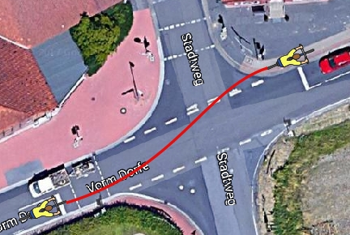
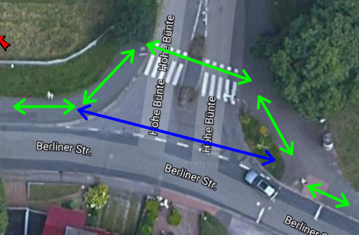
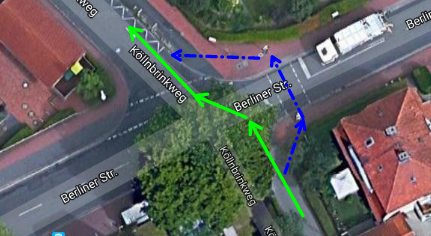
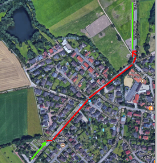
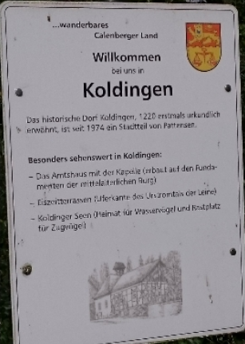

# [ADFC Ortsgruppe Hemmingen/Pattensen](http://adfc-hemmingen-pattensen.github.io/)

## [Mängelliste für Hemmingen](http://adfc-hemmingen-pattensen.github.io/MaengellisteHem)

> Letzte Änderung: LetzteAenderung  
> Autor: Jens Spille

Die Radverkehrs-Mängel und Verbesserungsvorschläge, die auf dieser Seite gelistet sind, beziehen sich größtenteils auf unsere [Mängelkarte](http://adfc-hemmingen-pattensen.github.io/MaengelHemPat.html) (Übersicht). Somit steht einmal zur Übersicht die  Mängelkarte zur Verfügung, andererseits steht diese Liste mit detaillierteren Angaben zur Verfügung. 

Link zur [**Mängelkarte**](http://adfc-hemmingen-pattensen.github.io/MaengelHemPat.html)  
Link zur [Open Location Code](https://plus.codes/9F4F8P9F+J9) Karte.

<!-- TOC in VIM Leader+i -->

## Übersicht

- [ADFC Ortsgruppe Hemmingen/Pattensen](#adfc-ortsgruppe-hemmingenpattensen)
    - [Mängelliste für Hemmingen](#mängelliste-für-hemmingen)
    - [Übersicht](#übersicht)
- [Open Location Code](#open-location-code)
- [OLC 8P77+W8](#olc-8p77w8)
    - [Kreuzung Mutter Buermann](#kreuzung-mutter-buermann)
- [OLC 8Q5G+](#olc-8q5g)
    - [Leinebrücke zum Grassdachhaus](#leinebrücke-zum-grassdachhaus)
- [OLC 8P5M+RG](#olc-8p5mrg)
    - [Kreuzung B3 (alt) - Hoher Holzweg](#kreuzung-b3-alt---hoher-holzweg)
- [OLC 8PPQ+5H](#olc-8ppq5h)
    - [Hemminger Kirchweg nahe Osterbrückenweg](#hemminger-kirchweg-nahe-osterbrückenweg)
- [OLC 8PHG+RW](#olc-8phgrw)
    - [Am Siek](#am-siek)
- [OLC 8PJR+55](#olc-8pjr55)
    - [Verbindung Fahrradstrasse zum Radweg - Hohe Bünte](#verbindung-fahrradstrasse-zum-radweg---hohe-bünte)
- [OLC 8QH3+R4](#olc-8qh3r4)
    - [Radwegverschwenkung auf Brücke](#radwegverschwenkung-auf-brücke)
- [OLC 8PGV+4C](#olc-8pgv4c)
    - [Berliner Straße - Haltestelle KGS](#berliner-straße---haltestelle-kgs)
- [OLC 8PGR+7W](#olc-8pgr7w)
    - [Berliner Straße - Einmündung Hohe Bünte](#berliner-straße---einmündung-hohe-bünte)
- [OLC 8PFX+Q2](#olc-8pfxq2)
    - [Döhrener Str. Seniebachbrücke](#döhrener-str-seniebachbrücke)
- [OLC 8PFW+JW](#olc-8pfwjw)
    - [Berliner Straße - Döhrener Str.](#berliner-straße---döhrener-str)
- [OLC 7QPG+76](#olc-7qpg76)
    - [Bankett - Radweg zwischen Harkenbleck und Reden](#bankett---radweg-zwischen-harkenbleck-und-reden)
- [OLC 8PFG+4G](#olc-8pfg4g)
    - [Berliner Straße - Linksseitiger Radweg Katzbachweg](#berliner-straße---linksseitiger-radweg-katzbachweg)
- [OLC 8PFJ+M8](#olc-8pfjm8)
    - [Berliner Straße - Kreuzung Köllnbringweg/Dorle-und-Albrecht-Heuer-Weg](#berliner-straße---kreuzung-köllnbringwegdorle-und-albrecht-heuer-weg)
- [OLC 8P9J+H4](#olc-8p9jh4)
    - [Weetzener Straße - Einmündung Sundernstraße](#weetzener-straße---einmündung-sundernstraße)
- [OLC 8Q94+VR](#olc-8q94vr)
    - [Wilkenburger Spinne](#wilkenburger-spinne)
- [OLC 8PCW+5H](#olc-8pcw5h)
    - [Querung Brot Henke](#querung-brot-henke)
- [OLC 8Q84+6P](#olc-8q846p)
    - [L 389 Schlaglöcher im Radweg](#l-389-schlaglöcher-im-radweg)
- [OLC 8Q64+XF](#olc-8q64xf)
    - [Ortsdurchfahrt Wilkenburg](#ortsdurchfahrt-wilkenburg)
- [OLC 8P7J+98](#olc-8p7j98)
    - [Bankett B3 zwischen Westerfeld und Arnum](#bankett-b3-zwischen-westerfeld-und-arnum)
- [OLC 8Q98+W4](#olc-8q98w4)
    - [Orientierungslos am Ortseingang](#orientierungslos-am-ortseingang)
- [OLC 7M8V+Q4](#olc-7m8vq4)
    - [Radweg an K 227 fehlt](#radweg-an-k-227-fehlt)

# Open Location Code

Um die Zuordnung der Mängel und Verbesserungsvorschläge zu ermöglichen, ist jeder **Pin** und jede **Linie** auf der Mängelkarte mit einer eindeutigen Bezeichnung versehen.

Als Bezeichner wird der [Open Location Code](https://de.wikipedia.org/wiki/Open_Location_Code) verwendet. Der Open Location Code (OLC) gibt geographische Koordinaten an. Gegenüber der konventionellen Schreibweise in Winkelgrad ist er kompakt, eindeutig, und leicht an die erforderliche Genauigkeit anzupassen. OLC wird auch als **"Plus Codes"** bezeichnet.

So befindet sich zum Beispiel die Fahrrad-Selbsthilfewerkstatt mit den Ziffern [**9F4F8P9F+J9**](https://plus.codes/9F4F8P9F+J9) an der Stelle 52.319063,9.723438 (Heinrich-Hertz-Straße 23, 30966 Hemmingen, Deutschland). Das erste Ziffernpaar des Open Location Codes zerlegt den Globus in 20 × 20 Grad große Flächen. Norddeutschland liegt im Sektor 9F. 

 

Jedes weitere OLC-Ziffernpaar „zwanzigselt“ den bis dahin definierten Bereich in jeder Dimension.Die Ziffern 9F4F beschreiben den Bereich um Hannover.

 

Zum Auffinden des Bereichs gibt man zum Beispiel die Ziffern '9F4F8P9F+J9'auf der Webseite [https://plus.codes](https://plus.codes/9F4F8P9F+J9) ein.
Die ersten vier Stellen nennt man Area-Code, 9F4F im obigen Beispiel. Man kann ihn weglassen, wenn ohnehin klar ist, welchen Ort man meint.

# OLC 8P77+W8
## Kreuzung Mutter Buermann

| Kurzbeschreibung | Querungshilfe fehlt                                                                          |
| ---------------: | -----------------------                                                                      |
| Mängelkarte      | [Link](http://umap.openstreetmap.fr/de/map/adfc-hemmingen-pattensen_84202#15/52.3150/9.7132) |
| Einstelldatum   | 2017-12-05-Di                                                                                |
| Status           | Verbesserungsvorschlag                                                                       |
| Autor            | Jens Spille                                                                                  |
| Ort              | Devese K 221 / Stadweg                                                                       |
| Fahrtrichtung    | Von West nach Ost                                                                            |
| Verantwortlich   | Region                                                                                       |

### Ist Zustand/Mangel/Gefahr
Radfahrende aus Richtung Westen müssen ungesichert die Fahrbahn kreuzen, um auf den linksseitigen Radweg zu gelangen. Radfahrende haben keine vernünftige Alternative um die Fahrbahn sicher zu queren.

### Mögliche Maßnahmen

Angebot einer Alternative - z.B. indirektes Abbiegen.

### Status

- 2018-01-05 J. Spille: Verbesserungsvorschlag wurde in unserer Stellungsnahme vom VEP2030 vorgestellt. *ADFCStellungnahmeVEP2030.doc*
- 2018-10 J.Spille: Bündnes 90/Die Grünen haben ein Gesprächsangebot gemacht.

# OLC 8Q5G+
## Leinebrücke zum Grassdachhaus

| Kurzbeschreibung | Querungshilfe fehlt                                                                          |
| ---------------: | -----------------------                                                                      |
| Mängelkarte      | [Link](http://umap.openstreetmap.fr/de/map/adfc-hemmingen-pattensen_84202#15/52.3110/9.7777) |
| Einstelldatum    | 2014 "Gesamtkonzept wasserbezogener Naherholung"                                             |
| Status           | Verbesserungsvorschlag                                                                       |
| Autor            | Jens Spille                                                                                  |
| Ort              | Steinfeldsees bis Grassdachaus                                                               |
| Fahrtrichtung    | Von West nach Ost                                                                            |
| Verantwortlich   | Hemmingen und Laatzen (plus Naturschutzbehörden)                                             |

### Ist Zustand/Mangel/Gefahr

Es fehlt ein Konzept zur Entlastung und Entschärfung der sogenannten Wilkenburger Spinne. Bewohner, die von Westerfeld, Arnum oder Wilkenburg nach Laatzen müssen, haben keine andere Wahl, als über die Wilkenburger Spinne nach Wülfel zu fahren. Die Radwege in der Leinemasch sind bei Regen und im Winter  nicht oder nur noch sehr eingeschränkt passierbar.

### Mögliche Maßnahmen

Hier sollte man die Diskussion über eine Brücke zwischen Wilkenburg und Laatzen, wie sie 2014 im „Gesamtkonzept wasserbezogener Naherholung“ vorgestellt wurde, wieder beleben. Es sollte untersucht werden, in wieweit eine Reduzierung von Abgasen, Feinstäube, Lärm und Unfallgefahren und die Förderung des Radverkehrs, einen Schotterweg in der Nähe des Steinfeldsees rechtfertigt. 

### Status

- 2014 "Gesamtkonzept wasserbezogener Naherholung"
- 2018-01-05 J. Spille: Verbesserungsvorschlag wurde in unserer Stellungsnahme vom VEP2030 wiederholt.  *ADFCStellungnahmeVEP2030.doc* 

# OLC 8P5M+RG
## Kreuzung B3 (alt) - Hoher Holzweg

| Kurzbeschreibung | Sichere Radführung über B3                                                                   |
| ---------------: | -----------------------                                                                      |
| Mängelkarte      | [Link](http://umap.openstreetmap.fr/de/map/adfc-hemmingen-pattensen_84202#16/52.3097/9.7331) |
| Einstelldatum   | 2018-01-05 Stellungsnahme vom VEP2030                                                        |
| Status           | Vorschlag                                                                                    |
| Autor            | Jens Spille                                                                                  |
| Ort              | Kreuzung B3 (alt) / Hoher Holzweg                                                            |
| Fahrtrichtung    | Alle                                                                                         |
| Verantwortlich   | Hemmingen (in Zukunft)                                                                       |

### Ist Zustand/Mangel/Gefahr

Vom Hohen Holzweg kommend gibt es keinen Radweg zur Ampel. Unklare Verkehrsführung für Radfahrer, da die Streuscheibe der Ampel eine kombinierte Fußgänger und Radfahrer Ampel ist. Wenn Radfahrer vor der Shell Tankstelle stehen, besteht eine Gefahr durch Rechtsabbieger. Verwirrung durch ungünstige Verkehrsführung.

Radfahrer aus Hoher Holzweg in Richtung Sundernweg richten sich teilweise nach der LSA mit der gemeinsamen Streuscheibe für Fuß- und Radverkehr. Dazu wechseln sie von der Fahrbahn Hoher Holzweg auf den Hochbord, um die Furt des LSA zu benutzen (Karte - Punkt 1). Rechts abbiegende Autofahrer aus Hoher Holzweg übersehen leicht die Fußgänger und Radfahrer, da ein Schild den Blick versperrt (Karte - Punkt 2). 

Das Radfahren von der Gartenstraße/Mühlenweg bis zur Shell-Tankstelle auf der linken Seite ist nicht freigegeben. Einen sicheren Übergang vom der Gartenstraße auf die rechte Fahrbahnseite gibt es nicht, deshalb fahren die Schüler, linksseitig auf den Fußweg, um dann die LSA Hoher Holzweg - Sundernweg zu benutzen. In umgekehrter Richtung ist der Fußweg an der B3 für Radfahrer frei gegeben "Fahrrad frei".

### Mögliche Maßnahmen

Eine Radfahrerfurt nahe der Fahrbahn einrichten (blaue Linie). -  Überweg in Höhe Gartenstraße einrichten.

### Status

- 2018-01-05 J. Spille: Verbesserungsvorschlag wurde in unserer Stellungsnahme vom VEP2030 wiederholt.  *ADFCStellungnahmeVEP2030.doc* 
- 2018-11 J. Spille: Vorschlag wurde im Rahmen einer Ortsbegehung wiederholt.
- 2018-11 J. Spille: Alles ist offen. Hier könnte evtl. auch ein Kreisverkehr entstehen.

# OLC 8PPQ+5H
## Hemminger Kirchweg nahe Osterbrückenweg 

| Kurzbeschreibung | Buckel in Hemminger Kirchweg nahe Osterbrückenweg                                            |
| ---------------: | -----------------------                                                                      |
| Mängelkarte      | [Link](http://umap.openstreetmap.fr/en/map/adfc-hemmingen-pattensen_84202#16/52.3361/9.7388) |
| Einstelldatum   | 2019-05-27-Mo                                                                                |
| Status           | Gemeldet                                                                                     |
| Autor            | Jens Spille                                                                                  |
| Ort              | Hemminger Kirchweg                                                                           |
| Fahrtrichtung    | Alle                                                                                         |
| Verantwortlich   | Stadt Hannover                                                                               |

### Ist Zustand/Mangel/Gefahr

Diese Meldung kam über RADar! rein. ID: 2019-19480

Adresse: Großer Hemminger Teich, Hemminger Kirchweg, Wilkenburg, Hemmingen, Region Hannover, Niedersachsen, 30966, Deutschland  
Meldungsgrund: Loch, Unebenheit, Bruch oder Riss im Oberbau erhöht Sturzrisiko  
weitere Angaben: An der Grenze zur Stadt Hannover 52.335427,9.738917

### Status
- 2019-07-12 - Stadt Hannover - Wir haben die Angelegenheit geprüft und beabsichtigen, noch in diesem Jahr den gesamten etwa 130 m langen, in Beton befestigten Wegeabschnitt mit einer dünnen bituminösen Decke zu versehen – so wie auch der Abschnitt Richtung Hemmingen befestigt ist. Derzeit holen wir die dafür erforderlichen Genehmigungen der Unteren Naturschutzbehörde und Unteren Wasserbehörde ein.

# OLC 8PHG+RW
## Am Siek

| Kurzbeschreibung | Drängelgitter                                                                                  |
| ---------------: | -----------------------                                                                        |
| Mängelkarte      | [Link](http://umap.openstreetmap.fr/en/map/adfc-hemmingen-pattensen_84202#17/52.32962/9.72934) |
| Einstelldatum    | 2017                                                                                           |
| Status           | Gemeldet                                                                                       |
| Autor            | Jens Spille                                                                                    |
| Ort              | Hemmingen, Am Siek                                                                             |
| Fahrtrichtung    | Alles                                                                                          |
| Verantwortlich   | Stadt Hannover                                                                                 |

### Ist Zustand/Mangel/Gefahr

Umlaufgitter verhindern das Durchkommen von Fahrrädern mit Anhänger und Lastenräder. 

ERA: "Poller sind unzulässig, wo Verkehrsteilnehmer gefährdet oder der Verkehr erschwert werden kann. Sie müssen nachts und bei schlechten Sichtverhältnissen ausreichend erkennbar sein."

### Mögliche Maßnahmen
Umlaufgitter entfernen, evtl. Verengung auf mindestens 2 m, um KFZ Verkehr zu verhindern.

Evtl. rote Furt über Klewertweg. Vorfahrt ändern. Um bessere Sichtverhältnisse zu gewähren.

### Status
- 2019-09-09 Jens Spille - Im Stadtgespräch mit Bündnes 90 / Die Grünen erörtert.
- 2019-09-21 Jens Spille - siehe auch https://www.adfc.de/artikel/umgang-mit-pollern-und-umlaufsperren/

# OLC 8PJR+55
## Verbindung Fahrradstrasse zum Radweg - Hohe Bünte

| Kurzbeschreibung | unglücklich um die Ecke kurven                                                               |
| ---------------: | -----------------------                                                                      |
| Mängelkarte      | [Link](http://umap.openstreetmap.fr/en/map/adfc-hemmingen-pattensen_84202#16/52.3303/9.7440) |
| Einstelldatum   | Stadtradeln 2019                                                                             |
| Status           | Hohe Bünte                                                                                   |
| Autor            | Jens Spille                                                                                  |
| Ort              | Hohe Bünte - Nähe Freibad                                                                    |
| Fahrtrichtung    | Alle                                                                                         |
| Verantwortlich   | Stadt Hemmingen                                                                              |

### Ist Zustand/Mangel/Gefahr
Meldung per Radar! ID: 2019-19546

Adresse: Hohe Bünte, Wilkenburg, Hemmingen, Region Hannover, Niedersachsen, 30966, Deutschland

Meldungsgrund: Auffahrt auf Radweg nur mit Umweg möglich

weitere Angaben: Wenn man aus Ricklingen kommt, und vor der Shinebar auf die Straße fahren möchte (Fahrradstraße) muss man unglücklich um die Ecke kurven.

### Mögliche Maßnahmen

Verbindung verbessern

### Status
- 2019-09-21 Jens Spille - Erste Meldung gab es schon 2017 von M. Schröder.

# OLC 8QH3+R4
## Radwegverschwenkung auf Brücke

| Kurzbeschreibung | Radweg verschwenkt und verengt                                                               |
| ---------------: | -----------------------                                                                      |
| Mängelkarte      | [Link](http://umap.openstreetmap.fr/en/map/adfc-hemmingen-pattensen_84202#16/52.3300/9.7540) |
| Einstelldatum    | 2017-09-11                                                                                   |
| Status           | offen                                                                                        |
| Autor            | M. Schröder                                                                                  |
| Ort              | Brückstr.                                                                                    |
| Fahrtrichtung    | Alle                                                                                         |
| Verantwortlich   | Region (Kreis)                                                                               |

### Ist Zustand/Mangel/Gefahr
Für eine Brücke wird der Radweg verschwenkt und verengt, die Verschwenkung ist im Dunklen schlecht erkennbar, die Breite ist für sich begegnende Radfahrer eng.

Mangel/Gefahr: Der Radweg entlang der K20 wird für eine kleine Brücke stark verschwenkt und die Radwegbreite eingeschränkt. Die Radwegführung ist im Dunklen schlecht erkennbar, der Radweg wird sehr eng an die K20 herangeführt (Abgrenzung nur durch eine Art Bordstein), die Radwegbreite im Bereich der Verschwenkung ist für sich begegnende Radfahrer eng. Ergänzung: Von Hemmingen Richtung Hannover ist eine Absperrschranke (Zeichen 600) angebracht, die in Richtung Hemmingen fehlt.

### Mögliche Maßnahmen

Mögliche Maßnahmen: Erkennbarkeit im Dunklen durch geeignete Reflektoren o. ä. erhöhen, Absperrschranke auch in Richtung Hemmingen anbringen,  Abgrenzung des Radwegs in Richtung des Gewässers und der Straße verbessern.

### Status
- 2017-09-13 J. Spille: Straßenbeleuchtung (evtl. Solar) wäre hilfreich.
- 2019 J. Spille: Absperrschranke (Zeichen 600) in Richtung Hemmingen wurde angebracht.

# OLC 8PGV+4C
## Berliner Straße - Haltestelle KGS

| Kurzbeschreibung | Konflikt zwischen Wartenden und Radfahrern                       |
| ---------------: | ----------------------- |
| Mängelkarte      | [Link](?)               |
| Einstelldatum   | Stadtradeln 2019                       |
| Status           | offen                       |
| Autor            | Jens Spille             |
| Ort              | Berliner Straße - Haltestelle KGS                      |
| Fahrtrichtung    | Alle                    |
| Verantwortlich   | Stadt Hemmingen                         |

### Ist Zustand/Mangel/Gefahr
Über RADar! wurde eine neue Meldung eingestellt. ID: 2019-19547

Adresse: Berliner Straße, Hemmingen, Wilkenburg, Hemmingen, Region Hannover, Niedersachsen, 30966, Deutschland

Meldungsgrund: Unfallschwerpunkt

weitere Angaben: Den Trampelpfad bei der Bushaltestelle Börie als Radweg ausbauen (direkter Weg zur KGS). Wenn man als Fußgänger in den Bus steigen will, ist es sehr unangenehm, wenn die vielen Schüler die aus der Börie kommen zwischen den wartenden Passanten hindurch kurven.

### Mögliche Maßnahmen
Trampelpfad bei der Bushaltestelle Börie als Radweg ausbauen.

### Status
- 2019-09-09 Jens Spille - Im Stadtgespräch mit Bündnes 90 / Die Grünen erörtert.

# OLC 8PGR+7W
## Berliner Straße - Einmündung Hohe Bünte

| Kurzbeschreibung |  Radweg an der Berliner Straße wird in der Einmündung Hohe Bünte extrem eingeschränkt.                      |
| ---------------: | ----------------------- |
| Mängelkarte      | [Link](?)               |
| Einstelldatum   | 2017-09-10                       |
| Status           | ?                       |
| Autor            | Jens Spille             |
| Ort              | Hemmingen - Westerfeld - Berliner Straße - Einmündung Hohe Bünte
Koordinaten: 52.32563/9.74227                       |
| Fahrtrichtung    | In beiden Richtungen                       |
| Verantwortlich   |                         |

### Ist Zustand/Mangel/Gefahr
Radfaher auf dem gemeinsamen, einseitigen, zweirichtungs Rad- und Fußweg, müssen in der Einmündung Hohe Bünte der eingerückten Furt folgen. Hinzu kommt das die Radfahrerfurt sehr schmal und nur einseitig vom Zebrastreifen angeordnet ist. Damit ist der Radfahrer nicht mehr im Sichtfeld des von der Berliner Straße kommenden rechts abbiegenden Autofahrer.

### Mögliche Maßnahmen
Straßenbegleitende Radwegeführung

### Status
- 2019-09-09 Jens Spille - Im Stadtgespräch mit Bündnes 90 / Die Grünen erörtert.

# OLC 8PFX+Q2
## Döhrener Str. Seniebachbrücke

| Kurzbeschreibung | unangenehme Höhenunterschiede                                                                  |
| ---------------: | -----------------------                                                                        |
| Mängelkarte      | [Link](http://umap.openstreetmap.fr/en/map/adfc-hemmingen-pattensen_84202#18/52.32471/9.74824) |
| Einstelldatum   | Stadtradeln 2019                                                                               |
| Status           | offen                                                                                          |
| Autor            | Jens Spille                                                                                    |
| Ort              | Döhrener Str.                                                                                  |
| Fahrtrichtung    | In beiden Richtungen                                                                           |
| Verantwortlich   | Region                                                                                         |

### Ist Zustand/Mangel/Gefahr
Über RADar! wurde eine neue Meldung eingestellt. ID: 2019-19544

Adresse: Hemminger Kirchweg, Wilkenburg, Hemmingen, Region Hannover, Niedersachsen, 30966, Deutschland

Meldungsgrund: Übergänge mit zu großen Höhenunterschieden (z. B. Bordsteine)

weitere Angaben: Bei der Reparatur der Brücke wurde auf Kosten der Radfahrer die Autofahrbahn sehr eben gestaltet. Radfahrer dagegen versprühen sehr unangenehme Höhenunterschiede, insbesondere bei Geschwindigkeiten von mehr als 20 km /h. Der Übergang müsste in einem flacheren Winkel und ohne Übergang erfolgen. Vor der Reparatur war der Radweg eben, ohne jede Erhöhung.

### Mögliche Maßnahmen
Der Übergang müsste in einem flacheren Winkel und ohne Übergang erfolgen.

### Status

# OLC 8PFW+JW
## Berliner Straße - Döhrener Str.

| Kurzbeschreibung | Bordsteinabsenkung                                                                             |
| ---------------: | -----------------------                                                                        |
| Mängelkarte      | [Link](http://umap.openstreetmap.fr/en/map/adfc-hemmingen-pattensen_84202#18/52.32412/9.74778) |
| Einstelldatum   | 2018-09-15                                                                                     |
| Status           | Bauamt bekannt                                                                                 |
| Autor            | Jens Spille                                                                                    |
| Ort              | Berliner Straße - Döhrener Str.                                                                |
| Fahrtrichtung    | In beiden Richtungen                                                                           |
| Verantwortlich   | Hemmingen                                                                                      |

### Ist Zustand/Mangel/Gefahr

Die Auffahrt auf den Radweg Berliner Str. aus dem Dorf kommend ist schwierig, da die Bordsteinabsenkung nur in Richtung Döhren existiert. 

### Mögliche Maßnahmen
Bordstein Abflachung

### Status
- 2018-11-27 J. Spille: Es ist geplant den Radweg an der Berliner Straße zu verbreitern. Im Zuge dieser Maßnahme wird es eine Absenkung geben.
- 2019-09-09 Jens Spille - Im Stadtgespräch mit Bündnes 90 / Die Grünen erörtert.

# OLC 7QPG+76
## Bankett - Radweg zwischen Harkenbleck und Reden

| Kurzbeschreibung | Bankett ist abgesack                       |
| ---------------: | ----------------------- |
| Mängelkarte      | [Link](?)               |
| Einstelldatum   | 2017-09-10                      |
| Status           | offen                       |
| Autor            | Jens Spille             |
| Ort              | Verbindung zwischen Harkenbleck und Reden                       |
| Fahrtrichtung    | In beiden Richtungen                      |
| Verantwortlich   |                         |

### Ist Zustand/Mangel/Gefahr
Sturzgefahr am Radwegrand, da das Bankett versackt ist. 

### Mögliche Maßnahmen
Bankett auffüllen

### Status

# OLC 8PFG+4G
## Berliner Straße - Linksseitiger Radweg Katzbachweg 

| Kurzbeschreibung | Querung Berliner Katzbachweg ohne Führung                                                      |
| ---------------: | -----------------------                                                                        |
| Mängelkarte      | [Link](http://umap.openstreetmap.fr/en/map/adfc-hemmingen-pattensen_84202#17/52.32309/9.72669) |
| Einstelldatum   | 2017-09-10                                                                                     |
| Status           | offen                                                                                          |
| Autor            | Jens Spille                                                                                    |
| Ort              | Hemmingen Westerfeld - Berliner Straße (Höhe Katzbachweg)                                      |
| Fahrtrichtung    | In Richtung Ost                                                                                |
| Verantwortlich   | Hemmingen                                                                                      |

### Ist Zustand/Mangel/Gefahr
Radfahrer von der B3 kommend und auf der rechten Seite den Radweg fahrend, müssen ab dem Katzbachweg die linksseitigen verpflichtenden Radweg benutzen. Es gibt keinerlei Führung oder Hilfsmittel um hier die Berliner Straße gefahrlos zu überqueren. Insbesondere von hinten kommenden B3 Rechtsabbieger können schnell übersehen werden.

Radfahrer die aus Richtung Norden von der B3 (alt) kommen, dürfen nicht links bleiben, obwohl Sie 200 Meter später links fahren müssen.

#### Radverkehrskonzept Hemmingen - 6.1.3 Radverkehrsführung Berliner Straße
Die Berliner Straße in Hemmingen-Westerfeld stellt eine wichtige Ost-
West-Verbindung dar und hat aufgrund der anliegenden KGS auch für den
Schulverkehr eine gewisse Bedeutung. Im Straßenzug ist überwiegend
Stadt Hemmingen – Radverkehrskonzept 27
eine Geschwindigkeit von 30 km/h angeordnet. Die Radfahrenden werden
auf einem auf der nördlichen Seite verlaufenden benutzungspflichtigen
gemeinsamer Geh- und Radweg in beiden Fahrtrichtungen geführt.

In Anpassung an die rechtlichen Gegebenheiten und vor dem Ziel den
Radverkehr komfortabel und sicher zu führen, wird empfohlen, die Benutzungspflicht
des gemeinsamen Geh- und Radweges aufzuheben. Für die
Radfahrenden wird eine Führung auf der Fahrbahn empfohlen. Am südlichen
Fahrbahnrand der Berliner Straße ist die Einrichtung eines einseitigen
Schutzstreifens mit einer Mindestbreite von 1,50 m vorzusehen. Der Einsatz
von Schutzstreifen ist vom Verkehrsaufkommen und der Fahrbahnbreite
abhängig. Aufgrund der zur Verfügung stehenden Fahrbahnbreite ist
dies für die nördliche Seite nicht möglich. Somit soll der Radfahrende in
westliche Richtung im Mischverkehr auf der Fahrbahn fahren. Ergänzend
kann der nördliche Seitenraum Richtungsbezogen für den Radverkehr freigegeben
werden.

### Mögliche Maßnahmen
Einfädelhilfe

### Status
- 2017-09-25 Jens Spille - Beispiel Einfädelhilfe aus Wunstorf - Koordinaren 52.42882/9.41554 'Am hohen Holz' gegenüber Rübensaftkocherei Reinhold - lecker

# OLC 8PFJ+M8
## Berliner Straße - Kreuzung Köllnbringweg/Dorle-und-Albrecht-Heuer-Weg

| Kurzbeschreibung | Geradeausfahrer aus Dorle-und-Albrecht-Heuer-Weg werden ignoriert                              |
| ---------------: | -----------------------                                                                        |
| Mängelkarte      | [Link](http://umap.openstreetmap.fr/en/map/adfc-hemmingen-pattensen_84202#17/52.32444/9.73265) |
| Einstelldatum   | 2017-09-10                                                                                     |
| Status           | Verwaltung bekannt                                                                             |
| Autor            | Jens Spille                                                                                    |
| Ort              | Hemmingen - Westerfeld - Berliner Straße - Köllnbringweg/Dorle-und-Albrecht-Heuer-Weg          |
| Fahrtrichtung    | Aus Dorle-und-Albrecht-Heuer-Weg in Richtung Köllnbringweg                                     |
| Verantwortlich   | Hemmingen                                                                                      |

### Ist Zustand/Mangel/Gefahr
Der Dorle-und-Albrecht-Heuer-Weg ist zwar eine kleine, aber zulässige Autostraße. Fahrzeuge (inkl. Radfahrer) die aus dieser Straße kommen und geradeaus in den Köllnbringweg fahren wollen, haben vor den Linksabbiegern aus dem Köllnbringweg Vorrang. Dieses ist den meisten Autofahrern nicht bewusst. Einige Radfahrer benutzen den benachbarten Fußgängerüberweg, das wird von einigen Autofahrern auch so erwartet. 

### Mögliche Maßnahmen
Hinweisschilder "Achtung Gegenverkehr" und Radfahrerfurt.

### Status

- 2019-09-09 Jens Spille - Im Stadtgespräch mit Bündnes 90 / Die Grünen erörtert.

# OLC 8P9J+H4
## Weetzener Straße - Einmündung Sundernstraße

| Kurzbeschreibung | Autofahrer und Radfahrer können sich nicht sehen.                                              |
| ---------------: | -----------------------                                                                        |
| Mängelkarte      | [Link](http://umap.openstreetmap.fr/en/map/adfc-hemmingen-pattensen_84202#17/52.31897/9.73191) |
| Einstelldatum   | 2017-09-10                                                                                     |
| Status           | Verwaltung bekannt´                                                                            |
| Autor            | Jens Spille                                                                                    |
| Ort              | Hemmingen - Westerfeld - Weetzener Straße (K221) - Einmündung Sundernstraße                    |
| Fahrtrichtung    | In Richtung Osten                                                                              |
| Verantwortlich   | Hemmingen                                                                                      |

### Ist Zustand/Mangel/Gefahr
 Fahrzeugfahrer aus der Sundernstraße kommend, können die Radfahrer die linksseitig aus Richtung Westen kommen nicht, oder erst spät sehen. Erschwerend kommt hinzu, dass die Radfahrer (auch ungeübte), an dieser Stelle, aufgrund des Gefälles eine "flotte" Geschwindigkeit erreichen. 

### Mögliche Maßnahmen
Sichtdreieck herstellen. Evtl. Spiegel. Bodenmarkierung mit zwei Pfeilen.

### Status
- 2018 - Jens Spille - Rote Bodenmarkierung wurde aufgebracht - Sehr gut. 

# OLC 8Q94+VR
## Wilkenburger Spinne

| Kurzbeschreibung | Gefährliche Zweirichtungsquerung der Dorfstraße auf der Wülfeler Straße.                       |
| ---------------: | -----------------------                                                                        |
| Mängelkarte      | [Link](http://umap.openstreetmap.fr/en/map/adfc-hemmingen-pattensen_84202#17/52.31971/9.75676) |
| Einstelldatum   | 2017-09-09                                                                                     |
| Status           | Verwaltung bekannt                                                                             |
| Autor            | Jens Spille                                                                                    |
| Ort              | Einmündung Dorfstraße (K221) auf der Wülfeler Straße (L 389)                                   |
| Fahrtrichtung    | In beiden Richtungen                                                                           |
| Verantwortlich   | Region Hannover                                                                                |

### Ist Zustand/Mangel/Gefahr
Der Radweg entlang der Wülfeler Straße (L 389) (grüner Pfeil) hat eine abgefahrene rote Markierung in der Einmündung Dorfstraße (K 221).
Zu den Stoßzeiten bildet sich ein Rückstau auf der Dorfstraße, da auf der Wülfeler Straße ein kontinuierlicher Verkehrsfluss besteht. 
Durch den "Druck" der Fahrer eine Lücke erwischen zu müssen (Tunnelblick), sind Radfahrer und Fußgänger auf der Querung nicht mehr sicher.

Desweiteren ist die Querung (blauer Pfeil) vom Parkplatz kommend sehr gefährlich, da der Verkehr aus Richtung Wilkenburg 
hinter einer Kurve liegt. "Grüner Ring".

### Mögliche Maßnahmen
Hier brauchen wir dringend eine Entschleunigung
        - Ideal wäre ein Kreisel, mit STOP und Zusatzzeichen Radfahrer von links und rechts.
        - Notfalls eine LSA
        - Dringend eine Geschwindigkeitsbegrenzung auf 50 km/h.

Für die Querung aus und zu dem Parkplatz wäre eine Querungshilfe (Verkehrsinsel) sinnvoll. Mindestens ein Spiegel.

### Status
- 2019-09-09 Jens Spille - Im Stadtgespräch mit Bündnes 90 / Die Grünen erörtert.

# OLC 8PCW+5H
## Querung Brot Henke

| Kurzbeschreibung | Radfahrer die die K211 überqueren möchten müssen sich häufig zwischen den stauenden Fahrzeugen auf der K221 drängeln. |
| ---------------: | -----------------------                                                                                               |
| Mängelkarte      | [Link](http://umap.openstreetmap.fr/en/map/adfc-hemmingen-pattensen_84202#17/52.32053/9.74647)                        |
| Einstelldatum   | 2017-09-10                                                                                                            |
| Status           | Zustand bekannt - Region will Inkuktionsschleife einbauen.                                                            |
| Autor            | Jens Spille                                                                                                           |
| Ort              | Hemmingen (Altes Dorf) -  Weetzener Landstraße (K221) - Kreuzung - Im Dorfeld                                         |
| Fahrtrichtung    | Im Dorffeld folgend - Nord-Süd und Süd-Nord                                                                           |
| Verantwortlich   | Region Hannover                                                                                                       |

### Ist Zustand/Mangel/Gefahr
 Die Querung der K 221 (aus und in die Fahrradstraße) ist zu Stoßzeiten schwierig, da sich auf der K221 
längere Rückstaus bilden. Das führt dazu, dass Radfahrer den Drücker der Fußgängerample betätigen, und mit dem Grün 
der Fußgänger-Ampel die K221 überqueren. Dazu müssen sie, wenn sie von Norden kommen, die Gegenfahrtrichtung auf 
Im Dorffeld überqueren.

### Mögliche Maßnahmen
Extra Radfahrer-Ampel. Am besten als Dunkel-Dunkel Ampel geschaltet, damit in ruhigen Zeiten 
ein zügiges Überqueren möglich wird und keine Rotlicht-Sünder herangezogen werden.

### Status

- 2019 - Jens Spille - Region hat Plan zum Umbau vorgelegt. 

# OLC 8Q84+6P
## L 389 Schlaglöcher im Radweg

| Kurzbeschreibung | Der Radweg zwischen Wilkenburg und Wilkenburger Spinne enthält gefährliche Schlaglöcher. |
| ---------------: | -----------------------                                                                  |
| Mängelkarte      | [Link](?)                                                                                |
| Einstelldatum   | 2017-09-10                                                                                        |
| Status           | Es ist der Region bekannt                                                                                        |
| Autor            | Jens Spille                                                                              |
| Ort              | Wülfener Straße (L 389) zwischen Wilkenburg und Wilkenburger Spinne                      |
| Fahrtrichtung    | In beiden Richtungen                                                                     |
| Verantwortlich   | Region Hannover                                                                          |

### Ist Zustand/Mangel/Gefahr
Gefahr durch Stürze, besonders entlang der Längskanten.

Der alte kombinierte Rad-/Fußweg an der Wülfeler Str zwischen Wilkenburg und Dorfstr (Spinne) ist seit Langem ein Ärgernis mit Rissen, Brüchen und Wellen. Wer seinen Rücken liebt, fährt auf der Straße und setzt sich dem hupenden, drängelnden Autoverkehr aus. Positives Beispiel: Die Weiterführung auf Hannoverscher Seite. 

### Mögliche Maßnahmen
Sanierung

### Status

- 2019-05-27-Mo - Jens Spille - Mehrere Meldungen über Radar! ID: 2019-19275, ID: 2019-19318
- 2019-09-09 Jens Spille - Im Stadtgespräch mit Bündnes 90 / Die Grünen erörtert.
 

# OLC 8Q64+XF
## Ortsdurchfahrt Wilkenburg

| Kurzbeschreibung | Radweg-Nichtradweg-Radweg                                                                    |
| ---------------: | -----------------------                                                                      |
| Mängelkarte      | [Link](http://umap.openstreetmap.fr/en/map/adfc-hemmingen-pattensen_84202#16/52.3128/9.7550) |
| Einstelldatum    | 2017-09-11                                                                                   |
| Status           | Ist der Verwaltung bekannt                                                                   |
| Autor            | Marko Schröder                                                                                 |
| Ort              | Wilkenburg, Wülfeler Straße                                                                  |
| Fahrtrichtung    | In beiden Richtungen                                                                         |
| Verantwortlich   | Region Hannover                                                                              |

### Ist Zustand/Mangel/Gefahr
Der Radweg entlang der L398 ist von Arnum bis Ortseingang / Friedhof Wilkenburg verpflichtend (Zeichen 240). Ab ca. Orteingang wird der Weg (zurecht aufgrund der geringen Breite) zum "Fußweg / Radfahrer frei" herabgestuft, d. h. der Alltagsradfahrer/Berufspendler sollte/muss auf die Straße wechseln. Nach der Kurve vor der Kirchstraße neben der Pferdekoppel wird der Weg wieder zum verpflichtenden Radweg auf der linken Seite heraufgestuft, d. h. ein erneuter Wechsel der Straßenseite steht an. 

Erschwerend kommt hinzu, dass der Rad-/Fußweg für beide Fahrtrichtungen freigegeben ist und in der Ortsdurchfahrt Wilkenburg dafür eigentlich zu schmal ist.

### Mögliche Maßnahmen
Maximalforderung: Einen der ERA entsprechenden Radweg durch Wilkenburg bauen. Realistisch: Warnzeichen 138 an den gefährlichen Stellen aufstellen. Eventuell einen Radstreifen einrichten. Dieser würde allerdings nicht das Problem des doppelten Seitenwechsels lösen.

### Status
- 2017 - Jens Spille - L389 soll saniert werden.

# OLC 8P7J+98
## Bankett B3 zwischen Westerfeld und Arnum

| Kurzbeschreibung | Bankett ist abgesackt                                                                        |
| ---------------: | -----------------------                                                                      |
| Mängelkarte      | [Link](http://umap.openstreetmap.fr/en/map/adfc-hemmingen-pattensen_84202#15/52.3114/9.7325) |
| Einstelldatum    | 2017-09-10                                                                                   |
| Status           | Ist der Verwaltung bekannt                                                                   |
| Autor            | Jens Spille                                                                                  |
| Ort              | B3 Verbindung zwischen Arnum und Hemmingen Westerfeld                                        |
| Fahrtrichtung    | In beiden Richtungen                                                                         |
| Verantwortlich   | In Zukunft Stadt Hemmingen                                                                   |

### Ist Zustand/Mangel/Gefahr
Sturzgefahr am Radwegrand, da das Bankett versackt ist. 

### Mögliche Maßnahmen
Bankett auffüllen

### Status
- 2019 - Jens Spille - Radweg soll saniert werden, wegen Beleuchtung.

# OLC 8Q98+W4
## Orientierungslos am Ortseingang 

| Kurzbeschreibung | fehlende Ortstafeln                                                                            |
| ---------------: | -----------------------                                                                        |
| Mängelkarte      | [Link](http://umap.openstreetmap.fr/en/map/adfc-hemmingen-pattensen_84202#17/52.32002/9.76499) |
| Einstelldatum    | 2017-09-10                                                                                     |
| Status           | Ist der Verwaltung bekannt                                                                     |
| Autor            | Jens Spille                                                                                    |
| Ort              | Hemmingen Pattensen - alle nicht straßenbegleitende Radwege                                    |
| Fahrtrichtung    | Nach Hemmingen rein - aus allen Richtungen                                                     |
| Verantwortlich   | Hemmingen                                                                                      |

### Ist Zustand/Mangel/Gefahr
Ortsunkundige wissen nicht wann sie welchen Ort passieren. Hinweise auf Sehenswürdigkeiten und Hilfe (Gastronomie, Lebensmittel und Pannendienst) erleichtern das Leben und solche Gäste kommen wieder.

### Mögliche Maßnahmen
Beispiel Ortseingangstafel aus Koldingen. Aufgestellt vom Ortsrat

### Status

# OLC 7M8V+Q4
## Radweg an K 227 fehlt

| Kurzbeschreibung | An der K227 fehlt ein Radweg                                                                 |
| ---------------: | -----------------------                                                                      |
| Mängelkarte      | [Link](http://umap.openstreetmap.fr/en/map/adfc-hemmingen-pattensen_84202#13/52.2690/9.6937) |
| Einstelldatum    | 2017-09-13                                                                                   |
| Status           | Der Verwaltung bekannt                                                                       |
| Autor            | Jens Spille                                                                                  |
| Ort              | Hemmingen - Verbindung Hiddesdorf (L389) - Lüdersen - K227                                   |
| Fahrtrichtung    | Beide Richtungen                                                                             |
| Verantwortlich   | egion Hannover                                                                               |

### Ist Zustand/Mangel/Gefahr
Entlang der K227 fehlt ein Radweg. Die Straße ist schmal und es ist vor Jahren zu einem tödlichen Unfall gekommen.

### Mögliche Maßnahmen
Radweg

### Status

<!-- 
########################################################################################################
Vorlage für weitere Einträge

# OLC ?
## ?

| Kurzbeschreibung | ?                       |
| ---------------: | ----------------------- |
| Mängelkarte      | [Link](?)               |
| Einstelldatum    | ?                       |
| Status           | ?                       |
| Autor            | Jens Spille             |
| Ort              | ?                       |
| Fahrtrichtung    | ?                       |
| Verantwortlich   |                         |

### Ist Zustand/Mangel/Gefahr
### Mögliche Maßnahmen
### Status
- Wann, Wer, Was

#########################################################################################################
-->

