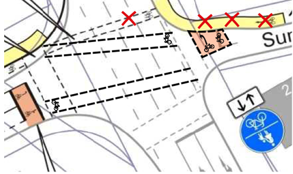

# [ADFC Ortsgruppe Hemmingen/Pattensen](http://adfc-hemmingen-pattensen.github.io/)

## [Mängelliste für Hemmingen](http://adfc-hemmingen-pattensen.github.io/MaengellisteHem/MaengellisteHem.html)

> Letzte Änderung: LetzteAenderung  
> Autor: Jens Spille

Die Radverkehrs-Mängel und Verbesserungsvorschläge, die auf dieser Seite gelistet sind, beziehen sich größtenteils auf unsere [Mängelkarte](http://adfc-hemmingen-pattensen.github.io/MaengelHemPat.html) (Übersicht). Somit steht einmal zur Übersicht die  Mängelkarte zur Verfügung, andererseits steht diese Liste mit detaillierteren Angaben zur Verfügung. 

Link zu [**Mängelkarte**](http://adfc-hemmingen-pattensen.github.io/MaengelHemPat.html)  
Link zur [Open Location Code](https://plus.codes/9F4F8P9F+J9) Karte.

<!-- TOC in VIM Leader+i -->

## TOC

- [ADFC Ortsgruppe Hemmingen/Pattensen](#adfc-ortsgruppe-hemmingenpattensen)
    - [Mängelliste für Hemmingen](#mängelliste-für-hemmingen)
    - [TOC](#toc)
    - [OLC 8P77+W8](#olc-8p77w8)
        - [Kreuzung Mutter Buermann](#kreuzung-mutter-buermann)
    - [OLC 8Q5G+](#olc-8q5g)
        - [Leinebrücke zum Grassdachhaus](#leinebrücke-zum-grassdachhaus)
    - [OLC 8P5M+RG](#olc-8p5mrg)
        - [Kreuzung B3 (alt) - Hoher Holzweg](#kreuzung-b3-alt---hoher-holzweg)

# Open Location Code

Um die Zuordnung der Mängel und Verbesserungsvorschläge zu ermöglichen, ist jeder **Pin** und jede **Linie** auf der Mängelkarte mit einer eindeutigen Bezeichnung versehen.

Als Bezeichner wird der [Open Location Code](https://de.wikipedia.org/wiki/Open_Location_Code) verwendet. Der Open Location Code (OLC) gibt geographische Koordinaten an. Gegenüber der konventionellen Schreibweise in Winkelgrad ist er kompakt, eindeutig, und leicht an die erforderliche Genauigkeit anzupassen. OLC wird auch als **"Plus Codes"** bezeichnet.

So befindet sich zum Beispiel die Fahrrad-Selbsthilfewerkstatt mit den Ziffern [**9F4F8P9F+J9**](https://plus.codes/9F4F8P9F+J9) an der Stelle 52.319063,9.723438 (Heinrich-Hertz-Straße 23, 30966 Hemmingen, Deutschland). Das erste Ziffernpaar des Open Location Codes zerlegt den Globus in 20 × 20 Grad große Flächen. Norddeutschland liegt im Sektor 9F. 

 

Jedes weitere OLC-Ziffernpaar „zwanzigselt“ den bis dahin definierten Bereich in jeder Dimension.Die Ziffern 9F4F beschreiben den Bereich um Hannover.

 

Zum Auffinden des Bereichs gibt man zum Beispiel die Ziffern '9F4F8P9F+J9'auf der Webseite [https://plus.codes](https://plus.codes/9F4F8P9F+J9) ein.

## OLC 8P77+W8
### Kreuzung Mutter Buermann

| Kurzbeschreibung | Querungshilfe fehlt                                                                          |
| ---------------: | -----------------------                                                                      |
| Mängelkarte      | [Link](http://umap.openstreetmap.fr/de/map/adfc-hemmingen-pattensen_84202#15/52.3150/9.7132) |
| Feststelldatum   | 2017-12-05-Di                                                                                |
| Status           | Verbesserungsvorschlag                                                                       |
| Autor            | Jens Spille                                                                                  |
| Ort              | Devese K 221 / Stadweg                                                                       |
| Fahrtrichtung    | Von West nach Ost                                                                            |
| Verantwortlich   | Region                                                                                       |

#### Ist Zustand/Mangel/Gefahr
Radfahrende aus Richtung Westen müssen ungesichert die Fahrbahn kreuzen, um auf den linksseitigen Radweg zu gelangen. Radfahrende haben keine vernünftige Alternative um die Fahrbahn sicher zu queren.

#### Verbesserungsvorschlag

Angebot einer Alternative - z.B. indirektes Abbiegen.

#### Status

- 2018-01-05 J. Spille: Verbesserungsvorschlag wurde in unserer Stellungsnahme vom VEP2030 vorgestellt. *ADFCStellungnahmeVEP2030.doc*
- 2018-10 J.Spille: Bündnes 90/Die Grünen haben ein Gesprächsangebot gemacht.

## OLC 8Q5G+
### Leinebrücke zum Grassdachhaus

| Kurzbeschreibung | Querungshilfe fehlt                                                                          |
| ---------------: | -----------------------                                                                      |
| Mängelkarte      | [Link](http://umap.openstreetmap.fr/de/map/adfc-hemmingen-pattensen_84202#15/52.3110/9.7777) |
| Feststelldatum   | 2014 "Gesamtkonzept wasserbezogener Naherholung"                                             |
| Status           | Verbesserungsvorschlag                                                                       |
| Autor            | Jens Spille                                                                                  |
| Ort              | Steinfeldsees bis Grassdachaus                                                               |
| Fahrtrichtung    | Von West nach Ost                                                                            |
| Verantwortlich   | Hemmingen und Laatzen (plus Naturschutzbehörden)                                             |

#### Ist Zustand/Mangel/Gefahr

Es fehlt ein Konzept zur Entlastung und Entschärfung der sogenannten Wilkenburger Spinne. Bewohner, die von Westerfeld, Arnum oder Wilkenburg nach Laatzen müssen, haben keine andere Wahl, als über die Wilkenburger Spinne nach Wülfel zu fahren. Die Radwege in der Leinemasch sind bei Regen und im Winter  nicht oder nur noch sehr eingeschränkt passierbar.

#### Verbesserungsvorschlag

Hier sollte man die Diskussion über eine Brücke zwischen Wilkenburg und Laatzen, wie sie 2014 im „Gesamtkonzept wasserbezogener Naherholung“ vorgestellt wurde, wieder beleben. Es sollte untersucht werden, in wieweit eine Reduzierung von Abgasen, Feinstäube, Lärm und Unfallgefahren und die Förderung des Radverkehrs, einen Schotterweg in der Nähe des Steinfeldsees rechtfertigt. 

#### Status

- 2014 "Gesamtkonzept wasserbezogener Naherholung"
- 2018-01-05 J. Spille: Verbesserungsvorschlag wurde in unserer Stellungsnahme vom VEP2030 wiederholt.  *ADFCStellungnahmeVEP2030.doc* 

## OLC 8P5M+RG
### Kreuzung B3 (alt) - Hoher Holzweg

| Kurzbeschreibung | Sichere Radführung über B3                                                                   |
| ---------------: | -----------------------                                                                      |
| Mängelkarte      | [Link](http://umap.openstreetmap.fr/de/map/adfc-hemmingen-pattensen_84202#16/52.3097/9.7331) |
| Feststelldatum   | 2018-01-05 Stellungsnahme vom VEP2030                                                        |
| Status           | Vorschlag                                                                                    |
| Autor            | Jens Spille                                                                                  |
| Ort              | Kreuzung B3 (alt) / Hoher Holzweg                                                            |
| Fahrtrichtung    | Alle                                                                                         |
| Verantwortlich   | Hemmingen (in Zukunft)                                                                       |

### Ist Zustand/Mangel/Gefahr

Vom Hohen Holzweg kommend gibt es keinen Radweg zur Ampel. Unklare Verkehrsführung für Radfahrer, da die Streuscheibe der Ampel eine kombinierte Fußgänger und Radfahrer Ampel ist. Wenn Radfahrer vor der Shell Tankstelle stehen, besteht eine Gefahr durch Rechtsabbieger. Verwirrung durch ungünstige Verkehrsführung.

Radfahrer aus Hoher Holzweg in Richtung Sundernweg richten sich teilweise nach der LSA mit der gemeinsamen Streuscheibe für Fuß- und Radverkehr. Dazu wechseln sie von der Fahrbahn Hoher Holzweg auf den Hochbord, um die Furt des LSA zu benutzen (Karte - Punkt 1). Rechts abbiegende Autofahrer aus Hoher Holzweg übersehen leicht die Fußgänger und Radfahrer, da ein Schild den Blick versperrt (Karte - Punkt 2). 

Das Radfahren von der Gartenstraße/Mühlenweg bis zur Shell-Tankstelle auf der linken Seite ist nicht freigegeben. Einen sicheren Übergang vom der Gartenstraße auf die rechte Fahrbahnseite gibt es nicht, deshalb fahren die Schüler, linksseitig auf den Fußweg, um dann die LSA Hoher Holzweg - Sundernweg zu benutzen. In umgekehrter Richtung ist der Fußweg an der B3 für Radfahrer frei gegeben "Fahrrad frei".

### Verbesserungsvorschlag

Eine Radfahrerfurt nahe der Fahrbahn einrichten (blaue Linie). -  Überweg in Höhe Gartenstraße einrichten.

### Status

- 2018-01-05 J. Spille: Verbesserungsvorschlag wurde in unserer Stellungsnahme vom VEP2030 wiederholt.  *ADFCStellungnahmeVEP2030.doc* 
- 2018-11 J. Spille: Vorschlag wurde im Rahmen einer Ortsbegehung wiederholt.
- 2018-11 J. Spille: Alles ist offen. Hier könnte evtl. auch ein Kreisverkehr entstehen.

<!-- 
#########################################################################################################
Vorlage für weitere Einträge

## OLC ?
### ?

| Kurzbeschreibung | ?                       |
| ---------------: | ----------------------- |
| Mängelkarte      | [Link](?)               |
| Feststelldatum   | ?                       |
| Status           | ?                       |
| Autor            | Jens Spille             |
| Ort              | ?                       |
| Fahrtrichtung    | ?                       |
| Verantwortlich   |                         |

### Ist Zustand/Mangel/Gefahr
### Verbesserungsvorschlag
### Status
- Wann, Wer, Was

#########################################################################################################
-->

