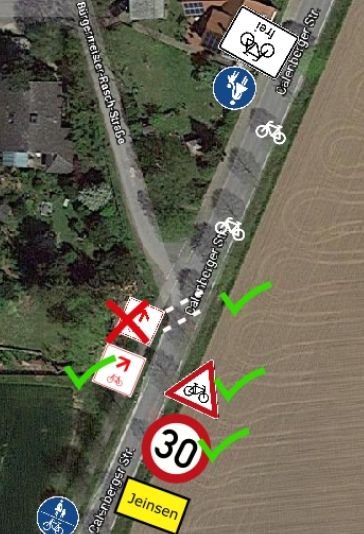

# [ADFC Ortsgruppe Hemmingen/Pattensen](http://adfc-hemmingen-pattensen.github.io/)

## [Mängelliste für Pattensen](http://adfc-hemmingen-pattensen.github.io/MaengellistePat)

> Letzte Änderung: LetzteAenderung  
> Autor: Jens Spille

Die Radverkehrs-Mängel und Verbesserungsvorschläge, die auf dieser Seite gelistet sind, beziehen sich größtenteils auf unsere [Mängelkarte](http://adfc-hemmingen-pattensen.github.io/MaengelHemPat.html) (Übersicht). Somit steht einmal zur Übersicht die  Mängelkarte zur Verfügung, andererseits steht diese Liste mit detaillierteren Angaben zur Verfügung. 

Link zur [**Mängelkarte**](http://adfc-hemmingen-pattensen.github.io/MaengelHemPat.html)  
Link zur [Open Location Code](https://plus.codes/9F4F8P9F+J9) Karte.

<!-- TOC in VIM Leader+i -->

## Übersicht

- [ADFC Ortsgruppe Hemmingen/Pattensen](#adfc-ortsgruppe-hemmingenpattensen)
    - [Mängelliste für Pattensen](#mängelliste-für-pattensen)
- [Open Location Code](#open-location-code)
- [OLC 6Q7V+23](#olc-6q7v23)
    - [Jeinsen Süd](#jeinsen-süd)
- [OLC 7QF6+HG](#olc-7qf6hg)
    - [Kreisel Pattensen Nord](#kreisel-pattensen-nord)
- [OLC 7QJF+2R](#olc-7qjf2r)
    - [Pattenser Str.](#pattenser-str)
- [OLC 7Q64+F9](#olc-7q64f9)
    - [Radweg zur KGS](#radweg-zur-kgs)
- [OLC 7Q87+6P](#olc-7q876p)
    - [Radwegführung Göttinger Straße](#radwegführung-göttinger-straße)

# Open Location Code

Um die Zuordnung der Mängel und Verbesserungsvorschläge zu ermöglichen, ist jeder **Pin** und jede **Linie** auf der Mängelkarte mit einer eindeutigen Bezeichnung versehen.

Als Bezeichner wird der [Open Location Code](https://de.wikipedia.org/wiki/Open_Location_Code) verwendet. Der Open Location Code (OLC) gibt geographische Koordinaten an. Gegenüber der konventionellen Schreibweise in Winkelgrad ist er kompakt, eindeutig, und leicht an die erforderliche Genauigkeit anzupassen. OLC wird auch als **"Plus Codes"** bezeichnet.

So befindet sich zum Beispiel die Fahrrad-Selbsthilfewerkstatt mit den Ziffern [**9F4F8P9F+J9**](https://plus.codes/9F4F8P9F+J9) an der Stelle 52.319063,9.723438 (Heinrich-Hertz-Straße 23, 30966 Hemmingen, Deutschland). Das erste Ziffernpaar des Open Location Codes zerlegt den Globus in 20 × 20 Grad große Flächen. Norddeutschland liegt im Sektor 9F. 

 

Jedes weitere OLC-Ziffernpaar „zwanzigselt“ den bis dahin definierten Bereich in jeder Dimension.Die Ziffern 9F4F beschreiben den Bereich um Hannover.

 

Zum Auffinden des Bereichs gibt man zum Beispiel die Ziffern '9F4F8P9F+J9'auf der Webseite [https://plus.codes](https://plus.codes/9F4F8P9F+J9) ein.
Die ersten vier Stellen nennt man Area-Code, 9F4F im obigen Beispiel. Man kann ihn weglassen, wenn ohnehin klar ist, welchen Ort man meint.

# OLC 6Q7V+23
## Jeinsen Süd

| Kurzbeschreibung | Irreführende Beschilderung                                                                 |
| ---------------: | -----------------------                                                                    |
| Mängelkarte      | [Link](http://adfc-hemmingen-pattensen.github.io/MaengellisteHem/#olc-6Q7V+23)             |
| Einstelldatum    | 2017-12-04                                                                                 |
| Status           | offen                                                                                      |
| Autor            | Jens Spille                                                                                |
| Ort              | Jeinsen - Ortseingang Süd  Einmündung Bürgermeister Rasch Str. in Calenberger Str. (K 202) |
| Fahrtrichtung    | in Richtung Norden - Ortseinfahrt                                                          |
| Verantwortlich   | Region Hannover                                                                            |

### Ist Zustand/Mangel/Gefahr
Der Radweg von Süden trifft linkseitig auf den Ort. Ab hier müssen Radfahrende auf die rechte Fahrbahn wechseln. Dieses Querung ist gefährlich und irreführende beschildert.
Durch die Beschilderung und durch die Furt werden Radfahrende auf den linksseitigen Gehweg geleitet, obwohl der Gehweg in Richtung Norden nicht für Radfahrende freigegeben ist. 

### Mögliche Maßnahmen

Korrektur der Beschilderung und Querungshilfen für Radfahrende.

Beispiel: Korrektur des "Symboles der FAHRRADREGION Hannover" - Furt für Radfahrer - Tempo 30 und Achtung Radfahrer.

### Status

# OLC 7QF6+HG
## Kreisel Pattensen Nord

| Kurzbeschreibung | Doppelte Vorfahr Gewährung                                                     |
| ---------------: | -----------------------                                                        |
| Mängelkarte      | [Link](http://adfc-hemmingen-pattensen.github.io/MaengellisteHem/#olc-7QF6+HG) |
| Einstelldatum    | 2010-09-10                                                                     |
| Status           | offen                                                                          |
| Autor            | Jens Spille                                                                    |
| Ort              | Pattensen - Göttinger Straße - K233 - B3 - K226 - Kreisel                      |
| Fahrtrichtung    | Alle                                                                           |
| Verantwortlich   | ?                                                                              |

### Ist Zustand/Mangel/Gefahr
Autofahrer müssen, aus dem Kreisel kommend, Vorfahrt gewähren, zugleich habe die Radfahrer das Zeichen 205 Vorfahrt gewähren. Das stiftet Verwirrung. Die Idee dahinter ist eine scheinbare doppelte Sicherheit. In der Realität gewöhnt sich der Stärkere an seine scheinbare Vorfahrt. Hinzu kommt, das eine Einigung per Sichtkontakt, bei Dunkelheit mit Scheinwerferlicht für den Radfahrer nicht zu machen ist.

### Mögliche Maßnahmen
"Rechts vor Links" wie immer. Je weniger Ausnahmen, desto einfacher und sicherer der Verkehr.

### Status

# OLC 7QJF+2R
## Pattenser Str. 

| Kurzbeschreibung | Radweg fehlt                                                                                 |
| ---------------: | -----------------------                                                                      |
| Mängelkarte      | [Link](http://umap.openstreetmap.fr/en/map/adfc-hemmingen-pattensen_84202#15/52.2795/9.7740) |
| Einstelldatum    | 2018-12-06                                                                                   |
| Status           | offen                                                                                        |
| Autor            | Jens Spille                                                                                  |
| Ort              | Pattenser Straße (K223)                                                                      |
| Fahrtrichtung    | In beiden Richtungen                                                                         |
| Verantwortlich   | Region Hannover                                                                              |

### Ist Zustand/Mangel/Gefahr

HAZ Pattensen Artikel -  2018-12-06

#### K 223: Redener fordern längeren Radweg
Pattenser Ortsteil fehlt ausgebaute Verbindung zur Kernstadt

VON KIM GALLOP

Reden. Wer Politik macht, auch Kommunalpolitik, braucht häufig einen langen Atem. Ratsmitglied Matthias Friedrichs (SPD) aus Reden hat bei der jüngsten Ratssitzung erneut einen Vorstoß zur Verlängerung des Fuß- und Radwegs an der Kreisstraße 223 (Pattenser Straße) gemacht.

Nach den Vorstellungen von Friedrichs und von der Redener Ortsvorsteherin Edeltraut Ruppelt-Czybulka soll diese Verbindung von Reden/Mühle – dem Abzweig nach Harkenbleck – aus bis in den Kern von Reden verlängert werden. Wie sie in ihrem Antrag
schildern, sei dieser Ausbau eine „absolute Notwendigkeit“ und müsse „schnellstmöglich“ umgesetzt werden.

Das Thema ist nicht neu: Es gibt schon einen entsprechenden Ratsbeschluss aus dem Frühjahr 2015. Da die Gestaltung der Kreisstraße samt möglicher Fuß- und Radwege eine Angelegenheit der Region Hannover ist, wurde die Stadtverwaltung von Pattensen entsprechend beauftragt, sich in der Sache an die Region zu wenden. Verändert wurde die Strecke seitdem allerdings nicht.

In ihrem neuen Antrag beschreiben Friedrichs und Ruppelt-Czybulka, dass die K 223 eine
viel befahrene Straße ist – und die einzige befestigte Anbindung von Reden an Pattensen-Mitte. „Fußgänger, aber auch Fahrradfahrer setzen sich selbst einer hohen Unfallgefahr aus, sobald sie die Strecke vom Stadtteil Reden aus zum nächsten Fuß- oder Radweg zurücklegen wollen“, heißt es. Besonders deutlich sei das beim jüngsten Streik beim Verkehrsunternehmen Üstra geworden: Wer als Fußgänger oder Radfahrer von Reden aus nach Pattensen wollte oder umgekehrt, dem bliebt „nur die hochgradig gefährliche Route über die K 223“.

Friedrichs hatte in der Ratssitzung persönlich um eine möglichst große Mehrheit für den Antrag gebeten. „Das hat mehr Gewicht bei
der Region“, sagte er. „Ich würde mich über jede Stimme freuen.“ Sein Wunsch wurde erfüllt: Es gab außer einer Enthaltung nur Ja­stimmen.

Was die Region von der Angelegenheit hält, ist einer Stellungnahme des Fachbereichs Verkehr zu entnehmen. Die Stadt Pattensen hatte vor kurzem nachgefragt, ob die geforderte Radwegverbindung nicht als Teil des sogenannten Vorrangnetzes für den Alltagsradverkehr mit Bundesmitteln
ausgebaut wird. Vonseiten der Region heißt es, dass diese Verbindung nicht Teil des Vorrangnetzes ist. Und weiter steht in der Antwort: „Ein Neubau eines Radweges außerhalb des Vorrangnetzes kann leider nicht in Aussicht gestellt werden.“

### Mögliche Maßnahmen
Radweg bauen

### Status
- 2018-12-06 - Region - „Ein Neubau eines Radweges außerhalb des Vorrangnetzes kann leider nicht in Aussicht gestellt werden.“

# OLC 7Q64+F9
## Radweg zur KGS 

| Kurzbeschreibung | Radweg zur KGS ist kurvig                                                                    |
| ---------------: | -----------------------                                                                      |
| Mängelkarte      | [Link](http://umap.openstreetmap.fr/en/map/adfc-hemmingen-pattensen_84202#16/52.2625/9.7550) |
| Einstelldatum    | 2019-03-26                                                                                   |
| Status           | in Planung                                                                                   |
| Autor            | Jens Spille                                                                                  |
| Ort              | Zwischen Dammstraße und KGS                                                                  |
| Fahrtrichtung    | In beiden Richtugen                                                                          |
| Verantwortlich   |                                                                                              |

### Ist Zustand/Mangel/Gefahr

siehe [HAZ Artikel](7Q64+F9_2019-03-26 HAZ Pat Radweg zur KGS ist kurvig.pdf)

### Status

# OLC 7Q87+6P
##  Radwegführung Göttinger Straße

| Kurzbeschreibung | Ein Hin und Her                                                                              |
| ---------------: | -----------------------                                                                      |
| Mängelkarte      | [Link](http://umap.openstreetmap.fr/en/map/adfc-hemmingen-pattensen_84202#15/52.2651/9.7655) |
| Einstelldatum    | 2019-09-22                                                                                   |
| Status           | In Gespräch mit Grünen                                                                       |
| Autor            | Jens Spille                                                                                  |
| Ort              | Pattensen - Göttinger Straße                                                                 |
| Fahrtrichtung    | In beiden Richtungen                                                                         |
| Verantwortlich   | Region und Pattensen                                                                         |

### Ist Zustand/Mangel/Gefahr

Plenergy Sommer 2019: Die Schüler der KGS hatten u.a. das Thema "Ausbau Radwege" auf Ihrer Liste. Im Anschluss ist folgende Aufzeichnung entstanden (ohne Gewähr).

Wenn schon Radfahrende von Norden kommend zwischen der Koldinger Straße bis zur Esso Tankstelle auf der Fahrbahn fahren dürfen (grau gestrichelt), warum dann nicht auf der Tempo 30 Strecke von der Schöneberger Straße bis zur Koldinger Straße? Dann müssen Radfahrende nicht zwangsweise an der Koldinger Straße von der Linken auf die Rechte Straßenseite wechseln. 

#### Brief an Politiker (März 2019)
Sehr geehrte Damen und Herren,

Der ADFC Hemmingen/Pattensen möchte anlässlich der Diskussion zur Radwegführung in der Göttinger Straße in Pattensen die Sichtweise von Fußgängern und Radfahrenden als Diskussionsbeitrag einbringen und steht für einen konstruktiven Dialog gerne zur Verfügung.

Die ADFC Ortsgruppe Hemmingen/Pattensen sieht die bestehende und auch zukünftig angedachte Radwegeführung entlang der Göttinger Straße als kritisch an und mit einem hohen Gefahrenpotential verbunden. Die Radfahrenden werden auf der Göttinger Straße innerorts auf einem Teil des Zweirichtungs-Rad-/Gehweg neben einer Tempo 30 Strecke geführt. Radfahren entgegen der Fahrrichtung im Zweirichtungsverkehr darf innerorts nach Verwaltungsverordnung nur in Ausnahmefällen  verpflichtend angeordnet werden. 
Abbiegeunfälle mit linksseitig fahrenden Radfahrern gibt es leider zu häufig. 

Der Radweg entlang der Göttinger Straße gehört zum Vorrang-Radwegenetz der Region mit einer mittleren Netzbedeutung und verbindet Pattensen u.a. mit Hemmingen zur späteren Stadtbahn-Endhaltestelle bzw. mit Hannover Zentrum über Harkenbleck und Wilkenburg.

Grundsätzlich ist der ADFC-Hemmingen/Pattensen der Auffassung, dass auf der Göttinger Straße die gesamte Radwegeführung entlang der Tempo 30 Strecke und weiter bis zum Ortsausgang (ESSO Tankstelle) überarbeitet werden sollte. Hier sehen wir Anregungen aus der Semesterarbeit der Studenten der HAWK Hildesheim (WS 2015/2016) als einen ersten Ansatz. Die Arbeit wurde am 25.01.2016 in der Grundschule Pattensen Mitte vorgestellt.

Eine Verkehrsführung für Radfahrende in Ortschaften soll nach Verwaltungsvorschriften eine einheitliche Führung in geschlossenen Ortschaften aufweisen. Also baulich getrennte Radwege oder Fahrbahnführung im durchführenden Verkehrsraum. Da in Pattensen keine einheitliche Radverkehrsführung erkennbar ist, wäre eine Konzepterstellung für Pattensen wünschenswert.

Auf Höhe der Haltestelle Schöneberger Straße kreuzen sich auf den Bus Wartende mit durchfahrenden Radfahrern. Dieses gilt schon jetzt und auch nach der eventuellen Errichtung der geplanten B+R-Anlage. 

Als "Minimallösung" unterstützt der ADFC den Vorschlag diesen Zweirichtungs-Rad-/Gehweg als Gehweg mit Zusatz "Radverkehr frei" auszuweisen, um ein reguläres, legales Befahren der Straße zu ermöglichen.

Ein Gehweg mit Zusatz "Radverkehr frei" ermöglicht Radfahrenden in Richtung Norden auf der Fahrbahn auszuweichen. In Richtung Süden wäre dieses Theoretisch auch möglich, aber da Radfahrenden auf der kurzen Strecke zweimal die Fahrbahn kreuzen müssten, wird dieses selten geschehen. Deshalb der Begriff "Minimallösung".

Gern möchten wir diese Themen der Verkehrsführungen für Radfahrende auch mit der AG Stadtentwicklung diskutieren und würden uns über eine Einladung zu einer Sitzung freuen.

Mit freundlichen Grüßen

Jens Spille, Dirk Härtel, Udo Scherer, Ralf Schmalkuche

Ortsgruppe ADFC Hemmingen/Pattensen.

### Mögliche Maßnahmen
siehe: Semesterarbeit der Studenten der HAWK Hildesheim (WS 2015/2016) 

### Status

<!-- 
########################################################################################################
Vorlage für weitere Einträge

# OLC ?
## ?

| Kurzbeschreibung | ?                       |
| ---------------: | ----------------------- |
| Mängelkarte      | [Link](?)               |
| Einstelldatum    | ?                       |
| Status           | ?                       |
| Autor            | Jens Spille             |
| Ort              | ?                       |
| Fahrtrichtung    | ?                       |
| Verantwortlich   |                         |

### Ist Zustand/Mangel/Gefahr
### Mögliche Maßnahmen
### Status
- Wann, Wer, Was

#########################################################################################################
-->

