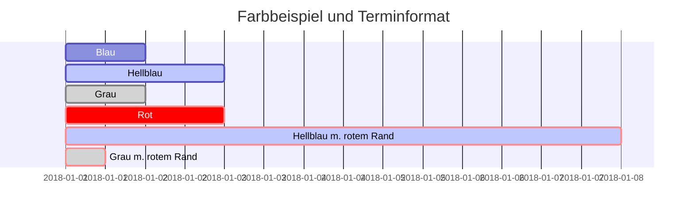
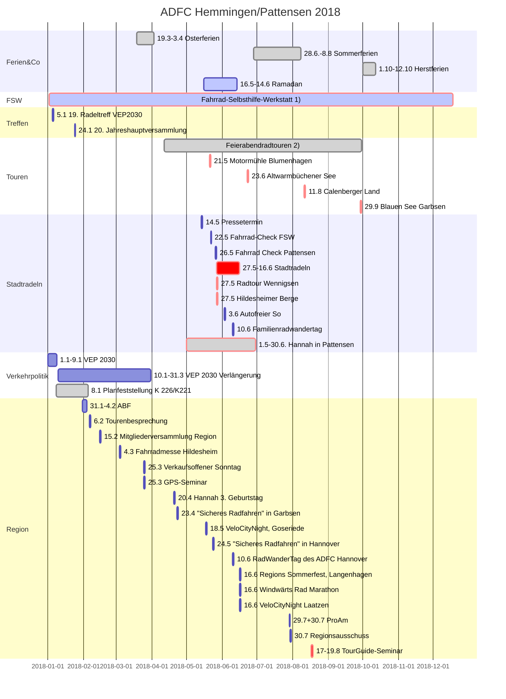
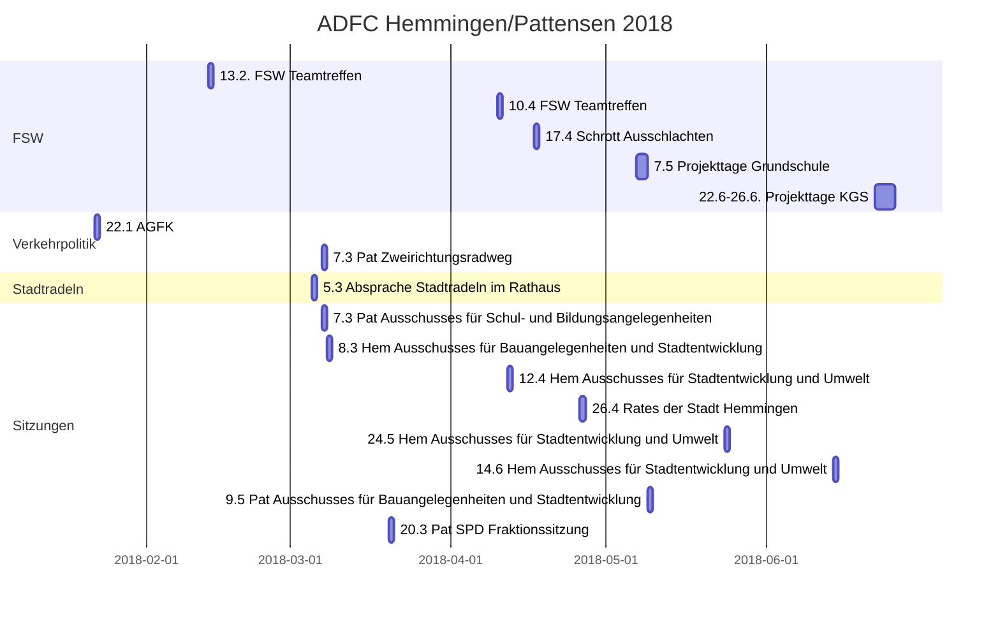

# [ADFC Hemmingen / Pattensen](http://adfc-hemmingen-pattensen.github.io/)

## Terminplan

### Öffentlich Termine

1. Die Fahrrad-Selbsthilfe-Werkstatt (FSW) hat jeden Dienstag von 17:30 bis 19:00 geöffnet.
2. Spontane Feierabendradtouren werden bei entsprechenden Wetter in der Regel Mittwochs angeboten. Die ADFC Ortsgruppe hat dafür eine E-Mail Liste angelegt. Wir melden uns wenn es passt. Wer auf dieser Liste möchte, schreibe bitte an j.spille@adfc-hannover.de.
3. Den Hemminger Sitzungskalender gibt es unter https://www.stadthemmingen.de/politik-gremien/buergerinformationssystem/
4. Den Pattenser Sitzungskalender gibt es unter https://pattensen.more-rubin1.de/sitzungskalender.php

### Interne Termine

