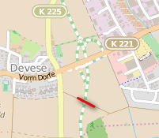
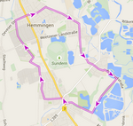

# [ADFC Ortsgruppe Hemmingen/Pattensen](http://adfc-hemmingen-pattensen.github.io/)

Am 19. Mai 2015 ist in Hemmingen die [12. ADFC-Ortsgruppe](http://adfc-hemmingen-pattensen.github.io/) der Region Hannover gegründet wurden. Es waren 18 Radfahrinteressierte ins Hemminger Rathaus gekommen. Der bisherige Ansprechpartner des ADFC in den Kommunen berichtete über die bisherigen Aktivitäten von ADFC Aktiven. Da sind Radwegebenutzungspflicht, neues Radverkehrskonzept in Hemmingen, Planungen zur Stadtbahnverlängerung und Alltagradwegenetz hervorzuheben.Ein Vertreter des ADFC Regionsvorstandes hat die anschließende Wahl eines Sprecherteams geleitet. Als Sprecher ist Jens Spille, und als Stellvertreter Dirk Härtel gewählt worden.

## Kontakt

Jens Spille siehe auch  <http://www.adfc-hannover.de>  

## Was wird

- Die nächste **Radtour** ist für Mittwoch den 17.06.2015 um 19 Uhr mit Start am Rathausplatz in Hemmingen geplant.

- Vom 08.05.2015 bis 08.06.2015 liegt in der Stadt Pattensen das **[Planfeststellungsverfahren](http://www.hannover.de/Leben-in-der-Region-Hannover/Verwaltungen-Kommunen/Bekanntmachungen-Ausschreibungen/Amtliche-Bekanntmachungen/Planfeststellungsverfahrens-f%C3%BCr-den-Umbau-des-Knotenpunkts-B-3-K-203-Wirtschaftsweg-%C3%B6stlich-Oerie-im-Zuge-der-B-3-Stadt-Pattensen) für den Umbau des Knotenpunkts B 3 / K 203 / Wirtschaftsweg** östlich Oerie im Zuge der B 3 (Stadt Pattensen) zur allgemeinen Einsichtnahme aus. 
    - Nach erster Durchsicht fehlt eine Querungshilfe in Richtung Oerie.  
	- Stellungsnahmen sind bis 24.06.2015 möglich  
    
- Der nächste **Radlertreff** wird am 14.07.2015 um 19 Uhr in Pattensen stattfinden. Eine geführte Radtour wird um 18 Uhr vom Rathaus Hemmingen nach Pattensen starten.

    - Ort [Mobile Pattensen](http://mobile-pattensen.de/) im Mehrgenerationenhaus im  Café-Raum - MOBILE e.V., Göttinger Str. 25a, 30982 Pattensen 

## Fahrrad(un)freundliche Nachrichten
- Leine Nachrichten vom 06.06.2015: Eine Radfahrer-Brücke für den Grünen Ring über die neue B3 würde 635 000 Euro kosten.
    - 

## Was war

- Zweite Radtour war am 03.06.2015 um 19 Uhr mit Start am Rathausplatz in Hemmingen. 

- Erste Radtour war am 27.05.2015 um 19 Uhr mit Start am Rathausplatz in Hemmingen.

- Sechstes Treffen war am 28.05.2015 um 19 Uhr bei Mutter Buermann - Devese. 
    -  Thema war die Besprechung unserer Einwendungen zu dem Planfeststellungsverfahren - Planänderung - Oberirdische Stadtbahnverlängerung nach Hemmingen  im Bereich der Stadtbahnstrecke A-Süd  
    - Die schriftlichen Einwendung wurden am 03.06.2015 bei der Niedersächsische Landesbehörde für Straßenbau und Verkehr eingereicht.

- Ortsgruppengründung fand am 19.05.2015 im Hemminger Bürgersaal Rathaus statt. Ankündigung stand in der [rings um uns](2015-05-13 LN AnkOrtsgruppengründung.pdf) und in der [HannoRad 1|2015](http://www.adfc-hannover.de/hannorad/) auf Seite 28.

- Mehr aus der [Vergangenheit](waswar.html)

## Impressum

Mit fahrradfreundlichen Grüßen, die ADFC Ortsgruppe Hemmingen/Pattensen. Zu erreichen über <http://www.adfc-hannover.de>  

