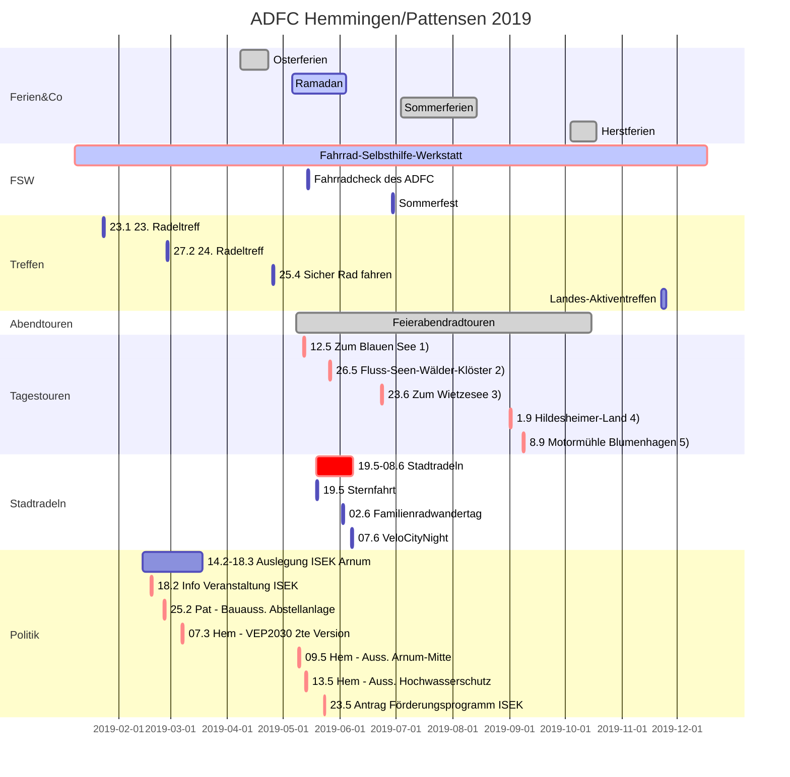

<iframe src="bannerAnimated.sozi.html" width="100%" height="90" frameBorder="0">
    ADFC Banner
</iframe>

# [ADFC Hemmingen / Pattensen](http://adfc-hemmingen-pattensen.github.io/)

<!--[](http://www.adfc-hannover.de/)-->

<!-- -->


Der ADFC (Allgemeiner Deutscher Fahrrad Club) Hemmingen/Pattensen engagiert sich für gute Fahrradinfrastruktur und ein fahrradfreundliches Klima in Hemmingen und Pattensen. [PDF-Broschüre](190117 ADFC Hemmingen-Pattensen Profil.pdf)

Sprecher Jens Spille, E-Mail: [j.spille@adfc-hannover.de](mailto:j.spille@adfc-hannover.de)

> **ADFC Fahrrad-Selbsthilfewerkstatt-Hemmingen**<br>
> in der Heinrich-Hertz-Straße 23 (Hinterhof), Hemmingen
> hat immer Dienstags von 17:30 bis 19:00 Uhr geöffnet<br>

> Hilfe bei Reparatur, Fahrradausgabe, [Spendenannahme](#konto)<br>
> ✉ [Fahrrad-Selbsthilfewerkstatt-Hemmingen@web.de](mailto:Fahrrad-Selbsthilfewerkstatt-Hemmingen@web.de)

>  oder [Mitglied werden](https://www.adfc.de/7678_1)

> **Lasten zu groß? Keine Ausrede** Leihen Sie sich kostenlos ein Hannah Lastenrad unter <http://www.hannah-lastenrad.de/>. Hilfe, Fragen und Wünsche zur Hannah gibt unter [hallo@hannah-lastenrad.de](mailto:hallo@hannah-lastenrad.de)


## Wer sind wir?

Der ADFC Hemmingen/Pattensen engagiert für gute Fahrradinfrastruktur und ein fahrradfreundliches Klima. Seit 2015 und mit mittlerweile rund 107 Mitgliedern (Stand Jan. 2019) und weiteren Ehrenamtlichen, engagiert sich der ADFC Hemmingen/Pattensen in den beiden Städten für 

1. Eine sichere und bessere Fahrradinfrastruktur (Radverkehrspolitik) 
2. Mehr Bewusstsein, dass Fahrradfahren eine zentrale Säule der Verkehrswende ist (Öffentlichkeitsarbeit) 
3. Touristisches Erleben der Region Hannover und darüber hinaus (Radtouren) 
4. Eine kostengünstige Versorgung Bedürftiger und Geflüchteter mit Fahrrädern und Reparatur-Unterstützung in der Fahrrad-Selbsthilfewerkstatt.

Diese vier zentralen Themenfelder werden in unser [PDF-Broschüre](190117 ADFC Hemmingen-Pattensen Profil.pdf) kurz vorgestellt. 

## Inhalt
> - [Aktuelles](#aktuelles)
>   - Kurzfristige Meldung
> - [Was wird](#was-wird)
>   - 5 Tagestouren in 2019 geplant. 
> - [Tipps und Nachrichten](#tipps-und-nachrichten)
>   - Veränderte Verkehrsführung wegen B3 Neubau
> - [Mängelkarte für Hemmingen und Pattensen](#unsere-mängelkarte)
> - [Was war](#was-war)
> - [Datenschutz](Datenschutzerklaerung_ADFC_2018-1-KV.pdf)
>   -  <span style="color: #888888; font-size: 0.8em;"> *Übertragung von schützenswerten Daten nur Verschlüsselt. [So funktioniert es](https://www.gpg4win.de/documentation-de.html) mit meinem öffentliche OpenPGP [ 0x9AF24CC8B850EFB77F629711906211B8AC607CB1](https://adfc-hemmingen-pattensen.github.io/OpenPGP/9AF24CC8B850EFB77F629711906211B8AC607CB1.asc) Schlüssel. [j.spille@adfc-hannover.de](mailto:j.spille@adfc-hannover.de)*</span>
> - [Impressum](#impressum)

## Aktuelles

### Kurzfristige Meldung
<div class="holder" style="width: 100%; height:500px; position:relative;">
<iframe width="100%" height="100%" src=https://hackmd.io/U-6kWHTpRAyp9glY_QNyKg" frameborder="1"></iframe>
<div style="position:absolute; top:3px; left:5px; width:100%; height:130px;"></div>
</div>

### Erste Mittwochstour in diesem Jahr
Die ADFC-Ortsgruppe Hemmingen-Pattensen möchte euch am nächsten Mittwoch, den 08.05.2019 um 18:00,
zu unserer ersten Feierabendtour 2019 einladen.
 
Treffpunkt ist wie immer der Rathausplatz in Hemmingen.
 
Wir werden uns wie immer nach Lust und Laune, sowie nach evtl. Wünschen der Teilnehmer richten. Ein Vorschlag ist, durch die Eilenriede zur Anderter Schleuse zu fahren.
 
Mal sehen, wohin die Reise geht ...

### RADTOUR 1 „Nach Garbsen zum Blauen See“ 

> 12.5., Sonntag, 10:00 Uhr 

Die ca. 51 km lange Strecke beginnt am Rathausplatz in Hemmingen und führt uns durch  
Wettbergen, Empelde, an der Kalihalde vorbei zum Benther Berg. Von dort geht es über 
Velber und Letter zum Stichkanal Hannover-Linden (Abzweig vom Mittellandkanal).  
Direkt am Kanal entlang fahren wir, vorbei an Seelze, nach Lohnde. Dort überqueren wir den 
Mittellandkanal und etwas später die Leine und erreichen den Blauen See, mit der 
Möglichkeit zum Picknick (bitte Verpflegung mitbringen!). 
Der Rückweg geht dann durch die Leinewiesen zum Wasserstraßenkreuz, ein imposantes 
Bauwerk. Danach geht es über Marienwerder mit der gleichnamigen Klosterkirche in den 
Hinüberschen Garten. Weiter fahren wir durch die Maschwiesen bei Stöcken und kommen 
wieder an den Stichkanal. An Leine und Ihme entlang, an den Ricklinger Teichen vorbei, 
fahren wir zurück nach Hemmingen.  

> **Dauer:** ca. 5-6 Std., bitte ausreichende Verpflegung mitnehmen! Einkehrmöglichkeiten sind unterwegs vorhanden.  
> **Führung:** Dirk Härtel, Günther Kleinod, Helmut Krause, Jochen Lemke, 
(ADFC Hemmingen/Pattensen)  
> **Treffpunkt:** Hemmingen, Am Rathausplatz, rechtzeitig zur Abfahrt um 10.00 Uhr  
> **Anmeldung:** Nicht erforderlich, Infos unter 05101-4164 

### Stadtradeln

Das Stadtradeln 2019 beginnt am So. 26. Mai 2019. Erneut werden die Kommunen Hemmingen und Pattensen an der dreiwöchigen Aktion vom 26. Mai bis 8. Juni teilnehmen.
Die Teilnehmer können die gefahrenen Kilometer zählen und Ihren Kommunen gutschreiben. 
Radler können sich auf der Seite [https://www.stadtradeln.de/](https://www.stadtradeln.de/) registrieren.
Beide Städte haben besondere Aktionen geplant: 

**Pattensen** lädt am 19. Mai von 10 bis 17 Uhr zum Klimaschutzforum im Rathaus ein. 
Um 10:15 treffen sich die Radfahrenden die sich an der [Sternfahrt nach Hannover](https://fahrradsternfahrt-hannover.de/) beteiligen wollen "[Flyer](Flyer Fahrradsternfahrt 2019.pdf)". 
Von dort geht es nach Hemmingen zum Rathausplatz, um mit Ronnenberger und Hemminger gemeinsam nach Hannover zu fahren.

**Hemminger** treffen sich zunächst um 09:30 am Rathausplatz und fahren zum Frühstück nach Devese zu Mutter Buermann. Das Frühstück kosten 2 Euro.
Gemeinsam mit den Ronnenberger und Pattenser geht es ab 11:00 zur [Sternfahrt nach Hannover](https://fahrradsternfahrt-hannover.de/). Um 12:30 sollen alle am Opernplatz sein.


*Um die [Fahrradroute](https://fahrradsternfahrt-hannover.de/touren/) sicher zu gestalten, suchen wir engagierte, ambitionierte RadfahrerInnen, die uns als OrdnerIn unterstützen.*


Am 22. und 20. Mai sowie am 5. Juni, jeweils um 18:00 laden wir zur Mittwochstour ab dem Rathausplatz ein.

### Familien-Radwandertag
Familien-Radwandertag des ADFC Region Hannover. Einmal rund um Hannover.

### Velo City Night

Als diesjährige Besonderheit findet währenden des Stadtradeln die Velo City Night am Freitag den 7. Juni in Hemmingen und Pattensen statt.
Die Velo City Night beginnt um 19:00 auf dem Rathausplatz in Hemmingen führt nach Pattensen und endet gegen 22:30 wieder in Hemmingen. Ein DJ sorgt auf einer kleinen Bühne für Musik.
Die Geschäfte werden länger geöffnet haben.

### Das Fahrrad braucht mehr Platz


Mehr Radverkehr ist die Lösung bei Stau, dicker Luft und Fahrverboten. Steigen mehr Menschen auf das Fahrrad um, ist das gut für alle. Wie das gelingt, zeigt der Allgemeine Deutsche Fahrrad-Club zu seinem 40-jährigen Bestehen mit einer großen, bundesweiten Kampagne. Das Ziel: Mehr Platz fürs Rad - für gute, breite Radwege, sichere Kreuzungen und viel mehr Fahrradparkplätze. Mit Aktionen vor Ort macht der Fahrradclub auf die Platzdebatte im Straßenraum aufmerksam und zeigt, wie dieser Platz fürs Fahrrad, für gute Radwege und für bessere Radfahrbedingungen genutzt werden kann. Weitere Informationen auf [mehrplatzfuersrad.de](http://mehrplatzfuersrad.de ). Hashtag: #MehrPlatzFürsRad.

### ISEK Arnum-Mitte

Die Stadt Hemmingen hat einen 80-seitgen Entwurf zum "Teilräumliches ISEK - Voruntersuchung Arnum Mitte" im Internet bereit gestellt [Drucksache 341/2019](https://www.stadthemmingen.de/allris/vo020.asp?VOLFDNR=1202). 

Hier eine von vielen Umbaumaßnahmen die angedacht sind.


Der Entwurf wird vom Do. 14.02 bis Mo. 18.03 im Rathaus Hemmingen ausliegen. Eine öffentliche Informationsveranstaltung ist am Mo. 18.02 ab 19:00 in der Wäldchenschule replant. 

> Die ADFC Mitglieder haben auf Ihren 23. RadelTreff in diesem Zusammenhang auch über einen [Shared Space](https://de.wikipedia.org/wiki/Shared_Space) (deutsch: „gemeinsamer Raum“) diskutiert. *Charakteristisch ist dabei die Idee, auf Verkehrszeichen, Signalanlagen und Fahrbahnmarkierungen zu verzichten. Gleichzeitig sollen die Verkehrsteilnehmer vollständig gleichberechtigt werden, wobei die Vorfahrtsregel weiterhin Gültigkeit besitzt. Im Gegensatz zur konventionellen Verkehrsberuhigung soll auch eine Anwendung in Hauptverkehrsstraßen möglich sein. (Wikipedia)*

> Beispiel: Shared-Space Kreisel in Bohmte (NdS).
> 

## Was wird

## Neuer Terminplan

1. Die Fahrrad-Selbsthilfe-Werkstatt (FSW) hat jeden **Dienstag von 17:30 bis 19:00** geöffnet.
2. Spontane Feierabendradtouren werden bei entsprechenden Wetter in der Regel Mittwochs angeboten. Die ADFC Ortsgruppe hat dafür eine E-Mail Liste angelegt. Wir melden uns wenn es passt. Wer auf dieser Liste möchte, schreibe bitte an [j.spille@adfc-hannover.de](mailto:j.spille@adfc-hannover.de).
3. Den Hemminger Sitzungskalender gibt es unter [https://www.stadthemmingen.de/politik-gremien/buergerinformationssystem/](https://www.stadthemmingen.de/politik-gremien/buergerinformationssystem/)
4. Den Pattenser Sitzungskalender gibt es unter [https://pattensen.more-rubin1.de/sitzungskalender.php](https://pattensen.more-rubin1.de/sitzungskalender.php)

<!-- see https://github.com/raghur/mermaid-filter-->
<!--```{.mermaid format=svg  theme=forest caption="ADFC Hemmingen/Pattensen"}-->

<!-- Preview for editors https://mermaidjs.github.io/mermaid-live-editor/ -->

#### Weiter Termine unter <http://www.adfc-hannover.de/termine/>


### Mittwochstour


Spontane Feierabendradtouren werden bei entsprechenden Wetter (Sommer) in der Regel Mittwochs angeboten. Die ADFC Ortsgruppe hat dafür eine E-Mail Liste angelegt. Wir melden uns wenn es passt. Wer auf dieser Liste möchte, schreibe bitte an [j.spille@adfc-hannover.de](mailto:j.spille@adfc-hannover.de).

### RADTOUR 1 „Nach Garbsen zum Blauen See“ 

> 12.5., Sonntag, 10:00 Uhr 

Die ca. 51 km lange Strecke beginnt am Rathausplatz in Hemmingen und führt uns durch  
Wettbergen, Empelde, an der Kalihalde vorbei zum Benther Berg. Von dort geht es über 
Velber und Letter zum Stichkanal Hannover-Linden (Abzweig vom Mittellandkanal).  
Direkt am Kanal entlang fahren wir, vorbei an Seelze, nach Lohnde. Dort überqueren wir den 
Mittellandkanal und etwas später die Leine und erreichen den Blauen See, mit der 
Möglichkeit zum Picknick (bitte Verpflegung mitbringen!). 
Der Rückweg geht dann durch die Leinewiesen zum Wasserstraßenkreuz, ein imposantes 
Bauwerk. Danach geht es über Marienwerder mit der gleichnamigen Klosterkirche in den 
Hinüberschen Garten. Weiter fahren wir durch die Maschwiesen bei Stöcken und kommen 
wieder an den Stichkanal. An Leine und Ihme entlang, an den Ricklinger Teichen vorbei, 
fahren wir zurück nach Hemmingen.  

> **Dauer:** ca. 5-6 Std., bitte ausreichende Verpflegung mitnehmen! Einkehrmöglichkeiten sind unterwegs vorhanden.  
> **Führung:** Dirk Härtel, Günther Kleinod, Helmut Krause, Jochen Lemke, 
(ADFC Hemmingen/Pattensen)  
> **Treffpunkt:** Hemmingen, Am Rathausplatz, rechtzeitig zur Abfahrt um 10.00 Uhr  
> **Anmeldung:** Nicht erforderlich, Infos unter 05101-4164 

### RADTOUR 2 Radtour für Geübte „Fluss-Seen-Wälder-Klöster“ 

> 26.05., Sonntag, 10 Uhr 

Die ca.50 km lange Strecke führt uns in südlicher Richtung auf guten Wirtschafts-und 
Fahrradwegen über Jeinsen, Sieger beim Regionswettbewerb “Unser Dorf hat Zukunft“, 
weiter nach Schulenburg. Dort durchqueren wir den Ort und fahren unterhalb des 
Marienberges ein Stück auf dem Leine-Heide-Radweg, überqueren die Leine und fahren vor 
Nordstemmen durch ein kleines Seen-Gebiet nach Wülfingen. Nachdem wir ein kurzes Stück 
entlang der B3 gefahren sind, biegen wir auf einen asphaltierten Wirtschaftsweg ab und 
erreichen den Ort Wittenburg. Dort fahren wir steil hinauf zum „Augustiner Kloster 
Wittenburg“ mit seiner wuchtigen Klosterkirche und einen weiten Blick ins Land. Nun geht es 
weiter am Rande des Osterwaldes zum sehenswerten „Klostergut Wülfinghausen“, welches 
wir durchqueren und radeln danach auf einem sehr schönen Weg am Waldrand weiter zum 
„Cafe Am Waldkater“ mit Einkehrmöglichkeit, man sitzt dort in einem gemütlichen 
Biergarten mit weiten Blick ins Land. Danach radeln wir am Nordrand des Osterwaldes zum 
„Forsthaus Fahrensen“ und fahren in den Osterwald hinein zum „Waldrestaurant 
Holzmühle“. Innerhalb der Wildschweingehege-Mauer, am Rande des „Kleinen Deisters“, 
radeln wir nach Eldagsen und fahren dann auf der ehemaligen Landstraße weiter nach 
Mittelrode, wo uns das rustikale „Bauerncafe Mittelrode“ mit Biergarten, zu Kaffee und 
Kuchen einlädt. Gut gestärkt geht es auf die letzte Etappe unserer Rundtour in nördlicher 
Richtung nach Bennigsen und von dort aus über die „Calenberger-Ackerwege“ nach 
Pattensen zurück. 

> **Dauer:** ca. 6-7 Std., Verpflegung bitte mitnehmen!  
> **Führung:** Helmut Krause, Jochen Lemke, Günter Kleinod, Dirk Härtel (ADFC 
Hemmingen/Pattensen)  
> **Treffpunkt:** Pattensen Neues Rathaus, rechtzeitig zur Abfahrt um 10.00 Uhr  
> **Anmeldung:** Nicht erforderlich, weitere Infos unter 05069-7979 

### RADTOUR 3 „Durchs grüne Hannover zum Wietzesee“ 

> 23.6., Sonntag, 10.00 Uhr 

Die ca. 60 km lange Strecke beginnt am Rathausplatz in Hemmingen und führt uns durch  
die Hemminger Wiesen, an den Ricklinger Teichen vorbei zum Maschsee. Von dort geht es, 
fast immer im Grünen durch die Eilenriede, nach Bischhofshol und Kleefeld zum Pferdeturm.  
Weiter geht es am Zoo vorbei, über Vier Grenzen in die List. Hier überqueren wir den 
Mittellandkanal, und fahren weiter zum Silbersee in Langenhagen. Vorbei an der 
Pferderennbahn Neue Bult kommen wir nach Isernhagen an den Hufeisensee, mit der 
Möglichkeit zum Picknick oder Einkehr. Nach einer ausreichenden Pause fahren wir weiter 
zum Wietzesee, am Golfplatz vorbei, zum Waldkater. Hier kehren wir um und fahren zurück 
durch die Felder der Isernhagener Bauernschaften zum Altwarmbüchener See. Dort machen 
wir eine weitere Pause. Anschließend fahren wir weiter durch den Misburger Wald und 
kommen wieder an den Mittellandkanal. Nach einer kurzen Fahrt am Kanal entlang biegen 
wir ab, fahren durch eine Kleingartenkolonie, vorbei am Annateich und erreichen den 
Hermann-Löns-Park mit der Alten Mühle. Zurück geht es wieder vorbei am Maschsee, den 
Ricklinger Teichen nach Hemmingen. 

> **Dauer:** ca. 6-7 Std., bitte ausreichende Verpflegung mitnehmen! Einkehrmöglichkeiten sind unterwegs vorhanden.  
> **Führung:** Dirk Härtel, Günther Kleinod, Helmut Krause, Jochen Lemke (ADFC 
Hemmingen/Pattensen)  
> **Treffpunkt:** Hemmingen, Am Rathausplatz, rechtzeitig zur Abfahrt um 10.00 Uhr  
> **Anmeldung:** Nicht erforderlich, weitere Infos unter 05101-4164 

### RADTOUR 4 für Geübte „Unterwegs im Hildesheimer-Land“ 

> 1.9., Sonntag, 10 Uhr 

Die ca. 65 km lange Strecke, führt uns vom „Reiterdorf Koldingen“ nach Ruthe, wo wir das 
„Landwirtschaftliche Versuchsgut“ sehen, weiter zur Innerstebrücke. 
Danach verlassen wir die Straße und radeln auf dem Innerste-Radweg weiter zum Bahnhof 
Sarstedt, den wir unterqueren.  
Weiter geht es ein kurzes Stück durch die Altstadt, wieder zum Innerste-Radweg an der 
sehenswerten „Malzfeldt-Mühle“ vorbei. Wir überqueren ein Wehr, verlassen den Fluss und 
radeln am „Bruchgraben“ entlang, unterqueren die Bundesstraße und fahren weiter nach 
Ahrbergen und Giesen. Wir sehen das Naturschutzgebiet „Giesener Berge“, welches nur zu 
Fuß erkundet werden kann. 
Weiter geht es auf dem Innerste-Radweg durch das grüne Hildesheim, vorbei am schönen 
„Hohnsensee“ bis zur „Domäne Marienburg“. Dort gibt es Einkehrmöglichkeit im sehr schön 
gelegenen „Domänencafé“. 
Nachdem wir uns gestärkt haben, fahren wir in westlicher Richtung nach Söhre, wo wir ein 
Stück auf dem „Bahntrassen-Radweg“ fahren und dann weiter zum „Kloster Marienrode“ 
radeln. Dann geht es hinauf in den Hildesheimer Wald, an den Boschwerken vorbei und 
durch den Wald bis nach Sorsum. Von dort geht es bergab nach Groß Escherde und weiter 
nach Heyersum und Rössing, wo wir am „Wasserschloss“ vorbeifahren. Von Rössing fahren 
wir durch das sehenswerte „Dorf Barnten“. Nun geht es durch die Giftener Seenplatte nach 
Schliekum und Ruthe. Noch ein paar km, dann sind wir wieder am Ausgangspunkt in 
Koldingen. Dort schauen wir uns das „Schloss Amtssitz Coldingen“ an.

> **Dauer:** ca. 7-8 Std., ausreichende Verpflegung bitte mitnehmen!  
> **Führung:** Helmut Krause, Jochen Lemke, Günter Kleinod, Dirk Härtel (ADFC 
Hemmingen/Pattensen)  
> **Treffpunkt:** Koldingen, Am Lindenplatz, rechtzeitig zur Abfahrt um 10.00 Uhr  
> **Anmeldung:** Nicht erforderlich, weitere Infos unter 05069-7979 

### RADTOUR 5 „Von Hemmingen zur Motormühle Blumenhagen bei Edemissen“ für sportlich Radfahrende 

> Tag des offenen Denkmals am 8. Sep. 2019, 9.00 Uhr 

Besichtigung der historischen Motormühle anlässlich des Tags des offenen Denkmals 
Länge: 50 km einfache Strecke. Rückfahrt möglich als geführte Radtour mit weiteren 50 km 
oder eigenständig per Bahn ab Dolbergen möglich (GVH-Tarif). Bei der Motormühle ist eine 
Auflademöglichkeit für Pedelecs vorhanden 
Charakter: Anspruchsvolle Tour über 50 km (einfach) oder 100 km (Hin- und Rückfahrt) bei 
anspruchsvollem Tempo (2,5 Std. für 50 km sind angesetzt) 
Strecke: Durch die Eilenriede entlang der Güterbahnumgehung geht es durch Lehrte. Hinter 
Ramhorst fahren wir über Arpke und Abbensen durch Edemissen zur Motormühle. Nach 
ausführlichem Genuß von Kaffee und Kuchen kann die Historische Motormühle in Betrieb 
besichtigt werden. Gemeinsam geht es denselben Weg wieder 50 km zurück, bzw. für 
Bahnfahrende eigenständig nach Dolbergen. 
Geeignet nur für sportliche Fahrer (Lademöglichkeit für E-Bikes vorhanden) 


> **Dauer:** Einfache Fahrt ca. 2,5 Stunden, insgesamt ca. 8-9 Stunden, bitte ausreichende 
Verpflegung mitnehmen!  
> **Führung:** Dirk Härtel, (0511)-4104749 (mit AB).  
> **Treffpunkt:** Hemmingen, Rathausplatz 1, rechtzeitig zur Abfahrt um 9.00 Uhr.  
> **Anmeldung:** Nicht erforderlich 
 

## Tipps und Nachrichten

### Veränderte Verkehrsführung für Fußgänger und Radfahrer

Straßenbauverwaltung: Sperrungen und Umleitungen erforderlich. Hier die [Offizielle Pressemitteilung](http://www.strassenbau.niedersachsen.de/aktuelles/presseinformationen/b-3-ortsumgehung-hemmingen-veraenderte-verkehrsfuehrung-fuer-fugaenger-und-radfahrer-168474.html).

Zitat: "Anregungen der Stadt Hemmingen, möglichst viele Wegebeziehungen in der Bauzeit von Überführungsbauwerken und Bundesstraßentrasse dauerhaft mittels provisorischer Umfahrungen aufrechtzuerhalten, wurden durch die Straßenbauverwaltung geprüft und angesichts der bisherigen Erfahrungen im Verlauf der Deveser Straße als nicht praktikabel verworfen. Gegen die Einrichtung und Unterhaltung niveaugleicher Querungsmöglichkeiten für öffentliche Verkehre inmitten des Baufeldes sind in erster Linie Sicherheitsbedenken anzuführen."


- [ ] Da Radfahrende Ausweichstrecken über den "Stadtweg" K225 nehmen müssen, fordern wir eine vorübergehende Geschwindigkeitsbegrenzung für den KFZ-Verkehr auf 50km/h auf diesen Strecken. Dieses haben wir auf der Ausschusssitzung am 27.09.18 angeregt. Sowie je Richtung ein Hinweisschild "Achtung Radfahren". Für Alternative und weitere Anregungen sind wir sehr dankbar. Oberstes Gebot ist die Sicherheit für alle Verkehrsteilnehmer.

### Umgestaltung der Weetzener Landstraße -Planung der Region Hannover-

Die Pläne (eher gesagt Ideen) zur Umgestaltung der Weetzener Landstraße liegt auf der Homepage der Stadt Hemmingen. [Umgestaltung der Weetzener Landstraße](https://www.stadthemmingen.de/hemmingen-erleben/verkehr/umgestaltung-der-weetzener-landstrasse-planung-der-region-hannover-/).


### Erste Dauerzählstelle in Hemmingen

Die erste Fahrrad-Messstation im Umland ist am Dienstag, den 31.07.2018 durch den Regionspräsidenten Hauke Jagau und Bürgermeister Claus-Dieter Schacht-Gaida in Betrieb genommen worden. Weitere Messstationen sollen in Seelze, Sehnde und Burgwedel folgen.

Ziel: 2025 sollen 21 von 100 Wegen mit dem Rad gefahren werden.

### Büroensemble Hemmingen - MAX DUDLER

Am 14.06.18 wurde die Analyse der verkehrlichen Auswirkungen vorgestellt.

[Auf der Hemminger Homepage](https://www.stadthemmingen.de/downloads/datei/OTA3MDAyMjE4Oy07L3Vzci9sb2NhbC9odHRwZC92aHRkb2NzL2hlbW1pbmdlbi9oZW1taW5nZW4vbWVkaWVuL2Rva3VtZW50ZS8xODA2MTRfMTcxNV9iZWhfYnVlcm9lbnNlbWJsZV9oZW1taW5nZW5bMV0ucGRm/180614_1715_beh_bueroensemble_hemmingen[1].pdf) können Sie die Präsentation des Vorhabens einsehen.

[Hier](https://www.stadthemmingen.de/downloads/datei/OTA3MDAyMjE5Oy07L3Vzci9sb2NhbC9odHRwZC92aHRkb2NzL2hlbW1pbmdlbi9oZW1taW5nZW4vbWVkaWVuL2Rva3VtZW50ZS8yMDE4MDYxNF9wcmFlc2VudGF0aW9uX3NocC5wZGY%3D/20180614_praesentation_shp.pdf) können Sie die verkehrliche Untersuchung einsehen. Die Erschließung wird von „hinten“ über die Carl-Zeiss-Straße erfolgen.


### Planfeststellungsverfahren für den Neubau eines Radweges im Zuge der K 226/K221 von Ronnenberg nach Devese

Die Einwendungen zum Planfeststellungsverfahren für den Neubau eines Radweges im Zuge der K 226/K221 von Ronnenberg nach Devese wurden am 2018-06-27-Mi erörtert. Der ADFC Hemmingen / Pattensen hat auf Mängel für die Einschleifung bei der Querungshilfe in Devese hingewiesen, der neue Entwurf berücksichtigt diese Mängel.

### Verkehrsentwicklungsplan 2030 der Stadt Hemmingen

Der Entwurf des Verkehrsentwicklungsplanes 2030 der Stadt Hemmingen lag in der Zeit vom 07.12.2017 bis zum 31.03.2018 öffentlich aus. Er ist immer noch auf der Homepage der Stadt Hemmingen einsehbar [Entwurf VEP2030](https://www.stadthemmingen.de/downloads/datei/OTA3MDAxOTYxOy07L3Vzci9sb2NhbC9odHRwZC92aHRkb2NzL2hlbW1pbmdlbi9oZW1taW5nZW4vbWVkaWVuL2Rva3VtZW50ZS9lbnR3dXJmX2Rlc192ZXJrZWhyc2VudHdpY2tsdW5nc3BsYW5lc19kZXJfc3RhZHRfaGVtbWluZ2VuX3ZlcF8yMDMwX1szXS5wZGY%3D/entwurf_des_verkehrsentwicklungsplanes_der_stadt_hemmingen_vep_2030_[3].pdf).

### Einige nützliche Links

[Stadt Pattensen](http://www.pattensen.de/) und das [Wanderbare Calenberger Land](http://www.pattensen.de/Default.aspx?tabid=3110)<br>
[Stadt Hemmingen](https://www.stadthemmingen.de/) und das [Radvehrkehrskonzept](https://www.stadthemmingen.de/portal/seiten/radverkehrskonzept-der-stadt-hemmingen-907000093-22500.html)

[**GPSies**](http://www.gpsies.com/) bietet die Möglichkeit Touren zu planen und mit anderen auszutauschen. Auch als Apps erhältlich.

**Tipp Radtouren:** Ausgewählte Radtouren der Nachbar Ortsgruppen sind unter [ADFC Region Hannover Termine](http://www.adfc-hannover.de/termine/) zu finden.

**Tipp Radfahrkarte:** Eine Quellen offene Radfahrkarte mit Routingfunktion git es under [OpenRouteService.org](http://bit.ly/1cEUTze). Mit der rechten Maustaste kann man Start- und Zielpunkt setzen.

_Ältere Tipps und Nachrichten gibt es unter [Ältere Nachrichten](alteNews.html)_

## Unsere Mängelkarte

Gefährliche Querungen, Unfallschwerpunkte und Mängel auf Rad- und Fußwegen sammeln wir auf unserer **neuen** Mängelkarte.


siehe [Mängelkarte für Hemmingen und Pattensen](http://adfc-hemmingen-pattensen.github.io/MaengelHemPat.html)
<!--siehe [Mängelkarte für Hemmingen und Pattensen](https://adfc-hemmingen-pattensen.github.io/TiddlyWiki/ADFCWiki.html#M%C3%A4ngelkarte)-->

## Was war

### 24. Radeltreff

Am Mittwoch, den 27. Februar 2019 startete um 18.30 Uhr unser 24. RadelTreff im Calenberger Hof,  Göttinger Str. 26  in 30982 Pattensen. Es wurde viel diskutiert, u.a. über die geplante Abstellanlage am Lidl-Parkplatz in Pattensen und um den ISEC Entwurf für Arnum.

### 23. RadelTreff

ADFC Mitglieder und Interessierte haben sich am 23. Januar 2019 im Clubheim SC Hemmingen getroffen um die Aktivitäten für das Jahr 2019 zu planen. Zum [Entwurf ISEK/VU Arnum-Mitte](https://www.stadthemmingen.de/allris/vo020.asp?VOLFDNR=1202) wird der ADFC rechtzeitig eine Stellungnahme abgeben. Weiterhin wollen wir nochmal einen Schulradwegeplan für Pattensen starten. Zum Abbiegeassistent für LKW gab es eine lebhafte Diskussion. Wir möchten die Diskussion erweitern und versachlichen, dazu gehört es auch die Ampelprofile zu ändern und die Trennung der Grünphasen. Der nächste RadelTreff wird vermutlich Ende Februar im Calenberger Hof in Pattensen stattfinden.

### Hemmingen ist AGFK Mitglied

Die Stadt Hemmingen ist der Arbeitsgemeinschaft Fahrradfreundlicher Kommunen Niedersachsen / Bremen e. V. (AGFK) beigetreten. Die AGFK bietet den Kommunen ein Netzwerk,
um sich gegenseitig auszutauschen und zu unterstützen. Ziel ist die Zertifizierung „Fahrradfreundliche Kommune Niedersachsen“. Zu den Aufgaben gehört es u.a.:

* das die Kommune darauf hinarbeiten, die Voraussetzungen für die Zertifizierung
„Fahrradfreundliche Kommune Niedersachsen“ zu erfüllen.
* das die Kommune bereit ist, in der AGFK mitzuarbeiten und sie zu unterstützen.


Die Stadt Hemmingen hat ihre Errungenschaften und Ziele auf Seite 15 der [Broschüre 2018 als PDF (Download)](http://www.agfk-niedersachsen.de/fileadmin/user_upload/public/Meldungen/2018_Fahrradland-Niedersachsen-Bremen.pdf) dargelegt.


### Hemmingens Grüne spenden 350 Euro an die ADFC Fahrrad-Selbsthilfewerkstatt

Am Dienstag, den 18. Dezember 2018 überreichte eine Delegation der Hemminger Grünen einen symbolischen Spendenscheck über 350 € an das Team der Fahrrad-Selbsthilfewerkstatt vom ADFC.

Das Geld hatten die Grünen beim Hemminger Weihnachtsmarkt am vergangenen dritten Adventswochenende eingesammelt. Dort hatten sie an ihrem Stand wie jedes Jahr selbstgemachte Kekse, Marmeladen, Honig und anderes mehr angeboten und dafür um Spenden für einen guten Zweck gebeten, dieses Mal für die Arbeit der Fahrrad-Selbsthilfe-Werkstatt.

"Wir haben großen Respekt vor der Arbeit der Ehrenamtlichen des ADFC, die die Werkstatt auf dem Gelände der Flüchtlingsunterkunft in der Heinrich-Hertz-Straße nun schon seit über zwei Jahren mit viel Enthusiasmus und sehr professionell betreiben" erklärt Joachim Steinmetz, Vorsitzender des Grünen Ortsverbandes."Diese Initiative fördert die Integration der Geflüchteten genauso wie den umweltfreundlichen Radverkehr. Alte Fahrräder und Ersatzteile werden weiterverwendet, und auch Mitbürger mit schmalem Geldbeutel können sich Räder und Reparaturen leisten. Solch eine soziale und nachhaltige Initiative würden wir uns noch viel häufiger wünschen!"

"Wir werden das Geld nun für dringend benötigte Aufwertungen der Räder einsetzen, wie zum Beispiel für gute LED-Fahrradbeleuchtungen, die sind unverzichtbar für die Verkehrssicherheit von Radlern in der dunklen Jahreszeit" freuten sich die Mitarbeiter der Fahrradwerkstatt. Die aktuell etwa 15 Ehrenamtlichen - Heminger Einwohner und Geflüchtete - wollen dazu gleich im Januar eine Umrüstaktion starten. "Wir freuen uns auch immer über weitere Mitmacherinnen und Mitmacher, denn Arbeit ist genug da und der Bedarf auch".

"Über das Engagement in der Fahrradwerkstatt hinaus ist der ADFC ist in Hemmingen mittlerweile ein wichtiger Akteur in verkehrspolitischen Belangen geworden", so Steinmetz weiter.  So habe der ADFC in jüngster Zeit beispielsweise beim Verkehrsentwicklungskonzept oder bei Planungen zum Straßenumbau an der Hohen Bünte wichtige Anregungen gegeben. ADFC und Grüne vereinbarten, sich auch 2019 weiter zu Schwachstellen und Perspektiven des Radverkehrs auszutauschen, um die Verkehrswende auch in Hemmingen voranzubringen.


### Kurze Winterferien in der ADFC Fahrrad-Selbsthilfe-Werkstatt!

Auch wenn zwei Wochen ohne kaum auszuhalten sind, gönnt sich das Team der ADFC Fahrrad-Selbsthilfe-Werkstatt eine kurze Auszeit. Am 18.12. werden die letzten Fahrräder an Geflüchtete und Bedürftige ausgegeben und die letzten Kundenreparaturen begleitet. Die Werkstatt wird gefegt und aufgeräumt. Am Dienstag, 8. Januar 2019, 17.30 geht es mit neuer Energie an den Start. Das ehrenamtliche Team bedankt sich bei allen Fahrrad-, Material- und Geldspendern aus Hemmingen, Pattensen und "umzu". Die großzügige Überlassung alter oder ausgemusterter Räder erleichtert sehr vielen Menschen den Weg zur Arbeit oder zu Sprachkursen und ermöglicht die alltäglichen Transporte. Auch weiterhin freuen wir uns über Spendenfahrräder. Weihnachten ist ja immer eine gute Tauschgelegenheit, bringen Sie Ihr **Altes** gerne vorbei! In der Werkstatt gab es im Jahresverlauf viele nette Gespräche und Begegnungen zwischen Hemminger Bürgern und Geflüchteten, die auch in der Werkstatt mithelfen. Hunderte Reparaturprojekte konnten gemeinsam abgeschlossen werden: Reifen wurden geflickt, Beleuchtung repariert, Bremsen neu justiert oder Räder neu eingespeicht.

Das soll auch 2019 weitergehen. Die Werkstatt sucht dazu auch weitere Ehrenamtliche, die mit sozialer Kompetenz die Fahrradausgabe an Bedürftige managen oder technisch versiert gerne in der Werkstatt mit schrauben möchten. Kommen Sie einfach an einem Dienstag zu den Öffnungszeiten 17.30 bis 19.00 Uhr in der Heinrich-Hertz-Straße 23 vorbei


### Tempo 50 auf K225 zum Schutz der Radfahrer

Am 27. Nov. 2018 schrieb die Presse, das die neue Höchstgeschwindigkeit auf der K225 zwischen Devese und Ohlendorf 50 km/h beträgt. Der Grund dafür ist der Wegfall von Radwegverbindungen durch den Bau der Ortsumgehung. Die Gefahr für Radfahrende, die gezwungen sind diese Ausweichstrecke zu benutzen, war bei bis zu Tempo 100 einfach zu groß.


Mehr aus der [Vergangenheit](waswar.html)

## Impressum

Die ADFC **Geschäftsstelle**:

> ADFC Allgemeiner Deutscher Fahrrad-Club / Region Hannover e.V.

> Geschäftsstelle<br>
> Hausmannstr. 9-10<br>
> 30159 Hannover<br>
> Tel.: (0511) 16403-12

### Sprecherteam
Das Sprecherteam wurde auf der Jahreshauptversammlung 2018 am 24\. Januar 2018 für zwei Jahre gewählt.

Aufgabe                                   | Vertreter
----------------------------------------- | ----------------
Sprecher                                  | Jens Spille
Vertreter (Fahrrad Selbsthilfe Werkstatt) | Dirk Härtel
Vertreter (Touren)                        | Günther Kleinod
Vertreter (Pattensen)                     | Ralf Schmalkuche

### Mitgliedsschaft

Mitglied werden kann man [hier](https://www.adfc.de/mitgliedschaft/mitglied-werden/beitrittserklaerung/beitrittserklaerung)

### Konto

> IBAN: DE97 2509 0500 0000 9205 50,<br>
> BIC: GENODEF1S09 (Sparda Bank Hannover e.G.)<br>
> **Verwendungszweck: "ADFC Selbsthilfewerkstatt Hemmingen" und Anschrift (für eine Spendenbescheinigung)**

Mit fahrradfreundlichen Grüßen, die ADFC Ortsgruppe Hemmingen/Pattensen.

<button onclick="alert('tschuess')">tschuess</button>
