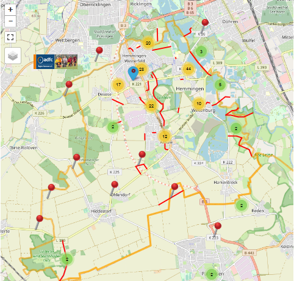

<iframe src="bannerSozi\bannerAnimated.sozi.html" width="100%" height="90" frameBorder="0">
    ADFC Banner
</iframe>

# [ADFC Hemmingen / Pattensen](https://adfc-hemmingen-pattensen.github.io/)
- [ADFC Region Hannover e.V](https://hannover-region.adfc.de/)

Der ADFC (Allgemeiner Deutscher Fahrrad Club) Hemmingen/Pattensen engagiert sich für gute Fahrradinfrastruktur und ein fahrradfreundliches Klima in Hemmingen und Pattensen. [PDF-Broschüre](pdf\190117 ADFC Hemmingen-Pattensen Profil.pdf)

Sprecher Jens Spille, E-Mail: [j.spille@adfc-hannover.de](mailto:j.spille@adfc-hannover.de)

# **Einladung** 
## Dienstag, 23. März, von 18.30 Uhr bis ca. 20.00

**Gesucht waren 2020 - Radwege für Frauen, Männer, Familien, Jugendliche**  
*Für all die Fahrräder, Fixies, Anhänger, Lastenräder, Pedelecs…*  
Gefunden wurden die Hemminger Alltagsrouten!!!

Was ist aus den vielen Vorschlägen geworden, die vor einem Jahr im Bürgersaal zusammengetragen wurden? Der ADFC hat daraus eine Radwegestruktur ausgearbeitet und in der AG Radverkehr des Stadtrates vorgestellt. Dazu gibt es unterschiedliche Budget-Vorschläge von Verwaltung und ADFC für den nächsten städtischen Haushalt, der jetzt zum Beschluss ansteht. In einer Online-Veranstaltung wollen wir diese Alltagsrouten allen Interessierten vorstellen und das weitere Vorgehen diskutieren. Denn jetzt ist wieder die Unterstützung aller Radbegeisterten zur Umsetzung gefragt: Es geht um die Verkehrswende und in den städtischen Haushaltsberatungen und um das dazu erforderliche Geld.

> Online-Vorstellung der erarbeiteten Hemminger Alltags-Radrouten am
>
> **Dienstag, 23. März, von 18.30 Uhr bis ca. 20.00 Uhr über ZOOM**  
> Anmeldung per Mail bitte an: **[adfc.hemmingen.pattensen@gmail.com](mailto:adfc.hemmingen.pattensen@gmail.com)**  
> Der Online-Zugangslink wird dann zugemailt

## ADFC Fahrrad-Selbsthilfewerkstatt-Hemmingen

> Die Fahrrad-Selbsthilfe-Werkstatt des ADFC Hemmingen/Pattensen in der Heinrich-Hertz-Straße 23 in Hemmingen, **bleibt bleiben vorerst geschlossen geschlossen**, bis die Corona bedingten Auflagen einen Betrieb wieder ermöglichen. Das Team und der ADFC Hemmingen/Pattensen wünschen allen Radelnden so lange ein gesundes, pannenfreies Radfahren. Radfahren stärkt das Immunsystem und schützt das Klima! Für Fahrradspenden bitten wir um Nachricht unter der Mailadresse [Fahrrad-Selbsthilfewerkstatt-Hemmingen@web.de](mailto:Fahrrad-Selbsthilfewerkstatt-Hemmingen@web.de).

<!-- > in der Heinrich-Hertz-Straße 23 (Hinterhof), Hemmingen"+x
> hat immer Dienstags von 17:30 bis 19:00 Uhr geöffnet. 
> 
> Hilfe bei Reparatur, Fahrradausgabe, [Spendenannahme](#konto)  -->
>   
> *Wir geben uns ja schon Mühe – aber nicht jedes Schätzchen ist dafür geeignet*  
> ✉ [Fahrrad-Selbsthilfewerkstatt-Hemmingen@web.de](mailto:Fahrrad-Selbsthilfewerkstatt-Hemmingen@web.de)

> 
> **Sind Sie schon Mitglied?** - hier können Sie sich [anmelden](https://www.adfc.de/7678_1)  
> **Lasten zu groß? Keine Ausrede** Leihen Sie sich kostenlos ein Hannah Lastenrad unter <https://www.hannah-lastenrad.de/>. Hilfe, Fragen und Wünsche zur Hannah gibt unter [hallo@hannah-lastenrad.de](mailto:hallo@hannah-lastenrad.de).  
> **Tragen Sie grundsätzlich einen Helm**, wenn sie im Straßenverkehr fahren? Besser ist es. Eine Untersuchung der Deutschen Gesellschaft für Unfallchirurgie ergab 2017, dass es bei rund 25 Prozent aller Fahrradunfälle Kopfverletzungen gibt. 

# K 225 wird nach 115 Jahren wieder Feldweg

Zum HAZ Artikel vom 2.3.2021.

Nein, es wird kein Feldweg wie vor 115 Jahren. Beim Rückbau handelt es sich um eine Folgemaßnahme des Baus der B3neu durch die Straßenbauverwaltung des Landes Niedersachsen. Im Abschnitt zwischen dem Gertrud-Kochanowski-Weg in Devese und der Zufahrt zum Cafe Webstuhl wird die K 225 entsprechend des Planfeststellungsbeschlusses für den Bau der B3neu auf eine Breite von 3 m zurückgebaut. Die verbleibende Fläche wird nicht entsiegelt, sondern bleibt wie sie ist. Im Abschnitt von Ohlendorf bis zum Cafe Webstuhl wir die K 225 auf eine Breite von 4,75 m zurückgebaut, da hier nicht nur landwirtschaftlicher Verkehr und Radfahrer und Fußgänger zugelassen sind, sondern auch Anliegerverkehr zum Cafe Webstuhl, dem dort befindlichen Freizeitparkplatz und dem Waldkindergarten.

# L 389 - Quelle: HAZ Leine 9.3.2021

Die Landesstraße L 389 zwischen der Wilkenburger Spinne und der Ihmener Straße in Hiddestorf soll in den nächsten Jahren saniert werden. Die Stadt Hemmingen plant eine Vereinbarung mit dem Land. Zur Verkehrsberuhigung soll es in den Arnumer Ortsausfahren Querungshifen geben. In Wilkenburg könnte der höhengleiche Gehweg zu einem Hochbord ausgebaut werden. Weiterhin ist ein Umbau der gefährlichen Wilkenburger Spinne im Gespräch. Der Radweg zwischen der Spinne und Wilkenburg könnte noch dieses Jahr beginnen. Die Straßensanierung in Hiddestorf ist erst für 2023 angedacht. 

Der ADFC setzt sich dafür ein, dass die AG-Radverkehr an den Planungen beteiligt wird.

# Mach mit bei der Aktion “Überhol-Abstände messen”

Ein Überhol-Abstand innerorts von mindestens 1,5 Meter zwischen Radfahrenden und Kraftfahrzeuge ist in der StVO vorgeschrieben. Wie nah kommen Kraftfahrzeuge Radfahrenden im Verkehr wirklich? 

Mit einem Abstandssensor am Rahmen lässt sich dies überprüfen: Die [Region Hannover](https://www.hannover.de/Leben-in-der-Region-Hannover/Verwaltungen-Kommunen/Die-Verwaltung-der-Region-Hannover/Region-Hannover/Aktion-%22Abstandsmessung%22-Teilnehmerinnen-und-Teilnehmer-gesucht), das [Mobilnetzwerk Hannover](https://mobilnetzwerk.de/projects/v/open-bike-sensor) und der ADFC Region Hannover suchen für eine vierwöchige Erhebungsaktion im März 2021 noch Teilnehmer, die auf den Straßen der Stadt und der Region Hannover unterwegs sind und bereit sind, ihr Rad mit einem Messgerät ausstatten zu lassen.

> Bewerber können sich noch **bis zum 8. Januar 2021** über die Internetseite https://mobilnetzwerk.de/projects/v/open-bike-sensor anmelden. 

Alle teilnehmenden Personen werden vor Beginn der Testfahrwochen in die OpenBikeSensor-Technik und ihre Funktionen eingewiesen. Auf einem Display hat man fortlaufend die aktuellen Ergebnisse der Messungen vor Augen. Das Ziel ist es herauszufinden, wie oft und besonders wo in der Region Hannover der vorgeschriebene Sicherheitsabstand von Kfz und Rad beim Überholen eingehalten bzw. nicht eingehalten wird. Nach Abschluss der Erhebungsphase werden die gesammelten Daten ausgewertet - natürlich anonym. Sie sollen für die Optimierung der Infrastruktur im Radverkehr und auch für weitere Forschungszwecke genutzt werden.

Bei Fragen wenden Sie sich bitte an: OpenBikeSensor@region-hannover.de

## Inhalt
    
> - [Aktuelles](#aktuelles)
>   - **NEU** [Verkehrsrecht für Radfahrende](#verkehrsrecht-für-radfahrende) 
> - [Wer sind wir?](#wer-sind-wir)
> - [Was wird](#was-wird)
> - [Tipps und Nachrichten](#tipps-und-nachrichten)  
>    * [Veränderte Verkehrsführung für Fußgänger und Radfahrer](#veränderte-verkehrsführung-für-fußgänger-und-radfahrer)  
>    * [Umgestaltung der Weetzener Landstraße -Planung der Region Hannover-](#umgestaltung-der-weetzener-landstraße--planung-der-region-hannover-)  
> - [Mängelkarte für Hemmingen und Pattensen](#unsere-mängelkarte)  
>   - [ **Direkter Link**](https://adfc-hemmingen-pattensen.github.io/MaengelKarte/)
> - [Was war](#was-war)
> * [Impressum](#impressum)
> - [Datenschutz](pdf\Datenschutzerklaerung_ADFC_2018-1-KV.pdf)
> - [Impressum](#impressum)
>   - *Stand: LetzteAenderung*

## Aktuelles

### Kurzfristige Meldung

<iframe width="100%" height="100%" src=https://hackmd.io/U-6kWHTpRAyp9glY_QNyKg?view" frameborder="1"></iframe>

### Verkehrsrecht für Radfahrende

#### Sei kein Geisterradler

Nach einer Studie der Bundesanstalt für Straßenwesen (BASt 2015) fahren bis zu 20 % der Rad fahrenden auf Radwegen entgegen der vorgesehenen Fahrtrichtung. Dieses sogenannte „Geisterradeln“, also das regelwidrige Linksfahren, gehört zu den Hauptursachen der Unfälle, die durch den Radverkehr selbst verursacht werden.

[https://www.geisterradeln.de/](https://www.geisterradeln.de/)

#### Verkehrsrecht für Radfahrende

Das Fahrrad ist ein Fahrzeug – und Radfahrende sind Fahrzeugführende mit allen Rechten und Pflichten. Deshalb gelten zunächst die allgemeinen Regeln für den Fahrzeugverkehr. Auf diese Regeln geht der folgende Beitrag nur ein, wenn sie besondere Bedeutung für Radfahrende haben. Außerdem enthält die Straßenverkehrs-Ordnung (StVO) Vorschriften speziell für den Radverkehr. Um diese Vorschriften, ihre Beachtung und mögliche Konflikte soll es hier vor allem gehen.

[Verkehrsrecht_fuer_Radfahrende als PDF](pdf/Verkehrsrecht_fuer_Radfahrende_6.20-1.pdf)

#### Video zum neuen Verkehrsrecht

ARD hr-Fernsehen [Sicherheit auf Radwegen - was bringen die neuen Regeln](https://www.ardmediathek.de/ard/video/alles-wissen/sicherheit-auf-radwegen-was-bringen-die-neuen-regeln/hr-fernsehen/Y3JpZDovL2hyLW9ubGluZS8xMDg2MDY/)

### ADFC fordert Radweg entlang des Südschnellweges
<!-- 2020-05-23 11:41 -->
Der ADFC fordert in einer Stellungnahme einen Radweg entlang des Südschnellweges. Ziel ist es bei Hochwasser von Ricklingen/Westerfeld nach Döhren zu kommen. 

### ADFC Workshop am 12.2. und 4.3.2020 im Bürgersaal
<!-- 2020-03-04 -->
Der ADFC hatte zusammen mit der Stadt Hemmingen zu einem Workshop aufgerufen. Zum ersten Termin kamen 40 interessierte Bürger und zum zweiten Termin kamen auf Grund der nahenden Corona Krise die Hälfte. Die Bürger hatten auf vier großen Karten mit Stiften Ihre Wunschstecken eingetragen und 175 Moderatorenkarten beschrieben. Mit den schon vorhandenen Verbesserungsvorschlägen gibt es jetzt eine Liste mit über 239 Verbesserungsvorschlägen zu den Themen:

- Allgemeinen Verbesserungsvorschlägen
- Radwege Zustand
- Beleuchtung
- Service Station
- Neue Wege
- Ampelschaltungen
- Neue Verkehrsformen
- Verhalten von Verkehrsteilnehmern (inkl. Radfahrer)
- Fahrrad-Cafe

Alle Verbesserungsvorschläge haben wir auf folgender Mängelkarte zusammen gefasst. Siehe [MaengelKarte](https://adfc-hemmingen-pattensen.github.io/MaengelKarte/).

### Termine

**<a href="https://teamup.com/ksju1rrabvbvttzec9">Vollbildanzeige</a>** - Ein Service von [Teamup Solutions AG in Zurich](https://www.teamup.com/)

<iframe width="100%" height="100%" src="https://teamup.com/ksju1rrabvbvttzec9" frameborder="1"></iframe>

<!-- FSW und Touren Termine ändern? *Nur für Eingeweihte.* Bitte Passwort eingeben: <input id='password' type='text'  />
<a href="https://teamup.com/ks81di9kaob57td5hd" onclick="javascript:return validatePass()">und Click hier</a>
-->

1. **Die Fahrrad-Selbsthilfe-Werkstatt (FSW) bleibt bleiben vorerst geschlossen, bis die Corona bedingten Auflagen einen Betrieb wieder ermöglichen.** <!-- hat jeden **Dienstag von 17:30 bis 19:00** geöffnet.-->
3. Spontane, kostenlose Feierabendradtouren werden bei entsprechenden Wetter in der Regel Mittwochs angeboten. Die ADFC Ortsgruppe hat dafür eine E-Mail Liste angelegt. Wir melden uns wenn es passt. Wer auf dieser Liste möchte, schreibe bitte an [j.spille@adfc-hannover.de](mailto:j.spille@adfc-hannover.de).
4. Den Hemminger Sitzungskalender gibt es unter [https://www.stadthemmingen.de/politik-gremien/buergerinformationssystem/](https://www.stadthemmingen.de/politik-gremien/buergerinformationssystem/)
5. Den Pattenser Sitzungskalender gibt es unter [https://pattensen.more-rubin1.de/sitzungskalender.php](https://pattensen.more-rubin1.de/sitzungskalender.php)
6. Weiter Termine unter <https://www.adfc-hannover.de/termine/>

## Wer sind wir?

Der ADFC Hemmingen/Pattensen engagiert für gute Fahrradinfrastruktur und ein fahrradfreundliches Klima. Erste Aktivitäten starteten 2013, seit Mai 2015 und mit mittlerweile rund 107 Mitgliedern (Stand Jan. 2019) und weiteren Ehrenamtlichen, engagiert sich der ADFC Hemmingen/Pattensen offiziell in den beiden Städten für

1. Eine sichere und bessere Fahrradinfrastruktur (Radverkehrspolitik)
2. Mehr Bewusstsein, dass Fahrradfahren eine zentrale Säule der Verkehrswende ist (Öffentlichkeitsarbeit)
3. Touristisches Erleben der Region Hannover und darüber hinaus (Radtouren)
4. Eine kostengünstige Versorgung Bedürftiger und Geflüchteter mit Fahrrädern und Reparatur-Unterstützung in der Fahrrad-Selbsthilfewerkstatt (seit Nov. 2016). Siehe [PDF-Broschüre](pdf\191017 ADFC Fahrrad-Selbsthilfe-Werkstatt Hemmingen.pdf)

Diese vier zentralen Themenfelder werden in unser [PDF-Broschüre](pdf\190117 ADFC Hemmingen-Pattensen Profil.pdf) kurz vorgestellt.

## Was wird

### Mittwochstour

Spontane, kostenlose Feierabendradtouren werden bei entsprechenden Wetter (Sommer) in der Regel Mittwochs angeboten. Die ADFC Ortsgruppe hat dafür eine E-Mail Liste angelegt. Wir melden uns wenn es passt. Wer auf dieser Liste möchte, schreibe bitte an [j.spille@adfc-hannover.de](mailto:j.spille@adfc-hannover.de).

### Tourenkarten

**NEU: Tipps für Touren haben wir auf unsere [Tourenkarte](http://adfc-hemmingen-pattensen.github.io/Touren/) für Euch zusammen gestellt**

## Tipps und Nachrichten

### Einige nützliche Links

[Stadt Pattensen](https://www.pattensen.de/) und das [Wanderbare Calenberger Land](https://www.pattensen.de/Default.aspx?tabid=3110) 
[Stadt Hemmingen](https://www.stadthemmingen.de/) und das [Radvehrkehrskonzept](https://www.stadthemmingen.de/portal/seiten/radverkehrskonzept-der-stadt-hemmingen-907000093-22500.html)

[**GPSies**](https://www.gpsies.com/) bietet die Möglichkeit Touren zu planen und mit anderen auszutauschen. Auch als Apps erhältlich.

**Tipp Radtouren:** Ausgewählte Radtouren der Nachbar Ortsgruppen sind unter [ADFC Region Hannover Termine](https://www.adfc-hannover.de/termine/) zu finden.

**Tipp Radfahrkarte:** Eine Quellen offene Radfahrkarte mit Routingfunktion git es under [OpenRouteService.org](https://bit.ly/1cEUTze). Mit der rechten Maustaste kann man Start- und Zielpunkt setzen.

_Ältere Tipps und Nachrichten gibt es unter [Ältere Nachrichten](alteNews.html)_

## Unsere Mängelkarte

Gefährliche Querungen, Unfallschwerpunkte und Mängel auf Rad- und Fußwegen sammeln wir auf unserer Mängelkarte.

siehe [Mängelkarte für Hemmingen und Pattensen](https://adfc-hemmingen-pattensen.github.io/MaengelKarte/)

### Radwegeführung Stadtbahnbaustelle

Beschwerden bitte direkt am Infrastrukturgesellschaft (Infra), *Bürgersprechstunden: Mittwochs, 15 bis 17 Uhr* im Büro Göttinger Landstraße 44 (neben Volksbank) in Hemmingen-Westerfeld melden.

- Info: https://www.infra-hannover.de/hemmingenwesterfeld/
- Email: https://www.infra-hannover.de/kontakt/

## Was war

### Abendtour 5/20 2020-10-07-Mi.
 
Tourenziel       | Ruthe, Sarstedt, Ahrbergen
---------------: | ----------------------- 
Datum            | 2020-10-07-Mi
Tourenrart       | Feierabend
Tourenleiter     | Helmut, Günther
Start            | Hemmingen Rathaus 15:00
Dauer [Stunden]  | ca. 3
Teilnehmerzahl   | 11
Tourenlänge [km] | 36
Wetter           | zeitweise regnerisch

Die 5. Feierabend-Radtour startete am Mittwoch den 07. Oktober mit 11 Radlern bei nicht so schönem Wetter. Über Wilkenburg, Harkenbleck fuhren wir nach Koldingen, wo wir die Pattenser Radler trafen. Weiter ging es an den Koldinger Teichen vorbei nach Sarstedt. Am Wehr erreichten wir den idyllischen Willi-Jädtke-Weg und fuhren weiter nach Ahrbergen Richtung Giesen Zurück ging es zu den Giftener Teichen und weiter nach Schliekum. Von dort fuhren wir bei leichtem Regen durchs Calenberger Land nach Pattensen und Arnum. 
Nach ca. 36 km und 3 Std. erreichten wir Hemmingen.

### Abendtour 04/20 2020-09-29-Mi.
 
Tourenziel       | Gehrdener Berg
---------------: | ----------------------- 
Datum            | 2020-09-29-Mi
Tourenrart       | Feierabend
Tourenleiter     | Günther
Start            | Hemmingen Rathaus 16:00
Dauer [Stunden]  | ca. 3
Teilnehmerzahl   | 14
Tourenlänge [km] | 34
Wetter           | heiter bis wolkig
    
Die 4. Feierabend-Radtour startete am Mittwoch den 29. September mit 14 Radlern. Bei gutem Wetter fuhren wir gen Westen nach Ihme-Roloven, vorbei an Ronnenberg und weiter nach Gehrden. In Gehrden ging es ein kurzes Stück steil bergauf, da durfte man schon mal schieben. Oben angekommen, umrundeten wir den Gehrdener Berg. Nach einer kurze Rast, mit sehr guter Fernsicht ging es wieder bergab. Zurück ging es, entlang der Bahn nach Weetzen. Über Vörie, Ihme Roloven und Devese ging es zurück nach Hemmingen, das wir nach ca. 3 Std. und 34 km erreichten.

### Abendtour 3/20 2020-09-09-Mi.
 
Tourenziel       | Ruthe, Sarstedt
---------------: | ----------------------- 
Datum            | 2020-09-09-Mi
Tourenrart       | Feierabend
Tourenleiter     | Günther
Start            | Hemmingen Rathaus 17:00
Dauer [Stunden]  | ca. 3
Teilnehmerzahl   | 9
Tourenlänge [km] | 35
Wetter           | zeitweise regnerisch

Die 3. Feierabend-Radtour startete am Mittwoch den 09. September mit 9 Radlern bei nicht so schönem Wetter.  Über Wilkenburg, Harkenbleck und Reden fuhren wir ins Fuchsbachtal. Dort konnten wir die "Arbeit" des Bibers bestaunen. Weiter ging es nach Koldingen zu den Koldinger Teichen. In Ruthe erreichten wir die Innerste und fuhren an ihr entlang bis Sarstedt. Dort legten wir eine kurze Rast ein, bevor wir den Rückweg antraten. Zurück ging es wieder über Ruthe, vorbei an der geophysikalischen Versuchsanstalt GEO 600, Koldingen, Harkenbleck nach Hemmingen. Trotz teilweise leichtem Nieselregen hatten wir eine schöne, ca. 35 km lange Fahrt.

### Abendtour 2/20 2020-09-02-Mi.
 
Tourenziel       | Rethen, Bockemer Holz
---------------: | ----------------------- 
Datum            | 2020-09-02-Mi
Tourenrart       | Feierabend
Tourenleiter     | Günther
Start            | Hemmingen Rathaus 17:00
Dauer [Stunden]  | ca. 3
Teilnehmerzahl   | 11
Tourenlänge [km] | 32
Wetter           | heiter bis wolkig

Die 2. Feierabend-Radtour startete am Mittwoch den 02. September mit 11 Radlern bei schönem Wetter. 
Durch die Leinemasch erreichten wir Rethen und fuhren auf einem idyllischen Radweg entlang der Bruchriede. 
Vorbei am Erbenholz ging es weiter zum Bockemer Holz mit seinen sehr schönen Waldwegen. Über den Kronsberg ging es zurück nach Laatzen und wieder in die Leinemasch. Nach einem kurzweiligen Stop im Laatzener Grasdachhaus fuhren wir weiter und erreichten nach ca. 3 Stunden flotter und schöner Fahrt und ca. 32 km Hemmingen.

### Abendtour 1/20 2020-08-19-Mi.
 
Tourenziel       | Benthe, Velber und Ahlem
---------------: | ----------------------- 
Datum            | 2020-08-19-Mi
Tourenrart       | Feierabend
Tourenleiter     | Günther
Start            | Hemmingen Rathaus 18:00
Dauer [Stunden]  | ca. 2 1/2
Teilnehmerzahl   | 9
Tourenlänge [km] | 32
Wetter           | heiter bis wolkig
    
Die 1. Feierabend-Radtour startete am Mittwoch den 19.August mit 9 Radlern bei gutem Wetter, und führte streckenweise über den Grünen Ring. Wir überquerten die neue B3 und fuhren durch Wettbergen nach Empelde. Mit einer leichten Steigung ging es zum Benther Berg. Von dort radelten wir weiter, direkt am Wald entlang, bis nach Velber und weiter zu der Gedenkstätte nach Ahlem. Danach erreichten wir den Mittellandkanal und fuhren weiter am Stichkanal entlang. An der Wasserkunst vorbei erreichten wir die Ihme und gelangten zu den Ricklinger Teichen. Nach ca. 2 1/2 Stunden und 32 km kamen wir gut gelaunt in Hemmingen an. Die Tour beendeten wir in einem Biergarten.

### Stadtradeln 2020

<!-- 2020-05-23 11:41 -->
**Nichts ist gesünder, als mit dem Rad zur Arbeit zu fahren.** Mit dem Rad zur Arbeit: Das Risiko, an Herz-Kreislauf-Erkrankungen zu sterben, ist bei Radfahrenden um 24 Prozent geringer als bei Autofahrenden [Quelle](https://t3n.de/news/pendlerstudie-zeigt-nichts-rad-1283894/?fbclid=IwAR1J1qFv5utQd0Uy3sP1fEP0g3HtLS9KymL5STXRebyU5jalpWGxJubyzoM).

Das *Stadtradeln 2020* fand trotzt der Corona-Pandemie in der Zeit vom **07.06. bis zum 27.06.2020** in der Region Hannover statt.

Die Gewinnenliste finden Sie unter [https://www.stadtradeln.de/ergebnisse/?&cityfilter=Region%20Hannover&tab=winning#sr-ergebnisse-kommunen](https://www.stadtradeln.de/ergebnisse/?&cityfilter=Region%20Hannover&tab=winning#sr-ergebnisse-kommunen).

### Was war 2019

### Radwege für Frauen, Männer, Familien, Jugendliche, Anhänger, Lastenräder, Pedelecs – aber wo gehen sie lang?
<!-- 2020-02-12 -->
Der Weg ist das Ziel und führt idealerweise dorthin. Mal direkt, mal malerisch oder schnell und effizient oder auch mit Umwegen. Immer mit dem Rad, mal mit Anhänger dran oder mit den Kindern, ein anders Mal mit dem Grünschnitt oder dem Einkauf auf dem Lastenrad. Und auch mit dem Pedelec, weil es einfach geht oder schneller ist. 

Was sind die Ziele der Hemminger Radelnden und über welchen (Rad)Weg wollen sie gerne dorthin gelangen?  Das möchten der ADFC Hemmingen/Pattensen und die Stadt Hemmingen von den Hemminger Radelnden wissen. Darum sind Alle eingeladen zu einem 

>(Rad)Wege-Workshop am **Mittwoch, 12. Februar, 18.30 Uhr**
>in den Bürgersaal des Rathauses Hemmingen

Karten vom Stadtgebiet und Stifte für die Wege werden bereitgestellt. Jede und Jeder kann und soll ihre und seine wichtigsten Ziele und natürlich den Weg dahin eintragen. Den Weg zur Arbeit, zum Einkaufen, zur Schule oder nach weiter weg gilt es herausfinden. In anschließenden Gesprächen und Diskussionen können Abkürzungen, Problemstellen, Verbesserungshinweise besprochen und aufgeschrieben werden. 

In einer weiteren Runde sollen auch die Wunschwege gefunden werden – „…wenn es eine Brücke gäbe…“ oder „…wenn man zwischen den Äckern oder Häusern durchfahren könnte…“. Das alles soll dazu beitragen, Vorschläge für notwendige und bessere Fahrradwege zusammenzustellen Der ADFC und die Stadt Hemmingen werden die Ergebnisse in einem zweiten Termin am 11. März zur gleichen Zeit am gleichen Ort verfeinern und versuchen Prioritäten für Hemmingen herauszuarbeiten. Daraus soll ein abgestimmter Aktionsplan für die planmäßige und schnelle Umsetzung werden. ADFC und Stadtverwaltung arbeiten zusammen in der AG Radverkehr, die vom Stadtrat einberufen wurde, um Hemmingen zu einer wirklich fahrradfreundlichen Stadt zu machen.

### Veränderte Verkehrsführung für Fußgänger und Radfahrer

Straßenbauverwaltung: Sperrungen und Umleitungen erforderlich. Hier die [Offizielle Pressemitteilung](https://www.strassenbau.niedersachsen.de/aktuelles/presseinformationen/b-3-ortsumgehung-hemmingen-veraenderte-verkehrsfuehrung-fuer-fugaenger-und-radfahrer-168474.html).

Zitat: "Anregungen der Stadt Hemmingen, möglichst viele Wegebeziehungen in der Bauzeit von Überführungsbauwerken und Bundesstraßentrasse dauerhaft mittels provisorischer Umfahrungen aufrechtzuerhalten, wurden durch die Straßenbauverwaltung geprüft und angesichts der bisherigen Erfahrungen im Verlauf der Deveser Straße als nicht praktikabel verworfen. Gegen die Einrichtung und Unterhaltung niveaugleicher Querungsmöglichkeiten für öffentliche Verkehre inmitten des Baufeldes sind in erster Linie Sicherheitsbedenken anzuführen."

- Da Radfahrende Ausweichstrecken über den "Stadtweg" K225 nehmen müssen, fordern wir eine vorübergehende Geschwindigkeitsbegrenzung für den KFZ-Verkehr auf 50km/h auf diesen Strecken. Dieses wurde zuerst eingerichtet, ist jetzt aber wieder auf Tempo 100 ausgeschildert. 

### Umgestaltung der Weetzener Landstraße -Planung der Region Hannover-

Die Pläne (eher gesagt Ideen) zur Umgestaltung der Weetzener Landstraße liegt auf der Homepage der Stadt Hemmingen. [Umgestaltung der Weetzener Landstraße](https://www.stadthemmingen.de/hemmingen-erleben/verkehr/umgestaltung-der-weetzener-landstrasse-planung-der-region-hannover-/).

### Erste Dauerzählstelle in Hemmingen

Die erste Fahrrad-Messstation im Umland ist am Dienstag, den 31.07.2018 durch den Regionspräsidenten Hauke Jagau und Bürgermeister Claus-Dieter Schacht-Gaida in Betrieb genommen worden. Weitere Messstationen sollen in Seelze, Sehnde und Burgwedel folgen.

Ziel: 2025 sollen 21 von 100 Wegen mit dem Rad gefahren werden.

### Büroensemble Hemmingen - MAX DUDLER

Am 14.06.18 wurde die Analyse der verkehrlichen Auswirkungen vorgestellt.

[Auf der Hemminger Homepage](https://www.stadthemmingen.de/downloads/datei/OTA3MDAyMjE4Oy07L3Vzci9sb2NhbC9odHRwZC92aHRkb2NzL2hlbW1pbmdlbi9oZW1taW5nZW4vbWVkaWVuL2Rva3VtZW50ZS8xODA2MTRfMTcxNV9iZWhfYnVlcm9lbnNlbWJsZV9oZW1taW5nZW5bMV0ucGRm/180614_1715_beh_bueroensemble_hemmingen[1].pdf) können Sie die Präsentation des Vorhabens einsehen.

[Hier](https://www.stadthemmingen.de/downloads/datei/OTA3MDAyMjE5Oy07L3Vzci9sb2NhbC9odHRwZC92aHRkb2NzL2hlbW1pbmdlbi9oZW1taW5nZW4vbWVkaWVuL2Rva3VtZW50ZS8yMDE4MDYxNF9wcmFlc2VudGF0aW9uX3NocC5wZGY%3D/20180614_praesentation_shp.pdf) können Sie die verkehrliche Untersuchung einsehen. Die Erschließung wird von „hinten“ über die Carl-Zeiss-Straße erfolgen.

### Planfeststellungsverfahren für den Neubau eines Radweges im Zuge der K 226/K221 von Ronnenberg nach Devese

Die Einwendungen zum Planfeststellungsverfahren für den Neubau eines Radweges im Zuge der K 226/K221 von Ronnenberg nach Devese wurden am 2018-06-27-Mi erörtert. Der ADFC Hemmingen / Pattensen hat auf Mängel für die Einschleifung bei der Querungshilfe in Devese hingewiesen, der neue Entwurf berücksichtigt diese Mängel.

### Verkehrsentwicklungsplan 2030 der Stadt Hemmingen

Der Entwurf des Verkehrsentwicklungsplanes 2030 der Stadt Hemmingen lag in der Zeit vom 07.12.2017 bis zum 31.03.2018 öffentlich aus. Er ist immer noch auf der Homepage der Stadt Hemmingen einsehbar [Entwurf VEP2030](https://www.stadthemmingen.de/downloads/datei/OTA3MDAxOTYxOy07L3Vzci9sb2NhbC9odHRwZC92aHRkb2NzL2hlbW1pbmdlbi9oZW1taW5nZW4vbWVkaWVuL2Rva3VtZW50ZS9lbnR3dXJmX2Rlc192ZXJrZWhyc2VudHdpY2tsdW5nc3BsYW5lc19kZXJfc3RhZHRfaGVtbWluZ2VuX3ZlcF8yMDMwX1szXS5wZGY%3D/entwurf_des_verkehrsentwicklungsplanes_der_stadt_hemmingen_vep_2030_[3].pdf).

### Auszeichnung: **Stadt ist fahrradfreundlich**

Die Stadt Hemmingen wurde am Mittwoch den 2019-09-25 von der Arbeitsgemeinschaft Fahrradfreundlicher Kommunen Niedersachsen / Bremen e. V. (AGFK) als „Fahrradfreundliche Kommune Niedersachsen“ zertifiziert. Die Jury lobte besonders die ADFC—Fahrradwerkstatt in Hemmingen. Hier möchte der ADFC den Initiator und Begründer der Fahrrad-Selbsthilfewerkstatt, Dirk Härtel, ihren besonderen Dank aussprechen. Dank gilt auch Michael Maier der die Fahrrad-Selbsthilfewerkstatt vor der Jury hervorragend präsentiert hat sowie der Stadt Hemmingen, die die Räumlichkeiten kostenlos zur Verfügung stellt.

Bei der "straßenbegleitenden Infrastruktur" sieht die Jury aber noch Nachholbedarf. In diesem Zusammenhang verweisen wir hier auf unsere [Mängelkarte für Hemmingen und Pattensen](https://adfc-hemmingen-pattensen.github.io/MaengelKarte/).

Die AGFK bietet den Kommunen ein Netzwerk, um sich gegenseitig auszutauschen und zu unterstützen. 

### Arbeitsgemeinschaft (AG) Radverkehr in Hemmingen

Der Ausschusses für Stadtentwicklung und Umwelt hat am 15. Aug. 2019 beschlossen, dass zur Umsetzung des Radverkehrskonzeptes eine Arbeitsgemeinschaft (AG) Radverkehr gebildet wird, die mindestens einmal im Jahr tagt. Die Zusammensetzung soll sich an dem Teilnehmerkreis orientieren, der auch bei der Erarbeitung des Radverkehrskonzeptes beteiligt war. Feste Teilnehmer sind Vertreter von ADFC, ADAC, Polizei, Rat und Stadtverwaltung.

### Stärkung des Radverkehrs

<!-- 2019-08-15-Do.-->
StVO Novelle. Das Bundesministerium für Verkehr und digitale Infrastruktur plant eine [Stärkung des Radverkehrs](https://www.bmvi.de/SharedDocs/DE/Artikel/StV/stvo-novelle.html).

1. Mindestüberholabstand für Kfz: Es wird ein **Mindestüberholabstand von 1,5 m innerorts und von 2 m außerorts** für das Überholen von zu Fuß Gehenden, Radfahrenden und Elektrokleinstfahrzeugführenden durch Kraftfahrzeuge **festgeschrieben**. Bisher schreibt die StVO lediglich einen „ausreichenden Seitenabstand“ vor.
Schrittgeschwindigkeit für rechtsabbiegende Kraftfahrzeuge über 3,5 t

1. Für rechtsabbiegende Kraftfahrzeuge über 3,5 t soll aus Gründen der Verkehrssicherheit innerorts Schrittgeschwindigkeit (7 bis 11 km/h) vorgeschrieben werden. Verstöße können künftig mit einem Bußgeld in Höhe von 70 Euro sanktioniert werden. Zudem wird ein Punkt im Fahreignungsregister eingetragen.
Grünpfeil ausschließlich für Radfahrer

1. Mit der StVO-Novelle wird die bestehende Grünpfeilregelung auch auf Radfahrer ausgedehnt, die aus einem Radfahrstreifen oder baulich angelegten Radweg heraus rechts abbiegen wollen. Außerdem wird ein gesonderter Grünpfeil, der allein für Radfahrer gilt, eingeführt.

1. **Generelles Haltverbot auf Schutzstreifen**: Schutzstreifen für den Radverkehr trennen den Rad- und den Autoverkehr mit einer gestrichelten weißen Linie (Zeichen 295 der StVO). Autos dürfen dort zwar nicht parken, aber bislang noch bis zu drei Minuten halten. Dies führt vielfach dazu, dass die Radfahrenden Schutzstreifen nicht durchgängig nutzen können, weil ihnen haltende Autos den Weg versperren. Deshalb wollen wir dort ein generelles Haltverbot einführen.
Einrichtung von Fahrradzonen

1. Analog zu den Tempo 30-Zonen sollen in Zukunft auch Fahrradzonen angeordnet werden können. Die Regelung soll sich an den Regeln für Fahrradstraßen orientieren: Für den Fahrverkehr gilt eine Höchstgeschwindigkeit von 30 km/h. Der Radverkehr darf weder gefährdet noch behindert werden. Auch Elektrokleinstfahrzeuge sollen hier künftig fahren dürfen.

1. Klarstellung zum Nebeneinanderfahren von Radfahrenden: **Das Nebeneinanderfahren von Radfahrenden ist ausdrücklich erlaubt, wenn der Verkehr dadurch nicht behindert wird**. Die bisherige Formulierung in der StVO stellt das Hintereinanderfahren in den Vordergrund und kann daher missverstanden werden.

1. Ausweitung des Parkverbots vor Kreuzungen und Einmündungsbereichen: Das Parken vor Kreuzungen und Einmündungen soll in einem Abstand von bis zu je 8 m von den Schnittpunkten der Fahrbahnkanten oder bis zu je 5 m vom Beginn der Eckausrundung verboten werden, wenn ein straßenbegleitenderbaulicher Radweg vorhanden ist, der als benutzungspflichtig oder mit Radsinnbildgekennzeichnet ist. Hierdurch soll die Sicht zwischen Straße und Radweg verbessert und dadurch die Sicherheit von Radfahrenden erhöht werden.

1. Vereinfachung für Lastenfahrräder: Um speziell für Lastenfahrräder Parkflächen und Ladezonen vorhalten zu können, führen wir ein spezielles Sinnbild „Lastenfahrrad“ ein, das die zuständigen Straßenverkehrsbehörden nutzen können.

1. Verkehrszeichen Radschnellwege: Das Verkehrszeichen „Radschnellweg“ soll in die StVO aufgenommen werden, um die Kennzeichnung von Radschnellwegen auch unabhängig von der Fahrbahnbeschaffenheit wie z. B. auf sandigem Untergrund möglich zu machen.

1. Überholverbot von Radfahrenden: Mit der Einführung eines neuen Verkehrszeichens sollen die zuständigen Straßenverkehrsbehörden in Zukunft ein Überholverbot von einspurigen Fahrzeugen (u. a. Fahrrädern) für mehrspurige Kraftfahrzeuge z. B. an Engstellen anordnen können.  

1. Erweiterung der Erprobungsklausel: Die bestehende Klausel für zeitlich und örtlich begrenzte Anordnungen zur Erprobung verkehrsregelnder oder sichernder Maßnahmen soll künftig unabhängig von einer Gefahrenlage Modellversuche ermöglichen, um den Handlungsspielraum der zuständigen Straßenverkehrsbehörden zu erweitern. Solche Modellversuche sollen im Einvernehmen mit den Kommunen angeordnet werden. Damit wird auch die Mitbestimmung der Kommunen gestärkt. Eine weitergehende Öffnung des Straßenverkehrsrechts für Verkehrsversuche bedarf einer Änderung auf Gesetzesebene, die in einem weiteren Schritt im nächsten Jahr angegangen werden soll.

1. Vermehrte Öffnung von Einbahnstraßen für Radfahrende in Gegenrichtung: Durch die Änderung der Allgemeinen Verwaltungsvorschrift zur StVO sollen die zuständigen Straßenverkehrsbehörden verstärkt zur Prüfung der Öffnungsmöglichkeit von Einbahnstraßen in Gegenrichtung für Radfahrende veranlasst und die Zahl der in Gegenrichtung freigegebenen Einbahnstraßen dadurch vergrößert werden.

### Das Fahrrad braucht mehr Platz

Mehr Radverkehr ist die Lösung bei Stau, dicker Luft und Fahrverboten. Steigen mehr Menschen auf das Fahrrad um, ist das gut für alle. Wie das gelingt, zeigt der Allgemeine Deutsche Fahrrad-Club zu seinem 40-jährigen Bestehen mit einer großen, bundesweiten Kampagne. Das Ziel: Mehr Platz fürs Rad - für gute, breite Radwege, sichere Kreuzungen und viel mehr Fahrradparkplätze. Mit Aktionen vor Ort macht der Fahrradclub auf die Platzdebatte im Straßenraum aufmerksam und zeigt, wie dieser Platz fürs Fahrrad, für gute Radwege und für bessere Radfahrbedingungen genutzt werden kann. Weitere Informationen auf [mehrplatzfuersrad.de](https://mehrplatzfuersrad.de ). Hashtag: #MehrPlatzFürsRad.

### ISEK Arnum-Mitte

Die Stadt Hemmingen hat einen 80-seitgen Entwurf zum "Teilräumliches ISEK - Voruntersuchung Arnum Mitte" im Internet bereit gestellt [Drucksache 341/2019](https://www.stadthemmingen.de/allris/vo020.asp?VOLFDNR=1202).

Hier eine von vielen Umbaumaßnahmen die angedacht sind.

Der Entwurf wird vom Do. 14.02 bis Mo. 18.03 im Rathaus Hemmingen ausliegen. Eine öffentliche Informationsveranstaltung ist am Mo. 18.02 ab 19:00 in der Wäldchenschule replant.

> Die ADFC Mitglieder haben auf Ihren 23. RadelTreff in diesem Zusammenhang auch über einen [Shared Space](https://de.wikipedia.org/wiki/Shared_Space) (deutsch: „gemeinsamer Raum“) diskutiert. *Charakteristisch ist dabei die Idee, auf Verkehrszeichen, Signalanlagen und Fahrbahnmarkierungen zu verzichten. Gleichzeitig sollen die Verkehrsteilnehmer vollständig gleichberechtigt werden, wobei die Vorfahrtsregel weiterhin Gültigkeit besitzt. Im Gegensatz zur konventionellen Verkehrsberuhigung soll auch eine Anwendung in Hauptverkehrsstraßen möglich sein. (Wikipedia)*

> Beispiel: Shared-Space Kreisel in Bohmte (NdS).
> 

Mehr aus der [Vergangenheit](waswar.html)

## Impressum

Die ADFC **Geschäftsstelle**:

> ADFC Allgemeiner Deutscher Fahrrad-Club / Region Hannover e.V.

> Geschäftsstelle 
> Hausmannstr. 9-10 
> 30159 Hannover 
> Tel.: (0511) 16403-12

### Sprecherteam
Das Sprecherteam wurde auf der Mitgliederversammlung 2020 am 29\. Januar 2020 für zwei Jahre gewählt.

Aufgabe                                   | Name
----------------------------------------- | ----------------
Sprecher                                  | Jens Spille
Vertreter  | Günther Kleinod
Vertreter                         | Michael Maier 
Vertreter                      | Joachim Amtsfeld 

### Mitgliedsschaft

Mitglied werden kann man [hier](https://www.adfc.de/mitgliedschaft/mitglied-werden/beitrittserklaerung/beitrittserklaerung)

### Konto

> IBAN: DE97 2509 0500 0000 9205 50, 
> BIC: GENODEF1S09 (Sparda Bank Hannover e.G.) 
> **Verwendungszweck: "ADFC Selbsthilfewerkstatt Hemmingen" und Anschrift (für eine Spendenbescheinigung)**

Mit fahrradfreundlichen Grüßen, die ADFC Ortsgruppe Hemmingen/Pattensen.

  

