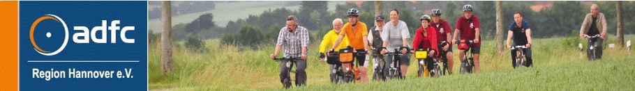
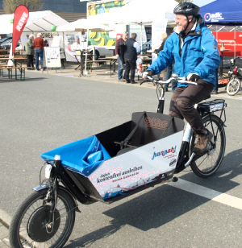
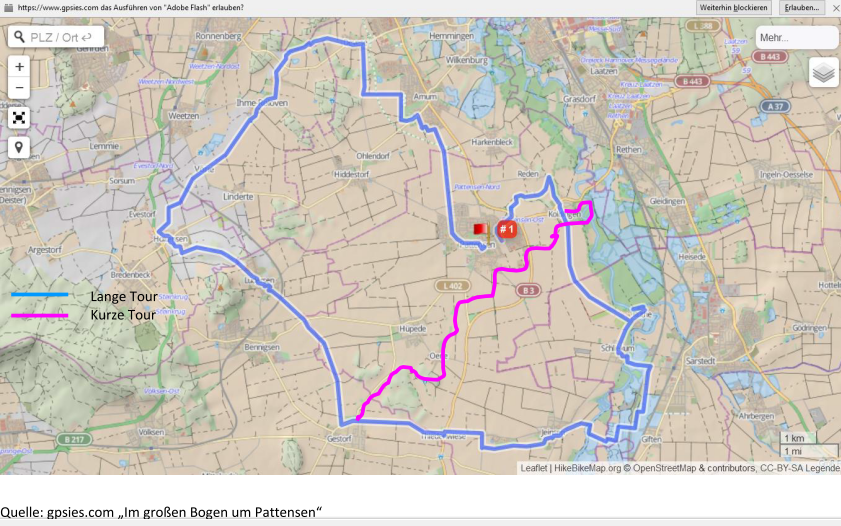

[](http://www.adfc-hannover.de/)

# [ADFC Hemmingen / Pattensen](http://adfc-hemmingen-pattensen.github.io/)

<!-- -->


Sprecher Jens Spille, E-Mail: [j.spille@adfc-hannover.de](mailto:j.spille@adfc-hannover.de)

> **ADFC Fahrrad-Selbsthilfewerkstatt-Hemmingen**<br>
> Immer Dienstags von 17:30 bis 19:00 Uhr<br>
> Heinrich-Hertz-Straße 23 (Hinterhof), Hemmingen

> Hilfe bei Reparatur, Fahrradausgabe, [Spendenannahme](#konto)<br>
> ✉ [Fahrrad-Selbsthilfewerkstatt-Hemmingen@web.de](mailto:Fahrrad-Selbsthilfewerkstatt-Hemmingen@web.de)

>  oder [Mitglied werden](https://www.adfc.de/7678_1)

> **Lasten zu groß? Keine Ausrede** Leihen Sie sich kostenlos ein Hannah Lastenrad unter <http://www.hannah-lastenrad.de/>. Hilfe, Fragen und Wünsche zur Hannah gibt unter [hallo@hannah-lastenrad.de](mailto:hallo@hannah-lastenrad.de)


## Inhalt

> - [Was wird](#was-wird)
> - [Mängelkarte für Hemmingen und Pattensen](http://adfc-hemmingen-pattensen.github.io/MaengelHemPat.html)
> - [Tipps und Nachrichten](#tipps-und-nachrichten)
> - [Was war](#was-war)
> - [Impressum](#impressum)

## Was wird

### Auftakt Radtour

Pattenser und Hemminger Radelnde fahren nach einem gemeinsamen Frühstück, gemeinsam zur regionsweiten Auftaktveranstalltung in den Reden-Park nach Gerhrden. Starttermine und -Orte folgen.


### Hannah in Pattensen
Ein Lastenrad Hannah wird im Mai und Juni für alle Pattenser kostenlos zur Verfügung stehen. Das REWE-CENTER, unter der Leitung von Lutz Ahlers hat sich freundlicherweise bereit erklärt das kostenlos von jedermann ausleihbare Lastenrad Hannah bei sich zu stationieren. Hannah ist eine Initiative vom ADFC und Velogold und in der Region Hannover das erste Projekt für freie Lastenfahrräder. Es ermöglicht die kostenfreie Ausleihe für bis zu drei Tage über die Webseite: [https://www.hannah-lastenrad.de](https://www.hannah-lastenrad.de)


Die Hannah kann von allen Pattenser Bürgern für bis zu drei Tage ausgeliehen werden, um den Großeinkauf zu transportieren, die Kinder spazieren zu fahren oder den Grünschnitt zum Wertstoffhof zu bringen. Und das funktioniert über die Webseite www.hannah-lastenrad.de Dort gibt es auch eine Anleitung dazu. Vier Schritte sind erforderlich:

1. Es ist eine einmalige Registrierung notwendig, nach der man die Hannah in Pattensen (oder an einer der anderen Stationen) ausleihen kann.
2. Nach der Auswahl der Hannah bucht man die gewünschten Ausleihtage, bis maximal drei Tage am Stück kann die Hannah ausgeliehen werden.
3. Die Ausleihe wird durch eine E-Mail bestätigt und gleichzeitig wird ein Kennwort und ein Ausleihvertrag zugemailt. Dieser muss ausgedruckt ausgefüllt und unterschrieben werden.
4. Mit dem ausgefüllten Ausleihformular, Kennwort und Personalausweis gibt es dann bei REWE die Hannah. Einfach an der Kasse nach dem Hannah-Verantwortlichen fragen.

Die REWE-Öffnungszeiten passen hervorragend zum Hannah-Projekt, so kann man montags bis Samstag zwischen 7 und 22 Uhr ausleihen oder (voll geladen) zurückgeben.

> Eine weitere Hannah steht an der Postfiliale Rathausplatz 8 in Hemmingen und kann zu den Öffnungszeiten
Montag – Freitag von 09.- 13.00 Uhr und von 14.30 – 18.00 Uhr sowie Samstags von 9.00 bis 12.00 Uhr,
kostenlos nach Buchung abgeholt werden.

<!-- > <iframe src="https://www.fiinote.com/gpage.jsp?pi=ssxhkocb7l4fj6beque5ykcj7a" width="100%" height="200" name="iframe_a" frameborder="1" scrolling="no" seamless ></iframe> Von unserer [FiiNote](https://www.fiinote.com) Seite. -->

<!-- <iframe src="https://hackmd.io/p/rkSQJE-hz#/" width="100%" height="200%" name="iframe_a" frameborder="0" scrolling="yes" seamless ></iframe> Von unserer [HackMD](https://hackmd.io) Seite. -->

### **ENTFÄLLT**

**21. Radeltreff - Sondertreffen zum Thema: Tempo 50 in Devese**

> 26. April 2018 - 21:50 Die Presse meldet, dass die Tempo-30-Regelung auf der Ortsdurchfahrt in Devese vorerst bleibt. Das Verkehrsministerium will den Sachverhalt nochmals prüfen. Mehr siehe [Hannoversche Allgemeine - Umland](http://www.haz.de/Umland/Hemmingen/Nachrichten/Tempo-30-auf-Ortsdurchfahrt-Devese-bleibt-vorerst-bestehen).
>
> Damit entfällt das geplante Sondertreffen am 3. Mai bei Mutter Buermann.

### Saisonstart der beliebten ADFC-Mittwochsradtouren

Alle begeistert Radelnden sind herzlich eingeladen zur ersten offiziellen Mittwochsradtour des ADFC Hemmingen/Pattensen in der Radsaison 2018.
Los gehts am **Mittwoch, den 25. April um 18:00 ab Rathausplatz in Hemmingen**, Rückkehr gegen 20.00 Uhr.

Mögliche Ziele und Dauer werden wie immer gemeinsam festgelegt und die Radtourenpalette gibt da einiges her.

Wir werden uns aber wie immer auch nach Wind, Wetter und evtl. Wünschen der Teilnehmer richten.
Der ADFC Radtourenleiter Günther Kleinod freut sich auf möglichst viele MitradlerInnen, bestes Fahrradwetter und eine schöne Fahrt.

### Termine

1. Die Fahrrad-Selbsthilfe-Werkstatt (FSW) hat jeden **Dienstag von 17:30 bis 19:00** geöffnet.
2. Spontane Feierabendradtouren werden bei entsprechenden Wetter in der Regel Mittwochs angeboten. Die ADFC Ortsgruppe hat dafür eine E-Mail Liste angelegt. Wir melden uns wenn es passt. Wer auf dieser Liste möchte, schreibe bitte an [j.spille@adfc-hannover.de](mailto:j.spille@adfc-hannover.de).
3. Den Hemminger Sitzungskalender gibt es unter [https://www.stadthemmingen.de/politik-gremien/buergerinformationssystem/](https://www.stadthemmingen.de/politik-gremien/buergerinformationssystem/)
4. Den Pattenser Sitzungskalender gibt es unter [https://pattensen.more-rubin1.de/sitzungskalender.php](https://pattensen.more-rubin1.de/sitzungskalender.php)

<!-- see https://github.com/raghur/mermaid-filter-->
<!--```{.mermaid format=svg  theme=forest caption="ADFC Hemmingen/Pattensen"}-->

### Radtour 1 „Von Hemmingen zur Motormühle Blumenhagen bei Edemissen" für Sportliche

- Pfingstmontag, 21.Mai 2018 (Pfingstmontag): Von Hemmingen zur Motormühle Blumenhagen bei Edemissen. Besichtigung anlässlich des Tags der offenen Mühle
- Länge: 50 km einfache Strecke, geführte Rückfahrt weitere 50 km per Rad oder eigenständig per Bahn ab Dolbergen möglich (GVH-Tarif), Lademöglichkeit für Pedelecs vorhanden
- Dauer: einfache Fahrt ca. 2,5 Stunden

Anspruchsvolle Tour über 50 km (einfach) oder 100 km (Hin- und Rückfahrt) bei anspruchsvollem Tempo (2,5Std für 50 km sind angesetzt) Rückfahrt ist selbstständig ab Bahnhof Dollbergen im GVH-Hannover möglich oder wieder als geführte Tour. Ausreichende Verpflegung bitte mitnehmen!

- Start: 9:00 Uhr
- Treffpunkt: Hemmingen, Rathausplatz 1

Durch die Eilenriede entlang der Güterbahnumgehung geht es durch Lehrte. Hinter Ramhorst fahren wir über Arpke und Abbensen durch Edemissen zur Motormühle. Nach ausführlichem Genuß von Kaffee und Kuchen kann die Historische Motormühle in Betrieb besichtigt werden. Gemeinsam geht es denselben Weg wieder 50 km zurück.

Geeignet nur für Sportliche Fahrer (Lademöglichkeit für E-Bikes vorhanden)

- Tourenleitung: Dirk Härtel, (0511)-4104749 (mit AB)
- Anmeldung: Nicht erforderlich


### Radtour 2 „Von Pattensen durch die Hildesheimer Berge" – für Geübte

- Sonntag, 27.5.: Durch die Hildesheimer Berge – für Geübte
- Länge: 60 km
- Dauer: ca.7 Std., ausreichende Verpflegung bitte mitnehmen!
- Start: 10:00 Uhr
- Treffpunkt: Pattensen, Rewe-Center, Johann-Koch-Str.2

Die Strecke führt uns über Jeinsen und Schulenburg nach Nordstemmen. Dann fahren wir über Mahlerten nach Haus Escherde, wo wir eine kurze Rast machen! Von dort aus fahren/schieben wir den Berg hinauf zum Kammweg des Hildesheimer Waldes. Oben angekommen genießen wir die lange Abfahrt nach Sorsum. Wir fahren am Blaupunktwerk vorbei zum Kloster Marienrode, weiter nach Ochtersum. Bald sind wir am Fluss Innerste, dessen Verlauf wir bis in Höhe der Giesener Berge folgen. Dann radeln wir über Giften durch die Seenplatte nach Jeinsen zurück. Auf dem Wirtschaftsweg geht es an den Windrädern vorbei, nach Pattensen. Die Tour ist landschaftlich sehr abwechslungsreich. Einkehr in einem idyllisch gelegenen Café am Fluss ist möglich!

- Tourenleitung: Helmut Krause und Günther Kleinod, Telefon: (05069) 7979,
- Anmeldung: Nicht erforderlich

### Radtour 3: „Von Hemmingen zum Altwarmbüchener See"

- Samstag, 23.6.: Radtour zum Altwarmbüchener See
- Länge: 48 km
- Dauer: ca. 5 Std., ausreichende Verpflegung bitte mitnehmen!
- Start: 10:00
- Treffpunkt: Hemmingen, Rathausplatz 1

Die Tour führt durch die Leinemasch, am Maschsee vorbei, in die Eilenriede. Von dort geht es über Buchholz und Lahe zum Altwarmbüchener See, mit der Möglichkeit zum Baden oder Picknick (Bitte Verpflegung mitbringen!). Der Rückweg geht dann durch den Misburger Wald zum Mittellandkanal bis zur Anderter Schleuse. Danach fahren wir über den Kronsberg, nach Laatzen und durch die Leinemasch zurück nach Hemmingen.

- Tourenleitung: Helmut Krause und Jochen Lemke, Telefon: (05069) 7979
- Anmeldung: Nicht erforderlich.

### Radtour 4: „Von Pattensen durch das Calenberger Land"

- Samstag, 11.8.: Durch das Calenberger Land
- Länge: 45 km
- Dauer: ca. 5 Std., ausreichende Verpflegung bitte mitnehmen!
- Start: 10:00 Uhr
- Treffpunkt: Pattensen, Am Hallenbad 1

Die Strecke verläuft zuerst über die Calenberger Ackerwege in Richtung Bennigsen und Gestorf. Dann radeln wir durch das Hallerburger Holz nach Hallerburg. Über Sonnenborn fahren wir weiter nach Eldagsen-Hallermühle und Mittelrode, wo es ein gemütliches Hofcafe gibt. Weiter geht es zum Rittergut Bockenrode. Vor Bennigsen biegen wir nach Lüdersen ab und kehren zum Ausgangspunkt Pattensen zurück.

- Tourenleitung: Helmut Krause und Jochen Lemke, Telefon: (05069) 7979,
- Anmeldung: Nicht erforderlich

### Radtour 5 „Von Hemmingen zum Blauen See nach Garbsen"

- Samstag, 29.9.: Radtour zum Blauen See nach Garbsen
- Länge: 51 km
- Dauer: ca. 5 Std., ausreichende Verpflegung bitte mitnehmen!
- Start: 10:00
- Treffpunkt: Hemmingen, Rathausplatz 1

Die Strecke führt über Wettbergen und Empelde zum Benther Berg. Von dort geht es über Velber und Letter zum Mittellandkanal. Direkt am Kanal entlang fahren wir, vorbei an Seelze, nach Lohnde. Dort überqueren wir den Kanal und die Leine und erreichen den Blauen See, mit der Möglichkeit zum Picknick (Bitte Verpflegung mitbringen!).

Der Rückweg geht dann durch die Leinewiesen zum Wasserstrassenkreuz von Leine und Mittellandkanal. Danach geht es über Marienwerder und Stöcken wieder an den Stichkanal. An Leine und Ihme entlang fahren wir zurück nach Hemmingen.

- Tourenleitung: Helmut Krause und Jochen Lemke, Telefon: (05069) 7979,
- Anmeldung: Nicht erforderlich.

### Weiter Termine unter <http://www.adfc-hannover.de/termine/>

## Unsere Mängelkarte

Gefährliche Querungen, Unfallschwerpunkte und Mängel auf Rad- und Fußwegen sammeln wir auf unserer **neuen** Mängelkarte.


siehe [Mängelkarte für Hemmingen und Pattensen](http://adfc-hemmingen-pattensen.github.io/MaengelHemPat.html)

## Tipps und Nachrichten

### Der Fuß- und Radweg Klewertweg wird saniert

Der Fuß- und Radweg Klewertweg, zwischen Reuterwiese und Göttinger Landstraße wird saniert. Ende Mai soll die letzte Schicht aufgetragen werden.


### Planfeststellungsverfahren für den Neubau eines Radweges im Zuge der K 226/K221 von Ronnenberg nach Devese

Einwendungen zum Planfeststellungsverfahren für den Neubau eines Radweges im Zuge der K 226/K221 von Ronnenberg nach Devese konnten bis zum 05.02.2018 erhoben werden. Der ADFC Hemmingen / Pattensen hat  Verbesserungsvorschläge für die Querungshilfe in Devese vorgeschlagen.

### Verkehrsentwicklungsplan 2030 der Stadt Hemmingen

Der Entwurf des Verkehrsentwicklungsplanes 2030 der Stadt Hemmingen lag in der Zeit vom 07.12.2017 bis zum 31.03.2018 öffentlich aus. Er ist immer noch auf der Homepage der Stadt Hemmingen einsehbar [Entwurf VEP2030](https://www.stadthemmingen.de/downloads/datei/OTA3MDAxOTYxOy07L3Vzci9sb2NhbC9odHRwZC92aHRkb2NzL2hlbW1pbmdlbi9oZW1taW5nZW4vbWVkaWVuL2Rva3VtZW50ZS9lbnR3dXJmX2Rlc192ZXJrZWhyc2VudHdpY2tsdW5nc3BsYW5lc19kZXJfc3RhZHRfaGVtbWluZ2VuX3ZlcF8yMDMwX1szXS5wZGY%3D/entwurf_des_verkehrsentwicklungsplanes_der_stadt_hemmingen_vep_2030_[3].pdf).

### Einige nützliche Links

[Stadt Pattensen](http://www.pattensen.de/) und das [Wanderbare Calenberger Land](http://www.pattensen.de/Default.aspx?tabid=3110)<br>
[Stadt Hemmingen](https://www.stadthemmingen.de/) und das [Radvehrkehrskonzept](https://www.stadthemmingen.de/portal/seiten/radverkehrskonzept-der-stadt-hemmingen-907000093-22500.html)

[**GPSies**](http://www.gpsies.com/) bietet die Möglichkeit Touren zu planen und mit anderen auszutauschen. Auch als Apps erhältlich.

**Tipp Radtouren:** Ausgewählte Radtouren der Nachbar Ortsgruppen sind unter [ADFC Region Hannover Termine](http://www.adfc-hannover.de/termine/) zu finden.

**Tipp Radfahrkarte:** Eine Quellen offene Radfahrkarte mit Routingfunktion git es under [OpenRouteService.org](http://bit.ly/1cEUTze). Mit der rechten Maustaste kann man Start- und Zielpunkt setzen.

_Ältere Tipps und Nachrichten gibt es unter [Ältere Nachrichten](alteNews.html)_

## Was war


### Abendtour #3/18  2018-05-02-Mi.

Tourenziel       | Benthe
---------------: | -----------------------
Tourenrart       | Feierabend
Tourenleiter     | Dirk Härtel
Start            | Hemmingen Rathaus 18:00
Dauer [Stunden]  | ca. 2 1/2
Teilnehmerzahl   | 9
Tourenlänge [km] | 24
Wetter           | heiter bis wolkig

Die 48. Feierabend-Radtour ging am Mittwoch den 2. Mai mit neun Radlern (8 Herren und 1 Dame) bei gutem Wetter zum Benther Berg. Wir sind gemütlich über Wettbergen zur Kükenmühle geradelt, an Ronnenberg vorbei durch die Felder zu den sagenumwobenen Sieben Trappen bei Benthe. Danach ging es eine kurze Steigung hinauf zum Benther Berg. Der Rückweg ging dann über Empelde und Wettbergen. Nach ca. 2 1/2 Stunden, 24 km und einer schönen Fahrt waren wir wieder zurück in Hemmingen.

### Fahrrad-Selbsthilfewerkstatt-Hemmingen
Auch am 1. Maifeiertag war die *ADFC Fahrrad-Selbsthilfewerkstatt-Hemmingen* mit einer Notbesetzung von 17:30 bis 19:00 Uhr geöffnet.

### Abendtour #2/18 2018-04-25-Mi.

Tourenziel       | Anderter Schleuse
---------------: | -----------------------
Tourenrart       | Feierabend
Tourenleiter     | Günther Kleinod
Start            | Hemmingen Rathaus 18:00
Dauer [Stunden]  | ca. 2 1/2
Teilnehmerzahl   | 7
Tourenlänge [km] | 35
Wetter           | bedeckt mit Regenschauer

Die 47. Feierabend-Radtour ging am Mittwoch den 25. April mit sieben Radlern (5 Herren und 2 Damen) durch die Leinemasch
nach Laatzen. Von dort ging es über den Kronsberg, durch Wülferode zur Anderter Schleuse.
Nach einer kurzen Pause fuhren wir zurück durch Anderten, Herrmann-Löns-Park und Eilenriede.
Vorbei am Maschsee und durchs Ricklinger Holz erreichten wir nach 2 1/2 Stunden und 35 km Hemmingen, leider war es am Ende etwas feucht.

### Abendtour #1/18 (Total #46) 2018-04-12-Do.

Tourenziel       | Lindener Berg
---------------- | -----------------------
Tourenrart       | Feierabend
Tourenleiter     | Günther Kleinod
Start            | Hemmingen Rathaus 18:00
Dauer [Stunden]  | ca. 2
Teilnehmerzahl   | 3
Tourenlänge [km] | 22
Wetter           | bedeckt

Die Tour führte zum **Lindener Berg**. Es ging durch das Ricklinger Holz, an der Ihme entlang, durch Limmer und Lindener Hafen zum Lindener Berg. Dort konnten wir noch die letzten _Skillablüten_ mit einem schönen Abendhimmel betrachten. Nach einer Pause fuhren wir weiter durch Linden zum Maschsee und wieder zurück nach Hemmingen.

<!-- Hallo Jens: Ein Foto schicke ich per Email -->

 

### 20\. Radeltreff - Jahreshauptversammlung 2018

Unsere Jahreshauptversammlung 2018 fand am 24\. Januar 2018 im Bürgersaal Hemmingen stattfinden. Das neue Sprecherteam ist:

Aufgabe                                   | Vertreter
----------------------------------------- | ----------------
Sprecher                                  | Jens Spille
Vertreter (Fahrrad Selbsthilfe Werkstatt) | Dirk Härtel
Vertreter (Touren)                        | Günther Kleinod
Vertreter (Pattensen)                     | Ralf Schmalkuche

### 18\. RadelTreff - Radelnde aus Hemmingen und Pattensen planten Aktionen für 2018!

Am Mittwoch, den 13\. Dezember 2017 trafen sich Radelnde im Jagdzimmer der Deveser Gaststätte Mutter Buermann. Elf Mitglieder und drei Gäste ließen das Jahr 2017 revue passieren und planten für 2018.

So hat zum Beispiel, die im Mai 2015 gegründete Ortsgruppe, zur Zeit 105 Mitglieder, davon 3 Tourenleiter. Es wurden im Jahr 2017 insgesamt 24 Touren durchgeführt. Davon 18 Abendtouren und 4 Tagestouren. Zusammen haben ca. 180 Teilnehmer rund 7500 km zurückgelegt.

Die Fahrrad-Selbsthilfe-Werkstatt hat seit seiner Gründung im November 2016, ca. 100 Fahrräder aufgearbeitet und ausgegeben. Zusätzlich wurden noch mehrere hundert Fahrräder repariert.

Verkehrspolitisch gab es ein Treffen mit der Stadt Hemmingen zum Thema gefährliche Querungen. Es gab ein Treffen mit dem Ortsbürgermeister in Jeinsen, einen Ortstermin mit der Niedersächsischen Landesbehörde für Straßenbau und Verkehr sowie der Region Hannover - Fachbereich Verkehr. Es gab viel Email Verkehr mit der Niedersächsischen Landesbehörde zum Thema Radweg an der L389.

Nächstes Jahr, am 24\. Januar im Bürgersaal, wird das Sprecherteam neu gewählt. Außerdem wird es wieder 4 Tagestouren geben und natürlich unsere Abendtouren. Auch das Stadtradeln ist wieder geplant. Außerdem werden wird unsere [Mängelkarte für Hemmingen und Pattensen](http://adfc-hemmingen-pattensen.github.io/MaengelHemPat.html) weiter vervollständigen und mit den Behörden besprechen.

### Erster Geburtstag der **ADFC Fahrrad-Selbsthilfewerkstatt-Hemmingen**

Nun besteht die Fahrrad-Selbsthilfewerkstatt und Fahrradausgabe bereits seit einem Jahr und wir haben gemeinsam in dieser Zeit erfolgreich eine Menge auf die Beine gestellt und erlebt. Das Werkstatt-Projekt wird sehr-gut angenommen und wir erhalten durchweg positive Rückmeldungen aus der Bevölkerung, von den Vertretern der Stadt und von den Flüchtlingen.

Aus diesem Grund haben wir uns am 14\. November 2017 zusammengesetzt und mit Lekkereien ein wenig gefeiert.

Wir möchten uns hiermit bei allen Geldspendern, Sachspendern, Helfern und Befürwortern bedanken. Ohne Unterstützung wäre dieses Jahr nicht so gut gelaufen.

### Abendtour #45 2017-09-20-Mi.

Karte mit unseren Touren 2017 bis Ende August. 

### 17\. Radel-Treff

Am Montag den 18\. September 2017 hatten wir ein kleines Arbeitstreffen in der Fahrrad-Selbsthilfe-Werkstatt. Es ging um die Vorbereitung zu der Einladung der Stadt Hemmingen am 20\. September zum Thema "Gefährliche Querungen". Das Ergebnis dieses Treffens kann man auf der [Mängelkarte für Hemmingen und Pattensen](http://adfc-hemmingen-pattensen.github.io/MaengelHemPat.html) sehen.

### Abendtour #44 2017-09-13-Mi.

> Bericht folgt

#### RADTOUR 4 „Durch das Calenberger Land"

> 10.09., Sonntag, 10 Uhr<br>
> Bericht folgt

### Abendtour #43 2017-09-06-Mi.

Die 43\. Feierabend-Radtour startete am Mittwoch, den 06\. September bei schwarzen Wolken mit 6 Radlern (2 Damen und 4 Herren). Die Fahrt ging am Maschsee vorbei in die Eilenriede. Durch den Herrmann-Löns-Park mit der Alten Mühle und dem Annateich fuhren wir in einem einem weiten Bogen um das Kleefelder Bad und starteten von dort den Rückweg durch die Eilenriede. Über den Maschsee und das Ricklinger Holz erreichten wir nach gut 2 Std. und ca. 30 km, bestens gelaunt, Hemmingen.

### Abendtour #42 2017-08-30-Mi.

Zum Uni-Viertel und die Südstadt - Mit 6 radelbegeisterten Fahrern ging es mal ungewöhnlich durch die Stadt Hannover, um drei unserer Gäste die Sehenswürdigkeiten unserer Nachbarstadt zu zeigen. An der Ihme entlang des Ihmecentrum ging es mal hinter die Unniversität in den Garten auf dem Schneiderberg. Über Königsworther-Platz an der Leine entlang durch die Calenberger Neustadt zum Neuen Rathaus. Leider war dieses schon geschlossen, da wir unseren Neubürgern gern die Modelle der Stadtentwicklung in Hannover und Umland gezeigt hätten. So ging es durch die Südstadt zum Braunschweiger Platz und am Bismark-Bahnhof entlang zur Eilenriede, um südlich des Maschsees wieder nach ca. 32km am Radhausplatz in Hemmingen anzukommen.

### 16\. Radel-Treff

Am Donnerstag, den 31\. August 2017 um 19:00 trafen sich sieben Radler im MOBILE e.V.; Göttinger Str. 25a; 30982 Pattensen, um über die vergangenen und zukünftigen Aktivitäten zu sprechen. Die Presse war vertreten und hat am Freitag sowie am Montag darauf im Pattenser bzw. Hemmingen HAZ Teil davon berichtet.

Der ADFC Hemmingen Pattensen ist im Jahr 2016, um vierzehn und im Jahr 2017 bis jetzt, um neun neue Mitglieder gewachsen. Somit hat die Ortsgruppe jetzt 103 Mitglieder.

Kurz angesprochen wurde die ADFC Bundesaktion "Fahrradland" das unter <https://radlandjetzt.de/> weitere Unterstützer sucht.

Die Ortsgruppe hat in diesem Jahr bis jetzt drei Tagestouren durchgeführt. Die vierte Tour folgt am Sonntag, den 10.09., ab 10 Uhr „Durch das Calenberger Land". Weiterhin wurden bis jetzt 14 Abendradtour und eine Nachmittags-Radtour veranstaltet.

Des Weiteren wurde kurz über das Treffen mit der Stadt Hemmingen, Velogold und Vertreter des ADFC Region zum Thema Lastenrad Hannah gesprochen. Die Nr. 3 steht z. Z. in Springe, die Nr. 14 in der Göttinger Str. 63 "Familienservicebüro" und kann unter folgender Adresse gebucht werden .<https://www.hannah-lastenrad.de/cb-items/hannah-14>

Dirk berichtete ausführlich über die Fahrrad-Selbsthilfewerkstatt. Bis jetzt wurden ca. 100 Fahrräder an Bedürftige ausgegeben und sage und schreibe ca. 500 Fahrräder repariert. Repariert wird vielfach draußen vor der Werkstatt weil der Andrang so groß ist.

Es wurden sich auch die Ein- und Ausgaben angesehen. Die großen Spender, die Bürgerstiftung Hemmingen, das Flüchtlingsnetzwerk Hemmingen und der Roatary-Club haben uns mit einer soliden Grundausstattung starten lassen. Die eingenommenen Spenden durch die Fahrradausgabe und die Ausgaben für Material halten sich z. Z. die Waage.

Die Fahrrad-Selbsthilfewerkstatt ist immer Dienstags von 17:30 bis 19:00 geöffnet, würde aber gerne noch an einem weiteren Tag in der Woche öffnen, dazu werden noch Ehrenamtlich Helfer gesucht, sowohl in der Ausgabe als auch in der Werkstatt.

Der Hof vor der Werkstatt soll einen Fahrrad-Parcour bekommen. Dieser muss aber mit anderen Interessenten, wie z. B. die Heuhüpfer, noch abgesprochen werden.

Das Stadtradeln 2017 war wieder ein voller Erfolg. Sowohl die KGS Hemmingen als auch eine Tour von Düsseldorf nach Barcelona zählten für Hemmingen mit insgesamt 105.002 km, aber auch die 18 Teilnehmer aus Pattensen haben sich mit 7.653,5 km kräftig ins Zeug gelegt. 2018, so der Plan, wird das Stadtradeln wiederholt.

Zum Thema Radverkehr gab es drei Berichte. Zum einen über die Infoveranstaltung zum Thema "Schutzstreifen" am 5.4.2017, zum anderen über die Abschlussveranstaltung "Vorrangnetz für den Alltagsradverkehr" am 30.5.2017 und zuletzt über die "3\. Sitzung des Ausschusses für Soziales, Kultur, Sport und Verkehr" in Hemmingen.

Die Schwerpunkte hier sind der Ausbau des Radwegs entlang der L 389, der für 2018 geplante Radweg zwischen Ronnenberg und Devese. Wir warten z. Z. auf die "Planfeststellung" um sie zu prüfen. In Planung ist auch ein Radweg entlang der Landstr. 460 (Schulenburg - B3). Die Radwegeführung über die Kreisel zwischen Hemmingen und Devese wollen die Mitglieder genau beobachten.

Des Weiteren wurde über eine doppelte Dunkel Ampel über die K221 diskutiert. Damit wird ein flüssigerer Verkehr und weniger Rotlichtverstöße erwartet.

Weiterhin wurde über die Einladung der Verwaltung Hemmingen: Gefährliche Straßenquerungen am Mittwoch, den. 20\. Sept. 2017 um 13:00 im kl. Sitzungsaal gesprochen. Hierzu wird der ADFC die zehn gefährlichsten Querungen erörtern. Die Idee ist es diese und weitere Mängel in eine Mängelkarte einzutragen und die Fortschritte zu verfolgen.

Als gefährlich werden u. a. auch abgesenkte Bankette an den Radwegen betrachtet. Auch die verdreckten Feldwege sind gefährlich, hier besteht seitens des Realverbandes eine Verkehrssicherungspflicht. Weitere Verbesserungen wären, eine Aufwertung der Leinemaschwege (zusammen mit dem ADFC Laatzen) und Ortseingangsschilder an Radwegen (z. B. zusammen mit dem Radwegeteam), wie sie z. B. der Ortsrat für Koldingen angeschafft hat.

Die Verkehrsordnung zu Fußgängerampel wurde in den letzten Jahren geändert und sind nicht allen Verkehrsteilnehmern bekannt. Vorgeschlagen wurden Aktionen mit Infoblatt, Schülerzeitung und/oder ein YouTube Video. Am besten zusammen mit den Kommunen, der Polizei und dem ADAC.

Die Mitglieder wünschen sich immer noch einen Schulradwegeplan Pattensen. Der ADFC steht mit der LGLN in Verbindung, um niedersachsenweit einen Radschulwegplaner zu installieren. Damit wird der Aufwand so klein wie möglich gehalten.

### 41\. Abendradtour

Am Mittwoch den 23\. August ab 18:00 Uhr hatten wir schöne Tour mit acht RadlerInnen zum Deisterrand. Bei "endlichmalSommer-Wetter" sind acht Abendradler gemütlich über Devesse und Weetzen in Richtung Holtensen und Bredenbeck zum Deisterrandweg geradelt. Eine kleine Pause am Deisterrand in der Abendsonne und über Steinkrug mit Besichtigung der Historischen Glashütte, ging es flott über Lüdersen und Arnum zurrück. Ein paar schöne Sonnenblumen haben auch noch die Satteltaschen verschönert, um diese Tour über 35km als herrliche Abendtour abzurunden.

### 40\. Abendradtour

Mittwoch, den 16.08.2017 um 18:00 - Bericht kommt.

### RADTOUR 2017#3 für Geübte „Durch die Hildesheimer Berge"

> 12.08., Samstag, 10 Uhr, Start: Pattensen-Rewe Center, Johann-Koch-Str.2

Es beteilgten sich 18 Personen. Bei stark bewölkten Himel ohne Niederschlag starteten wir pünktlich um 10h. Auf mehrfachen Wunsch machten wir Rast in einem Bäckerei-Cafe in Mahlerten. Gegen 13h erreichten wir das Klostergut Haus Escherde und nach einer kurzen Pause fuhren wir hinauf zum Kamm des Hildesheimer Waldes. Dann fing es sehr stark an zu regnen und wir fuhren hinab in Richtung Sorsum. Auf halber Strecke war leider der geplante Weg wegen Baumfällarbeiten gesperrt und wir mussten auf unbekannten Wegen (Ausschilderungen gab es nicht) weiterfahren. Schliesslich erreichten wir den Ort Betheln. Da der Regen nicht aufhörte, kürzten wir die Tour ab und fuhren von dort aus direkt über Burgstemmen nach Nordstemmen, wo wir auf vielfachen Wunsch in einem Italienischen Eiscafe einkehrten. Zurück ging es dann durch die Nordstemmer und Giftener Seenplatte nach Ruthe und von dort aus direkt nach Pattensen zurück.

Trotz der reduzierten Tour waren die Radler gut drauf, da es ihnen in erster Linie auf Bewegung in frischer Luft und Gesellschaft ankam. Es gab keine körperlichen und technischen Ausfälle.

Wir möchten gerne zu einem späteren Zeitpunkt die ursprünglich geplante Tour unter "normalen" Bedingungen wiederholen. Das würde dann so aussehen:

> Die ca. 60 Km lange Strecke führt uns über Jeinsen und Schulenburg nach Nordstemmen. Dann geht es über Mahlerten nach Haus Escherde. Von dort aus fahren/schieben wir den Berg hinauf zum Kammweg des Hildesheimer Waldes. Oben angekommen genießen wir die kilometerlange Abfahrt nach Sorsum. Wir fahren an den Blaupunkt Werken vorbei zum Kloster Marienrode, weiter nach Ochtersum. Wir treffen dann auf den Fluß Innerste, dessen Verlauf wir durch Hildesheim bis in Höhe der Giesener Berge folgen. Dann fahren wir über Giften durch die Seenplatte nach Jeinsen zurück. Auf dem Feldweg geht es an den Windrädern vorbei, nach Pattensen. Es ist eine landschaftlich sehr abwechselungreiche Tour! Einkehr in einem schönen Cafe am Fluß ist möglich! Dauer ca.6-7 Std., ausreichende Verpflegung bitte mitnehmen!

> Führung: Helmut Krause, Jochen Lemke (ADFC Hemmingen-Pattensen)<br>
> Treffpunkt: Pattensen-Rewe Center, Johann-Koch-Str.2<br>
> Termin noch unklar


> Quelle [https://www.gpsies.com](https://www.gpsies.com/map.do?fileId=ixxrppzvyejlbbjk)

### 39\. Abendradtour

Die 39\. Feierabend-Radtour startete am Mittwoch den 9\. August mit 3 Radlern zum Julius-Trip-Ring. Die Fahrt ging durch die Leinemasch zum Maschsee. Dort stiegen wir in den Julius-Trip-Ring ein. Weiter durch die Eilenriede zum Steuerndieb. Von dort über die Podbi auf den Pastor-Jäckel-Weg, Niedersachsenring, vorbei an den Herrenhäuser Gärten. An der Wasserkunst überquerten wir die Leine, und fuhren dann an Leine und Ihme entlang zurück. Nach knapp 2 Stunden flotter und schöner Fahrt, fast immer im Grünen, erreichten wir nach 30 km Hemmingen.

### 38\. Abendradtour

Mit nur vier Radlern sind wir am 2.8.2017 über Kückenmühle und Ihme-Roloven zu den Stapelteichen zwischen Weetzen und Vörie gefahren. Nach einer kurzen Pause und Beobachtung eines Eisvogel beim Fischen, ging es über den Vörieberg und Lüdersen zuück. Im Bürgerholz vor Arnum setzte dann leichter Regen ein, der uns aber nicht den Spass an der 30km langen Tour verleiden konnte.

### 37\. Abendradtour

Die 37\. Feierabend-Radtour startete am Mittwoch den 19\. Juni mit 5 Radlern, 3 Damen und 2 Herren. Die Fahrt sollte wegen des sehr heissen Wetters durch die Eilenriede zum Altwarmbüchener See führen. Leider mussten wir die Tour in Misburg abbrechen und fuhren zurück. In Bischhofshol erwischte uns der Regen und wir legten eine Zwangspause ein. Nach ca. 3 Std. und 30 km erreichten wir, nicht mehr ganz trocken, Hemmingen.

### 36\. Abendradtour

Am 05.07.2017 sind wir zu viert eine schöne fotte Tour zum Wasserstassenkreuz nordlich von Seelze gefahren. Am Ihmegraben und Leine entlang ging es an der Leineschleuse vorbei durch Letter und die Leinemasch zum Kolster Marienwerder. Nach kurzer Pause im Hinüberschen Garten lief es weiter zum Brückenbauwerk des Mittellandkanales über die Leine. Die Trogbrücke wurde erklommen und der Mittellandkanal unterquert um weiter über Seelze zum Eisessen zuradeln. Dann über Landstrassen und Feldwegen vorbei am Bentherberg und Bornum haben wir 40km in gut 3 Stunden zurückgelegt.


### 35\. Abendradtour

Die 35\. Feierabend-Radtour startete am Mittwoch den 28\. Juni mit 3 Radlern, 1 Dame und 2 Herren, und sollte zum Wasserstrassenkreuz in Garbsen gehen. Die Fahrt ging über Wettbergen, Empelde, rechts am Benther Berg vorbei, durch Velber an den Mittellandkanal. Nach einer kurzen Beratung und einem Blick in die Wolken entschlossen wir uns umzukehren. Daher fuhren wir nach einer kurzen Pause über Ahlem, an Leine und Ihme entlang, zurück. Nach ca. 2 Std. und 30 km erreichten wir, immer noch trocken, Hemmingen.

### 34\. Abendradtour

Die 34\. Feierabend-Radtour startete am Donnerstag den 22\. Juni bei sehr gutem Wetter mit 6 Radlern (3 Damen und 3 Herren). Die Fahrt ging am Maschsee vorbei in die Eilenriede,<br>
über die Podbi und durch die List bis zum Lister Bad, immer auf guten Fahrradwegen. Danach fuhren wir am Mittellandkanal entlang Richtung Osten bis nach Misburg. Von dort ging es<br>
am Tiergarten vorbei, durch den Herrmann-Löns-Park in die Eilenriede und zum Maschsee. Nach gut 2 Std. und 35 km erreichten wir nach einer flotten Fahrt Hemmingen, die drohenden Gewitterwolken haben uns wohl beflügelt, aber nicht erreicht.

### Stadtradeln beendet.

Die gefahrenen Kilometer können noch eine Woche lang nachgetragen werden. NICHT VERGESSEN! [https://www.stadtradeln.de/](https://www.stadtradeln.de/home/)

Die ADFC Ortgruppe hat zusammen 7.569,0 km zu den insgesamt 58.671,2 km für Hemmingen beigetragen. Pattensen hat dieses Jahr 27.727 km geschafft. Stand 2017-06-18-So_22h23\. Aber nächstes Jahr schlagen wir Wenningsen.

### Hannah im Mai und Juni in Pattensen

Das Lastenfahrrad Hannah kann im Mai für maximal drei Tage über das Online-Portal [www.hannah-lastenrad.de](http://www.hannah-lastenrad.de/) kostenlos ausgeliehen werden. Es ist zur Zeit stationiert beim

> REWE Center<br>
> Johann-Koch-Straße 2<br>
> 30982 Pattensen<br>
> [Radfahrerkarte](https://www.openstreetmap.org/?mlat=52.2646&mlon=9.7705#map=16/52.2646/9.7705&layers=C)

In dem Markt im Calenberger Center wird das E-Bike Lastenrad über Nacht aufgeladen. Mit dem Lastenfahrrad können zum Beispiel zwei kleine Kinder, der Einkauf, die Grünabfälle oder auch drei Kisten Bier transportiert werden. Das Rad ist ab Dienstag den 2\. Mai im Rewe-Markt stationiert.



### 33\. Feierabend-Radtour

Die 33\. Feierabend-Radtour startete am Mittwoch den 14\. Juni bei sehr gutem Wetter mit rekordverdächtigen 13 Radlern (5 Damen und 8 Herren). Die Fahrt ging über Empelde, an Ronnenberg vorbei am Benther Berg. An den Sieben Trappen machten wir eine kurze Pause. Anschliessend fuhren wir durch die Felder nach Gehrden. Nach einem kurzen aber sehr steilen Anstieg kamen wir auf einen sehr schönen Rundweg, mit sehr guter Aussicht auf den Deister. Nach einer kurzen Rast mit Fotoshooting fuhren wir um den Gehrdener Berg und zurück über Weetzen, Vörie und Ihme-Roloven. Nach ca. 3 Std. und 35 km erreichten wir Hemmingen.

#### RADTOUR 2 „Im großen Bogen um Pattensen herum"

Am Sonntag den 11.06.2017 gab es die Tour „Im großen Bogen um Pattensen herum". Teilgenommen haben ca. 35 Personen. Angeboten wurden eine ca. 50 Km lange Stecke und auf Wunsch eine kürzere Strecke für Familien. Die Tour führte zunächst aus Pattensen über Arnum nach Devese zum stärkenden Radler-Frühstück bei Mutter Buermann in Devese.

Auch aus Hemmingen wurde vom Treffpunkt Rathausplatz zuerst dorthin gefahren. Nach einer Stärkung und netten Frühstücks-Schnack ging es gemeinsam los. Die Strecke führte zunächst durch das Bürgerholz, nach Ihme-Roloven. In Holtensen durchquerten wir einen Naturerlebnispfad und fuhren aufwärts zu den Windrädern hoch. Hier hatten wir einen herrlichen Ausblick über das Calenberger Land bis nach Hannover. Weiter ging es über Gestorf nach Thiedenwiese und Jeinsen. Dort fuhren wir über die Leinebrücke durch die herrliche Seenlandschaft nach Ruthe. Wir machen einen Abstecher zum Zusammenfluß der Innerste/Leine. Am Versuchsgut vorbei ging es weiter zum gemeinsamen Endpunkt der Tour am Sportlerheim des SV Koldingen am Fußballplatz in Koldingen. Dort gab es die Möglichkeit sich zu stärken und sich bei Imker Könnecke über Bienen und die Imkerei zu informieren. Im Anschluss gab es geführte Rückfahrten durch das Fuchsbachtal zurück nach Pattensen oder über Reden nach Hemmingen zum Rathausplatz. Dauer ca.5-6 Std.

 Details siehe <https://www.gpsies.com/> Entdecken/Suche nach "Im großen Bogen um Pattensen".

### 32\. Feierabend-Radtour

Weitere 32 Kilometer fürs Stadtradeln. Zu zweit wurde am 07.06.2017 ab 18:00 Uhr eine nette Tour mit 16,5 km gefahren. Bei Stürmischen Winden und Regen am Horizont sind wir über die neue Brücke nach Devese durch das Bürgerholz nach Ihme-Rolloven und über die Kückmühle nach Wettbergen mit einem Schlenger über Devese zurück zum Radhausplatz gefahren. Also 16 km ohne Pause in gut einer Stunde gemütlich durch die Hemminger Landschaft.

### 31\. Feierabend-Radtour

Die 31\. Feierabend-Radtour startete am Mittwoch den 31\. Mai mit fünf Radlern (2 Damen und 3 Herren). Wir fuhren Richtung Maschsee, dann ging es in die Eilenriede. Über Bischhofshol und den Herrmann-Löns-Park kamen wir zum Tierpark. Der Rückweg ging über den Kronsberg und weiter durch die Leinemasch. Nach ca. 3 Std. und 30 km erreichten wir wieder Hemmingen.

### Stadtradeln gestartet - Sternfahrt war ein Erfolg

Rund 50 Teilnehmer machten am Sonntag, den 28\. Mai bei der Sternfahrt von Hemmingen nach Hannover mit und sammelten Kilometer für das Stadtradeln. Bis zum 17\. Juni kann jeder Kilometer unter [https://www.stadtradeln.de/](https://www.stadtradeln.de/home/) eingetragen werden. Egal ob für Hemmingen oder Pattensen, jeder Kilometer zählt für den Umweltschutz. Lassen Sie das Auto stehen und fahren Sie mit dem Fahrrad zu Arbeit. Morgens munter ankommen und Abends den Stress wegstrampeln. Über 550 Hemminger und Pattenser Radfahren radelten 2016 zusammen mehr als 130000 km!

Fahrrad defekt? Kein Platz zum Schrauben? Werkzeug fehlt? **Ausreden zählen nicht!** Kein Problem. Unsere Fahrrad-Selbsthilfe-Werkstatt Hemmingen in der [Heinrich-Hertz-Straße 23, 30966 Hemmingen](https://www.openstreetmap.org/#map=16/52.3195/9.7241&layers=C) ist jeden Dienstag von 17:30 bis 19:00 geöffnet.

Lasten zu groß? **Keine Ausrede** Leihen Sie sich kostenlos eine Hannah unter <http://www.hannah-lastenrad.de/>. Im Mai und Juni sind unsere Hannahs, mit Elektromotor, stationniert in:

> [Hannah 14](http://www.hannah-lastenrad.de/cb-items/hannah-14): Heinrich-Hertz-Str. 23 30966 Hemmingen, und<br>
> [Hannah 3](http://www.hannah-lastenrad.de/cb-items/hannah-3): REWE Center Johann-Koch-Straße 2 30982 Pattensen

### 30\. Feierabend-Radtour

Die 30\. Feierabend-Radtour ging am Mittwoch den 17\. Mai mit drei Radlern (2 Herren und 1 Dame) bei sehr gutem Fahrradwetter rund um den Benther Berg. Wir sind gemütlich über Wettbergen zur Kükenmühle geradelt, an Ronnenberg vorbei zu den sagenumwobenen Sieben Trappen bei Benthe. Danach ging es eine kurze Steigung hinauf zum Benther Berg, den wir auf einem schönen Weg umrundeten. Auf der Rückseite hatten wir eine sehr schöne Aussicht über den Gehrdene Berg und den Deister. Anschliessend ging es dann über Empelde und Wettbergen zurück. Nach ca. 2 1/2 Stunden und 28 km waren wir wieder zurück in Hemmingen.

### 29\. Feierabend-Radtour

Die 29\. Feierabend-Radtour startete am Donnerstag den 11\. Mai mit 5 Radlern (2 Damen und 3 Herren). Es wurde eine "tierisch" schöne Fahrt durch die Leinemasch, mit der Beobachtung einer Biberburg in der alten Leine, sowie Störchen, Fischreihern und alles was die Natur so zeigt. Aufgrund bedrohlich aussehender dunkler Wolken verkürzten wir unsere Tour, und waren nach ca. 2 Std. und 24 km wieder in Hemmingen.

#### RADTOUR 1 „Zum Kaliberg Giesen" oder _"mit Rückenwind nach Giesen"_

> 30.04., Sonntag, 14 Uhr, Start am Hallenbad Pattensen

Wir starteten pünktlich um 14 Uhr mit 25 Teilnehmern aus der Region Hannover bei strahlenden Sonnenschein und Windstärke 4 in Böen um 6...! Die Rundtour wurde entgegen der Plannung im Uhrzeigersinn gestartet. Wir fuhren im Zickzackkurs gegen den Nord-Ost-Ost-Wind an und kamen somit, ohne große Anstengungen, gut voran.

Zuerst durchfuhren wir das sonnige Fuchsbachtal, tangierten Reden und überquerten in Koldingen die B443\. Auf der anderen Seite ging es dann auf dem asphaltierten Wirtschaftsweg zum Hopfenberg nach Ruthe. Vom Hopfenberg fuhren wir weiter nach Schliekum und überquerten dort die alte Leinebrücke und machten unterhalb von Schliekum, an einem sehr schönen großen Rastplatz eine 1/2-stündige Pause, wo sich die Radler stärken konnten.

Dann überquerten wir die Leinebrücke und fuhren in Richtung Sarstedter Bahnhof, den wir rollend im Zickzackkurs durch den neuen Bahntunnel unterquerten. Ein Vergnügen! Wir fuhren ein kurzes Stück durch die Altstadt und bogen dann auf einem sehr schönen Radwanderweg an der Innerste ab. Wir sahen einige Kilometer eine wunderschöne Flußlandschaft, kamen am Wehr des Industriedenkmals "Mühle Malzfeldt" vorbei und tangierten die Ortschaft Ahrbergen.

Dann sahen eine kleine Feldsteinkirche in der Landschaft und erreichten bald den Westhang des Kalibergs.


Da wir nun ungeschützt in östlicher Richtung den Berg umrunden mussten, boten wir der Gruppe an, auf die Umrundung zu verzichten und am Rastplatz auf die Radler zu warten, die sich die Strapazen der Umrundung zutrauten. Fast alle wollten aber an der Umrundung teilnehmen. Es war für alle sicher eine große Herausforderung wegen des starken Windes, der nun direkt von vorne kam. Als wir dann in südlicher Richtung und etwas später in westlicher Richtung fuhren, war vom Wind nichts mehr zu spüren.

Wir fuhren dann auf einen westlichen Kurs _mit Rückenwind nach Giesen_, es rollte wie von alleine. Dann fuhren wir über den Giesener Bahnübergang zu den Giesener Teichen, wo viele Ausflügler ihre Würstchen grillten. Nach ein paar hundert Metern machten wir an einem schönen Aussichtspunkt, der auf einer Anhöhe lag, einen Zwischenstopp. Dort hatten die Radler eine Rundumblick über die Giftener Seenplatte und wir sahen auch große Schwärme von Graugänsen, die im Formationflug an uns vorbei flogen.

Über Schliekum ging es dann wieder auf aspaltierten Wirtschaftswegen, an Windrädern und blühenden Rapsfeldern vorbei, zum Ausgangspunkt Pattensen. Vorher machten wir noch einen kurzen Stopp auf dem Wiesenweg der Paten-Obstbaumallee, auf dem "Bürgermeister" Bötger-Rastplatz.

Um 18h kamen wir am Ziel an. Es gab keine technischen und körperlichen Ausfälle.

### 28\. Abendradtour

Die insgesamt 28te oder auch 1ste Abendradtour 2017 fand am 22\. März statt. Wir waren 7 Radler die in der herlichen Abendsonne zum Lindenerberg fuhren. Drei Damen und vier Herren legten jeweils 17,2 km vom Radhausplatz zurück. Die Czillablütte auf dem alten Friedhof ist in vollem Blau bis zum Horizont, das ware eine schöne Auftakttour zum Sasionstart.

### 15\. RadlerTreff am 15\. März 2017

< Bericht folgt>

### 14\. RadlerTreff am 21\. Febr. 2017

< Bericht folgt>

### Die Stadt Hemmingen hat jetzt eine eigene hannah

Matthias Peuker vom ADFC Vorstand war bei der Übergabe mit dabei. Er hat auch die Bilder gemacht. Die ADFC Fahrrad-Selbsthilfe-Werkstatt übernimmt die Wartung.

 Zu buchen ist die hannah Nr. 14 unter <http://www.hannah-lastenrad.de/cb-items/hannah-14> Station Hemmingen Rathaus. Jetzt gibt es keine Entschuldigung mehr; auch der große Einkauf und das Entsorgen der Gartenabfälle geht mit dem Rad.

> Die Hoffnung, dass sich Hannah zu einem „kleinen Leuchtturmprojekt" für das Thema E-Mobilität in Hemmingen entwickeln werde, hegt auch Bürgermeister Claus Schacht. Das Lastenfahrrad, ist er sich mit Axel Schedler einig, habe ein positives Image, von dem Hemmingen profitieren könne. „Nun wünsche ich mir, dass Hannah von den Hemmingern auch ordentlich genutzt wird", sagte der Bürgermeister.


### 15\. Nov. 2016 Fahrrad-Selbsthilfe-Werkstatt Hemmingen ist eröffnet

Die Fahrrad-Selbsthilfe-Werkstatt für Jedermann auf dem Gelände der Flüchtlingsunterkunft in der Heinrich-Hertz-Straße 23 des ADFC Hemmingen / Pattensen ist eröffnet. Mit vielen Besuchern, inklusive Bürgermeister Claus-Dieter Schacht-Gaida, Vertretern der Verwaltung, der Bürgerstiftung Hemmingen, des Flüchtlingsnetzwerks Hemmingen, des ADFC Region Hannover e.V., der Fahrradwerkstatt des Flüchtlingsnetzwerks Pattensen, die uns tatkräftig unterstützt haben, und vielen mehr. Ein Dank geht auch an den Spendern die uns Fahrräder, Sach- und Geldspenden überreicht haben.

Die ersten sechs gespendeten und anschließend reparierten Räder konnten gegen einen Materialkostenbeitrag an Geflüchtete und Inhaber des Hemminger „Aktiv-Passes" ausgegeben werden und eine handvoll Räder konnten vor Ort zusammen mit den Besitzern repariert werden. Im Wochenrhythmus, jeden **Dienstag von 17.30 und 19.00 Uhr** soll es weiter gehen.

Auch in Zukunft werden nicht mehr benötigte Fahrräder, Fahrradwerkzeug, Zubehör, Ersatzteile, Schlösser, Helme und Kindersitze gebraucht. Natürlich freuen wir uns auch über ehrenamtliche Mitarbeit - ob bei der Fahrradausgabe, Organisation oder in der Werkstatt, und ebenso über finanzielle Unterstützung.

Ermöglicht wurde der Start durch Förderung seitens der Bürgerstiftung Hemmingen, des Flüchtlingsnetzwerks Hemmingen, der Stadt Hemmingen sowie durch die Hemminger Fahrradhändler Carsten Hische vom Zweirad-Fachwerk und Axel Rauer von Radsport Arnum und Spenden seitens Zubehörhersteller.

Kontakt:

- Mailadresse: [Fahrrad-Selbsthilfewerkstatt-Hemmingen@web.de](mailto:Fahrrad-Selbsthilfewerkstatt-Hemmingen@web.de)

  - Dirk Härtel: 0511-4104749 (mit AB)
  - Michael Maier: 0511-429234 (mit AB) oder 0177-3087040 (mit AB)
  - Udo Scherer: 0152-09800808 (nach 17.00 Uhr)

- Konto: IBAN DE97 2509 0500 0000 9205 50, BIC GENODEF1S09, Sparda Bank Hannover e.G., **Verwendungszweck: ADFC Selbsthilfewerkstatt Hemmingen** und Anschrift (für eine Spendenbescheinigung)

- **Presseartikel**: [ADFC Region](http://www.adfc-hannover.de/adfc-fahrrad-selbsthilfe-werkstatt-in-hemmingen/)


### Fahrrad-Selbsthilfe-Werkstatt Hemmingen auf dem Weg

Der ADFC Hemmingen / Pattensen wird mit Unterstützung der Stadt Hemmingen eine Fahrrad-Selbsthilfe-Werkstatt für Jedermann auf dem Gelände der Flüchtlingsunterkunft in der Heinrich-Hertz-Straße 23 aufbauen. Der Nutzungsvertrag ist unterschrieben und die Vorbereitungen für die Werkstatteinrichtung sind gestartet. Die Ortsgruppe möchte allen interessierten Bürgerinnen und Bürgern, insbesondere den Geflüchteten eine Unterstützung bei der Wartung, Reparatur und Aufbereitung von Fahrrädern bieten und die Stadt möchte die vorhandenen Räumlichkeiten in der Heinrich-Hertz-Straße sinnvoll genutzt wissen. Sie stellt sie dem ADFC kostenlos zur Verfügung. Zunächst werden die Räume hergerichtet und dann sollen dringend benötigte Spenden-Fahrräder eingesammelt, aufbereitet und an Bedürftige gegen einen kleinen Materialkostenbeitrag weitergeben werden. Die Ehrenamtlichen ADFC-Mitglieder arbeiten dabei eng mit der Fahrradwerkstatt des Flüchtlingsnetzwerks Pattensen zusammen und werden die dortigen Erfahrungen auch in Hemmingen umsetzen.

Gemeinsam haben Stadt Hemmingen und der ADFC das Projekt jetzt auf den Weg gebracht und nach der offiziellen Schlüsselübergabe soll das Projekt zügig anlaufen.

Ermöglicht wird der Start bislang durch Förderung seitens der _Bürgerstiftung Hemmingen_, des _Flüchtlingsnetzwerks Hemmingen_, bei dem der ADFC mitarbeitet sowie durch die Hemminger Fahrradhändler Carsten Hische vom _Zweirad-Fachwerk_ und Axel Rauer von _Radsport Arnum_ sowie Spenden seitens _Zubehörhersteller_. Einige Spendenfahrräder sind schon da und der ADFC bedankt sich bei allen, die zum Erfolg beitragen. Perspektivisch sollen auch die Geflüchteten intensiv in die Arbeit eingebunden werden.

Schon am **Dienstag, 15\. November, von 17.30 Uhr bis 19.00 Uhr** wollen die Aktiven die Tore öffnen. Dann soll es im Wochenrhythmus jeden Dienstag weitergehen.

Damit das funktioniert, werden nicht mehr benötigte Fahrräder gesucht, die von Bürgern gerne in der Heinrich-Hertz-Straße 23 zu den Öffnungszeiten abgegeben werden können. Falls ein Transport nicht möglich ist, können diese auch abgeholt werden. Auch Fahrradwerkzeug oder Zubehör und Ersatzteile können gerne abgegeben werden.

Die Ehrenamtlichen der ADFC Ortgruppe freuen sich auch über engagierte Menschen, die sich bei der Fahrradausgabe, der Organisation oder der technischen Aufbereitung der Räder einbringen wollen. Alle sind willkommen. Wer die Materialbeschaffung und den Betrieb finanziell unterstützen möchte kann dies auch gerne tun. Der gemeinnützige Verein stellt auch gerne Spendenquittungen aus.

Kontakt:

- Mailadresse: [Fahrrad-Selbsthilfewerkstatt-Hemmingen@web.de](mailto:Fahrrad-Selbsthilfewerkstatt-Hemmingen@web.de)

  - Dirk Härtel: 0511-4104749 (mit AB)
  - Michael Maier: 0511-429234 (mit AB) oder 0177-3087040 (mit AB)
  - Udo Scherer: 0152-09800808 (nach 17.00 Uhr)

- Geldspenden werden gern angenommen unter der IBAN DE97 2509 0500 0000 9205 50, BIC GENODEF1S09, Sparda Bank Hannover, **Verwendungszweck: "ADFC Selbsthilfewerkstatt Hemmingen"** und Anschrift (für eine Spendenbescheinigung)

- **Presseartikel**: [Leine Nachrichten](161021_LKLN_VP_01-1.pdf)


Wer Lust hat beim Herrichten der Räume und Spendenfahrräder mitzuarbeiten oder das Team bei der Fahrradausgabe zu unterstützen, kann sich am Besten bei den Kontaktpersonen melden. Ab sofort werde die Dienstage 17:30 bis 19:00 Uhr (oder länger) dazu. **Dazu brauchen wir Menschen, die uns unterstützen** bei:

- _Fahrradschrauben_ - Dienstags zu den Öffnungszeiten in Pannen zusammen mit den Fahrradeigentümern beheben oder zu einem anderen Tag in Ruhe und Gelassenheit Spendenfahrräder aufbereiten.
- _Ausgabe der Räder organisieren_, Buchführung und KassenwartIn - die Aktiven aus Pattensen zeigen uns geduldig, wie es gehen kann und auch im Trubel der Überblick bewahrt bleibt.
- _Beratung_: Mit den Interessenten ein passendes Fahrrad aussuchen, Testfahrt beobachten und die Entscheidungsfindung unterstützen. Verkehrsregeln für Fahrradfahrer in verschiedenen Sprachen gibt es beim Bistum in Trier zum [Download](http://www.bistum-trier.de/willkommens-netzde/service-grafik-weitere-informationen-fuer-die-praxis/informationsmaterial-zum-download/?L=0)
- _Fahrradtransporte_: Ob mit Fahrradanhänger oder PkW, Spendenfahrräder können meist nicht von den Spendern zu uns gebracht werden und müssen abgeholt werden

Mehr aus der [Vergangenheit](waswar.html)

## Impressum

Die ADFC **Geschäftsstelle**:

> ADFC Allgemeiner Deutscher Fahrrad-Club / Region Hannover e.V.

> Geschäftsstelle<br>
> Hausmannstr. 9-10<br>
> 30159 Hannover<br>
> Tel.: (0511) 16403-12

### Mitgliedsschaft

Mitglied werden kann man [hier](https://www.adfc.de/mitgliedschaft/mitglied-werden/beitrittserklaerung/beitrittserklaerung)

### Konto

> IBAN: DE97 2509 0500 0000 9205 50,<br>
> BIC: GENODEF1S09 (Sparda Bank Hannover e.G.)<br>
> **Verwendungszweck: "ADFC Selbsthilfewerkstatt Hemmingen" und Anschrift (für eine Spendenbescheinigung)**

Mit fahrradfreundlichen Grüßen, die ADFC Ortsgruppe Hemmingen/Pattensen. - tschuess.
