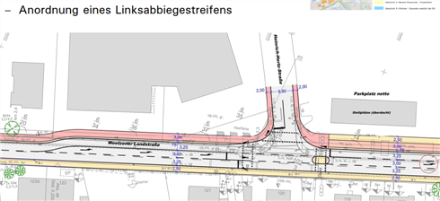

<iframe src="bannerAnimated.sozi.html" width="100%" height="90" frameBorder="0">
    ADFC Banner
</iframe>

# [ADFC Hemmingen / Pattensen](http://adfc-hemmingen-pattensen.github.io/)

<!--[](http://www.adfc-hannover.de/)-->

<!-- -->


Der ADFC (Allgemeiner Deutscher Fahrrad Club) Hemmingen/Pattensen engagiert sich für gute Fahrradinfrastruktur und ein fahrradfreundliches Klima in Hemmingen und Pattensen. [PDF-Broschüre](190117 ADFC Hemmingen-Pattensen Profil.pdf)

Sprecher Jens Spille, E-Mail: [j.spille@adfc-hannover.de](mailto:j.spille@adfc-hannover.de)

> **ADFC Fahrrad-Selbsthilfewerkstatt-Hemmingen**<br>
> in der Heinrich-Hertz-Straße 23 (Hinterhof), Hemmingen
> hat immer Dienstags von 17:30 bis 19:00 Uhr geöffnet<br>

> Hilfe bei Reparatur, Fahrradausgabe, [Spendenannahme](#konto)<br>
> ✉ [Fahrrad-Selbsthilfewerkstatt-Hemmingen@web.de](mailto:Fahrrad-Selbsthilfewerkstatt-Hemmingen@web.de)

>  oder [Mitglied werden](https://www.adfc.de/7678_1)

> **Lasten zu groß? Keine Ausrede** Leihen Sie sich kostenlos ein Hannah Lastenrad unter <http://www.hannah-lastenrad.de/>. Hilfe, Fragen und Wünsche zur Hannah gibt unter [hallo@hannah-lastenrad.de](mailto:hallo@hannah-lastenrad.de)


## Inhalt
> - [Aktuelles](#aktuelles)
> - [Wer sind wir?](#wer-sind-wir)
> - [Was wird](#was-wird)
>   - 5 Tagestouren in 2019 geplant.
> - [Tipps und Nachrichten](#tipps-und-nachrichten)
>   - Veränderte Verkehrsführung wegen B3 Neubau
> - [Mängelkarte für Hemmingen und Pattensen](#unsere-mängelkarte)
>   - [Direkter Link](http://adfc-hemmingen-pattensen.github.io/MaengelHemPat.html)
> - [Was war](#was-war)
> - [Datenschutz](Datenschutzerklaerung_ADFC_2018-1-KV.pdf)
>   -  <span style="color: #888888; font-size: 0.8em;"> *Übertragung von schützenswerten Daten nur Verschlüsselt. [So funktioniert es](https://www.gpg4win.de/documentation-de.html) mit meinem öffentliche OpenPGP [ 0x9AF24CC8B850EFB77F629711906211B8AC607CB1](https://adfc-hemmingen-pattensen.github.io/OpenPGP/9AF24CC8B850EFB77F629711906211B8AC607CB1.asc) Schlüssel. [j.spille@adfc-hannover.de](mailto:j.spille@adfc-hannover.de)*</span>
> - [Impressum](#impressum)

## Aktuelles

### Kurzfristige Meldung
<div class="holder" style="width: 100%; height:500px; position:relative;">
<iframe width="100%" height="100%" src=https://hackmd.io/U-6kWHTpRAyp9glY_QNyKg?view" frameborder="1"></iframe>
<div style="position:absolute; top:3px; left:5px; width:100%; height:130px;"></div>
</div>

## Tour 5 „Von Hemmingen zur Motormühle Blumenhagen bei Edemissen“ für sportlich Radfahrende

<!-- Die Tour und die Besichtigung der historischen Motormühle anlässlich des Tags des offenen Denkmals muss aus organisatorischen Gründen leider entfallen. Wir bitten den Ausfall zu entschuldigen.-->

Tag des offenen Denkmals am 8. Sep. 2019, 9.00 Uhr

Besichtigung der historischen Motormühle anlässlich des Tags des offenen Denkmals
Länge: 50 km einfache Strecke. Rückfahrt möglich als geführte Radtour mit weiteren 50 km
oder eigenständig per Bahn ab Dolbergen möglich (GVH-Tarif). Bei der Motormühle ist eine
Auflademöglichkeit für Pedelecs vorhanden
Charakter: Anspruchsvolle Tour über 50 km (einfach) oder 100 km (Hin- und Rückfahrt) bei
anspruchsvollem Tempo (2,5 Std. für 50 km sind angesetzt)
Strecke: Durch die Eilenriede entlang der Güterbahnumgehung geht es durch Lehrte. Hinter
Ramhorst fahren wir über Arpke und Abbensen durch Edemissen zur Motormühle. Nach
ausführlichem Genuß von Kaffee und Kuchen kann die Historische Motormühle in Betrieb
besichtigt werden. Gemeinsam geht es denselben Weg wieder 50 km zurück, bzw. für
Bahnfahrende eigenständig nach Dolbergen.
Geeignet nur für sportliche Fahrer (Lademöglichkeit für E-Bikes vorhanden)

> **Dauer:** Einfache Fahrt ca. 2,5 Stunden, insgesamt ca. 8-9 Stunden, bitte ausreichende
Verpflegung mitnehmen!  
> **Führung:** Udo Scherer Tel: 01520 9800808
> **Treffpunkt:** Hemmingen, Rathausplatz 1, rechtzeitig zur Abfahrt um 9.00 Uhr.  
> **Anmeldung:** Nicht erforderlich. Die Tour ist kostenlos.

## Stadtgespräch auf zwei Rädern: Hemmingen - Fahrradfreundliche Kommune voller Hindernisse?

Hemmingen hat sich auf den Weg zu einer "fahrradfreundlichen Kommune" gemacht. Es liegen jedoch noch einige Hindernisse auf der Wegstrecke, die beim "Stadtgespräch auf zwei Rädern" der Grünen Ortsgruppe erfahrbar gemacht werden sollen. Unter kundiger Führung von zwei Referenten der ADFC-Ortsgruppe Hemmingen/Pattensen ruft die Grüne Ortsgruppe am Montag, den 09.09.19 zu einer gemeinsamen Radtour durch Hemmingen auf. Die Strecke führt uns auf einem Rundkurs vom Strandbad über das alte Dorf nach Wilkenburg, durch den Sundern, das Gewerbegebiet und durch Hemmingen-Westerfeld zurück zum Ausgangspunkt. Wir halten zwischendurch immer wieder an und tauschen uns über die Erfahrungen im Radverkehr aus. Eingeladen sind alle Alltagsradfahrenden und solche, die es werden wollen. Jede*r kommt bitte mit ihrem/seinem eigenen Fahrrad und fährt auf eigene Verantwortung mit. Treffpunkt ist um 18:30 Uhr am Strandbad in Hemmingen. Die gesamte Tour dauert ca. 2 Stunden. Im Anschluss lassen wir das "Stadtgespräch auf zwei Rädern" in geselliger Runde im Seecafé "ShineBar" an der Hohen Bünte 10 ausklingen.

## Wer sind wir?

Der ADFC Hemmingen/Pattensen engagiert für gute Fahrradinfrastruktur und ein fahrradfreundliches Klima. Erste Aktivitäten starteten 2013, seit Mai 2015 und mit mittlerweile rund 107 Mitgliedern (Stand Jan. 2019) und weiteren Ehrenamtlichen, engagiert sich der ADFC Hemmingen/Pattensen offiziell in den beiden Städten für

1. Eine sichere und bessere Fahrradinfrastruktur (Radverkehrspolitik)
2. Mehr Bewusstsein, dass Fahrradfahren eine zentrale Säule der Verkehrswende ist (Öffentlichkeitsarbeit)
3. Touristisches Erleben der Region Hannover und darüber hinaus (Radtouren)
4. Eine kostengünstige Versorgung Bedürftiger und Geflüchteter mit Fahrrädern und Reparatur-Unterstützung in der Fahrrad-Selbsthilfewerkstatt (seit Nov. 2016).

Diese vier zentralen Themenfelder werden in unser [PDF-Broschüre](190117 ADFC Hemmingen-Pattensen Profil.pdf) kurz vorgestellt.

### Arbeitsgemeinschaft (AG) Radverkehr in Hemmingen

Der Ausschusses für Stadtentwicklung und Umwelt hat am 15. Aug. 2019 beschlossen, dass zur Umsetzung des Radverkehrskonzeptes eine Arbeitsgemeinschaft (AG) Radverkehr gebildet wird, die mindestens einmal im Jahr tagt. Die Zusammensetzung soll sich an dem Teilnehmerkreis orientieren, der auch bei der Erarbeitung des Radverkehrskonzeptes beteiligt war. Feste Teilnehmer sind Vertreter von ADFC, ADAC, Polizei, Rat und Stadtverwaltung.

### Radwegeführung Stadtbahnbaustelle

Beschwerden bitte direkt am Infrastrukturgesellschaft (Infra), *Bürgersprechstunden: Mittwochs, 15 bis 17 Uhr* im Büro Göttinger Landstraße 44 (neben Volksbank) in Hemmingen-Westerfeld melden.


- Info: https://www.infra-hannover.de/hemmingenwesterfeld/
- Email: https://www.infra-hannover.de/kontakt/

### Stärkung des Radverkehrs

<!-- 2019-08-15-Do.-->
StVO Novelle. Das Bundesministerium für Verkehr und digitale Infrastruktur plant eine [Stärkung des Radverkehrs](https://www.bmvi.de/SharedDocs/DE/Artikel/StV/stvo-novelle.html).


1. Mindestüberholabstand für Kfz: Es wird ein **Mindestüberholabstand von 1,5 m innerorts und von 2 m außerorts** für das Überholen von zu Fuß Gehenden, Radfahrenden und Elektrokleinstfahrzeugführenden durch Kraftfahrzeuge **festgeschrieben**. Bisher schreibt die StVO le: diglich einen „ausreichenden Seitenabstand“ vor.
Schrittgeschwindigkeit für rechtsabbiegende Kraftfahrzeuge über 3,5 t

1. Für rechtsabbiegende Kraftfahrzeuge über 3,5 t soll aus Gründen der Verkehrssicherheit innerorts Schrittgeschwindigkeit (7 bis 11 km/h) vorgeschrieben werden. Verstöße können künftig mit einem Bußgeld in Höhe von 70 Euro sanktioniert werden. Zudem wird ein Punkt im Fahreignungsregister eingetragen.
Grünpfeil ausschließlich für Radfahrer

1. Mit der StVO-Novelle wird die bestehende Grünpfeilregelung auch auf Radfahrer ausgedehnt, die aus einem Radfahrstreifen oder baulich angelegten Radweg heraus rechts abbiegen wollen. Außerdem wird ein gesonderter Grünpfeil, der allein für Radfahrer gilt, eingeführt.

1. **Generelles Haltverbot auf Schutzstreifen**: Schutzstreifen für den Radverkehr trennen den Rad- und den Autoverkehr mit einer gestrichelten weißen Linie (Zeichen 295 der StVO). Autos dürfen dort zwar nicht parken, aber bislang noch bis zu drei Minuten halten. Dies führt vielfach dazu, dass die Radfahrenden Schutzstreifen nicht durchgängig nutzen können, weil ihnen haltende Autos den Weg versperren. Deshalb wollen wir dort ein generelles Haltverbot einführen.
Einrichtung von Fahrradzonen

1. Analog zu den Tempo 30-Zonen sollen in Zukunft auch Fahrradzonen angeordnet werden können. Die Regelung soll sich an den Regeln für Fahrradstraßen orientieren: Für den Fahrverkehr gilt eine Höchstgeschwindigkeit von 30 km/h. Der Radverkehr darf weder gefährdet noch behindert werden. Auch Elektrokleinstfahrzeuge sollen hier künftig fahren dürfen.

1. Klarstellung zum Nebeneinanderfahren von Radfahrenden: **Das Nebeneinanderfahren von Radfahrenden ist ausdrücklich erlaubt, wenn der Verkehr dadurch nicht behindert wird**. Die bisherige Formulierung in der StVO stellt das Hintereinanderfahren in den Vordergrund und kann daher missverstanden werden.

1. Ausweitung des Parkverbots vor Kreuzungen und Einmündungsbereichen: Das Parken vor Kreuzungen und Einmündungen soll in einem Abstand von bis zu je 8 m von den Schnittpunkten der Fahrbahnkanten oder bis zu je 5 m vom Beginn der Eckausrundung verboten werden, wenn ein straßenbegleitenderbaulicher Radweg vorhanden ist, der als benutzungspflichtig oder mit Radsinnbildgekennzeichnet ist. Hierdurch soll die Sicht zwischen Straße und Radweg verbessert und dadurch die Sicherheit von Radfahrenden erhöht werden.

1. Vereinfachung für Lastenfahrräder: Um speziell für Lastenfahrräder Parkflächen und Ladezonen vorhalten zu können, führen wir ein spezielles Sinnbild „Lastenfahrrad“ ein, das die zuständigen Straßenverkehrsbehörden nutzen können.

1. Verkehrszeichen Radschnellwege: Das Verkehrszeichen „Radschnellweg“ soll in die StVO aufgenommen werden, um die Kennzeichnung von Radschnellwegen auch unabhängig von der Fahrbahnbeschaffenheit wie z. B. auf sandigem Untergrund möglich zu machen.

1. Überholverbot von Radfahrenden: Mit der Einführung eines neuen Verkehrszeichens sollen die zuständigen Straßenverkehrsbehörden in Zukunft ein Überholverbot von einspurigen Fahrzeugen (u. a. Fahrrädern) für mehrspurige Kraftfahrzeuge z. B. an Engstellen anordnen können.  


1. Erweiterung der Erprobungsklausel: Die bestehende Klausel für zeitlich und örtlich begrenzte Anordnungen zur Erprobung verkehrsregelnder oder sichernder Maßnahmen soll künftig unabhängig von einer Gefahrenlage Modellversuche ermöglichen, um den Handlungsspielraum der zuständigen Straßenverkehrsbehörden zu erweitern. Solche Modellversuche sollen im Einvernehmen mit den Kommunen angeordnet werden. Damit wird auch die Mitbestimmung der Kommunen gestärkt. Eine weitergehende Öffnung des Straßenverkehrsrechts für Verkehrsversuche bedarf einer Änderung auf Gesetzesebene, die in einem weiteren Schritt im nächsten Jahr angegangen werden soll.

1. Vermehrte Öffnung von Einbahnstraßen für Radfahrende in Gegenrichtung: Durch die Änderung der Allgemeinen Verwaltungsvorschrift zur StVO sollen die zuständigen Straßenverkehrsbehörden verstärkt zur Prüfung der Öffnungsmöglichkeit von Einbahnstraßen in Gegenrichtung für Radfahrende veranlasst und die Zahl der in Gegenrichtung freigegebenen Einbahnstraßen dadurch vergrößert werden.

### Das Fahrrad braucht mehr Platz

Mehr Radverkehr ist die Lösung bei Stau, dicker Luft und Fahrverboten. Steigen mehr Menschen auf das Fahrrad um, ist das gut für alle. Wie das gelingt, zeigt der Allgemeine Deutsche Fahrrad-Club zu seinem 40-jährigen Bestehen mit einer großen, bundesweiten Kampagne. Das Ziel: Mehr Platz fürs Rad - für gute, breite Radwege, sichere Kreuzungen und viel mehr Fahrradparkplätze. Mit Aktionen vor Ort macht der Fahrradclub auf die Platzdebatte im Straßenraum aufmerksam und zeigt, wie dieser Platz fürs Fahrrad, für gute Radwege und für bessere Radfahrbedingungen genutzt werden kann. Weitere Informationen auf [mehrplatzfuersrad.de](http://mehrplatzfuersrad.de ). Hashtag: #MehrPlatzFürsRad.

### ISEK Arnum-Mitte

Die Stadt Hemmingen hat einen 80-seitgen Entwurf zum "Teilräumliches ISEK - Voruntersuchung Arnum Mitte" im Internet bereit gestellt [Drucksache 341/2019](https://www.stadthemmingen.de/allris/vo020.asp?VOLFDNR=1202).

Hier eine von vielen Umbaumaßnahmen die angedacht sind.


Der Entwurf wird vom Do. 14.02 bis Mo. 18.03 im Rathaus Hemmingen ausliegen. Eine öffentliche Informationsveranstaltung ist am Mo. 18.02 ab 19:00 in der Wäldchenschule replant.

> Die ADFC Mitglieder haben auf Ihren 23. RadelTreff in diesem Zusammenhang auch über einen [Shared Space](https://de.wikipedia.org/wiki/Shared_Space) (deutsch: „gemeinsamer Raum“) diskutiert. *Charakteristisch ist dabei die Idee, auf Verkehrszeichen, Signalanlagen und Fahrbahnmarkierungen zu verzichten. Gleichzeitig sollen die Verkehrsteilnehmer vollständig gleichberechtigt werden, wobei die Vorfahrtsregel weiterhin Gültigkeit besitzt. Im Gegensatz zur konventionellen Verkehrsberuhigung soll auch eine Anwendung in Hauptverkehrsstraßen möglich sein. (Wikipedia)*

> Beispiel: Shared-Space Kreisel in Bohmte (NdS).
> 

## Was wird

## Neuer Terminplan

1. Die Fahrrad-Selbsthilfe-Werkstatt (FSW) hat jeden **Dienstag von 17:30 bis 19:00** geöffnet.
2. Spontane, kostenlose Feierabendradtouren werden bei entsprechenden Wetter in der Regel Mittwochs angeboten. Die ADFC Ortsgruppe hat dafür eine E-Mail Liste angelegt. Wir melden uns wenn es passt. Wer auf dieser Liste möchte, schreibe bitte an [j.spille@adfc-hannover.de](mailto:j.spille@adfc-hannover.de).
3. Den Hemminger Sitzungskalender gibt es unter [https://www.stadthemmingen.de/politik-gremien/buergerinformationssystem/](https://www.stadthemmingen.de/politik-gremien/buergerinformationssystem/)
4. Den Pattenser Sitzungskalender gibt es unter [https://pattensen.more-rubin1.de/sitzungskalender.php](https://pattensen.more-rubin1.de/sitzungskalender.php)

<!-- see https://github.com/raghur/mermaid-filter-->
<!--```{.mermaid format=svg  theme=forest caption="ADFC Hemmingen/Pattensen"}-->
```mermaid
gantt
  title ADFC Hemmingen/Pattensen 2019
#  dateFormat  DD.MM.YY
  dateFormat  YYYY-MM-DD

section Ferien&Co
  Osterferien :done,        2019-04-08, 2019-04-23
  Ramadan     :active,done, 2019-05-06, 2019-06-04
  Sommerferien:done,        2019-07-04, 2019-08-14
  Herstferien :done,        2019-10-04, 2019-08-18

section FSW
  Fahrrad-Selbsthilfe-Werkstatt :crit,active, 2019-01-08, 2019-12-17
  Fahrradcheck des ADFC         : 2019-05-14, 1d

section Treffen
  23.1 23. Radeltreff  : 2019-01-23, 1d
  27.2 24. Radeltreff : 2019-02-27, 1d
  03.7 25. Radeltreff : 2019-07-03, 1d
  25.4 Sicher Rad fahren : 2019-04-25, 1d
  9.9 Stadtgespräch mit Grüne: 2019-09-09, 1d
  Landes-Aktiventreffen: 2019-11-22, 3d

section Abendtouren
Feierabendradtouren        :done,       2019-05-08, 2019-10-15

section Tagestouren
  12.5 Zum Blauen See 1)           :crit, 2019-05-12,1d
  26.5 Fluss-Seen-Wälder-Klöster 2):crit, 2019-05-26,1d
  23.6 Zum Wietzesee 3)            :crit, 2019-06-23,1d
  1.9 Hildesheimer-Land 4)         :crit, 2019-09-01,1d
  8.9 Motormühle Blumenhagen 5)    :crit, 2019-09-08,1d

section Stadtradeln
  19.5-08.6 Stadtradeln    : crit, 2019-05-19, 2019-06-08
  19.5 Sternfahrt          :       2019-05-19, 1d
  02.6 Familienradwandertag:       2019-06-02, 1d
  07.6 VeloCityNight       :       2019-06-07, 1d
  18.11 Ehrung       :       2019-11-18, 1d

section Politik
  14.2-18.3 Auslegung ISEK Arnum: 2019-02-14, 2019-03-18
  18.2 Info Veranstaltung ISEK  : crit, 2019-02-18, 1d
  25.2 Pat - Bauauss. Abstellanlage : crit, 2019-02-25, 1d
  07.3 Hem - VEP2030 2te Version : crit, 2019-03-07, 1d
  09.5 Hem - Auss. Arnum-Mitte : crit,  2019-05-09, 1d
  13.5 Hem - Auss. Hochwasserschutz: crit, 2019-05-13, 1d
  23.5 Antrag Förderungsprogramm ISEK : crit, 2019-05-23,1d
  27.6 Pat - Auss. FFW, Verkehr, ... : crit, 2019-06-27,1d
  15.8 Hem - Auss. AG Radverkehr & ISEC : crit, 2019-08-15,1d
  19.9 Pat - Auss. Verkehr : crit, 2019-09-19,1d
  20.9 Parking Day - globalen Klimastreik : crit, 2019-09-20,1d
```
<!-- Preview for editors https://mermaidjs.github.io/mermaid-live-editor/ -->

#### Weiter Termine unter <http://www.adfc-hannover.de/termine/>


### Mittwochstour


Spontane, kostenlose Feierabendradtouren werden bei entsprechenden Wetter (Sommer) in der Regel Mittwochs angeboten. Die ADFC Ortsgruppe hat dafür eine E-Mail Liste angelegt. Wir melden uns wenn es passt. Wer auf dieser Liste möchte, schreibe bitte an [j.spille@adfc-hannover.de](mailto:j.spille@adfc-hannover.de).

### RADTOUR 4 für Geübte „Unterwegs im Hildesheimer-Land“

> 1.9., Sonntag, 10 Uhr

Die ca. 65 km lange Strecke, führt uns vom „Reiterdorf Koldingen“ nach Ruthe, wo wir das
„Landwirtschaftliche Versuchsgut“ sehen, weiter zur Innerstebrücke.
Danach verlassen wir die Straße und radeln auf dem Innerste-Radweg weiter zum Bahnhof
Sarstedt, den wir unterqueren.  
Weiter geht es ein kurzes Stück durch die Altstadt, wieder zum Innerste-Radweg an der
sehenswerten „Malzfeldt-Mühle“ vorbei. Wir überqueren ein Wehr, verlassen den Fluss und
radeln am „Bruchgraben“ entlang, unterqueren die Bundesstraße und fahren weiter nach
Ahrbergen und Giesen. Wir sehen das Naturschutzgebiet „Giesener Berge“, welches nur zu
Fuß erkundet werden kann.
Weiter geht es auf dem Innerste-Radweg durch das grüne Hildesheim, vorbei am schönen
„Hohnsensee“ bis zur „Domäne Marienburg“. Dort gibt es Einkehrmöglichkeit im sehr schön
gelegenen „Domänencafé“.
Nachdem wir uns gestärkt haben, fahren wir in westlicher Richtung nach Söhre, wo wir ein
Stück auf dem „Bahntrassen-Radweg“ fahren und dann weiter zum „Kloster Marienrode“
radeln. Dann geht es hinauf in den Hildesheimer Wald, an den Boschwerken vorbei und
durch den Wald bis nach Sorsum. Von dort geht es bergab nach Groß Escherde und weiter
nach Heyersum und Rössing, wo wir am „Wasserschloss“ vorbeifahren. Von Rössing fahren
wir durch das sehenswerte „Dorf Barnten“. Nun geht es durch die Giftener Seenplatte nach
Schliekum und Ruthe. Noch ein paar km, dann sind wir wieder am Ausgangspunkt in
Koldingen. Dort schauen wir uns das „Schloss Amtssitz Coldingen“ an.

> **Dauer:** ca. 7-8 Std., ausreichende Verpflegung bitte mitnehmen!  
> **Führung:** Helmut Krause, Jochen Lemke, Günter Kleinod, Dirk Härtel (ADFC
Hemmingen/Pattensen)  
> **Treffpunkt:** Koldingen, Am Lindenplatz, rechtzeitig zur Abfahrt um 10.00 Uhr  
> **Anmeldung:** Nicht erforderlich, weitere Infos unter 05069-7979. Die Tour ist kostenlos.


### 5 „Von Hemmingen zur Motormühle Blumenhagen bei Edemissen“ für sportlich Radfahrende

<!-- Die Tour und die Besichtigung der historischen Motormühle anlässlich des Tags des offenen Denkmals muss aus organisatorischen Gründen leider entfallen. Wir bitten den Ausfall zu entschuldigen.-->

Tag des offenen Denkmals am 8. Sep. 2019, 9.00 Uhr

Besichtigung der historischen Motormühle anlässlich des Tags des offenen Denkmals
Länge: 50 km einfache Strecke. Rückfahrt möglich als geführte Radtour mit weiteren 50 km
oder eigenständig per Bahn ab Dolbergen möglich (GVH-Tarif). Bei der Motormühle ist eine
Auflademöglichkeit für Pedelecs vorhanden
Charakter: Anspruchsvolle Tour über 50 km (einfach) oder 100 km (Hin- und Rückfahrt) bei
anspruchsvollem Tempo (2,5 Std. für 50 km sind angesetzt)
Strecke: Durch die Eilenriede entlang der Güterbahnumgehung geht es durch Lehrte. Hinter
Ramhorst fahren wir über Arpke und Abbensen durch Edemissen zur Motormühle. Nach
ausführlichem Genuß von Kaffee und Kuchen kann die Historische Motormühle in Betrieb
besichtigt werden. Gemeinsam geht es denselben Weg wieder 50 km zurück, bzw. für
Bahnfahrende eigenständig nach Dolbergen.
Geeignet nur für sportliche Fahrer (Lademöglichkeit für E-Bikes vorhanden)


> **Dauer:** Einfache Fahrt ca. 2,5 Stunden, insgesamt ca. 8-9 Stunden, bitte ausreichende
Verpflegung mitnehmen!  
> **Führung:** Udo Scherer Tel: 01520 9800808
> **Treffpunkt:** Hemmingen, Rathausplatz 1, rechtzeitig zur Abfahrt um 9.00 Uhr.  
> **Anmeldung:** Nicht erforderlich. Die Tour ist kostenlos.


## Tipps und Nachrichten

### Veränderte Verkehrsführung für Fußgänger und Radfahrer

Straßenbauverwaltung: Sperrungen und Umleitungen erforderlich. Hier die [Offizielle Pressemitteilung](http://www.strassenbau.niedersachsen.de/aktuelles/presseinformationen/b-3-ortsumgehung-hemmingen-veraenderte-verkehrsfuehrung-fuer-fugaenger-und-radfahrer-168474.html).

Zitat: "Anregungen der Stadt Hemmingen, möglichst viele Wegebeziehungen in der Bauzeit von Überführungsbauwerken und Bundesstraßentrasse dauerhaft mittels provisorischer Umfahrungen aufrechtzuerhalten, wurden durch die Straßenbauverwaltung geprüft und angesichts der bisherigen Erfahrungen im Verlauf der Deveser Straße als nicht praktikabel verworfen. Gegen die Einrichtung und Unterhaltung niveaugleicher Querungsmöglichkeiten für öffentliche Verkehre inmitten des Baufeldes sind in erster Linie Sicherheitsbedenken anzuführen."


- [ ] Da Radfahrende Ausweichstrecken über den "Stadtweg" K225 nehmen müssen, fordern wir eine vorübergehende Geschwindigkeitsbegrenzung für den KFZ-Verkehr auf 50km/h auf diesen Strecken. Dieses haben wir auf der Ausschusssitzung am 27.09.18 angeregt. Sowie je Richtung ein Hinweisschild "Achtung Radfahren". Für Alternative und weitere Anregungen sind wir sehr dankbar. Oberstes Gebot ist die Sicherheit für alle Verkehrsteilnehmer.

### Umgestaltung der Weetzener Landstraße -Planung der Region Hannover-

Die Pläne (eher gesagt Ideen) zur Umgestaltung der Weetzener Landstraße liegt auf der Homepage der Stadt Hemmingen. [Umgestaltung der Weetzener Landstraße](https://www.stadthemmingen.de/hemmingen-erleben/verkehr/umgestaltung-der-weetzener-landstrasse-planung-der-region-hannover-/).




### Erste Dauerzählstelle in Hemmingen

Die erste Fahrrad-Messstation im Umland ist am Dienstag, den 31.07.2018 durch den Regionspräsidenten Hauke Jagau und Bürgermeister Claus-Dieter Schacht-Gaida in Betrieb genommen worden. Weitere Messstationen sollen in Seelze, Sehnde und Burgwedel folgen.

Ziel: 2025 sollen 21 von 100 Wegen mit dem Rad gefahren werden.

### Büroensemble Hemmingen - MAX DUDLER

Am 14.06.18 wurde die Analyse der verkehrlichen Auswirkungen vorgestellt.

[Auf der Hemminger Homepage](https://www.stadthemmingen.de/downloads/datei/OTA3MDAyMjE4Oy07L3Vzci9sb2NhbC9odHRwZC92aHRkb2NzL2hlbW1pbmdlbi9oZW1taW5nZW4vbWVkaWVuL2Rva3VtZW50ZS8xODA2MTRfMTcxNV9iZWhfYnVlcm9lbnNlbWJsZV9oZW1taW5nZW5bMV0ucGRm/180614_1715_beh_bueroensemble_hemmingen[1].pdf) können Sie die Präsentation des Vorhabens einsehen.

[Hier](https://www.stadthemmingen.de/downloads/datei/OTA3MDAyMjE5Oy07L3Vzci9sb2NhbC9odHRwZC92aHRkb2NzL2hlbW1pbmdlbi9oZW1taW5nZW4vbWVkaWVuL2Rva3VtZW50ZS8yMDE4MDYxNF9wcmFlc2VudGF0aW9uX3NocC5wZGY%3D/20180614_praesentation_shp.pdf) können Sie die verkehrliche Untersuchung einsehen. Die Erschließung wird von „hinten“ über die Carl-Zeiss-Straße erfolgen.


### Planfeststellungsverfahren für den Neubau eines Radweges im Zuge der K 226/K221 von Ronnenberg nach Devese

Die Einwendungen zum Planfeststellungsverfahren für den Neubau eines Radweges im Zuge der K 226/K221 von Ronnenberg nach Devese wurden am 2018-06-27-Mi erörtert. Der ADFC Hemmingen / Pattensen hat auf Mängel für die Einschleifung bei der Querungshilfe in Devese hingewiesen, der neue Entwurf berücksichtigt diese Mängel.

### Verkehrsentwicklungsplan 2030 der Stadt Hemmingen

Der Entwurf des Verkehrsentwicklungsplanes 2030 der Stadt Hemmingen lag in der Zeit vom 07.12.2017 bis zum 31.03.2018 öffentlich aus. Er ist immer noch auf der Homepage der Stadt Hemmingen einsehbar [Entwurf VEP2030](https://www.stadthemmingen.de/downloads/datei/OTA3MDAxOTYxOy07L3Vzci9sb2NhbC9odHRwZC92aHRkb2NzL2hlbW1pbmdlbi9oZW1taW5nZW4vbWVkaWVuL2Rva3VtZW50ZS9lbnR3dXJmX2Rlc192ZXJrZWhyc2VudHdpY2tsdW5nc3BsYW5lc19kZXJfc3RhZHRfaGVtbWluZ2VuX3ZlcF8yMDMwX1szXS5wZGY%3D/entwurf_des_verkehrsentwicklungsplanes_der_stadt_hemmingen_vep_2030_[3].pdf).

### Einige nützliche Links

[Stadt Pattensen](http://www.pattensen.de/) und das [Wanderbare Calenberger Land](http://www.pattensen.de/Default.aspx?tabid=3110)<br>
[Stadt Hemmingen](https://www.stadthemmingen.de/) und das [Radvehrkehrskonzept](https://www.stadthemmingen.de/portal/seiten/radverkehrskonzept-der-stadt-hemmingen-907000093-22500.html)

[**GPSies**](http://www.gpsies.com/) bietet die Möglichkeit Touren zu planen und mit anderen auszutauschen. Auch als Apps erhältlich.

**Tipp Radtouren:** Ausgewählte Radtouren der Nachbar Ortsgruppen sind unter [ADFC Region Hannover Termine](http://www.adfc-hannover.de/termine/) zu finden.

**Tipp Radfahrkarte:** Eine Quellen offene Radfahrkarte mit Routingfunktion git es under [OpenRouteService.org](http://bit.ly/1cEUTze). Mit der rechten Maustaste kann man Start- und Zielpunkt setzen.

_Ältere Tipps und Nachrichten gibt es unter [Ältere Nachrichten](alteNews.html)_

## Unsere Mängelkarte

Gefährliche Querungen, Unfallschwerpunkte und Mängel auf Rad- und Fußwegen sammeln wir auf unserer **neuen** Mängelkarte.


siehe [Mängelkarte für Hemmingen und Pattensen](http://adfc-hemmingen-pattensen.github.io/MaengelHemPat.html)
<!--siehe [Mängelkarte für Hemmingen und Pattensen](https://adfc-hemmingen-pattensen.github.io/TiddlyWiki/ADFCWiki.html#M%C3%A4ngelkarte)-->

## Was war
### Abendtour 13/19 2019-08-21-Mi.

Tourenziel       | Julius-Trip-Ring
---------------: | -----------------------
Datum            | 2019-08-21-Mi
Tourenrart       | Feierabend
Tourenleiter     | Günther
Start            | Hemmingen Rathaus 18:00
Dauer [Stunden]  | ca. 2 1/2
Teilnehmerzahl   | 10
Tourenlänge [km] | 32
Wetter           | heiter bis wolkig

Die 13. Feierabend-Radtour startete am Mittwoch den 21. August mit 10 Radlern zum Julius-Trip-Ring. Die Fahrt ging durch die Leinemasch zum Maschsee. Dort stiegen wir in den Julius-Trip-Ring ein. Weiter ging es durch die Eilenriede, am Pferdeturm vorbei zum Zoo. An Vier Grenzen überquerten wir die Podbi und fuhren auf den Pastor-Jäckel-Weg, Niedersachsenring und dem Hans-Meinecke-Weg nach Hainholz. Vorbei am Berggarten kamen wir zu den Herrenhäuser Gärten. Am Leibnitz Tempel machten wir eine kurze Rast. Auf der Dornröschenbrücke überquerten wir die Leine und fuhren dann an Leine und Ihme entlang zurück. Nach ca. 2 1/2 Stunden flotter und schöner Fahrt, fast immer im Grünen, erreichten wir nach 32 km Hemmingen.

### Abendtour 12/19 2019-08-14-Mi.

Tourenziel       | Anderten Kronsberg
---------------: | -----------------------
Datum            | 2019-08-14-Mi
Tourenrart       | Feierabend
Tourenleiter     | Günther
Start            | Hemmingen Rathaus 14:00
Dauer [Stunden]  | ca. 5
Teilnehmerzahl   | 12 / 70
Tourenlänge [km] | 40
Wetter           | heiter bis wolkig

Die 12. Feierabend-Radtour startete am Mittwoch den 14. August ausnahmsweise mal um 14:00. Mit 12 Radlern fuhren wir durch die Eilenriede nach Anderten. Dort startete um 15:00 die Sommerradtour der Regionspräsidenten Hauke Jagau. Die Tour, mit dann 70 Teilnehmern, ging dann über den Kronsberg, wo der erste Stopp am geplanten „essbaren Rastplatz“ eingelegt wurde. Nach einer kurzen Pause fuhren wir weiter durch Laatzen nach Grasdorf zur Freien Martinsschule. Hier gab es eine Führung mit Erfrischung. Anschließend fuhren wir durch die Leinemasch nach Hemmingen. Im Sundern gab es eine Besichtigung des Mausoleums des Grafen Carl von Alten. Der Nachmittag klangt im Strandbad in Hemmingen aus.

### Abendtour 11/19 2019-08-07-Mi.

Tourenziel       | Giftener See
---------------: | -----------------------
Datum            | 2019-08-07-Mi
Tourenrart       | Feierabend
Tourenleiter     | Günther
Start            | Hemmingen Rathaus 18:00
Dauer [Stunden]  | ca. 3
Teilnehmerzahl   | 10
Tourenlänge [km] | 42
Wetter           | heiter bis wolkig

Die 11. Feierabend-Radtour startete am Mittwoch den  8. August mit 10 Radlern. Wir fuhren durch die Leinemasch nach Rethen zu den Koldinger Teichen.
In Ruthe erreichten wir den Welfen Weg, der direkt an der Leine entlang führt. Vorbei an Schliekum ging es zu den Giftener Seen. Nach einer kurzen Pause fuhren wir weiter nach Jeinsen, Örie und Hüpede. In Pattensen fuhren wir durch das Fachsbachtal nach Reden, Harkenbleck und Wilkenburg. Nach ca. 3 Std. und 42 km erreichten wir wieder Hemmingen.

### Abendtour #10/19 2019-07-17-Mi.

Tourenziel       | Benther Berg, Lindener Berg
---------------: | -----------------------
Datum            | 2019-07-17-Mi
Tourenrart       | Feierabend
Tourenleiter     | Dirk, Günther
Start            | Hemmingen Rathaus 18:00
Dauer [Stunden]  | ca. 2,5
Teilnehmerzahl   | 13
Tourenlänge [km] | 28
Wetter           | heiter bis wolkig

Die 10. Feierabend-Radtour startete am Mittwoch den 17. Juli mit 13 Radlern. Wir fuhren über Ricklingen, Mühlenberg nach Empelde. Weiter ging es nach Benthe und in südlicher Richtung, bei sehr guter Fernsicht, um den Benther Berg herum. Vorbei an Everloh radelten wir am Fuss des Benther Berges wieder nach Norden.
Auf einigen Schleichwegen ging es dann durch Badenstedt nach Linden, zum Lindener Berg. An der Sternwarte gab es einen kurzen Boxenstop. Der Rückweg ging dann durch Linden und Ricklingen. Nach ca. 2 1/2 Std. und knapp 30 km erreichten wir wieder Hemmingen. Nach ca. 2,5 Std. und 25 km erreichten wir wieder Hemmingen.

### Abendtour #9/19 2019-07-10-Mi.

Tourenziel       | Gleidingen, Ruthe, Sarstedt
---------------: | -----------------------
Datum            | 2019-07-10-Mi
Tourenrart       | Feierabend
Tourenleiter     | Dirk, Günther
Start            | Hemmingen Rathaus 18:00
Dauer [Stunden]  | ca. 2,5
Teilnehmerzahl   | 8
Tourenlänge [km] | 33
Wetter           | heiter bis wolkig

Die 9. Feierabend-Radtour startete am Mittwoch den 10. Juli mit 8 Radlern. Wir fuhren durch die Leinemasch nach Rethen und den Koldiger Teichen. Ein kurzer Abstecher
nach Gleidingen und Heisede sollte in Ruthe münden. Durch eine Umleitung wurden wir gezwungen über Sarstedt zu fahren. Dort gab es eine kurze Pause mit einem schönen
Eis. Der Rückweg ging dann an der Innerste entlang nach Ruthe. Weiter ging es durch die Koldinger Teiche nach Koldingen, Reden, Harkenbleck und Wilkenburg. Nach ca. 2,5 Std. und 33 km erreichten wir wieder Hemmingen.


### Abendtour #8/19 2019-07-03-Mi.

Tourenziel       | Maschsee, Eilenriede
---------------: | -----------------------
Datum            | 2019-07-03-Mi
Tourenrart       | Feierabend
Tourenleiter     | Dirk, Günther
Start            | Hemmingen Rathaus 18:00
Dauer [Stunden]  | ca. 2,5
Teilnehmerzahl   | 6
Tourenlänge [km] | 25
Wetter           | heiter bis wolkig

Die 8. Feierabend-Radtour startete am Mittwoch den 3. Juli mit 6 Radlern. Wir fuhren über Devese nach Ihme-Roloven und weiter nach Vörie. Nach einer kurzen Pause bei den Wasserbüffeln und anderen Tieren an dem Naturschutz-Aussichtsturm fuhren wir weiter nach Holtensen. Der Rückweg ging über Lüdersen, an Hiddesdorf vorbei nach Arnum.
Nach ca. 2,5 Std. und 25 km erreichten wir wieder Hemmingen.


### 25. RadelTreff

Der 25. RadelTreff fand am 2. Juli in dem Schulungsraum des Roten Kreuz in der Heinrich-Hertz-Str. 23 in Hemmingen statt.
Themen war u.a. die Radwegeführung in der Stadtbahn Baustelle. Diese kann sich täglich ändern. Beschwerden bitte direkt in der **infra** Sprechstunde ansprechen, jeden Mittwoch von 15 bis 17 Uhr in ihrem eigens eingerichteten Büro Göttinger Landstr. 44 in Hemmingen-Westerfeld. Es wurde viel über die Benutzung von Schutzstreifen diskutiert. Gewohnheitsfahrer nutzen sie gerne, Gelegenheitsfahrer empfinden sie meist zu schmal. Wir fordern breitere Schutzstreifen mit mehr Abstand zu parkenden Fahrzeugen und zum fließenden Verkehr. Wenn wir Interessiert zu Gewohnheitsfahrer machen wollen, müssen wir nicht nur die objektive, sondern auch die subjektive Sicherheit erhöhen [Nationaler Radverkehrsplan](https://nationaler-radverkehrsplan.de/de/forschung/schwerpunktthemen/subjektive-sicherheit-im-radverkehr). Die [Unfallforschung der Versicherer](https://udv.de/de/strasse/stadtstrasse/radverkehr/radfahrstreifen-und-schutzstreifen) fordert:

- Sicherheitstrennstreifen mit einer Breite von 0,75 m zum ruhenden Verkehr.
- Radfahr- und Schutzstreifen sollten jeweils mindestens 1,85 m breit sein.
- Sicherheitstrennstreifen von 0,75 m Breite zur Kfz-Fahrbahn erhalten.
- Breite der verbleibenden Restfahrbahn für den Kfz-Verkehr mindestens 5 m.


### Abendtour #7/19 2019-06-26-Mi.

Tourenziel       | Maschsee, Eilenriede
---------------: | -----------------------
Datum            | 2019-06-26-Mi
Tourenrart       | Feierabend
Tourenleiter     | Dirk
Start            | Hemmingen Rathaus 18:00
Dauer [Stunden]  | ca. 2,5
Teilnehmerzahl   | 8
Tourenlänge [km] | 32
Wetter           | sehr warm

Die 7. Feierabend-Radtour startete am Mittwoch den 26. Juli mit acht Radlern. Bei ca. 30° im Schatten war klar, möglichst viel im Wald zu fahren. Es ging durchs Ricklinger Holz zum Maschsee. Von dort in die Eilenriede, vorbei am Zoo, Seuerndieb. Der Bischhofsholer Biergarten kam uns gerade recht. Nach einer kurzen Rast ging es wieder zum Machsee und in die Leinemasch. Nach ca. 2,5 Std. und 32 km erreichten wir wieder Hemmingen.

### Tagestour #3/19 2019-06-23-So

Tourenziel       | „Durchs grüne Hannover zum Wietzesee“
---------------: | -----------------------
Datum            | 2019-06-23-So
Tourenrart       | Tagestour
Tourenleiter     | Günther Kleinod
Start            | Hemmingen Rathausplatz 10:00
Dauer [Stunden]  | ca. 6 - 7
Teilnehmerzahl   | 25
Tourenlänge [km] | 65
Wetter           | 25° Sonne + Wolken

Die Tour durchs grüne Hannover zum Wietzesee startete bei herrlichem Wetter am Rathausplatz in Hemmingen und führte uns durchs Ricklinger Holz zu den Ricklinger Seen. An der Ihme fuhren wir entlang bis zur Einmündung der Leine.
Von dort geht es in den Herrenhauser Garten zum Leibnitztempel. Am Berggarten vorbei fuhren wir weiter auf dem Julius-Trip-Ring, den wir in der List Richtung Norden verliessen. Den Mittellandkanal überquerten wir beim Lister Bad und erreichten den Silbersee. An der Pferderennbahn Neue Bult vorbei kamen wir an die Wietze und wenig später zum Hufeisensee. Der Biergarten und der Sandstrand luden zum Picknick ein. Nach einer kurzweiligen Pause fuhren wir weiter zum Wietzesee, nach Hainhaus und durch einen Golfplatz. Kurz vor dem Waldkater verliessen wir die Wietze und bogen nach Osten Richtung Isernhagen ab. Durch die Felder der Isernhagener Bauernschaften mit einer kurzen Steigung ging es weiter bis nach Altwarmbüchen. Am Altwarmbüchener See hatten wir uns die 2. Pause verdient. Anschließend ging es durchs Misburger Holz zum Mittellandkanal. Nach einer kurzen Fahrt am Kanal entlang bogen wir ab und fuhren durch eine Kleingartenkolonie, vorbei am Annateich und erreichen den Hermann-Löns-Park mit der Alten Mühle. Eine letzte Pause machten wir am Verein für Rasenspiele. Zurück ging es wieder vorbei am Maschsee und den Ricklinger Teichen. Nach einer sehr schönen Fahrt, auf guten, schattigen Wegen kamen wir gut gelaunt in Hemmingen an, nach ca. 6 1/2 Stunden und 65 km.

### Abendtour #6/19 2019-06-19-Mi.

Tourenziel       | Maschsee, Eilenriede
---------------: | -----------------------
Datum            | 2019-06-19-Mi
Tourenrart       | Feierabend
Tourenleiter     | Dirk, Günther
Start            | Hemmingen Rathaus 18:00
Dauer [Stunden]  | ca. 2,5
Teilnehmerzahl   | 3
Tourenlänge [km] | 20
Wetter           | heiter bis wolkig

Die 6. Feierabend-Radtour startete am Mittwoch den 19. Juni mit drei Radlern. Bei ca. 25° fuhren wir gen Westen nach Ihme-Roloven. In der Kükenmühle mussten wir den Biergarten testen. Nach einer kurzweiligen Rast ging es weiter nach Ihme-Roloven und zurück durch das Bürgerholz nach Hemmingen. Die neue B3 zwang uns zu einigen
Umwegen. Nach ca. 2,5 Std. und 20 km erreichten wir wieder Hemmingen.


### Abendtour #5/19 2019-06-12-Mi.

Tourenziel       | Hemmingen
---------------: | -----------------------
Datum            | 2019-06-12-Mi
Tourenrart       | Feierabend
Tourenleiter     | Günther
Start            | Hemmingen Rathaus 18:00
Dauer [Stunden]  | ca. 1,5
Teilnehmerzahl   | 3
Tourenlänge [km] | 15
Wetter           | regnerisch


Die 5. Feierabend-Radtour startete am Mittwoch den 12. Juni mit 3 Radlern. Wegen des leichten Regens wurde es eine kurze Tour, durchs Ricklinger Holz, nach Arnum und zurück nach Hemmingen.


### Stadtradeln

Das Stadtradeln 2019 began am So. 26. Mai 2019. Erneut haben die Kommunen Hemmingen und Pattensen an der dreiwöchigen Aktion vom 26. Mai bis 8. Juni teilgenommen. Die Teilnehmer Konnten die gefahrenen Kilometer zählen und Ihren Kommunen gutschreiben. Mehr auf der Seite [https://www.stadtradeln.de/](https://www.stadtradeln.de/).

<!--Am 22. und 20. Mai sowie am 5. Juni, jeweils um 18:00 laden wir zur kostenlosen Mittwochstour ab dem Rathausplatz ein.-->


### Velo City Night

Als diesjährige Besonderheit fand währenden des Stadtradeln die [Velo City Night](https://velocitynight.de/07-juni-2019/) am Freitag den 7. Juni in Hemmingen und Pattensen statt.
Die Velo City Night began um 18:00 auf dem Rathausplatz in Hemmingen. Ein DJ sorgte auf einer kleinen Bühne für Musik. Der Start begann um 20:00 führte nach Pattensen und endet gegen 22:00 wieder in Hemmingen. Ca. 300 Radfahrende haben teilgenommen.

### Abendtour #4/19 2019-06-05-Mi.

Tourenziel       | Maschsee, Eilenriede
---------------: | -----------------------
Datum            | 2019-06-05-Mi
Tourenrart       | Feierabend
Tourenleiter     | Günther Kleinod
Start            | Hemmingen Rathaus 18:00
Dauer [Stunden]  | ca. 2,5
Teilnehmerzahl   | 8
Tourenlänge [km] | 30
Wetter           | sonnig und schwül

Die 4. Feierabend-Radtour startete am Mittwoch den 05. Juli mit acht Radlern. Bei ca. 30° im Schatten war klar, möglichst viel im Wald zu fahren. Es ging
in die durchs Ricklinger Holz zum Maschsee. Von dort in die Eilenriede, vorbei am Zoo, Seuerndieb. Der Bischhofsholer Biergarten kam us gerade recht. Nach einer kurzen Rast ging es wieder zum Machsee und in die Leinemasch. Nach ca. 2,5 Std. und 30 km erreichten wir wieder Hemmingen.

## Familien-Radwandertag am 2.6.
Familien-Radwandertag des ADFC Region Hannover. Einmal rund um Hannover.


### Tagestour #2/19 2019-05-26-So

Tourenziel       | „Fluss-Seen-Wälder-Klöster“
---------------: | -----------------------
Datum            | 2019-05-26-So
Tourenrart       | Tagestour
Tourenleiter     | Günther Kleinod
Start            | Hemmingen, Rathausplatz 1,  9:00
Start            | Arnum Freibad,              9:25
Start            | Pattensen, Rathausplatz 1, 10:00
Dauer [Stunden]  | ca. 6 - 7
Teilnehmerzahl   | 31
Tourenlänge [km] | 55 - 70
Wetter           | 18° Sonne + Wolken

Die Radtour begann mit einer organisierten Anfahrt von Hemmingen über Arnum nach Pattensen. Um 10:00 starteten dann 31 Radler am Neuen Rathaus in Pattensen. Von dort
fuhren wir in südlicher Richtung auf guten Wirtschaft-und Fahrradwegen über Jeinsen  nach Schulenburg. Dort durchquerten wir den Ort und fuhren unterhalb des Marienberges ein Stück auf dem Leine-Heide-Radweg, überquerten die Leine und fuhren vor Nordstemmen durch ein kleines Seen-Gebiet nach Wülfingen.
Nachdem wir ein kurzes Stück entlang der B3 fahren mussten, bogen wir auf einen asphaltierten Wirtschaftsweg ab und erreichten den Ort Wittenburg. Dort fuhren wir steil hinauf zum „Augustiner Kloster Wittenburg“ mit seiner wuchtigen, ca. 700 Jahre alten Klosterkirche. Der weite Blick über das Land entschädigte für den steilen Anstieg.
Nun ging es weiter am Rande des Osterwaldes zum sehenswerten „Klostergut Wülfinghausen“. Wir durchquerten es und radelten danach auf einem sehr schönen Weg am Waldrand weiter zum „Cafe Am Waldkater“. Dort hatten wir uns eine Einkehr redlich verdient. Es war ein gemütlicher Biergarten mit herrlicher Aussicht.
Danach radelten wir am Nordrand des Osterwaldes zum „Forsthaus Fahrensen“ und fuhren durch den idyllischen Osterwald vorbei am „Waldrestaurant Holzmühle“.
Innerhalb der Wildschweingehege-Mauer, am Rande des „Kleinen Deisters“, radelten wir, ab jetzt mit Rückenwind, weiter nach Eldagsen und fuhren dann auf der ehemaligen Landstraße weiter nach Mittelrode, wo wir nicht ohne anzuhalten an dem rustikalen „Bauerncafe Mittelrode“ mit Biergarten vorbeikamen.
Gut gestärkt, mit Kaffee und Kuchen, geht es auf die letzte Etappe unserer Rundtour in nordöstlicher Richtung nach Bennigsen und von dort aus über die „Calenberger-Ackerwege“ nach Pattensen zurück.
Nach ca.6 Std. und 55 km erreichten wir wieder Pattensen. Die Arnumer und Hemminger Radler mussten noch etwas weiterfahren und kamen so auf ca. 70 km für das Stadtradeln.


### Tagestour #1/19 2019-05-12-S0

Tourenziel       | Rund um den Blauen See
---------------: | -----------------------
Datum            | 2019-05-12-So
Tourenrart       | Tagestour
Tourenleiter     | Dirk Härtel
Start            | Hemmingen, Rathausplatz 1, 10:00
Dauer [Stunden]  | ca. 5 1/2
Teilnehmerzahl   | 12
Tourenlänge [km] | 60
Wetter           | 12° Sonne + Wolken

Die Tour Zum Blauen See nach Garbsen startete mit 13 Radlern bei kühlen Wetterbedingungen, Temperaturen um die 12°, aber sonnig.
Wir überquerten die neue B3, leider über die 3 Kreisel, und fuhren durch Wettbergen und Empelde. Mit einer leichten Steigung ging
es zum Benther Berg. Von dort radelten wir weiter durch Velber, vorbei an der Gedenkstätte nach Ahlem. Danach erreichten wir den
Mittellandkanal und fuhren direkt am Kanal entlang Richtung Westen, vorbei an Seelze, bis nach Lohnde. Dort überquerten wir den
Kanal und die Leine und erreichten den Blauen See. Direkt am See, auf einer Aussichtsterrasse konnten wir picknicken. Nach einer
kurzweiligen Pause traten wir den Rückweg an. Es ging an Alt-Garbsen vorbei, durch die Leinewiesen zum Wasserstrassenkreuz von Leine
und Mittellandkanal. Danach fuhren wir über Marienwerder, mit kurzem Stop an der Klosterkirche, durch den Hinüberschen Garten nach
Stöcken und von dort über Letter wieder an den Stichkanal. An Leine und Ihme entlang fuhren wir zurück. Nach ca. 5 1/2 Stunden und
knapp 60 km kamen wir gut gelaunt in Hemmingen an.

### Abendtour #2/19 2019-05-21-Mi.

Tourenziel       | Anderter Schleuse u. Kronsberg
---------------: | -----------------------
Datum            | 2019-05-21-Mi
Tourenrart       | Feierabend
Tourenleiter     | Dirk Härtel
Start            | Hemmingen Rathaus 18:00
Dauer [Stunden]  | ca. 2,5
Teilnehmerzahl   | 8
Tourenlänge [km] | 33
Wetter           | heiter bis wolkig


Die 2. Feierabend-Radtour ging am Mittwoch den 21. Juni mit 8 Radlern (5 Herren und 3 Damen) bei gutem Wetter, durch das Ricklinger Holz, am Maschsee vorbei in die Eilenriede. Weiter ging es durch den Herrmann-Löns-Park mit der "Alten Mühle", einer Bockwindmühle, zur Anderter Schleuse. Nach einer kurzen Rast ging es auf den höchsten Punkt des Kronsbergs (118 m ü. NN). Die schöne Aussicht über Hannover und bis zum Brocken entschädigte für den letzten steilen Anstieg. Nach ca. 2,5 Std. und 33 km erreichten wir wieder Hemmingen.


### Abendtour #1/19 2019-05-08-Mi.

Tourenziel       | Maschsee, Eilenriede, Leinemasch
---------------: | -----------------------
Datum            | 2019-05-08-Mi
Tourenrart       | Feierabend
Tourenleiter     | Dirk Härtel
Start            | Hemmingen Rathaus 18:00
Dauer [Stunden]  | ca. 1 3/4
Teilnehmerzahl   | 3
Tourenlänge [km] | 20
Wetter           | bedrohliche Regenwolken

Die 1. Feierabend-Radtour 2019 ging mit 3 Radlern bei dunklen Wolken durch das Ricklinger Holz zum Maschsee. Durch den Rathauspark
in Hannover, vorbei am Maschteich fuhren wir weiter auf einer Fahrradstrasse bis zum Döhrener Turm. Weiter in die Eilenriede, durch
Waldheim, Seelhorst und Döhren. Danach kamen wir durch den Wiehegraben, überquerten die Leine und fuhren durch die Leinemasch. Am Schwarzen
Weg machten wir einen Abstecher zu den Döhrener Teichen mit einer kleinen Insel. Von dort ging es zurück über den Johann-Duve-Weg.
Nach knapp 2 Std. und 20 km erreichten wir Hemmingen vor dem angekündigten Regen.

### 24. Radeltreff

Am Mittwoch, den 27. Februar 2019 startete um 18.30 Uhr unser 24. RadelTreff im Calenberger Hof,  Göttinger Str. 26  in 30982 Pattensen. Es wurde viel diskutiert, u.a. über die geplante Abstellanlage am Lidl-Parkplatz in Pattensen und um den ISEC Entwurf für Arnum.

### 23. RadelTreff

ADFC Mitglieder und Interessierte haben sich am 23. Januar 2019 im Clubheim SC Hemmingen getroffen um die Aktivitäten für das Jahr 2019 zu planen. Zum [Entwurf ISEK/VU Arnum-Mitte](https://www.stadthemmingen.de/allris/vo020.asp?VOLFDNR=1202) wird der ADFC rechtzeitig eine Stellungnahme abgeben. Weiterhin wollen wir nochmal einen Schulradwegeplan für Pattensen starten. Zum Abbiegeassistent für LKW gab es eine lebhafte Diskussion. Wir möchten die Diskussion erweitern und versachlichen, dazu gehört es auch die Ampelprofile zu ändern und die Trennung der Grünphasen. Der nächste RadelTreff wird vermutlich Ende Februar im Calenberger Hof in Pattensen stattfinden.

### Hemmingen ist AGFK Mitglied

Die Stadt Hemmingen ist der Arbeitsgemeinschaft Fahrradfreundlicher Kommunen Niedersachsen / Bremen e. V. (AGFK) beigetreten. Die AGFK bietet den Kommunen ein Netzwerk,
um sich gegenseitig auszutauschen und zu unterstützen. Ziel ist die Zertifizierung „Fahrradfreundliche Kommune Niedersachsen“. Zu den Aufgaben gehört es u.a.:

* das die Kommune darauf hinarbeiten, die Voraussetzungen für die Zertifizierung
„Fahrradfreundliche Kommune Niedersachsen“ zu erfüllen.
* das die Kommune bereit ist, in der AGFK mitzuarbeiten und sie zu unterstützen.


Die Stadt Hemmingen hat ihre Errungenschaften und Ziele auf Seite 15 der [Broschüre 2018 als PDF (Download)](http://www.agfk-niedersachsen.de/fileadmin/user_upload/public/Meldungen/2018_Fahrradland-Niedersachsen-Bremen.pdf) dargelegt.


### Hemmingens Grüne spenden 350 Euro an die ADFC Fahrrad-Selbsthilfewerkstatt

Am Dienstag, den 18. Dezember 2018 überreichte eine Delegation der Hemminger Grünen einen symbolischen Spendenscheck über 350 € an das Team der Fahrrad-Selbsthilfewerkstatt vom ADFC.

Das Geld hatten die Grünen beim Hemminger Weihnachtsmarkt am vergangenen dritten Adventswochenende eingesammelt. Dort hatten sie an ihrem Stand wie jedes Jahr selbstgemachte Kekse, Marmeladen, Honig und anderes mehr angeboten und dafür um Spenden für einen guten Zweck gebeten, dieses Mal für die Arbeit der Fahrrad-Selbsthilfe-Werkstatt.

"Wir haben großen Respekt vor der Arbeit der Ehrenamtlichen des ADFC, die die Werkstatt auf dem Gelände der Flüchtlingsunterkunft in der Heinrich-Hertz-Straße nun schon seit über zwei Jahren mit viel Enthusiasmus und sehr professionell betreiben" erklärt Joachim Steinmetz, Vorsitzender des Grünen Ortsverbandes."Diese Initiative fördert die Integration der Geflüchteten genauso wie den umweltfreundlichen Radverkehr. Alte Fahrräder und Ersatzteile werden weiterverwendet, und auch Mitbürger mit schmalem Geldbeutel können sich Räder und Reparaturen leisten. Solch eine soziale und nachhaltige Initiative würden wir uns noch viel häufiger wünschen!"

"Wir werden das Geld nun für dringend benötigte Aufwertungen der Räder einsetzen, wie zum Beispiel für gute LED-Fahrradbeleuchtungen, die sind unverzichtbar für die Verkehrssicherheit von Radlern in der dunklen Jahreszeit" freuten sich die Mitarbeiter der Fahrradwerkstatt. Die aktuell etwa 15 Ehrenamtlichen - Heminger Einwohner und Geflüchtete - wollen dazu gleich im Januar eine Umrüstaktion starten. "Wir freuen uns auch immer über weitere Mitmacherinnen und Mitmacher, denn Arbeit ist genug da und der Bedarf auch".

"Über das Engagement in der Fahrradwerkstatt hinaus ist der ADFC ist in Hemmingen mittlerweile ein wichtiger Akteur in verkehrspolitischen Belangen geworden", so Steinmetz weiter.  So habe der ADFC in jüngster Zeit beispielsweise beim Verkehrsentwicklungskonzept oder bei Planungen zum Straßenumbau an der Hohen Bünte wichtige Anregungen gegeben. ADFC und Grüne vereinbarten, sich auch 2019 weiter zu Schwachstellen und Perspektiven des Radverkehrs auszutauschen, um die Verkehrswende auch in Hemmingen voranzubringen.


### Kurze Winterferien in der ADFC Fahrrad-Selbsthilfe-Werkstatt!

Auch wenn zwei Wochen ohne kaum auszuhalten sind, gönnt sich das Team der ADFC Fahrrad-Selbsthilfe-Werkstatt eine kurze Auszeit. Am 18.12. werden die letzten Fahrräder an Geflüchtete und Bedürftige ausgegeben und die letzten Kundenreparaturen begleitet. Die Werkstatt wird gefegt und aufgeräumt. Am Dienstag, 8. Januar 2019, 17.30 geht es mit neuer Energie an den Start. Das ehrenamtliche Team bedankt sich bei allen Fahrrad-, Material- und Geldspendern aus Hemmingen, Pattensen und "umzu". Die großzügige Überlassung alter oder ausgemusterter Räder erleichtert sehr vielen Menschen den Weg zur Arbeit oder zu Sprachkursen und ermöglicht die alltäglichen Transporte. Auch weiterhin freuen wir uns über Spendenfahrräder. Weihnachten ist ja immer eine gute Tauschgelegenheit, bringen Sie Ihr **Altes** gerne vorbei! In der Werkstatt gab es im Jahresverlauf viele nette Gespräche und Begegnungen zwischen Hemminger Bürgern und Geflüchteten, die auch in der Werkstatt mithelfen. Hunderte Reparaturprojekte konnten gemeinsam abgeschlossen werden: Reifen wurden geflickt, Beleuchtung repariert, Bremsen neu justiert oder Räder neu eingespeicht.

Das soll auch 2019 weitergehen. Die Werkstatt sucht dazu auch weitere Ehrenamtliche, die mit sozialer Kompetenz die Fahrradausgabe an Bedürftige managen oder technisch versiert gerne in der Werkstatt mit schrauben möchten. Kommen Sie einfach an einem Dienstag zu den Öffnungszeiten 17.30 bis 19.00 Uhr in der Heinrich-Hertz-Straße 23 vorbei


### Tempo 50 auf K225 zum Schutz der Radfahrer

Am 27. Nov. 2018 schrieb die Presse, das die neue Höchstgeschwindigkeit auf der K225 zwischen Devese und Ohlendorf 50 km/h beträgt. Der Grund dafür ist der Wegfall von Radwegverbindungen durch den Bau der Ortsumgehung. Die Gefahr für Radfahrende, die gezwungen sind diese Ausweichstrecke zu benutzen, war bei bis zu Tempo 100 einfach zu groß.


Mehr aus der [Vergangenheit](waswar.html)

## Impressum

Die ADFC **Geschäftsstelle**:

> ADFC Allgemeiner Deutscher Fahrrad-Club / Region Hannover e.V.

> Geschäftsstelle<br>
> Hausmannstr. 9-10<br>
> 30159 Hannover<br>
> Tel.: (0511) 16403-12

### Sprecherteam
Das Sprecherteam wurde auf der Jahreshauptversammlung 2018 am 24\. Januar 2018 für zwei Jahre gewählt.

Aufgabe                                   | Vertreter
----------------------------------------- | ----------------
Sprecher                                  | Jens Spille
Vertreter (Fahrrad Selbsthilfe Werkstatt) | Dirk Härtel
Vertreter (Touren)                        | Günther Kleinod
Vertreter (Pattensen)                     | Ralf Schmalkuche

### Mitgliedsschaft

Mitglied werden kann man [hier](https://www.adfc.de/mitgliedschaft/mitglied-werden/beitrittserklaerung/beitrittserklaerung)

### Konto

> IBAN: DE97 2509 0500 0000 9205 50,<br>
> BIC: GENODEF1S09 (Sparda Bank Hannover e.G.)<br>
> **Verwendungszweck: "ADFC Selbsthilfewerkstatt Hemmingen" und Anschrift (für eine Spendenbescheinigung)**

Mit fahrradfreundlichen Grüßen, die ADFC Ortsgruppe Hemmingen/Pattensen.

<button onclick="alert('tschuess')">tschuess</button>
