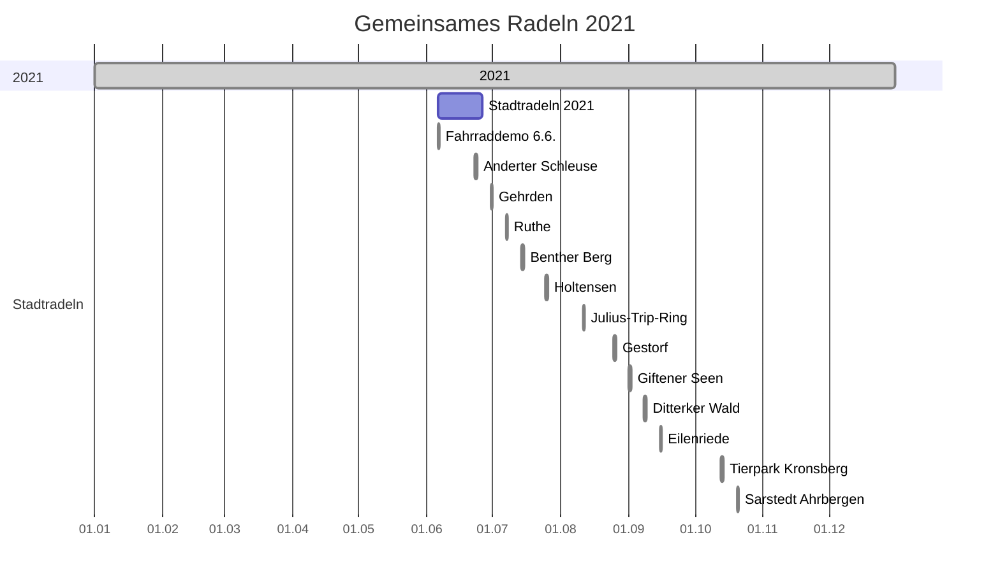

<script src="https://cdn.jsdelivr.net/npm/mermaid/dist/mermaid.min.js"></script>
<script>mermaid.initialize({startOnLoad:true});</script>

<iframe src="bannerSozi\bannerAnimated.sozi.html" width="100%" height="90" frameBorder="0">
    ADFC Banner
</iframe>

# [ADFC Hemmingen / Pattensen](https://adfc-hemmingen-pattensen.github.io/)
Eine Ortsgruppe des [ADFC's Region Hannover e.V](https://hannover-region.adfc.de/)

<div id="firstTable">
<table style="width:100%" >
<tbody>
  <tr>
    <td> <button style="background-color:#EE7F00; color:#FFFFFF" onclick="location.href='#rubriken'" type="button">Rubriken</button> </td>
    <td> <a href="#wer-sind-wir%3F">Über uns</a>
        <br> <a href="#adfc-fahrrad-selbsthilfewerkstatt-hemmingen">Fahrrad-Selbsthilfewerkstatt</a>
        <br> <a href="#mittwochstour"> Radtouren </a>
        <br> Verkehrspolitik <a href="#unsere-mängelkarte">Mängelkarte</a></td>
    <td rowspan="4" align="center"><br>Diese Seite</td>
  </tr>
  <tr>
    <td> <button style="background-color:#EE7F00; color:#FFFFFF" onclick="location.href='#aktuelles'" type="button">Aktuelles</button> </td>
    <td> <a href="#eilmeldung">Eilmeldungen</a>
    <br> Ankündigungen
    <br> <a href="#termine">Terminkalender</a>
  </tr>
  <tr>
    <td> <button style="background-color:#EE7F00; color:#FFFFFF" onclick="location.href='#artikel'" type="button">Artikel</button> </td>
    <td> <a href="#fahrradtouren-2021">Touren 2021</a> <br> Über Verkehrspolitik <br> Über "Dies & Das" </td>
  </tr>
  <tr>
    <td> <button style="background-color:#EE7F00; color:#FFFFFF" onclick="location.href='#footer'" type="button">Fußnote</button> </td>
    <td> <a href="#impressum">Impressum</a>
    <br> <a href="#mitgliedsschaft">Werde Mitglied</a>
    <br> <a href="#konto">Spendenkonto</a> </td>
  </tr>
</tbody>
</table>
</div>

<!-- =====================================================================
     Rubriken
     ===================================================================== -->
<table id="rubriken" style="width:100%" border="0" cellspacing="0" cellpadding="0">
  <tr>
    <td style="background-color:#EE7F00; color:#FFFFFF">Rubriken</td>
  </tr>
</table> 


## Wer sind wir?

Der ADFC Hemmingen Pattensen ([Allgemeiner Deutscher Fahrrad Club](https://www.adfc.de/)) engagiert für eine gute Fahrradinfrastruktur und ein fahrradfreundliches Klima. Erste Aktivitäten starteten 2013, seit Mai 2015 und mit mittlerweile rund 141 Mitglieder (Stand April 2021) und weiteren Ehrenamtlichen, engagiert sich der ADFC Hemmingen Pattensen offiziell in den beiden Städten für ...

<details>
  <summary>Klick hier für mehr Details!</summary>

Radverkehrspolitik
: Eine sichere und bessere Fahrradinfrastruktur

Öffentlichkeitsarbeit
: Mehr Bewusstsein, dass Fahrradfahren eine zentrale Säule der Verkehrswende ist 

Radtouren
: Touristisches Erleben der Region Hannover und darüber hinaus 

Fahrrad-Selbsthilfewerkstatt
: Eine kostengünstige Versorgung Bedürftiger und Geflüchteter mit Fahrrädern und Reparatur-Unterstützung in der Fahrrad-Selbsthilfewerkstatt (seit Nov. 2016). 

Diese vier zentralen Themenfelder werden in unser [PDF-Broschüre](pdf\190117 ADFC Hemmingen-Pattensen Profil.pdf) kurz vorgestellt.

**Gliederungen**

- [ADFC e.V.](https://www.adfc.de/)
  - [ADFC Niedersachsen](https://www.adfc-niedersachsen.de/)
    - [ADFC Hannover Region](https://hannover-region.adfc.de/)
      - ADFC Hemmingen
      - ADFC Pattensen

**ADFC Hemmingen Pattensen Neuzugänge**

| Jahr              | Neuzugänge |
|-------------------|------------|
| 2017              | 9          |
| 2018              | 10         |
| 2019              | 18         |
| 2020              | 23         |
| 2021 (Jan. - Mai) | 9          |


</details>

## ADFC Fahrrad-Selbsthilfewerkstatt-Hemmingen


<!-- **Die Fahrrad-Selbsthilfe-Werkstatt (FSW)** des ADFC Hemmingen/Pattensen in der Heinrich-Hertz-Straße 23 in Hemmingen hat jeden **Dienstag von 17:30 bis 19:00** geöffnet.-->

Die FSW bleibt wegen der Corona-Pandemie bis auf weiteres geschlossen. Wiedereröffnung wird dann kurzfristig mitgeteilt. Wenn sich die Entwicklung stabilisiert hat und eine reguläre Öffnung möglich wird, geben wir dies auf dieser Homepage und über die Tagespresse bekannt. Das Team und der ADFC Hemmingen Pattensen wünschen allen Radelnden so lange ein gesundes, pannenfreies Radfahren. Radfahren stärkt das Immunsystem und schützt das Klima! Für Fahrradspenden bitten wir um Nachricht unter der Mailadresse ✉ [Fahrrad-Selbsthilfewerkstatt-Hemmingen@web.de](mailto:Fahrrad-Selbsthilfewerkstatt-Hemmingen@web.de). Unsere Fahrrad-Selbsthilfe-Werkstatt [PDF-Broschüre](pdf\191017 ADFC Fahrrad-Selbsthilfe-Werkstatt Hemmingen.pdf).

<details>
  <summary>Weitere Services</summary>

In Hemmingen gibt es folgende Reparaturmöglichkeiten:

- [Zweirad Fachwerk](https://www.zweirad-fachwerk.de/) - Kapellenweg 6, Hemmingen
- Fahrrad-Selbsthilfewerkstatt - Heinrich-Hertz-Straße 23, Hemmingen
- Servicestation - Rathausplatz 1, Hemmingen
- Servicestation - EDEKA Ladage, Göttinger Str. 43, Arnum

### Spendenkonto

> IBAN: DE97 2509 0500 0000 9205 50,<br>
> BIC: GENODEF1S09 (Sparda Bank Hannover e.G.)<br>
> **Verwendungszweck: "ADFC Selbsthilfewerkstatt Hemmingen" und Anschrift (für eine Spendenbescheinigung)**

</details>

## Mittwochstour


Spontane, kostenlose Feierabendradtouren werden bei entsprechendem Wetter (Sommer) in der Regel Mittwochs angeboten. Die ADFC Ortsgruppe hat dafür eine E-Mail Liste angelegt. Wir melden uns, wenn es passt. Wer auf dieser Liste möchte, schreibe bitte an [j.spille@adfc-hannover.de](mailto:j.spille@adfc-hannover.de).

### Tourenkarten

- Tipps für Touren haben wir auf unsere [Tourenkarte](http://adfc-hemmingen-pattensen.github.io/Touren/) für Euch zusammen gestellt.
- Weitere ausgewählte Radtouren der Nachbar Ortsgruppen sind unter [ADFC Region Hannover Termine](https://www.adfc-hannover.de/termine/) zu finden.

### Hannah das ausleihbare Lastenrad

**Lasten zu groß? Keine Ausrede** Leihen Sie sich kostenlos ein Hannah Lastenrad unter <https://www.hannah-lastenrad.de/>. Hilfe, Fragen und Wünsche zur Hannah gibt unter [hallo@hannah-lastenrad.de](mailto:hallo@hannah-lastenrad.de).  

## Unsere Mängelkarte

[](https://adfc-hemmingen-pattensen.github.io/MaengelKarte/)

Gefährliche Querungen, Unfallschwerpunkte und Mängel auf Rad- und Fußwegen sammeln wir auf unserer Mängelkarte.

siehe [Mängelkarte für Hemmingen und Pattensen](https://adfc-hemmingen-pattensen.github.io/MaengelKarte/)

<div style="clear: both;"> </div>

<!-- =====================================================================
     Aktuelles
     ===================================================================== -->
<table id="aktuelles" style="width:100%" border="0" cellspacing="0" cellpadding="0">
  <tr>
    <td style="background-color:#EE7F00; color:#FFFFFF">Aktuelles</td>
  </tr>
</table>

## Eilmeldung
<div class="holder" style="width: 100%; height:400px; position:relative;">
<iframe width="100%" height="100%" src=https://hackmd.io/U-6kWHTpRAyp9glY_QNyKg?view" frameborder="1"></iframe>
<div style="position:absolute; top:2px; left:2px; width:100%; height:120px;"></div>
<div style="position:absolute; top:344px; left:2px; width:100%; height:58px;"></div>
</div>


## Ein Jahr zum Einstiegspreis 

Aktuell erhalten Sie für begrenzte Zeit unsere Jahresmitgliedschaft für nur 19,50 € (regulär 56 €) im ersten Jahr!  
Hier geht es zur [Anmeldung](https://www.adfc.de/sei-dabei/einstiegsmitgliedschaft).

<details>
  <summary>Klick hier für mehr Details!</summary>

Sie erhalten das komplette Vorteilpaket inklusive Pannenhilfe, Haftpflicht/Rechtsschutz und Radwelt-Magazin für 12 Monate. Das Angebot gilt auch für Familien- und Haushaltsmitgliedschaften (regulär 68 €). Voraussetzung für Familien- und Haushaltsmitgliedschaften ist ein gemeinsamer Wohnsitz. Die Mitgliedschaft wird unbefristet abgeschlossen, ist aber jederzeit ohne Frist zum Ende des laufenden Beitragsjahres kündbar.

Mit Ihrer Mitgliedschaft unterstützen Sie den ADFC in ganz Deutschland - für lebenswerte Städte und eine echte Verkehrswende mit dem Fahrrad im Mittelpunkt.

</details>

## Termine

<p>**<a href="https://teamup.com/ksju1rrabvbvttzec9">Vollbildanzeige</a>** - Ein Service von [Teamup Solutions AG in Zurich](https://www.teamup.com/)</p>

<div class="holder" style="width: 100%; height:500px; position:relative;">
<iframe width="100%" height="100%" src="https://teamup.com/ksju1rrabvbvttzec9" frameborder="1"></iframe>
</div>

<!-- =====================================================================
     Artikel
     ===================================================================== -->
<table id="artikel" style="width:100%" border="0" cellspacing="0" cellpadding="0">
  <tr>
    <td style="background-color:#EE7F00; color:#FFFFFF">Artikel</td>
  </tr>
</table> 

> Hier kommt eine kurze Übersicht der Themen, die uns in letzter Zeit beschäftigt haben. Solltet Ihr Euch zusätzliche Inhalte wünschen, oder wollt Ihr Lob oder Verbesserungspotential loswerden, dann freuen wir uns über einen kurzen Kommentar an <j.spille@adfc-hannover.de>.

# In Paris gilt Tempo 30

Tempo 30 ist jetzt die Regelgeschwindigkeit in Paris. Nach Madrid, Brüssel, Grenoble, Helsinky, Lille, Zürich und Barzelona folge nun auch Paris. Auf den Straßen von Paris gilt seit Ende August 2021 fast flächendeckend Tempo 30. Siehe auch [https://www.adfc.de/artikel/gute-gruende-fuer-tempo-30](https://www.adfc.de/artikel/gute-gruende-fuer-tempo-30).

# L389: Straßensperrung zwischen Hannover und Wilkenburg

Aufgrund einer Fahrbahn- und Radwegsanierung wurde vom 26. August bis zum 17. Dezenber 2021 die Wülfeler Straße vom Parkplatz an der Wülfeler Straße bis zur "Pferdeampel" am Ortseingang Wilkenburg voll gesperrt.
Eine Durchfahrt durch die Wülfeler Straße in diesem Bereich war für Radefahrende der L389 in der gesamten Bauzeit nicht möglich. Eine Umleitung über "Dorrieweg" und "Im Hammfeld" wurde ausgeschildert.

> 2021-08-26-Do.

# Wer soll Bürgermeisterin oder Bürgermeister von Hemmingen werden?

Wählen verändern die Welt, wenn die Wählenden es so wollen...

- Wie können wir mit den richtigen Wahlentscheidungen in Hemmingen erfolgreich den Radverkehr voranbringen?
- Wird sich mit einer:m neuen Bürgermeister:in etwas bewegen lassen?

Wahlprüfsteine sind ein bewährtes Mittel von den Kandidierenden zu erfahren, wie sie sich grundsätzlich und im Besonderen positionieren, was sie wollen und wie sie es umsetzen würden, wenn...ja wenn sie gewählt werden.

Der ADFC Hemmingen/ Pattensen hat darum 8 Schlüsselfragen an die Kandidierenden für das Amt der Bürgermeisterin des Bürgermeisters in Hemmingen verschickt. Mit Themen wie Tempo 30, Abstandsregeln beim Überholen, Komfort für Radfahrende, Sicherheit, Radwegeausbau, Unterstützung der Fahrrad-Selbsthilfewerkstatt, Stadtverkehrsentwicklung und Budget für Verbesserungen ist viel abgedeckt. Alle, Frau Dr. Schröder, Herr Dingeldey, Herr Grambeck und Herr Harder haben geantwortet. Die Antworten sind auf unserer Webseite des ADFC veröffentlicht:

- **Link zu den [Wahlprüfsteinen](https://adfc-hemmingen-pattensen.github.io/Wahlpruefsteine/index.html)**.

Dort können die Antworten von allen nachgelesen werden. Denn Wahl bedeutet ja Entscheidung treffen und Vertrauen auf die Inhalte und Personen setzen. Dazu hat der ADFC einen kleinen Baustein geliefert und es liegt an den Wählenden, sich daraufhin ihre Meinung zu bilden. Wir bleiben gespannt.


## MIT-DEM-RAD-ZUR-ARBEIT

Vom 01. Mai und bis 31. August lief die ADFC/AOK-Aktion Mit-dem-Rad-zur-Arbeit. Auch hier konnten alle mitmachen, es zählten aber nur die Kilometer zur und von der Arbeit.

Alle Informationen gab es auf <https://www.mit-dem-rad-zur-arbeit.de/niedersachsen/index.php>

## Fahrradtouren 2021



<details>
  <summary style="background-color: #eeeeee; width: 300px;
cursor: pointer;">Klick hier für mehr Details!</summary>


## Abendtour #12/21 2021-10-20-Mi.

Die 12. Radtour startete am Mittwoch den 20. Oktober mit 8 Radlern. Bei stürmischen Winden fuhren wir in die Leinemasch Richtung Rethen. Weiter ging es durch die Koldinger Seenplatte nach Ruthe. An der Innerste entlang ging es nach Saarstedt. Am Bruchgraben, einer sehr schönen Flusslandschaft fuhren wir weiter nach Ahrbergen. Zurück ging es wieder nach Sarstedt zu einem schönen Cafe. Nach einer kurzen Rast ging es dann zurück. Nach ca. 4 Std. und 43 km erreichten wir gut gelaunt Hemmingen.

<details>
  <summary style="background-color: #eeeeee; width: 300px;
cursor: pointer;">Klick hier für mehr Details!</summary>

<br>

Tourenziel       | Sarstedt Ahrbergen
---------------: | ----------------------- 
Datum            | 2021-10-20-Mi
Tourenrart       | Feierabend
Tourenleiter     | Günther Kleinod
Start            | Hemmingen Rathaus 13:00
Dauer [Stunden]  | ca. 4
Teilnehmerzahl   | 8
Tourenlänge [km] | 43
Wetter           | Wolkig und stürmisch
</details>

## Abendtour #11/21 2021-10-13-Mi.

Die 11. Radtour startete am Mittwoch den 13. Oktober mit 7 Radlern. Bei zeitweise leichtem Nieselregen war klar, möglichst viel im Wald zu fahren. Es ging durchs Ricklinger Holz zum Maschsee. Von dort weiter durch den Hermann Löns Park zum Tierpark. Nach einer kurzen Pause ging es wieder zum Kronsberg und durch die Leinemasch zurück. Nach ca. 2,5 Std. und 28 km erreichten wir, fast trocken, Hemmingen.

<details>
  <summary style="background-color: #eeeeee; width: 300px;
cursor: pointer;">Klick hier für mehr Details!</summary>

<br>

Tourenziel       | Tierpark Kronsberg
---------------: | ----------------------- 
Datum            | 2021-10-13-Mi
Tourenrart       | Feierabend
Tourenleiter     | Günther Kleinod
Start            | Hemmingen Rathaus 16:00
Dauer [Stunden]  | ca. 2,5
Teilnehmerzahl   | 7
Tourenlänge [km] | 28
Wetter           | regnerisch
</details>


<!-- Eingestellt am 16.09.2021 -->

## Abendtour #10/21 2021-09-15-Mi.

Die 7. Feierabend-Radtour startete am Mittwoch den 15. September mit 6 Radlern. Bei zeitweise leichtem Nieselregen war klar, möglichst viel im Wald zu fahren. Es ging durchs Ricklinger Holz zum Maschsee. Von dort in die Eilenriede, vorbei am Zoo, Seuerndieb. Nach einer kurzen Pause ging es wieder zum Machsee und in die Leinemasch. Nach ca. 2,5 Std. und 26 km erreichten wir, fast trocken, Hemmingen.

<details>
  <summary style="background-color: #eeeeee; width: 300px;
cursor: pointer;">Klick hier für mehr Details!</summary>

<br>

Tourenziel       | Maschsee, Eilenriede
---------------: | ----------------------- 
Datum            | 2021-09-26-Mi
Tourenrart       | Feierabend
Tourenleiter     | Günther Kleinod
Start            | Hemmingen Rathaus 16:00
Dauer [Stunden]  | ca. 2,5
Teilnehmerzahl   | 6
Tourenlänge [km] | 26
Wetter           | regnerisch
</details>

<!-- Eingestellt am 16.09.2021 -->

## Abendtour #09/21 2021-09-08-Mi

Die 9. Feierabend-Radtour ging am Mittwoch den 15. Sept. bei gutem Wetter über Wettbergen und Empelde zum Benther Berg. Wir sind gemütlich um die Nordseite geradelt, und dann ging es an Northen vorbei, an vielen Feldern entlang zum Ditterker Wald. Auf guten Wegen fuhren wir im dichten schattigen Wald. Nach einer kurzen Pause ging es nach Everloh. An Ronnenberg vorbei erreichten wir die Kückenmühle, mit anschliessender Einkehr. Nach ca. 3 Stunden, 35 km und einer schönen Fahrt waren wir wieder zurück in Hemmingen.

<details>
  <summary style="background-color: #eeeeee; width: 300px;
cursor: pointer;">Klick hier für mehr Details!</summary>

<br>

Tourenziel       | Benther Berg und Ditterker Wald
---------------: | -----------------------
Datum            | 2021-09-26-Mi
Tourenrart       | Feierabend
Tourenleiter     | Günther Kleinod
Start            | Hemmingen Rathaus 16:00
Dauer [Stunden]  | ca. 3
Teilnehmerzahl   | 11
Tourenlänge [km] | 35
Wetter           | heiter bis wolkig
</details>

## Abendtour 08/21 2021-09-01-Mi.

Die Fahrt ging mit 10 Radlern durch Harkenbleck, Koldingen und Ruthe. Nach einem kurzen Abstieg gelangt man an die Leine und kommt nach Schliekum. Wir fahren über die Leinebrücke und kommen zu den Giftener Seen. Der Rückweg führt uns über Sarstedt, mit Rast an der Eisdiele. Anschließend fahren wir an der Innerste entlang nach Ruthe und weiter nach Koldingen. Durch die Leinemasch fahren wir dann weiter und erreichten Hemmingen nach ca. 3 Std und 
34 km. 

<details>
  <summary style="background-color: #eeeeee; width: 300px;
cursor: pointer;">Klick hier für mehr Details!</summary>

<br>

Tourenziel       | Giftener Seen und Sarstedt
---------------: | ----------------------- 
Datum            | 2021-09-01-Mi
Tourenrart       | Feierabend
Tourenleiter     | Günther Kleinod
Start            | Hemmingen Rathaus 17:00
Dauer [Stunden]  | ca. 3 
Teilnehmerzahl   | 10
Tourenlänge [km] | 34
Wetter           | heiter bis wolkig
</details>

## Abendtour 07/21 2021-08-25-Mi.

Die 7. Feierabend-Radtour startete am Mittwoch den 25. August mit 12 Radlern ins Calenberger Land. Wir fuhren durch Pattensen und durch die Feldmark nach Oerie bis zum Oerier Wald. Dort machten wir die erste Rast. Weiter ging es durch Feld, Wiese und Wald nach Gestorf. Der Rückweg, auf dem wir ordentlichen Gegenwind hatten, ging auf einem schönen Feldweg nach Lüdersen und weiter, an den Feldern und Äckern vorbei, nach Hiddestorf. Über Ohlendorf und Devese erreichten wir nach ca. 3 Std
und 36 km Hemmingen

<details>
  <summary style="background-color: #eeeeee; width: 300px;
cursor: pointer;">Klick hier für mehr Details!</summary>

<br>

Tourenziel       | Calenberger Land nach Gestorf
---------------: | ----------------------- 
Datum            | 2021-08-25-Mi
Tourenrart       | Feierabend
Tourenleiter     | Günther
Start            | Hemmingen Rathaus 17:00
Dauer [Stunden]  | ca. 3
Teilnehmerzahl   | 12
Tourenlänge [km] | 36
Wetter           | heiter bis wolkig und windig

</details>

<!-- Eingestellt am 25.08.2021 -->

## Abendtour 06/21 2021-08-11-Mi.

Die 6. Feierabend-Radtour startete am Mittwoch den 11. August mit 14 Radlern zum Julius-Trip-Ring. Die Fahrt ging durch die Leinemasch zum Maschsee. Dort stiegen wir in den Julius-Trip-Ring ein. Weiter ging es durch die Eilenriede, am Pferdeturm vorbei zum Zoo. An Vier Grenzen überquerten wir die Podbi und fuhren auf den Pastor-Jäckel-Weg, Niedersachsenring und dem Hans-Meinecke-Weg nach Hainholz. 
Vorbei am Berggarten kamen wir zu den Herrenhäuser Gärten. Am Leibnitz Tempel machten wir eine kurze Rast. Auf der Dornröschenbrücke überquerten wir die Leineund fuhren dann an Leine und Ihme entlang zurück. Nach ca. 3 Stunden flotter und schöner Fahrt, fast immer im Grünen, erreichten wir nach 33 km Hemmingen.

<details>
  <summary style="background-color: #eeeeee; width: 300px;
cursor: pointer;">Klick hier für mehr Details!</summary>

<br>

Tourenziel       | Julius-Trip-Ring
---------------: | ----------------------- 
Datum            | 2021-08-11-Mi
Tourenrart       | Feierabend
Tourenleiter     | Günther
Start            | Hemmingen Rathaus 17:00
Dauer [Stunden]  | ca. 3
Teilnehmerzahl   | 14
Tourenlänge [km] | 33
Wetter           | heiter bis wolkig

</details>

<!-- Eingestellt am 25.08.2021 -->

## Abendtour 05/21 2021-07-25-Mi.

Die 5. Feierabend-Radtour startete am Mittwoch den 28. Juli mit 12 Radlern. Bei ca. 20° fuhren wir gen Westen nach Ihme-Roloven und Vörie. Auf dem Weg nach Holtensen bremste uns ein gesperrter Bahnübergang aus. Die ungeplante Verlängerung ging über Weetzen, an der Bahn entlang nach Lemmie. 
Über Sorsum ging es durch unbekannte Wege bis kurz vor Bredenbeck und dann kamen wir nach Holtensen. Es war ein schöner Umweg. An der Holtenser Kirche machten wir eine kurze Rast, bevor es über einen schönen Weg am Pastorenteich vorbeiging. Anschliessend fuhren wir auf den Vörier Berg, zum letzten verbliebenen Holtenser Windrad. Nach der Anstrengung hatten wir einen sehr schönen Rundumblick. Weiter fuhren wir dann durch Lüdersen nach Pattensen. 
Zurück ging es dann durch das Fuchsbachtal über Reden, Harkenbleck nach Hemmingen, das wir nach ca. 3 Std. und 32 km erreichten.
<details>
  <summary style="background-color: #eeeeee; width: 300px;
cursor: pointer;">Klick hier für mehr Details!</summary>

<br>

Tourenziel       | Holtensen, Vörier Berg
---------------: | ----------------------- 
Datum            | 2019-07-28-Mi
Tourenrart       | Feierabend
Tourenleiter     | Günther
Start            | Hemmingen Rathaus 16:00
Dauer [Stunden]  | ca. 3
Teilnehmerzahl   | 12
Tourenlänge [km] | 32
Wetter           | heiter bis wolkig

</details>

<!-- Eingestellt am 25.08.2021 -->

## Abendtour 04/21 2021-07-14-Mi.

Die 4. Feierabend-Radtour startete am Mittwoch den 14. Juli mit 11 Radlern bei gutem Wetter, und führte durch die Leinemasch, am Maschsee vorbei, an die Ihme bis zur Wasserstadt nach Limmer. Von da aus ging es weiter nach Ahlem, vorbei an der Gedenkstätte. Über Verlber, jetzt wieder auf dem Grünen Ring, kamen wir zum Benther Berg. Der Rückweg ging über Empelde, Wettbergen und Devese. 
Nach ca. 3 Stunden und 34 km kamen wir gut gelaunt in Hemmingen an.
<details>
  <summary style="background-color: #eeeeee; width: 300px;
cursor: pointer;">Klick hier für mehr Details!</summary>

<br>

Tourenziel       | Ihme, Ahlem, Benther Berg
---------------: | ----------------------- 
Datum            | 2021-07-14-Mi
Tourenrart       | Feierabend
Tourenleiter     | Günther
Start            | Hemmingen Rathaus 17:00
Dauer [Stunden]  | ca. 2 1/2
Teilnehmerzahl   | 11
Tourenlänge [km] | 34
Wetter           | heiter bis wolkig

</details>

## Abendtour #3/21   2021-07-07-Mi.

Die Fahrt ging mit 12 Radlern durch die Leinemasch, vorbei an Laatzen nach Rethen. Durch die Koldiger Seen zu einer Aussichtsplattform. Weiter ging es nach Ruthe mit einem kurzen Abstecher zum Zusammenfluss von Innerste und Leine mit einer kurzen, aber sonnigen Rast. Danach ging es in Ruthe einen steilen Abhang hinab und an der Leine nach Schliekum. Der Rückweg ging durch das Calenberger Land nach Pattensen direkt zu einer Eisdiele. Nach einer kurzen Pause fuhren wir durch das romantische Fuchsbachtal nach Reden, Harkenbleck und Wilkenburg. Nach einer schönen Fahrt holte uns am Ende doch noch der Regen ein. Wir erreichten Hemmingen nach ca. 34 km.

<details>
  <summary style="background-color: #eeeeee; width: 300px;
cursor: pointer;">Klick hier für mehr Details!</summary>

<br>
 
Tourenziel       | Ruthe
---------------: | ----------------------- 
Datum            | 2021-07-07-Mi
Tourenrart       | Feierabend
Tourenleiter     | Günther Kleinod
Start            | Hemmingen Rathaus 17:00
Dauer [Stunden]  | ca. 3
Teilnehmerzahl   | 7
Tourenlänge [km] | 34
Wetter           | Heiter bis wolkig mit etwas Regen


</details>

## Abendtour #2/21   2021-06-30-Mi.

Die 2. Feierabend-Radtour startete am Mittwoch den 30. Juni mit 7 Radlern. Bei dunklen Wolken und angekündigtem Regen fuhren wir gen Westen über Wettbergen nach Ronnenberg und weiter Richtung Gehrden. Anschliessend fuhren wir nach Lemmie und danach ging es am Bahndamm entlang nach Weetzen. Über Vörie ging es dann weiter nach Ihme-Roloven. An den Wasserbüffeln vorbei umfuhren wir Ihme-Roloven und dann ging es weiter durch das Bürgerholz nach Hemmingen, das wir nach ca. 2,5 Std. und 33 km, immer noch trocken, erreichten.

<details>
  <summary style="background-color: #eeeeee; width: 300px;
cursor: pointer;">Klick hier für mehr Details!</summary>

<br>
 
Tourenziel       | Gehrden
---------------: | ----------------------- 
Datum            | 2019-06-30-Mi
Tourenrart       | Feierabend
Tourenleiter     | Günther Kleinod
Start            | Hemmingen Rathaus 17:00
Dauer [Stunden]  | ca. 2 1/2
Teilnehmerzahl   | 7
Tourenlänge [km] | 33
Wetter           | Dunkle Wolken mit Regenankündigung


</details>


## Abendtour #1/21   2021-06-23-Mi.

Die 1. Feierabend-Radtour ging am Mittwoch den 23. Juni mit 13 Radlern (11 Herren und 2 Damen) bei gutem Wetter, durch das Ricklinger Holz, am Maschsee vorbei in die Eilenriede. Weiter ging es durch den Herrmann-Löns-Park mit der "Alten Mühle", einer Bockwindmühle, zur Anderter Schleuse. Nach einer kurzen Rast ging es auf den höchsten Punkt des Kronsbergs (118 m ü. NN). Die schöne Aussicht über Hannover, den Deister und die Hildesheimer Berge entschädigte für den letzten steilen Anstieg. Am Wiesendachhaus konnten wir noch einen schönen Zwischenstop einlegen. Nach ca. 3 Std. und 34 km erreichten wir wieder Hemmingen.

<details>
  <summary style="background-color: #eeeeee; width: 300px;
cursor: pointer;">Klick hier für mehr Details!</summary>

<br>
 
Tourenziel       | Anderter Schleuse u. Kronsberg
---------------: | ----------------------- 
Datum            | 2021-06-23-Mi
Tourenrart       | Feierabend
Tourenleiter     | Günther Kleinod
Start            | Hemmingen Rathaus 17:00
Dauer [Stunden]  | ca. 3
Teilnehmerzahl   | 13
Tourenlänge [km] | 34
Wetter           | heiter bis wolkig


</details>
</details>


## Polizei kontrolliert den Seitenabstand beim Überholen von Radfahrenden

Aus dem [Presseportal](https://www.presseportal.de/blaulicht/pm/66841/4972371) der Polizei:

> Die Fahrradstaffel der Polizei Hannover hat am Montagmorgen, 19.07.2021, im Berufsverkehr eine Kontrollstelle in der Wedekindstraße eingerichtet. Die Beamten hatten Autofahrende im Blick, die Radfahrende überholt haben. Dabei stellten sie auf einer kurzen Kontrollstrecke bei 33 Überholmanöver 17 Verstöße fest.
> ...
> Zur Stärkung des Radverkehrs wurden mit Wirkung vom 28.04.2020 verschiedene Neuerungen im Radverkehr eingeführt. ... Demnach müssen Kraftfahrzeugfahrende beim Überholen von zu Fuß Gehenden, Radfahrenden und Elektrokleinstfahrzeugführenden (z.B. E-Scooter) einen Mindestüberholabstand von 1,5 Meter innerorts und zwei Metern außerorts einhalten. Dieser Mindestabstand gilt auch bei separat geführten vorhandenen Radverkehrsanlagen.

> 

## Stadtradeln 2021


Beim Wettbewerb STADTRADELN traten die Hemminger und Pattenser 21 Tage in die Pedale für mehr Radförderung, Klimaschutz und Lebensqualität in unserer Kommune.

> vom 06. Juni bis 26. Juni 2021


<details>
  <summary>Klick hier für mehr Details!</summary>

Die Städte Hemmingen und Pattensen in der Region Hannover nahmen vom 06. Juni bis 26. Juni 2021 am STADTRADELN teil. Alle, die in den Städten in der Region Hannover wohnten, arbeiteten, einem Verein angehören oder eine (Hoch-)Schule besuchen, konnten beim STADTRADELN mitmachen.

Hier registrieren:

- Für Hemmingen: [https://www.stadtradeln.de/hemmingen](https://www.stadtradeln.de/hemmingen)
  - Das Team "ADFC Hemmingen" ist eingerichtet.
- Für Pattensen: [https://www.stadtradeln.de/pattensen](https://www.stadtradeln.de/pattensen)
  - Das Team "ADFC Pattensen" ist eingerichtet.

oder lade die [STADTRADELN-App](https://www.stadtradeln.de/app) herunter, um deine Strecken zu tracken.


---

Aufgrund der besonderen Situation mit vielfältigen Einschränkungen des öffentlichen Lebens wegen der Corona-Pandemie steht auch in diesem Jahr im Vordergrund, den Radverkehr in Hemmingen voranzubringen und viele Bürgerinnen und Bürger für die Vorteile des Radfahrens im Alltag zu gewinnen. Die Stadt Hemmingen führt die Aktion gemeinsam mit dem ADFC Hemmingen Pattensen durch.

Dennoch wollen wir natürlich auch dem Wettbewerbsgedanken folgen und in diesem Jahr wieder einen der vorderen Plätze im Regionsranking erringen. Das Stadtradeln beginnt am Sonntag, dem 06. Juni 2021 und endet am 26. Juni 2021. Beim Stadtradeln sollen sich auch diesmal Teams bilden und möglichst viele Kilometer beruflich sowie privat mit dem Fahrrad zurücklegen, natürlich unter Beachtung der dann aktuell geltenden Corona-Hygieneregeln und Kontaktbeschränkungen. Bitte beachten Sie diese bei gemeinsamen Fahrten, denn wir möchten vermeiden, dass es ausgerechnet bei gemeinsamen Radtouren zu Ansteckungen kommt.

Im Online-Radelkalender auf [www.stadtradeln.de](www.stadtradeln.de) können sich die Teams und Radelnde registrieren und die gefahrenen Kilometer dann eintragen. Gesucht wird Deutschlands fahrradaktivste Kommune mit den meisten Radkilometern (absolut) sowie mit den meisten Radkilometern pro EinwohnerIn (Durchschnittswert).

Und so machen sie mit:

- Registrieren sie sich für das STADTRADELN auf der Seite www.stadtradeln.de und radeln gemeinsam mit uns für ein gutes Klima.
- Gründen Sie mit Ihrer Familie, Ihren Nachbarn, Ihren Freunden oder ArbeitskollegInnen ein Team oder schließen Sie sich einem bestehenden Team an.
- Sammeln Sie alle Rad-Kilometer entweder auf der Stadtradel-Webseite oder in der Stadtradel-App.
- Ob Sie langsam oder schnell fahren, zum Einkaufen oder zur Arbeit oder in der Freizeit unterwegs sind. Die Herausforderung ist, 3 Wochen lang möglichst viel mit dem Fahrrad zu fahren und die Kilometer online einzutragen oder die Stadtradeln-App benutzen und die Kilometer automatisch erfassen.
- Natürlich dürfen und sollen Sie gerne auch nach dem Stadtradeln weiter das Rad benutzen, wo immer es geht.

Jeder einzelne Kilometer von Ihnen bringt Sie, Ihr Team, die Stadt Hemmingen und den Klimaschutz voran!

Anregungen für interessante Touren und Fahrradaktivitäten findet man über die kostenlose Fahrrad-App „Bike Citizens“ der Region Hannover. Dort stehen bereits jetzt die Routen der fast 1.000 Kilometer langen FAHRRADREGION Hannover zum Nachradeln zur Verfügung. Darüber hinaus hilft die App der Region Hannover bei der Radwegplanung, da Schwachstellen durch das Sammeln der anonymisierten Daten identifiziert werden können und bessere Daten für die Radwegplanung zur Verfügung stehen.

Hier finden Sie die App:  

- Apple AppStore: [https://itunes.apple.com/de/app/bike-citizens-fahrrad-navi/id517332958?mt=8](https://itunes.apple.com/de/app/bike-citizens-fahrrad-navi/id517332958?mt=8)
- Google PlayStore:   [https://play.google.com/store/apps/details?id=org.bikecityguide](https://play.google.com/store/apps/details?id=org.bikecityguide)

Weitere Informationen finden Sie auf der Homepage der Region Hannover unter

[https://www.hannover.de/Leben-in-der-Region-Hannover/Umwelt-Nachhaltigkeit/Klimaschutz-Energie/Klimaschutzregion-Hannover/Aktivitäten-der-Region-Hannover/Mobilität/Kostenlose-Fahrrad-App](https://www.hannover.de/Leben-in-der-Region-Hannover/Umwelt-Nachhaltigkeit/Klimaschutz-Energie/Klimaschutzregion-Hannover/Aktivitäten-der-Region-Hannover/Mobilität/Kostenlose-Fahrrad-App).

</details>

## Ortsdurchfahrt Hiddestorf: Land hebt 27 Jahre alte Tempo-Bremse auf

Auslöser für die Prüfung durch das Verkehrsministerium war eine von der Niedersächsischen Landesbehörde für Straßenbau und Verkehr (NLStBV) abgelehnte Förderung für den Neubau der Brücke über die Arnumer Landwehr im Zuge der K 226. Wegen der geltenden Geschwindigkeitsbegrenzung in Hiddestorf seien die Voraussetzungen dafür nicht mehr gegeben. Der ADFC ist gegen die Erhöhung der Geschwindigkeit. Eine Erhöhung der Geschwindigkeit erhöht sowohl die Unfallgefahr als auch das Sicherheitsgefühl. 

> 10.06.2021

## Technische Sachbearbeitung für Planung von Radverkehrsanlagen (m/w/d)

<!-- 29. Mai 2021 bis Bewerbungsfrist: 20.06.2021 -->

Die Entwicklung der Radverkehrsanlagen liegt Ihnen am Herzen und Sie möchten einen großen Beitrag für die Allgemeinheit der Stadt Langenhagen leisten? Dann bewerben Sie sich gerne in Langenhagen!

Infos unter [www.arbeiten-in-langenhagen.de](https://www.arbeiten-in-langenhagen.de/bewerbung/beschreibung-900000235-30890.html). Bewerbungsfrist: 20.06.2021.

## Tour de Verkehrswende – wir bringen Paris nach Berlin

<!-- 29. Mai 2021  -->

> In 11 Etappen mit dem Rad durch Deutschland

Vom 22. August bis zum 2. September zeigen Aktivist\*innen von Changing Cities mit einer Fahrraddemo von Essen nach Berlin, dass die Verkehrswende möglich und machbar ist. Als Teil der bundesweiten Protestaktion Ohne Kerosin nach Berlin werden Hunderte von Radfahrer\*innen in Deutschland unterwegs sein. 

<details>
  <summary>Klick hier für mehr Details!</summary>

Pünktlich zum Bundestagswahlkampf 2021 fahren wir in 11 Etappen mit dem Rad nach Berlin und setzen die Themen Mobilität und Klimaschutz auf die bundespolitische Agenda. Die „Tour de Verkehrswende“ fährt unter dem Motto „Wir bringen Paris nach Berlin“, denn die Politik der pariser Bürgermeisterin Anne Hidalgo zeigt: Die klima- und menschenfreundliche Verkehrswende ist politisch möglich und praktisch umsetzbar. Seit 2014 wird die französische Hauptstadt in großen Teilen nachhaltig umgestaltet. Um die Feinstaub- und Lärmbelastung zu reduzieren und die Lebensqualität der Menschen zu verbessern, wird der Ausbau von Fuß- und Radwegen deutlich vorangetrieben und große Bereiche des Zentrums für Menschen geöffnet und für den Autoverkehr gesperrt. 

„Auch für deutsche Städte und Gemeinden fordern wir einen solchen Strukturwandel in der Mobilitätspolitik. Weil die Zukunft dem Fuß- und Radverkehr sowie dem ÖPNV gehört. Denn auch in Deutschland gilt: Mit dem Fahrrad lassen sich Wahlen gewinnen,” sagt Ragnhild Sørensen von Changing Cities.

Die Forderungen der #TourDeVerkehrswende an die nächste Bundesregierung

1) Vorrang des Umweltverbundes: Grundlegende Flächenumverteilung mit Ausbau des ÖPNV und des bundesweiten Fuß- und Radverkehrsnetzes
2) Klare, konsequente und sofortige Maßnahmen zur deutlichen Reduktion des motorisierten Individualverkehrs (MIV). Ziel: Halbierung der Kfz bis 2030. 
3) Sofortiger und konsequenter Abbau der finanziellen und gesetzlichen Privilegien für den MIV
4) Moratorium für den Bundesverkehrswegeplan

Die 600 km lange Tour trägt die Pariser Botschaft auch durch Städte, die Fuß- und Radentscheide auf die Beine gestellt haben. Entlang der Strecke gibt es Treffen mit Initiativen, Organisationen, und Politiker\*innen, denen eine klimaverträgliche Verkehrswende ein Anliegen ist. Im Fokus steht der Austausch mit Menschen, die von den Fehlern und Versäumnissen der Verkehrspolitik am stärksten betroffen sind. An den Etappenzielen werden gemeinsam mit Unterstützer\*innen Aktionen zur Klima- und Verkehrswende stattfinden.

Aufgrund der Pandemie-Lage wird es ein umfassendes Hygienekonzept geben. Alle Veranstaltungen, sowie Übernachtungen finden draußen und mit Abstand und Maske statt.

```
ROUTE

Die Etappen der #TourDeVerkehrswende im August 2021:
22.8. Essen – Marl – Haltern am See (40 km)
23.8. Haltern am See – Dülmen – Münster (45 km)
24.8. Münster – Bielefeld (75 km)
25.8. Bielefeld – Rinteln (50 km)
26.8. Rinteln – Hannover (60 km)
28.8. Hannover – Braunschweig (70 km)
29.8. Braunschweig – Helmstedt (40 km)
30.8. Helmstedt – Magdeburg (50 km)
31.8. Magdeburg – Brandenburg an der Havel (85 km)
1.9. Brandenburg an der Havel – Werder – Potsdam (65 km)
2.9. Potsdam – Berlin (35 km)
```

</details>

## Fahrradhelm

**Tragen Sie grundsätzlich einen Helm**, wenn sie im Straßenverkehr fahren? 

Besser ist es. Eine Untersuchung der Deutschen Gesellschaft für Unfallchirurgie ergab 2017, dass es bei rund 25 Prozent aller Fahrradunfälle Kopfverletzungen gibt. 


## Verkehrsrecht für Radfahrende 

Das Fahrrad ist ein Fahrzeug – und Radfahrende sind Fahrzeugführende mit allen Rechten und Pflichten. Deshalb gelten zunächst die allgemeinen Regeln für den Fahrzeugverkehr. Auf diese Regeln geht der folgende Beitrag nur ein, wenn sie besondere Bedeutung für Radfahrende haben. Außerdem enthält die Straßenverkehrs-Ordnung (StVO) Vorschriften speziell für den Radverkehr. Um diese Vorschriften, ihre Beachtung und mögliche Konflikte soll es hier vor allem gehen.

[Verkehrsrecht_fuer_Radfahrende als PDF](pdf/Verkehrsrecht_fuer_Radfahrende_6.20-1.pdf)

### Video zum neuen Verkehrsrecht

ARD hr-Fernsehen [Sicherheit auf Radwegen - was bringen die neuen Regeln](https://www.ardmediathek.de/ard/video/alles-wissen/sicherheit-auf-radwegen-was-bringen-die-neuen-regeln/hr-fernsehen/Y3JpZDovL2hyLW9ubGluZS8xMDg2MDY/)

## Sei kein Geisterradler


Nach einer Studie der Bundesanstalt für Straßenwesen (BASt 2015) fahren bis zu 20 % der Rad fahrenden auf Radwegen entgegen der vorgesehenen Fahrtrichtung. Dieses sogenannte „Geisterradeln“, also das regelwidrige Linksfahren, gehört zu den Hauptursachen der Unfälle, die durch den Radverkehr selbst verursacht werden.

[https://www.geisterradeln.de/](https://www.geisterradeln.de/)

## Stärkung des Radverkehrs

<!-- 2019-08-15-Do.-->
StVO Novelle. Das Bundesministerium für Verkehr und digitale Infrastruktur plant eine [Stärkung des Radverkehrs](https://www.bmvi.de/SharedDocs/DE/Artikel/StV/stvo-novelle.html).

Unter anderem: Mindestüberholabstand, Einschränkungen für rechtsabbiegende Kraftfahrzeuge, Haltverbot auf Schutzstreifen, Klarstellung zum Nebeneinanderfahren, ...

<details>
  <summary>**Klick hier für 12 Änderungen für Radfahrende!**</summary>

1. Mindestüberholabstand für Kfz: Es wird ein **Mindestüberholabstand von 1,5 m innerorts und von 2 m außerorts** für das Überholen von zu Fuß Gehenden, Radfahrenden und Elektrokleinstfahrzeugführenden durch Kraftfahrzeuge **festgeschrieben**. Bisher schreibt die StVO lediglich einen „ausreichenden Seitenabstand“ vor.
Schrittgeschwindigkeit für rechtsabbiegende Kraftfahrzeuge über 3,5 t

1. Für rechtsabbiegende Kraftfahrzeuge über 3,5 t soll aus Gründen der Verkehrssicherheit innerorts Schrittgeschwindigkeit (7 bis 11 km/h) vorgeschrieben werden. Verstöße können künftig mit einem Bußgeld in Höhe von 70 Euro sanktioniert werden. Zudem wird ein Punkt im Fahreignungsregister eingetragen.
Grünpfeil ausschließlich für Radfahrer

1. Mit der StVO-Novelle wird die bestehende Grünpfeilregelung auch auf Radfahrer ausgedehnt, die aus einem Radfahrstreifen oder baulich angelegten Radweg heraus rechts abbiegen wollen. Außerdem wird ein gesonderter Grünpfeil, der allein für Radfahrer gilt, eingeführt.

1. **Generelles Haltverbot auf Schutzstreifen**: Schutzstreifen für den Radverkehr trennen den Rad- und den Autoverkehr mit einer gestrichelten weißen Linie (Zeichen 295 der StVO). Autos dürfen dort zwar nicht parken, aber bislang noch bis zu drei Minuten halten. Dies führt vielfach dazu, dass die Radfahrenden Schutzstreifen nicht durchgängig nutzen können, weil ihnen haltende Autos den Weg versperren. Deshalb wollen wir dort ein generelles Haltverbot einführen.
Einrichtung von Fahrradzonen

1. Analog zu den Tempo 30-Zonen sollen in Zukunft auch Fahrradzonen angeordnet werden können. Die Regelung soll sich an den Regeln für Fahrradstraßen orientieren: Für den Fahrverkehr gilt eine Höchstgeschwindigkeit von 30 km/h. Der Radverkehr darf weder gefährdet noch behindert werden. Auch Elektrokleinstfahrzeuge sollen hier künftig fahren dürfen.

1. Klarstellung zum Nebeneinanderfahren von Radfahrenden: **Das Nebeneinanderfahren von Radfahrenden ist ausdrücklich erlaubt, wenn der Verkehr dadurch nicht behindert wird**. Die bisherige Formulierung in der StVO stellt das Hintereinanderfahren in den Vordergrund und kann daher missverstanden werden.

1. Ausweitung des Parkverbots vor Kreuzungen und Einmündungsbereichen: Das Parken vor Kreuzungen und Einmündungen soll in einem Abstand von bis zu je 8 m von den Schnittpunkten der Fahrbahnkanten oder bis zu je 5 m vom Beginn der Eckausrundung verboten werden, wenn ein straßenbegleitenderbaulicher Radweg vorhanden ist, der als benutzungspflichtig oder mit Radsinnbildgekennzeichnet ist. Hierdurch soll die Sicht zwischen Straße und Radweg verbessert und dadurch die Sicherheit von Radfahrenden erhöht werden.

1. Vereinfachung für Lastenfahrräder: Um speziell für Lastenfahrräder Parkflächen und Ladezonen vorhalten zu können, führen wir ein spezielles Sinnbild „Lastenfahrrad“ ein, das die zuständigen Straßenverkehrsbehörden nutzen können.

1. Verkehrszeichen Radschnellwege: Das Verkehrszeichen „Radschnellweg“ soll in die StVO aufgenommen werden, um die Kennzeichnung von Radschnellwegen auch unabhängig von der Fahrbahnbeschaffenheit wie z. B. auf sandigem Untergrund möglich zu machen.

1. Überholverbot von Radfahrenden: Mit der Einführung eines neuen Verkehrszeichens sollen die zuständigen Straßenverkehrsbehörden in Zukunft ein Überholverbot von einspurigen Fahrzeugen (u. a. Fahrrädern) für mehrspurige Kraftfahrzeuge z. B. an Engstellen anordnen können.  


1. Erweiterung der Erprobungsklausel: Die bestehende Klausel für zeitlich und örtlich begrenzte Anordnungen zur Erprobung verkehrsregelnder oder sichernder Maßnahmen soll künftig unabhängig von einer Gefahrenlage Modellversuche ermöglichen, um den Handlungsspielraum der zuständigen Straßenverkehrsbehörden zu erweitern. Solche Modellversuche sollen im Einvernehmen mit den Kommunen angeordnet werden. Damit wird auch die Mitbestimmung der Kommunen gestärkt. Eine weitergehende Öffnung des Straßenverkehrsrechts für Verkehrsversuche bedarf einer Änderung auf Gesetzesebene, die in einem weiteren Schritt im nächsten Jahr angegangen werden soll.

1. Vermehrte Öffnung von Einbahnstraßen für Radfahrende in Gegenrichtung: Durch die Änderung der Allgemeinen Verwaltungsvorschrift zur StVO sollen die zuständigen Straßenverkehrsbehörden verstärkt zur Prüfung der Öffnungsmöglichkeit von Einbahnstraßen in Gegenrichtung für Radfahrende veranlasst und die Zahl der in Gegenrichtung freigegebenen Einbahnstraßen dadurch vergrößert werden.

</details>

## Unfallorte mit Fahrradbeteiligung in Hemmingen 2020


Die Grafik zeigt **Unfallorte mit Fahrradbeteiligung** in Hemmingen 2020 aus dem Unfallatlas <https://www.statistikportal.de/de/karten/unfallatlas>. Nächste Aktualisierung: Juli 2022.

**Aktuell**: Die HAZ hat am 17.05.2021 berichtet, dass im Bereich des Kommissariats Ronnenberg sich die Zahl der Unfälle mit Radfahrern 2020 verdoppelt hat.

> Zitat: "Auffällig in der jetzt vorgelegten Unfallstatistik ist, dass die Zahl der beteiligten Radfahrer sich mehr als verdoppelt hat: von 68 im Jahr 2019 auf 139. Nur 21 Radler blieben unbeschadet. 93 verletzten sich leicht, 25 Radfahrer sogar schwer."

Das PK Ronnenberg umfasst die Gemeinden: Wennigsen, Gehrden, Empelde, Ronnenberg und Hemmingen Arnum.


## Wir drehten am Rad 

EDEKA Minden-Hannover bot im Aktionszeitraum vom 10.05. bis 22.05.2021 ab einem Einkauf von 25€ eine vergünstigte ADFC Mitgliedschaft.

## Online-Vorstellung der erarbeiteten Hemminger Alltags-Radrouten

Dienstag, 23. März, von 18.30 Uhr bis ca. 20.00

**Gesucht waren 2020 - Radwege für Frauen, Männer, Familien, Jugendliche**  
*Für all die Fahrräder, Fixies, Anhänger, Lastenräder, Pedelecs…*  
Gefunden wurden die Hemminger Alltagsrouten!!!

Was ist aus den vielen Vorschlägen geworden, die vor einem Jahr im Bürgersaal zusammengetragen wurden? Der ADFC hat daraus eine Radwegestruktur ausgearbeitet und in der AG Radverkehr des Stadtrates vorgestellt. 

<details>
  <summary>Klick hier für mehr Details!</summary>

Dazu gab es unterschiedliche Budget-Vorschläge von der Verwaltung und vom ADFC für den städtischen Haushalt 2021. In einer Online-Veranstaltung haben wir diese Alltagsrouten allen Interessierten vorstellen und das weitere Vorgehen diskutieren. Jetzt ist wieder die Unterstützung aller Radbegeisterten zur Umsetzung gefragt: Es geht um die Verkehrswende und in den städtischen Haushaltsberatungen und um das dazu erforderliche Geld.

Zu userer [Mängelkarte für Hemmingen und Pattensen](#unsere-mängelkarte)
[](https://adfc-hemmingen-pattensen.github.io/MaengelKarte/)

</details>

## ＡＤＦＣ🚲 Fahrradklima-Test 2020 Ergebnisse

> 16.3.2021
> [https://fahrradklima-test.adfc.de/](https://fahrradklima-test.adfc.de/)

Die Fahrradklima-Test 2020 Ergebnisse liegen vor. Zu finden unter [https://fahrradklima-test.adfc.de/ergebnisse](https://fahrradklima-test.adfc.de/ergebnisse).

- Hannover hat die Note 3.7 und damit Range 2 von 14 mit unter einer Ortsgröße > 500.000 Einwohnern.
- Hemmingen hat auch die Note 3.7 und damit Range 134 von 418 mit unter einer Ortsgröße < 20.000 Einwohnern.
- Pattensen hat die Note 4.1 und damit Range 315 von 418 mit unter einer Ortsgröße < 20.000 Einwohnern.

## K 225 wird nach 115 Jahren wieder Feldweg

Zum HAZ Artikel vom 2.3.2021.

Nein, es wird kein Feldweg wie vor 115 Jahren. Beim Rückbau handelt es sich um eine Folgemaßnahme des Baus der B3neu durch die Straßenbauverwaltung des Landes Niedersachsen. Im Abschnitt zwischen dem Gertrud-Kochanowski-Weg in Devese und der Zufahrt zum Cafe Webstuhl wird die K 225 entsprechend des Planfeststellungsbeschlusses für den Bau der B3neu auf eine Breite von 3 m zurückgebaut. Die verbleibende Fläche wird nicht entsiegelt, sondern bleibt, wie sie ist. Im Abschnitt von Ohlendorf bis zum Cafe Webstuhl wir die K 225 auf eine Breite von 4,75 m zurückgebaut, da hier nicht nur landwirtschaftlicher Verkehr und Radfahrer und Fußgänger zugelassen sind, sondern auch Anliegerverkehr zum Cafe Webstuhl, dem dort befindlichen Freizeitparkplatz und dem Waldkindergarten.

> Aktualisierung 17.06.2021

Der Rückbau wird sichbar. Mit Ausweichbuchten für große Fahrzeuge.


## L 389 - Quelle: HAZ Leine 9.3.2021

Die Landesstraße L 389 zwischen der Wilkenburger Spinne und der Ihmener Straße in Hiddestorf soll in den nächsten Jahren saniert werden. Die Stadt Hemmingen plant eine Vereinbarung mit dem Land. Zur Verkehrsberuhigung soll es in den Arnumer Ortsausfahren Querungshifen geben. In Wilkenburg könnte der höhengleiche Gehweg zu einem Hochbord ausgebaut werden. Weiterhin ist ein Umbau der gefährlichen Wilkenburger Spinne im Gespräch. Der Radweg zwischen der Spinne und Wilkenburg könnte noch dieses Jahr beginnen. Die Straßensanierung in Hiddestorf ist erst für 2023 angedacht. 

Der ADFC setzt sich dafür ein, dass die AG-Radverkehr an den Planungen beteiligt wird.

## Entlastungsstraße B3 alt

> 12.3.2021 [https://www.stadthemmingen.de/allris/vo020.asp?VOLFDNR=1487](https://www.stadthemmingen.de/allris/vo020.asp?VOLFDNR=1487)  
> 16.3.2021 HAZ Artikel im Hemminger Teil "Stadt will Alfred-Bentz-Straße verlängern."

Die geplante Entlastungsstraße zwischen der B3alt (südlich Glende) und der Alfred-Bentz-Straße (am Spielplatz) soll, wenn alles gut läuft, auf der nördlichen Straßenseite einen 3 Meter breiten Zweirichtungsrad- und Gehweg erhalten.


## Touren 2020

Trotz Corona konnten wir einige Touren anbieten.


<details>
  <summary>Unsere Touren 2020! Klick hier</summary>

## Abendtour 5/20 2020-10-07-Mi.

Die 5. Feierabend-Radtour startete am Mittwoch, dem 07. Oktober mit 11 Radlern bei nicht so schönem Wetter. Über Wilkenburg, Harkenbleck fuhren wir nach Koldingen, wo wir die Pattenser Radler trafen. Weiter ging es an den Koldinger Teichen vorbei nach Sarstedt. Am Wehr erreichten wir den idyllischen Willi-Jädtke-Weg und fuhren weiter nach Ahrbergen Richtung Giesen. Zurück ging es zu den Giftener Teichen und weiter nach Schliekum. Von dort fuhren wir bei leichtem Regen durchs Calenberger Land nach Pattensen und Arnum. 
 
Nach ca. 36 km und 3 Std. erreichten wir Hemmingen.

<details>
  <summary>Klick hier für mehr Details!</summary>

Tourenziel       | Ruthe, Sarstedt, Ahrbergen
---------------: | ----------------------- 
Datum            | 2020-10-07-Mi
Tourenrart       | Feierabend
Tourenleiter     | Helmut, Günther
Start            | Hemmingen Rathaus 15:00
Dauer [Stunden]  | ca. 3
Teilnehmerzahl   | 11
Tourenlänge [km] | 36
Wetter           | zeitweise regnerisch

</details>

## Abendtour 04/20 2020-09-29-Mi.
 
Die 4. Feierabend-Radtour startete am Mittwoch, dem 29. September mit 14 Radlern. Bei gutem Wetter fuhren wir gen Westen nach Ihme-Roloven, vorbei an Ronnenberg und weiter nach Gehrden. In Gehrden ging es ein kurzes Stück steil bergauf, da durfte man schon mal schieben. Oben angekommen, umrundeten wir den Gehrdener Berg. Nach einer kurzen Rast, mit sehr guter Fernsicht ging es wieder bergab. Zurück ging es, entlang der Bahn nach Weetzen. Über Vörie, Ihme Roloven und Devese ging es zurück nach Hemmingen, das wir nach ca. 3 Std. und 34 km erreichten.

<details>
  <summary>Klick hier für mehr Details!</summary>

Tourenziel       | Gehrdener Berg
---------------: | ----------------------- 
Datum            | 2020-09-29-Mi
Tourenrart       | Feierabend
Tourenleiter     | Günther
Start            | Hemmingen Rathaus 16:00
Dauer [Stunden]  | ca. 3
Teilnehmerzahl   | 14
Tourenlänge [km] | 34
Wetter           | heiter bis wolkig

</details>

## Abendtour 3/20 2020-09-09-Mi.

Die 3. Feierabend-Radtour startete am Mittwoch, dem 09. September mit 9 Radlern bei nicht so schönem Wetter.  Über Wilkenburg, Harkenbleck und Reden fuhren wir ins Fuchsbachtal. Dort konnten wir die "Arbeit" des Bibers bestaunen. Weiter ging es nach Koldingen zu den Koldinger Teichen. In Ruthe erreichten wir die Innerste und fuhren an ihr entlang bis Sarstedt. Dort legten wir eine kurze Rast ein, bevor wir den Rückweg antraten. Zurück ging es wieder über Ruthe, vorbei an der geophysikalischen Versuchsanstalt GEO 600, Koldingen, Harkenbleck nach Hemmingen. Trotz teilweise leichtem Nieselregen hatten wir eine schöne, ca. 35 km lange Fahrt.
 
<details>
  <summary>Klick hier für mehr Details!</summary>

Tourenziel       | Ruthe, Sarstedt
---------------: | ----------------------- 
Datum            | 2020-09-09-Mi
Tourenrart       | Feierabend
Tourenleiter     | Günther
Start            | Hemmingen Rathaus 17:00
Dauer [Stunden]  | ca. 3
Teilnehmerzahl   | 9
Tourenlänge [km] | 35
Wetter           | zeitweise regnerisch

</details>

## Abendtour 2/20 2020-09-02-Mi.
 
Die 2. Feierabend-Radtour startete am Mittwoch, dem 02. September mit 11 Radlern bei schönem Wetter. Durch die Leinemasch erreichten wir Rethen und fuhren auf einem idyllischen Radweg entlang der Bruchriede. Vorbei am Erbenholz ging es weiter zum Bockemer Holz mit seinen sehr schönen Waldwegen. Über den Kronsberg ging es zurück nach Laatzen und wieder in die Leinemasch. Nach einem kurzweiligen Stop im Laatzener Grasdachhaus fuhren wir weiter und erreichten nach ca. 3 Stunden flotter und schöner Fahrt und ca. 32 km Hemmingen.

<details>
  <summary>Klick hier für mehr Details!</summary>

Tourenziel       | Rethen, Bockemer Holz
---------------: | ----------------------- 
Datum            | 2020-09-02-Mi
Tourenrart       | Feierabend
Tourenleiter     | Günther
Start            | Hemmingen Rathaus 17:00
Dauer [Stunden]  | ca. 3
Teilnehmerzahl   | 11
Tourenlänge [km] | 32
Wetter           | heiter bis wolkig

</details>


## Abendtour 1/20 2020-08-19-Mi.
 
Die 1. Feierabend-Radtour startete am Mittwoch, dem 19. August mit 9 Radlern bei gutem Wetter, und führte streckenweise über den Grünen Ring. Wir überquerten die neue B3 und fuhren durch Wettbergen nach Empelde. Mit einer leichten Steigung ging es zum Benther Berg. Von dort radelten wir weiter, direkt am Wald entlang, bis nach Velber und weiter zu der Gedenkstätte nach Ahlem. Danach erreichten wir den Mittellandkanal und fuhren weiter am Stichkanal entlang. An der Wasserkunst vorbei erreichten wir die Ihme und gelangten zu den Ricklinger Teichen. Nach ca. 2 1/2 Stunden und 32 km kamen wir gut gelaunt in Hemmingen an. Die Tour beendeten wir in einem Biergarten.

<details>
  <summary>Klick hier für mehr Details!</summary>

Tourenziel       | Benthe, Velber und Ahlem
---------------: | ----------------------- 
Datum            | 2020-08-19-Mi
Tourenrart       | Feierabend
Tourenleiter     | Günther
Start            | Hemmingen Rathaus 18:00
Dauer [Stunden]  | ca. 2 1/2
Teilnehmerzahl   | 9
Tourenlänge [km] | 32
Wetter           | heiter bis wolkig

</details>

## Tagestour 2020

Die Tour durchs grüne Hannover zum Wietzesee startete bei herrlichem Wetter am Rathausplatz in Hemmingen und führte uns durchs Ricklinger Holz zu den Ricklinger Seen. An der Ihme fuhren wir entlang bis zur Einmündung der Leine.

Von dort geht es in den Herrenhauser Garten zum Leibnitztempel. Am Berggarten vorbei fuhren wir weiter auf dem Julius-Trip-Ring, den wir in der List Richtung Norden verliessen. Den Mittellandkanal überquerten wir beim Lister Bad und erreichten den Silbersee. An der Pferderennbahn Neue Bult vorbei kamen wir an die Wietze und wenig später zum Hufeisensee. Der Biergarten und der Sandstrand luden zum Picknick ein. Nach einer kurzweiligen Pause fuhren wir weiter zum Wietzesee, nach Hainhaus und durch einen Golfplatz.  Kurz vor dem Waldkater verliessen wir die Wietze und bogen nach Osten Richtung Isernhagen ab. Durch die Felder der Isernhagener Bauernschaften mit einer kurzen Steigung ging es weiter bis nach Altwarmbüchen. Am Altwarmbüchener See hatten wir uns die 2. Pause verdient. Anschließend ging es durchs Misburger Holz zum Mittellandkanal. Nach einer kurzen Fahrt am Kanal entlang bogen wir ab und fuhren durch eine Kleingartenkolonie, vorbei am Annateich und erreichen den Hermann-Löns-Park mit der Alten Mühle. Zurück ging es wieder vorbei am Maschsee und den Ricklinger Teichen. Nach einer sehr schönen Fahrt, auf guten, schattigen Wegen kamen wir gut gelaunt in Hemmingen an, nach ca. 6 1/2 Stunden und 65 km.

<details>
  <summary>Klick hier für mehr Details!</summary>

Tourenziel       | Durchs grüne Hannover zum Wietzesee
---------------: | ----------------------- 
Datum            | 16.09.2020
Tourenrart       | Feierabend
Tourenleiter     | Günther
Start            | Hemmingen Rathausplatz 11:00
Dauer [Stunden]  | ca. 6 - 7 Std
Teilnehmerzahl   | 9
Tourenlänge [km] | 65
Wetter           | 25° Sonne + Wolken

</details>
</details> <!-- Touren 2020 -->

## Radwegeführung Stadtbahnbaustelle

Beschwerden bitte direkt am Infrastrukturgesellschaft (Infra), *Bürgersprechstunden: mittwochs, 15 bis 17 Uhr* im Büro Göttinger Landstraße 44 (neben Volksbank) in Hemmingen-Westerfeld melden.

- Info: [https://www.infra-hannover.de/hemmingenwesterfeld/](https://www.infra-hannover.de/hemmingenwesterfeld/)
- Email: [https://www.infra-hannover.de/kontakt/](https://www.infra-hannover.de/kontakt/)

<details>
  <summary>Klick hier für mehr Details!</summary>


</details>

## Was war sonst noch?

Mehr aus der [Vergangenheit](waswar.html).

<!-- =====================================================================
     Fußnote
     ===================================================================== -->
<table id="footer" style="width:100%" border="0" cellspacing="0" cellpadding="0">
  <tr>
    <td style="background-color:#EE7F00; color:#FFFFFF">Fußnote</td>
  </tr>
</table> 

## Impressum

### Kontakt 

Für die Ortsgruppe **Jens Spille**

> E-Mail: [j.spille@adfc-hannover.de](mailto:j.spille@adfc-hannover.de)

Für die ADFC Region Hannover **Geschäftsstelle**:

> ADFC Allgemeiner Deutscher Fahrrad-Club / Region Hannover e.V.

> Geschäftsstelle<br>
> Hausmannstr. 9-10<br>
> 30159 Hannover<br>
> Tel.: (0511) 16403-12

> Donnerstags 11:00 - 14:00 Uhr und 15:00 - 18:00 Uhr  
> Samstags 11:00 - 14:00 Uhr (erstmal bis Ende August 2021) - Stand 2.6.2021

### Sprecherteam

Das Sprecherteam wurde auf der Mitgliederversammlung 2020 am 29\. Januar 2020 für zwei Jahre gewählt.

Aufgabe                                   | Name
----------------------------------------- | ----------------
Sprecher                                  | Jens Spille
Vertreter                                 | Günther Kleinod
Vertreter                                 | Michael Maier
Vertreter                                 | Joachim Amtsfeld

### Mitgliedsschaft

Mitglied werden kann man [hier](https://www.adfc.de/sei-dabei/mitglied-werden)

### Konto

> IBAN: DE97 2509 0500 0000 9205 50,<br>
> BIC: GENODEF1S09 (Sparda Bank Hannover e.G.)<br>
> **Verwendungszweck: "ADFC Selbsthilfewerkstatt Hemmingen" und Anschrift (für eine Spendenbescheinigung)**

Mit fahrradfreundlichen Grüßen, die ADFC Ortsgruppe Hemmingen/Pattensen.

### Datenschutz

[Datenschutzerklärung](pdf\Datenschutzerklaerung_ADFC_2018-1-KV.pdf)

### Letzte Aktualisierung

- LetzteAenderung
