

# [ADFC Ortsgruppe Hemmingen/Pattensen](http://adfc-hemmingen-pattensen.github.io/)

## Was war

# Gedanken/Ideen zum Radweg entlang des Südschnellwegs

> 16.3.2021

Der ADFC Laatzen macht Vorschläge [https://www.adfc-laatzen.de/archive/4350#more-4350](https://www.adfc-laatzen.de/archive/4350#more-4350).

Radfahrende und Zufußgehende wünschen sich eine hochwassersichere Verbindung zwischen Ricklingen-Süd und der Schützenallee parallel zum Südschnellweg. Ein Gedanke ist es den Weg unterhalb/ seitlich unterhalb (der Brücken, an deren Ständer) des Südschnellweg zu hängen, so wie es in Oldenburg an der A29 Brücke über der Hunte realisiert wurde. Bilder dazu unter [Komoot.de](https://www.komoot.de/highlight/787847).

# ADFC kritisiert nicht geräumte Radwege

Zum HAZ Artikel vom 16.2.2021

"Das zunächst verständnisvolle Warten auf den Winterräumdienst schlägt um in Fassungslosigkeit. Alle Sonntagsreden von Verkehrswende mit Radverkehr als relevantem Baustein oder als Bestandteil kommunaler Absichtserklärungen sind offenbar passé". 

Der ADFC kritisiert, dass sich der Räumdienst nur auf den Straßenverkehr konzentriert habe. Der ADFC weist darauf hin, dass es auch für Fahrräder Reifen mit Spikes gebe, die das Fahren im Winter auch auf vereisten Flächen möglich machen. Doch geräumt sein müssen die Radwege. "Es braucht auch zupackende Fahrten des Winterdienstes auf Radwegen und nicht nur lobende Worte für den Radverkehr beim sommerlichen Stadtradeln" 
Fachbereichsleiter Sven Bertram weist zunächst auf die unterschiedlichen Zuständigkeiten für die Radwege hin. Für die Radwege entlang von Landesstraßen ist zum Beispiel das Land zuständig. Den Radweg zwischen Arnum und Pattensen hat die Stadt Hemmingen jedoch in Absprache mit der Straßenmeisterei Wennigsen jetzt selbst geräumt.

# Mach mit bei der Aktion “Überhol-Abstände messen”

Ein Überhol-Abstand innerorts von mindestens 1,5 Meter zwischen Radfahrenden und Kraftfahrzeuge ist in der StVO vorgeschrieben. Wie nah kommen Kraftfahrzeuge Radfahrenden im Verkehr wirklich? 

Mit einem Abstandssensor am Rahmen lässt sich dies überprüfen: Die [Region Hannover](https://www.hannover.de/Leben-in-der-Region-Hannover/Verwaltungen-Kommunen/Die-Verwaltung-der-Region-Hannover/Region-Hannover/Aktion-%22Abstandsmessung%22-Teilnehmerinnen-und-Teilnehmer-gesucht), das [Mobilnetzwerk Hannover](https://mobilnetzwerk.de/projects/v/open-bike-sensor) und der ADFC Region Hannover suchen für eine vierwöchige Erhebungsaktion im März 2021 noch Teilnehmer, die auf den Straßen der Stadt und der Region Hannover unterwegs sind und bereit sind, ihr Rad mit einem Messgerät ausstatten zu lassen.

> Bewerber können sich noch **bis zum 8. Januar 2021** über die Internetseite https://mobilnetzwerk.de/projects/v/open-bike-sensor anmelden. 

Alle teilnehmenden Personen werden vor Beginn der Testfahrwochen in die OpenBikeSensor-Technik und ihre Funktionen eingewiesen. Auf einem Display hat man fortlaufend die aktuellen Ergebnisse der Messungen vor Augen. Das Ziel ist es herauszufinden, wie oft und besonders wo in der Region Hannover der vorgeschriebene Sicherheitsabstand von Kfz und Rad beim Überholen eingehalten bzw. nicht eingehalten wird. Nach Abschluss der Erhebungsphase werden die gesammelten Daten ausgewertet - natürlich anonym. Sie sollen für die Optimierung der Infrastruktur im Radverkehr und auch für weitere Forschungszwecke genutzt werden.

Bei Fragen wenden Sie sich bitte an: OpenBikeSensor@region-hannover.de

## ADFC fordert Radweg entlang des Südschnellweges
<!-- 2020-05-23 11:41 -->
Der ADFC fordert in einer Stellungnahme einen Radweg entlang des Südschnellweges. Ziel ist es bei Hochwasser von Ricklingen/Westerfeld nach Döhren zu kommen. 

## ADFC Workshop am 12.2. und 4.3.2020 im Bürgersaal
<!-- 2020-03-04 -->
Der ADFC hatte zusammen mit der Stadt Hemmingen zu einem Workshop aufgerufen. Zum ersten Termin kamen 40 interessierte Bürger und zum zweiten Termin kamen auf Grund der nahenden Corona Krise die Hälfte. Die Bürger hatten auf vier großen Karten mit Stiften Ihre Wunschstecken eingetragen und 175 Moderatorenkarten beschrieben. Mit den schon vorhandenen Verbesserungsvorschlägen gibt es jetzt eine Liste mit über 239 Verbesserungsvorschlägen zu den Themen:

- Allgemeinen Verbesserungsvorschlägen
- Radwege Zustand
- Beleuchtung
- Service Station
- Neue Wege
- Ampelschaltungen
- Neue Verkehrsformen
- Verhalten von Verkehrsteilnehmern (inkl. Radfahrer)
- Fahrrad-Cafe

Alle Verbesserungsvorschläge haben wir auf folgender Mängelkarte zusammen gefasst. Siehe [MaengelKarte](https://adfc-hemmingen-pattensen.github.io/MaengelKarte/).

### Stadtradeln 2020

<!-- 2020-05-23 11:41 -->
**Nichts ist gesünder, als mit dem Rad zur Arbeit zu fahren.** Mit dem Rad zur Arbeit: Das Risiko, an Herz-Kreislauf-Erkrankungen zu sterben, ist bei Radfahrenden um 24 Prozent geringer als bei Autofahrenden [Quelle](https://t3n.de/news/pendlerstudie-zeigt-nichts-rad-1283894/?fbclid=IwAR1J1qFv5utQd0Uy3sP1fEP0g3HtLS9KymL5STXRebyU5jalpWGxJubyzoM).

Das *Stadtradeln 2020* fand trotzt der Corona-Pandemie in der Zeit vom **07.06. bis zum 27.06.2020** in der Region Hannover statt.

Die Gewinnenliste finden Sie unter [https://www.stadtradeln.de/ergebnisse/?&cityfilter=Region%20Hannover&tab=winning#sr-ergebnisse-kommunen](https://www.stadtradeln.de/ergebnisse/?&cityfilter=Region%20Hannover&tab=winning#sr-ergebnisse-kommunen).

### Was war 2019

### Radwege für Frauen, Männer, Familien, Jugendliche, Anhänger, Lastenräder, Pedelecs – aber wo gehen sie lang?
<!-- 2020-02-12 -->
Der Weg ist das Ziel und führt idealerweise dorthin. Mal direkt, mal malerisch oder schnell und effizient oder auch mit Umwegen. Immer mit dem Rad, mal mit Anhänger dran oder mit den Kindern, ein anders Mal mit dem Grünschnitt oder dem Einkauf auf dem Lastenrad. Und auch mit dem Pedelec, weil es einfach geht oder schneller ist. 

Was sind die Ziele der Hemminger Radelnden und über welchen (Rad)Weg wollen sie gerne dorthin gelangen?  Das möchten der ADFC Hemmingen/Pattensen und die Stadt Hemmingen von den Hemminger Radelnden wissen. Darum sind Alle eingeladen zu einem 

>(Rad)Wege-Workshop am **Mittwoch, 12. Februar, 18.30 Uhr**
>in den Bürgersaal des Rathauses Hemmingen

Karten vom Stadtgebiet und Stifte für die Wege werden bereitgestellt. Jede und Jeder kann und soll ihre und seine wichtigsten Ziele und natürlich den Weg dahin eintragen. Den Weg zur Arbeit, zum Einkaufen, zur Schule oder nach weiter weg gilt es herausfinden. In anschließenden Gesprächen und Diskussionen können Abkürzungen, Problemstellen, Verbesserungshinweise besprochen und aufgeschrieben werden. 

In einer weiteren Runde sollen auch die Wunschwege gefunden werden – „…wenn es eine Brücke gäbe…“ oder „…wenn man zwischen den Äckern oder Häusern durchfahren könnte…“. Das alles soll dazu beitragen, Vorschläge für notwendige und bessere Fahrradwege zusammenzustellen Der ADFC und die Stadt Hemmingen werden die Ergebnisse in einem zweiten Termin am 11. März zur gleichen Zeit am gleichen Ort verfeinern und versuchen Prioritäten für Hemmingen herauszuarbeiten. Daraus soll ein abgestimmter Aktionsplan für die planmäßige und schnelle Umsetzung werden. ADFC und Stadtverwaltung arbeiten zusammen in der AG Radverkehr, die vom Stadtrat einberufen wurde, um Hemmingen zu einer wirklich fahrradfreundlichen Stadt zu machen.

### Veränderte Verkehrsführung für Fußgänger und Radfahrer

Straßenbauverwaltung: Sperrungen und Umleitungen erforderlich. Hier die [Offizielle Pressemitteilung](https://www.strassenbau.niedersachsen.de/aktuelles/presseinformationen/b-3-ortsumgehung-hemmingen-veraenderte-verkehrsfuehrung-fuer-fugaenger-und-radfahrer-168474.html).

Zitat: "Anregungen der Stadt Hemmingen, möglichst viele Wegebeziehungen in der Bauzeit von Überführungsbauwerken und Bundesstraßentrasse dauerhaft mittels provisorischer Umfahrungen aufrechtzuerhalten, wurden durch die Straßenbauverwaltung geprüft und angesichts der bisherigen Erfahrungen im Verlauf der Deveser Straße als nicht praktikabel verworfen. Gegen die Einrichtung und Unterhaltung niveaugleicher Querungsmöglichkeiten für öffentliche Verkehre inmitten des Baufeldes sind in erster Linie Sicherheitsbedenken anzuführen."

- Da Radfahrende Ausweichstrecken über den "Stadtweg" K225 nehmen müssen, fordern wir eine vorübergehende Geschwindigkeitsbegrenzung für den KFZ-Verkehr auf 50km/h auf diesen Strecken. Dieses wurde zuerst eingerichtet, ist jetzt aber wieder auf Tempo 100 ausgeschildert. 

### Umgestaltung der Weetzener Landstraße -Planung der Region Hannover-

Die Pläne (eher gesagt Ideen) zur Umgestaltung der Weetzener Landstraße liegt auf der Homepage der Stadt Hemmingen. [Umgestaltung der Weetzener Landstraße](https://www.stadthemmingen.de/hemmingen-erleben/verkehr/umgestaltung-der-weetzener-landstrasse-planung-der-region-hannover-/).

### Erste Dauerzählstelle in Hemmingen

Die erste Fahrrad-Messstation im Umland ist am Dienstag, den 31.07.2018 durch den Regionspräsidenten Hauke Jagau und Bürgermeister Claus-Dieter Schacht-Gaida in Betrieb genommen worden. Weitere Messstationen sollen in Seelze, Sehnde und Burgwedel folgen.

Ziel: 2025 sollen 21 von 100 Wegen mit dem Rad gefahren werden.

### Büroensemble Hemmingen - MAX DUDLER

Am 14.06.18 wurde die Analyse der verkehrlichen Auswirkungen vorgestellt.

[Auf der Hemminger Homepage](https://www.stadthemmingen.de/downloads/datei/OTA3MDAyMjE4Oy07L3Vzci9sb2NhbC9odHRwZC92aHRkb2NzL2hlbW1pbmdlbi9oZW1taW5nZW4vbWVkaWVuL2Rva3VtZW50ZS8xODA2MTRfMTcxNV9iZWhfYnVlcm9lbnNlbWJsZV9oZW1taW5nZW5bMV0ucGRm/180614_1715_beh_bueroensemble_hemmingen[1].pdf) können Sie die Präsentation des Vorhabens einsehen.

[Hier](https://www.stadthemmingen.de/downloads/datei/OTA3MDAyMjE5Oy07L3Vzci9sb2NhbC9odHRwZC92aHRkb2NzL2hlbW1pbmdlbi9oZW1taW5nZW4vbWVkaWVuL2Rva3VtZW50ZS8yMDE4MDYxNF9wcmFlc2VudGF0aW9uX3NocC5wZGY%3D/20180614_praesentation_shp.pdf) können Sie die verkehrliche Untersuchung einsehen. Die Erschließung wird von „hinten“ über die Carl-Zeiss-Straße erfolgen.

### Planfeststellungsverfahren für den Neubau eines Radweges im Zuge der K 226/K221 von Ronnenberg nach Devese

Die Einwendungen zum Planfeststellungsverfahren für den Neubau eines Radweges im Zuge der K 226/K221 von Ronnenberg nach Devese wurden am 2018-06-27-Mi erörtert. Der ADFC Hemmingen / Pattensen hat auf Mängel für die Einschleifung bei der Querungshilfe in Devese hingewiesen, der neue Entwurf berücksichtigt diese Mängel.

### Verkehrsentwicklungsplan 2030 der Stadt Hemmingen

Der Entwurf des Verkehrsentwicklungsplanes 2030 der Stadt Hemmingen lag in der Zeit vom 07.12.2017 bis zum 31.03.2018 öffentlich aus. Er ist immer noch auf der Homepage der Stadt Hemmingen einsehbar [Entwurf VEP2030](https://www.stadthemmingen.de/downloads/datei/OTA3MDAxOTYxOy07L3Vzci9sb2NhbC9odHRwZC92aHRkb2NzL2hlbW1pbmdlbi9oZW1taW5nZW4vbWVkaWVuL2Rva3VtZW50ZS9lbnR3dXJmX2Rlc192ZXJrZWhyc2VudHdpY2tsdW5nc3BsYW5lc19kZXJfc3RhZHRfaGVtbWluZ2VuX3ZlcF8yMDMwX1szXS5wZGY%3D/entwurf_des_verkehrsentwicklungsplanes_der_stadt_hemmingen_vep_2030_[3].pdf).

### Auszeichnung: **Stadt ist fahrradfreundlich**

Die Stadt Hemmingen wurde am Mittwoch den 2019-09-25 von der Arbeitsgemeinschaft Fahrradfreundlicher Kommunen Niedersachsen / Bremen e. V. (AGFK) als „Fahrradfreundliche Kommune Niedersachsen“ zertifiziert. Die Jury lobte besonders die ADFC—Fahrradwerkstatt in Hemmingen. Hier möchte der ADFC den Initiator und Begründer der Fahrrad-Selbsthilfewerkstatt, Dirk Härtel, ihren besonderen Dank aussprechen. Dank gilt auch Michael Maier der die Fahrrad-Selbsthilfewerkstatt vor der Jury hervorragend präsentiert hat sowie der Stadt Hemmingen, die die Räumlichkeiten kostenlos zur Verfügung stellt.

Bei der "straßenbegleitenden Infrastruktur" sieht die Jury aber noch Nachholbedarf. In diesem Zusammenhang verweisen wir hier auf unsere [Mängelkarte für Hemmingen und Pattensen](https://adfc-hemmingen-pattensen.github.io/MaengelKarte/).

Die AGFK bietet den Kommunen ein Netzwerk, um sich gegenseitig auszutauschen und zu unterstützen. 

### Arbeitsgemeinschaft (AG) Radverkehr in Hemmingen

Der Ausschusses für Stadtentwicklung und Umwelt hat am 15. Aug. 2019 beschlossen, dass zur Umsetzung des Radverkehrskonzeptes eine Arbeitsgemeinschaft (AG) Radverkehr gebildet wird, die mindestens einmal im Jahr tagt. Die Zusammensetzung soll sich an dem Teilnehmerkreis orientieren, der auch bei der Erarbeitung des Radverkehrskonzeptes beteiligt war. Feste Teilnehmer sind Vertreter von ADFC, ADAC, Polizei, Rat und Stadtverwaltung.

### Stärkung des Radverkehrs

<!-- 2019-08-15-Do.-->
StVO Novelle. Das Bundesministerium für Verkehr und digitale Infrastruktur plant eine [Stärkung des Radverkehrs](https://www.bmvi.de/SharedDocs/DE/Artikel/StV/stvo-novelle.html).

1. Mindestüberholabstand für Kfz: Es wird ein **Mindestüberholabstand von 1,5 m innerorts und von 2 m außerorts** für das Überholen von zu Fuß Gehenden, Radfahrenden und Elektrokleinstfahrzeugführenden durch Kraftfahrzeuge **festgeschrieben**. Bisher schreibt die StVO lediglich einen „ausreichenden Seitenabstand“ vor.
Schrittgeschwindigkeit für rechtsabbiegende Kraftfahrzeuge über 3,5 t

1. Für rechtsabbiegende Kraftfahrzeuge über 3,5 t soll aus Gründen der Verkehrssicherheit innerorts Schrittgeschwindigkeit (7 bis 11 km/h) vorgeschrieben werden. Verstöße können künftig mit einem Bußgeld in Höhe von 70 Euro sanktioniert werden. Zudem wird ein Punkt im Fahreignungsregister eingetragen.
Grünpfeil ausschließlich für Radfahrer

1. Mit der StVO-Novelle wird die bestehende Grünpfeilregelung auch auf Radfahrer ausgedehnt, die aus einem Radfahrstreifen oder baulich angelegten Radweg heraus rechts abbiegen wollen. Außerdem wird ein gesonderter Grünpfeil, der allein für Radfahrer gilt, eingeführt.

1. **Generelles Haltverbot auf Schutzstreifen**: Schutzstreifen für den Radverkehr trennen den Rad- und den Autoverkehr mit einer gestrichelten weißen Linie (Zeichen 295 der StVO). Autos dürfen dort zwar nicht parken, aber bislang noch bis zu drei Minuten halten. Dies führt vielfach dazu, dass die Radfahrenden Schutzstreifen nicht durchgängig nutzen können, weil ihnen haltende Autos den Weg versperren. Deshalb wollen wir dort ein generelles Haltverbot einführen.
Einrichtung von Fahrradzonen

1. Analog zu den Tempo 30-Zonen sollen in Zukunft auch Fahrradzonen angeordnet werden können. Die Regelung soll sich an den Regeln für Fahrradstraßen orientieren: Für den Fahrverkehr gilt eine Höchstgeschwindigkeit von 30 km/h. Der Radverkehr darf weder gefährdet noch behindert werden. Auch Elektrokleinstfahrzeuge sollen hier künftig fahren dürfen.

1. Klarstellung zum Nebeneinanderfahren von Radfahrenden: **Das Nebeneinanderfahren von Radfahrenden ist ausdrücklich erlaubt, wenn der Verkehr dadurch nicht behindert wird**. Die bisherige Formulierung in der StVO stellt das Hintereinanderfahren in den Vordergrund und kann daher missverstanden werden.

1. Ausweitung des Parkverbots vor Kreuzungen und Einmündungsbereichen: Das Parken vor Kreuzungen und Einmündungen soll in einem Abstand von bis zu je 8 m von den Schnittpunkten der Fahrbahnkanten oder bis zu je 5 m vom Beginn der Eckausrundung verboten werden, wenn ein straßenbegleitenderbaulicher Radweg vorhanden ist, der als benutzungspflichtig oder mit Radsinnbildgekennzeichnet ist. Hierdurch soll die Sicht zwischen Straße und Radweg verbessert und dadurch die Sicherheit von Radfahrenden erhöht werden.

1. Vereinfachung für Lastenfahrräder: Um speziell für Lastenfahrräder Parkflächen und Ladezonen vorhalten zu können, führen wir ein spezielles Sinnbild „Lastenfahrrad“ ein, das die zuständigen Straßenverkehrsbehörden nutzen können.

1. Verkehrszeichen Radschnellwege: Das Verkehrszeichen „Radschnellweg“ soll in die StVO aufgenommen werden, um die Kennzeichnung von Radschnellwegen auch unabhängig von der Fahrbahnbeschaffenheit wie z. B. auf sandigem Untergrund möglich zu machen.

1. Überholverbot von Radfahrenden: Mit der Einführung eines neuen Verkehrszeichens sollen die zuständigen Straßenverkehrsbehörden in Zukunft ein Überholverbot von einspurigen Fahrzeugen (u. a. Fahrrädern) für mehrspurige Kraftfahrzeuge z. B. an Engstellen anordnen können.  

1. Erweiterung der Erprobungsklausel: Die bestehende Klausel für zeitlich und örtlich begrenzte Anordnungen zur Erprobung verkehrsregelnder oder sichernder Maßnahmen soll künftig unabhängig von einer Gefahrenlage Modellversuche ermöglichen, um den Handlungsspielraum der zuständigen Straßenverkehrsbehörden zu erweitern. Solche Modellversuche sollen im Einvernehmen mit den Kommunen angeordnet werden. Damit wird auch die Mitbestimmung der Kommunen gestärkt. Eine weitergehende Öffnung des Straßenverkehrsrechts für Verkehrsversuche bedarf einer Änderung auf Gesetzesebene, die in einem weiteren Schritt im nächsten Jahr angegangen werden soll.

1. Vermehrte Öffnung von Einbahnstraßen für Radfahrende in Gegenrichtung: Durch die Änderung der Allgemeinen Verwaltungsvorschrift zur StVO sollen die zuständigen Straßenverkehrsbehörden verstärkt zur Prüfung der Öffnungsmöglichkeit von Einbahnstraßen in Gegenrichtung für Radfahrende veranlasst und die Zahl der in Gegenrichtung freigegebenen Einbahnstraßen dadurch vergrößert werden.

### Das Fahrrad braucht mehr Platz

Mehr Radverkehr ist die Lösung bei Stau, dicker Luft und Fahrverboten. Steigen mehr Menschen auf das Fahrrad um, ist das gut für alle. Wie das gelingt, zeigt der Allgemeine Deutsche Fahrrad-Club zu seinem 40-jährigen Bestehen mit einer großen, bundesweiten Kampagne. Das Ziel: Mehr Platz fürs Rad - für gute, breite Radwege, sichere Kreuzungen und viel mehr Fahrradparkplätze. Mit Aktionen vor Ort macht der Fahrradclub auf die Platzdebatte im Straßenraum aufmerksam und zeigt, wie dieser Platz fürs Fahrrad, für gute Radwege und für bessere Radfahrbedingungen genutzt werden kann. Weitere Informationen auf [mehrplatzfuersrad.de](https://mehrplatzfuersrad.de ). Hashtag: #MehrPlatzFürsRad.

### ISEK Arnum-Mitte

Die Stadt Hemmingen hat einen 80-seitgen Entwurf zum "Teilräumliches ISEK - Voruntersuchung Arnum Mitte" im Internet bereit gestellt [Drucksache 341/2019](https://www.stadthemmingen.de/allris/vo020.asp?VOLFDNR=1202).

Hier eine von vielen Umbaumaßnahmen die angedacht sind.

Der Entwurf wird vom Do. 14.02 bis Mo. 18.03 im Rathaus Hemmingen ausliegen. Eine öffentliche Informationsveranstaltung ist am Mo. 18.02 ab 19:00 in der Wäldchenschule replant.

> Die ADFC Mitglieder haben auf Ihren 23. RadelTreff in diesem Zusammenhang auch über einen [Shared Space](https://de.wikipedia.org/wiki/Shared_Space) (deutsch: „gemeinsamer Raum“) diskutiert. *Charakteristisch ist dabei die Idee, auf Verkehrszeichen, Signalanlagen und Fahrbahnmarkierungen zu verzichten. Gleichzeitig sollen die Verkehrsteilnehmer vollständig gleichberechtigt werden, wobei die Vorfahrtsregel weiterhin Gültigkeit besitzt. Im Gegensatz zur konventionellen Verkehrsberuhigung soll auch eine Anwendung in Hauptverkehrsstraßen möglich sein. (Wikipedia)*

> Beispiel: Shared-Space Kreisel in Bohmte (NdS).
> 

### Das waren unsere Abendradtouren 2019:

Und das waren unsere Tagestouren 2019:

Wir hoffen es hat allen Spaß gemacht.

### Abendtour 17/19 2019-10-23-Mi.
 
Tourenziel       | Benthe, Velber und Ahlen
---------------: | ----------------------- 
Datum            | 2019-10-23-Mi
Tourenrart       | Feierabend
Tourenleiter     | Günther
Start            | Hemmingen Rathaus 16:00
Dauer [Stunden]  | ca. 2 1/2
Teilnehmerzahl   | 11
Tourenlänge [km] | 34
Wetter           | heiter bis wolkig
    
Die 17. Feierabend-Radtour startete am Mittwoch den 23. Oktober mit 11 Radlern bei gutem Wetter, und führte streckenweise über den Grünen Ring. Wir überquerten die neue B3 und fuhren durch Wettbergen nach Empelde. Mit einer leichten Steigung ging es zum Benther Berg. Von dort radelten wir weiter, direkt am Wald entlang, bis nach Velber und weiter zu der Gedenkstätte nach Ahlem. Danach erreichten wir den Mittellandkanal und fuhren weiter nach Ahlen. Am Stichkanal entlang, an der Wasserkunst vorbei erreichten wir die Ihme und gelangten zum Maschsee. Nach ca. 2 1/2 Stunden und 34 km kamen wir gut gelaunt in Hemmingen an.

### Abendtour 16/19 2019-09-18-Mi.
 
Tourenziel       | Gehrdener Berg
---------------: | ----------------------- 
Datum            | 2019-09-18-Mi
Tourenrart       | Feierabend
Tourenleiter     | Günther
Start            | Hemmingen Rathaus 17:00
Dauer [Stunden]  | ca. 2 1/2
Teilnehmerzahl   | 7
Tourenlänge [km] | 33
Wetter           | heiter bis wolkig
    
Die 16. Feierabend-Radtour startete am Mittwoch den 18. September mit 7 Radlern. Bei gutem Wetter fuhren wir gen Westen nach Ihme-Roloven, vorbei an Ronnenberg und weiter nach Gehrden. In Gehrden ging es ein kurzes Stück steil bergauf, da durfte man schon mal schieben. Oben angekommen, umrundeten wir den Gehrdener Berg. Nach einer kurze Rast, mit sehr guter Fernsicht ging es wieder bergab. Zurück ging es, entlang der Bahn nach Weetzen, weiter nach Ihme Roloven, durchs Bürgerholz nach Hemmingen, das wir nach ca. 2,5 Std. und 33 km erreichten.

### Abendtour 15/19 2019-09-11-Mi.
 
Tourenziel       | Rethen, Bockemer Holz
---------------: | ----------------------- 
Datum            | 2019-09-11-Mi
Tourenrart       | Feierabend
Tourenleiter     | Günther
Start            | Hemmingen Rathaus 17:00
Dauer [Stunden]  | ca. 2 1/2
Teilnehmerzahl   | 5
Tourenlänge [km] | 32
Wetter           | regnerisch

Die 15. Feierabend-Radtour startete am Mittwoch den   11. September mit 5 Radlern bei drohendem Regen. Durch die Leinemasch erreichten wir Rethen und fuhren auf einem idyllischen Radweg entlang der Bruchriede. Vorbei am Erbenholz ging es weiter zum Bockemer Holz mit seinen sehr schönen Waldwegen. Nach einer kurzen Regenpause traten wir den Rückweg an. Über den Kronsberg ging es durch Laatzen und wieder in die Leinemasch. Nach ca. 2 1/2 Stunden flotter und schöner Fahrt erreichten wir nach 32 km Hemmingen.

### Tagestour 05/19 2019-09-08-So.
 
Tourenziel       | Blumenhagen bei Edemissen
---------------: | ----------------------- 
Datum            | 2019-09-08-So
Tourenrart       | Tagestour
Tourenleiter     | Udo
Start            | Hemmingen Rathaus 09:00
Dauer [Stunden]  | ca. 5:13 
Teilnehmerzahl   | 3
Tourenlänge [km] | 116 km
Wetter           | schönstes Wetter

Drei Muske(l)tiere mit S-Pedelec, Pedelec und vollgefederte, rein bioenergetisch angetriebene Greenmachine, haben bei schönstem Wetter eine sportliche und sehr schöne Tour erlebt sich und den Planer der Tour, der leider nicht mitfahren konnte, in Gästebuch der Motormühle Blumenhagen bei Edemissen verewigt. 

116 km standen am Ende auf der Uhr bei 22,5 km/h Durchschnitt und 5:13 h reine Fahrzeit.
Alle waren wir rundum zufrieden, insbesondere mit den Ansagen und der Streckenführung durch Google Maps.

### Abendtour 14/19 2019-09-04-Mi.
 
Tourenziel       | Holtensen, Vörier Berg
---------------: | ----------------------- 
Datum            | 2019-09-04-Mi
Tourenrart       | Feierabend
Tourenleiter     | Günther
Start            | Hemmingen Rathaus 16:00
Dauer [Stunden]  | ca. 2 1/2
Teilnehmerzahl   | 9
Tourenlänge [km] | 32
Wetter           | heiter bis wolkig

Die 14. Feierabend-Radtour startete am Mittwoch den 4. September mit 9 Radlern. Bei ca. 20° fuhren wir gen Westen nach Ihme-Roloven, Vörie und Holtensen. An der 
Holtenser Kirche machten wir eine kurze Rast, bevor es über einen schönen Weg am Pastorenteich vorbeiging. Anschließend fuhren wir auf den Vörier Berg, zum letzten verbliebenen Holtenser Windrad. Nach der Anstrengung hatten wir einen sehr schönen Rundumblick. Weiter fuhren wir dann durch Lüdersen nach Pattensen. Zurück ging es dann durch das Fuchsbachtal über Reden, Harkenbleck nach Hemmingen, das wir nach ca. 2,5 Std. und 32 km erreichten.

### Tagestour 4/19 2019-09-01-So

Tourenziel       | „Unterwegs im Hildesheimer Land“
---------------: | -----------------------
Datum            | 2019-09-01-So
Tourenrart       | Tagestour
Tourenleiter     | Günther Kleinod
Start            | Hemmingen, Rathausplatz 1,    9:00
Start            | Arnum Freibad,                9:25
Start            | Koldingen, Am Lindenplatz, 10:00
Dauer [Stunden]  | ca. 7 - 8
Teilnehmerzahl   | 11
Tourenlänge [km] | 65 - 80
Wetter           | 20° Wolken, Sonne und etwas Regen

Die ca. 65 km lange Strecke, führte uns vom Reiterdorf Koldingen“ nach Ruthe, vorbei am „Landwirtschaftlichen Versuchsgut“, weiter zur Innerstebrücke. Danach radelten wir auf dem Innerste-Radweg durch Sarstedt. Vorbei an der sehenswerten „Malzfeldt-Mühle“ fuhren wir auf den Willi-Jaedtke-Weg, überquerten das Wehr, und radelten am „Bruchgraben“ entlang, bis zur B6. Von da ging es weiter, an den Ahrberger Seen vorbei nach Ahrbergen und Giesen. Weiter ging es auf dem Innerste-Radweg durch das grüne Hildesheim, immer an der Innerste entlang, vorbei am schönen „Hohnsensee“ bis zur „Domäne Marienburg“. Im sehr schön gelegenen „Domänencafe“ machten wir Rast. Nach einer längeren Pause, fuhren wir in westlicher Richtung nach Söhre,
und weiter zum „Kloster Marienrode“. Dann ging es hinauf in den Hildesheimer Wald, an den Boschwerken vorbei und durch den Wald bis nach Sorsum. Von dort geht es bergab nach Groß Escherde und weiter nach Heyersum und Rössing, wo wir das „Wasserschloss“ umrundeten. Von Rössing fahren wir durch das sehenswerte „Dorf Barnten“. Hier hielten wir nochmal an einem Hofcafe an. Leider fing es jetzt an zu regnen. Deshalb ging es nun direkt durch die Giftener Seenplatte nach Schliekum und Ruthe und wieder zurück zum Ausgangspunkt in Koldingen.

### Abendtour 13/19 2019-08-21-Mi.

Tourenziel       | Julius-Trip-Ring
---------------: | -----------------------
Datum            | 2019-08-21-Mi
Tourenrart       | Feierabend
Tourenleiter     | Günther
Start            | Hemmingen Rathaus 18:00
Dauer [Stunden]  | ca. 2 1/2
Teilnehmerzahl   | 10
Tourenlänge [km] | 32
Wetter           | heiter bis wolkig

Die 13. Feierabend-Radtour startete am Mittwoch den 21. August mit 10 Radlern zum Julius-Trip-Ring. Die Fahrt ging durch die Leinemasch zum Maschsee. Dort stiegen wir in den Julius-Trip-Ring ein. Weiter ging es durch die Eilenriede, am Pferdeturm vorbei zum Zoo. An Vier Grenzen überquerten wir die Podbi und fuhren auf den Pastor-Jäckel-Weg, Niedersachsenring und dem Hans-Meinecke-Weg nach Hainholz. Vorbei am Berggarten kamen wir zu den Herrenhäuser Gärten. Am Leibnitz Tempel machten wir eine kurze Rast. Auf der Dornröschenbrücke überquerten wir die Leine und fuhren dann an Leine und Ihme entlang zurück. Nach ca. 2 1/2 Stunden flotter und schöner Fahrt, fast immer im Grünen, erreichten wir nach 32 km Hemmingen.

### Abendtour 12/19 2019-08-14-Mi.

Tourenziel       | Anderten Kronsberg
---------------: | -----------------------
Datum            | 2019-08-14-Mi
Tourenrart       | Feierabend
Tourenleiter     | Günther
Start            | Hemmingen Rathaus 14:00
Dauer [Stunden]  | ca. 5
Teilnehmerzahl   | 12 / 70
Tourenlänge [km] | 40
Wetter           | heiter bis wolkig

Die 12. Feierabend-Radtour startete am Mittwoch den 14. August ausnahmsweise mal um 14:00. Mit 12 Radlern fuhren wir durch die Eilenriede nach Anderten. Dort startete um 15:00 die Sommerradtour der Regionspräsidenten Hauke Jagau. Die Tour, mit dann 70 Teilnehmern, ging dann über den Kronsberg, wo der erste Stopp am geplanten „essbaren Rastplatz“ eingelegt wurde. Nach einer kurzen Pause fuhren wir weiter durch Laatzen nach Grasdorf zur Freien Martinsschule. Hier gab es eine Führung mit Erfrischung. Anschließend fuhren wir durch die Leinemasch nach Hemmingen. Im Sundern gab es eine Besichtigung des Mausoleums des Grafen Carl von Alten. Der Nachmittag klangt im Strandbad in Hemmingen aus.

### Abendtour 11/19 2019-08-07-Mi.

Tourenziel       | Giftener See
---------------: | -----------------------
Datum            | 2019-08-07-Mi
Tourenrart       | Feierabend
Tourenleiter     | Günther
Start            | Hemmingen Rathaus 18:00
Dauer [Stunden]  | ca. 3
Teilnehmerzahl   | 10
Tourenlänge [km] | 42
Wetter           | heiter bis wolkig

Die 11. Feierabend-Radtour startete am Mittwoch den  8. August mit 10 Radlern. Wir fuhren durch die Leinemasch nach Rethen zu den Koldinger Teichen.
In Ruthe erreichten wir den Welfen Weg, der direkt an der Leine entlang führt. Vorbei an Schliekum ging es zu den Giftener Seen. Nach einer kurzen Pause fuhren wir weiter nach Jeinsen, Örie und Hüpede. In Pattensen fuhren wir durch das Fachsbachtal nach Reden, Harkenbleck und Wilkenburg. Nach ca. 3 Std. und 42 km erreichten wir wieder Hemmingen.

### Abendtour #10/19 2019-07-17-Mi.

Tourenziel       | Benther Berg, Lindener Berg
---------------: | -----------------------
Datum            | 2019-07-17-Mi
Tourenrart       | Feierabend
Tourenleiter     | Dirk, Günther
Start            | Hemmingen Rathaus 18:00
Dauer [Stunden]  | ca. 2,5
Teilnehmerzahl   | 13
Tourenlänge [km] | 28
Wetter           | heiter bis wolkig

Die 10. Feierabend-Radtour startete am Mittwoch den 17. Juli mit 13 Radlern. Wir fuhren über Ricklingen, Mühlenberg nach Empelde. Weiter ging es nach Benthe und in südlicher Richtung, bei sehr guter Fernsicht, um den Benther Berg herum. Vorbei an Everloh radelten wir am Fuss des Benther Berges wieder nach Norden.
Auf einigen Schleichwegen ging es dann durch Badenstedt nach Linden, zum Lindener Berg. An der Sternwarte gab es einen kurzen Boxenstop. Der Rückweg ging dann durch Linden und Ricklingen. Nach ca. 2 1/2 Std. und knapp 30 km erreichten wir wieder Hemmingen. Nach ca. 2,5 Std. und 25 km erreichten wir wieder Hemmingen.

### Abendtour #9/19 2019-07-10-Mi.

Tourenziel       | Gleidingen, Ruthe, Sarstedt
---------------: | -----------------------
Datum            | 2019-07-10-Mi
Tourenrart       | Feierabend
Tourenleiter     | Dirk, Günther
Start            | Hemmingen Rathaus 18:00
Dauer [Stunden]  | ca. 2,5
Teilnehmerzahl   | 8
Tourenlänge [km] | 33
Wetter           | heiter bis wolkig

Die 9. Feierabend-Radtour startete am Mittwoch den 10. Juli mit 8 Radlern. Wir fuhren durch die Leinemasch nach Rethen und den Koldiger Teichen. Ein kurzer Abstecher
nach Gleidingen und Heisede sollte in Ruthe münden. Durch eine Umleitung wurden wir gezwungen über Sarstedt zu fahren. Dort gab es eine kurze Pause mit einem schönen
Eis. Der Rückweg ging dann an der Innerste entlang nach Ruthe. Weiter ging es durch die Koldinger Teiche nach Koldingen, Reden, Harkenbleck und Wilkenburg. Nach ca. 2,5 Std. und 33 km erreichten wir wieder Hemmingen.

### Abendtour #8/19 2019-07-03-Mi.

Tourenziel       | Maschsee, Eilenriede
---------------: | -----------------------
Datum            | 2019-07-03-Mi
Tourenrart       | Feierabend
Tourenleiter     | Dirk, Günther
Start            | Hemmingen Rathaus 18:00
Dauer [Stunden]  | ca. 2,5
Teilnehmerzahl   | 6
Tourenlänge [km] | 25
Wetter           | heiter bis wolkig

Die 8. Feierabend-Radtour startete am Mittwoch den 3. Juli mit 6 Radlern. Wir fuhren über Devese nach Ihme-Roloven und weiter nach Vörie. Nach einer kurzen Pause bei den Wasserbüffeln und anderen Tieren an dem Naturschutz-Aussichtsturm fuhren wir weiter nach Holtensen. Der Rückweg ging über Lüdersen, an Hiddesdorf vorbei nach Arnum.
Nach ca. 2,5 Std. und 25 km erreichten wir wieder Hemmingen.

### 25. RadelTreff

Der 25. RadelTreff fand am 2. Juli in dem Schulungsraum des Roten Kreuz in der Heinrich-Hertz-Str. 23 in Hemmingen statt.
Themen war u.a. die Radwegeführung in der Stadtbahn Baustelle. Diese kann sich täglich ändern. Beschwerden bitte direkt in der **infra** Sprechstunde ansprechen, jeden Mittwoch von 15 bis 17 Uhr in ihrem eigens eingerichteten Büro Göttinger Landstr. 44 in Hemmingen-Westerfeld. Es wurde viel über die Benutzung von Schutzstreifen diskutiert. Gewohnheitsfahrer nutzen sie gerne, Gelegenheitsfahrer empfinden sie meist zu schmal. Wir fordern breitere Schutzstreifen mit mehr Abstand zu parkenden Fahrzeugen und zum fließenden Verkehr. Wenn wir Interessiert zu Gewohnheitsfahrer machen wollen, müssen wir nicht nur die objektive, sondern auch die subjektive Sicherheit erhöhen [Nationaler Radverkehrsplan](https://nationaler-radverkehrsplan.de/de/forschung/schwerpunktthemen/subjektive-sicherheit-im-radverkehr). Die [Unfallforschung der Versicherer](https://udv.de/de/strasse/stadtstrasse/radverkehr/radfahrstreifen-und-schutzstreifen) fordert:

- Sicherheitstrennstreifen mit einer Breite von 0,75 m zum ruhenden Verkehr.
- Radfahr- und Schutzstreifen sollten jeweils mindestens 1,85 m breit sein.
- Sicherheitstrennstreifen von 0,75 m Breite zur Kfz-Fahrbahn erhalten.
- Breite der verbleibenden Restfahrbahn für den Kfz-Verkehr mindestens 5 m.

### Abendtour #7/19 2019-06-26-Mi.

Tourenziel       | Maschsee, Eilenriede
---------------: | -----------------------
Datum            | 2019-06-26-Mi
Tourenrart       | Feierabend
Tourenleiter     | Dirk
Start            | Hemmingen Rathaus 18:00
Dauer [Stunden]  | ca. 2,5
Teilnehmerzahl   | 8
Tourenlänge [km] | 32
Wetter           | sehr warm

Die 7. Feierabend-Radtour startete am Mittwoch den 26. Juli mit acht Radlern. Bei ca. 30° im Schatten war klar, möglichst viel im Wald zu fahren. Es ging durchs Ricklinger Holz zum Maschsee. Von dort in die Eilenriede, vorbei am Zoo, Seuerndieb. Der Bischhofsholer Biergarten kam uns gerade recht. Nach einer kurzen Rast ging es wieder zum Machsee und in die Leinemasch. Nach ca. 2,5 Std. und 32 km erreichten wir wieder Hemmingen.

### Tagestour 3/19 2019-06-23-So

Tourenziel       | „Durchs grüne Hannover zum Wietzesee“
---------------: | -----------------------
Datum            | 2019-06-23-So
Tourenrart       | Tagestour
Tourenleiter     | Günther Kleinod
Start            | Hemmingen Rathausplatz 10:00
Dauer [Stunden]  | ca. 6 - 7
Teilnehmerzahl   | 25
Tourenlänge [km] | 65
Wetter           | 25° Sonne + Wolken

Die Tour durchs grüne Hannover zum Wietzesee startete bei herrlichem Wetter am Rathausplatz in Hemmingen und führte uns durchs Ricklinger Holz zu den Ricklinger Seen. An der Ihme fuhren wir entlang bis zur Einmündung der Leine.
Von dort geht es in den Herrenhauser Garten zum Leibnitztempel. Am Berggarten vorbei fuhren wir weiter auf dem Julius-Trip-Ring, den wir in der List Richtung Norden verliessen. Den Mittellandkanal überquerten wir beim Lister Bad und erreichten den Silbersee. An der Pferderennbahn Neue Bult vorbei kamen wir an die Wietze und wenig später zum Hufeisensee. Der Biergarten und der Sandstrand luden zum Picknick ein. Nach einer kurzweiligen Pause fuhren wir weiter zum Wietzesee, nach Hainhaus und durch einen Golfplatz. Kurz vor dem Waldkater verliessen wir die Wietze und bogen nach Osten Richtung Isernhagen ab. Durch die Felder der Isernhagener Bauernschaften mit einer kurzen Steigung ging es weiter bis nach Altwarmbüchen. Am Altwarmbüchener See hatten wir uns die 2. Pause verdient. Anschließend ging es durchs Misburger Holz zum Mittellandkanal. Nach einer kurzen Fahrt am Kanal entlang bogen wir ab und fuhren durch eine Kleingartenkolonie, vorbei am Annateich und erreichen den Hermann-Löns-Park mit der Alten Mühle. Eine letzte Pause machten wir am Verein für Rasenspiele. Zurück ging es wieder vorbei am Maschsee und den Ricklinger Teichen. Nach einer sehr schönen Fahrt, auf guten, schattigen Wegen kamen wir gut gelaunt in Hemmingen an, nach ca. 6 1/2 Stunden und 65 km.

### Abendtour 6/19 2019-06-19-Mi.

Tourenziel       | Maschsee, Eilenriede
---------------: | -----------------------
Datum            | 2019-06-19-Mi
Tourenrart       | Feierabend
Tourenleiter     | Dirk, Günther
Start            | Hemmingen Rathaus 18:00
Dauer [Stunden]  | ca. 2,5
Teilnehmerzahl   | 3
Tourenlänge [km] | 20
Wetter           | heiter bis wolkig

Die 6. Feierabend-Radtour startete am Mittwoch den 19. Juni mit drei Radlern. Bei ca. 25° fuhren wir gen Westen nach Ihme-Roloven. In der Kükenmühle mussten wir den Biergarten testen. Nach einer kurzweiligen Rast ging es weiter nach Ihme-Roloven und zurück durch das Bürgerholz nach Hemmingen. Die neue B3 zwang uns zu einigen
Umwegen. Nach ca. 2,5 Std. und 20 km erreichten wir wieder Hemmingen.

### Abendtour 5/19 2019-06-12-Mi.

Tourenziel       | Hemmingen
---------------: | -----------------------
Datum            | 2019-06-12-Mi
Tourenrart       | Feierabend
Tourenleiter     | Günther
Start            | Hemmingen Rathaus 18:00
Dauer [Stunden]  | ca. 1,5
Teilnehmerzahl   | 3
Tourenlänge [km] | 15
Wetter           | regnerisch

Die 5. Feierabend-Radtour startete am Mittwoch den 12. Juni mit 3 Radlern. Wegen des leichten Regens wurde es eine kurze Tour, durchs Ricklinger Holz, nach Arnum und zurück nach Hemmingen.

### Stadtradeln

Das Stadtradeln 2019 began am So. 26. Mai 2019. Erneut haben die Kommunen Hemmingen und Pattensen an der dreiwöchigen Aktion vom 26. Mai bis 8. Juni teilgenommen. Die Teilnehmer Konnten die gefahrenen Kilometer zählen und Ihren Kommunen gutschreiben. Mehr auf der Seite [https://www.stadtradeln.de/](https://www.stadtradeln.de/).

<!--Am 22. und 20. Mai sowie am 5. Juni, jeweils um 18:00 laden wir zur kostenlosen Mittwochstour ab dem Rathausplatz ein.-->

### Velo City Night

Als diesjährige Besonderheit fand währenden des Stadtradeln die [Velo City Night](https://velocitynight.de/07-juni-2019/) am Freitag den 7. Juni in Hemmingen und Pattensen statt.
Die Velo City Night began um 18:00 auf dem Rathausplatz in Hemmingen. Ein DJ sorgte auf einer kleinen Bühne für Musik. Der Start begann um 20:00 führte nach Pattensen und endet gegen 22:00 wieder in Hemmingen. Ca. 300 Radfahrende haben teilgenommen.

### Abendtour 4/19 2019-06-05-Mi.

Tourenziel       | Maschsee, Eilenriede
---------------: | -----------------------
Datum            | 2019-06-05-Mi
Tourenrart       | Feierabend
Tourenleiter     | Günther Kleinod
Start            | Hemmingen Rathaus 18:00
Dauer [Stunden]  | ca. 2,5
Teilnehmerzahl   | 8
Tourenlänge [km] | 30
Wetter           | sonnig und schwül

Die 4. Feierabend-Radtour startete am Mittwoch den 05. Juli mit acht Radlern. Bei ca. 30° im Schatten war klar, möglichst viel im Wald zu fahren. Es ging
in die durchs Ricklinger Holz zum Maschsee. Von dort in die Eilenriede, vorbei am Zoo, Seuerndieb. Der Bischhofsholer Biergarten kam us gerade recht. Nach einer kurzen Rast ging es wieder zum Machsee und in die Leinemasch. Nach ca. 2,5 Std. und 30 km erreichten wir wieder Hemmingen.

## Familien-Radwandertag am 2.6.
Familien-Radwandertag des ADFC Region Hannover. Einmal rund um Hannover.

### Tagestour 2/19 2019-05-26-So

Tourenziel       | „Fluss-Seen-Wälder-Klöster“
---------------: | -----------------------
Datum            | 2019-05-26-So
Tourenrart       | Tagestour
Tourenleiter     | Günther Kleinod
Start            | Hemmingen, Rathausplatz 1,  9:00
Start            | Arnum Freibad,              9:25
Start            | Pattensen, Rathausplatz 1, 10:00
Dauer [Stunden]  | ca. 6 - 7
Teilnehmerzahl   | 31
Tourenlänge [km] | 55 - 70
Wetter           | 18° Sonne + Wolken

Die Radtour begann mit einer organisierten Anfahrt von Hemmingen über Arnum nach Pattensen. Um 10:00 starteten dann 31 Radler am Neuen Rathaus in Pattensen. Von dort
fuhren wir in südlicher Richtung auf guten Wirtschaft-und Fahrradwegen über Jeinsen  nach Schulenburg. Dort durchquerten wir den Ort und fuhren unterhalb des Marienberges ein Stück auf dem Leine-Heide-Radweg, überquerten die Leine und fuhren vor Nordstemmen durch ein kleines Seen-Gebiet nach Wülfingen.
Nachdem wir ein kurzes Stück entlang der B3 fahren mussten, bogen wir auf einen asphaltierten Wirtschaftsweg ab und erreichten den Ort Wittenburg. Dort fuhren wir steil hinauf zum „Augustiner Kloster Wittenburg“ mit seiner wuchtigen, ca. 700 Jahre alten Klosterkirche. Der weite Blick über das Land entschädigte für den steilen Anstieg.
Nun ging es weiter am Rande des Osterwaldes zum sehenswerten „Klostergut Wülfinghausen“. Wir durchquerten es und radelten danach auf einem sehr schönen Weg am Waldrand weiter zum „Cafe Am Waldkater“. Dort hatten wir uns eine Einkehr redlich verdient. Es war ein gemütlicher Biergarten mit herrlicher Aussicht.
Danach radelten wir am Nordrand des Osterwaldes zum „Forsthaus Fahrensen“ und fuhren durch den idyllischen Osterwald vorbei am „Waldrestaurant Holzmühle“.
Innerhalb der Wildschweingehege-Mauer, am Rande des „Kleinen Deisters“, radelten wir, ab jetzt mit Rückenwind, weiter nach Eldagsen und fuhren dann auf der ehemaligen Landstraße weiter nach Mittelrode, wo wir nicht ohne anzuhalten an dem rustikalen „Bauerncafe Mittelrode“ mit Biergarten vorbeikamen.
Gut gestärkt, mit Kaffee und Kuchen, geht es auf die letzte Etappe unserer Rundtour in nordöstlicher Richtung nach Bennigsen und von dort aus über die „Calenberger-Ackerwege“ nach Pattensen zurück.
Nach ca.6 Std. und 55 km erreichten wir wieder Pattensen. Die Arnumer und Hemminger Radler mussten noch etwas weiterfahren und kamen so auf ca. 70 km für das Stadtradeln.

### Tagestour 1/19 2019-05-12-S0

Tourenziel       | Rund um den Blauen See
---------------: | -----------------------
Datum            | 2019-05-12-So
Tourenrart       | Tagestour
Tourenleiter     | Dirk Härtel
Start            | Hemmingen, Rathausplatz 1, 10:00
Dauer [Stunden]  | ca. 5 1/2
Teilnehmerzahl   | 12
Tourenlänge [km] | 60
Wetter           | 12° Sonne + Wolken

Die Tour Zum Blauen See nach Garbsen startete mit 13 Radlern bei kühlen Wetterbedingungen, Temperaturen um die 12°, aber sonnig.
Wir überquerten die neue B3, leider über die 3 Kreisel, und fuhren durch Wettbergen und Empelde. Mit einer leichten Steigung ging
es zum Benther Berg. Von dort radelten wir weiter durch Velber, vorbei an der Gedenkstätte nach Ahlem. Danach erreichten wir den
Mittellandkanal und fuhren direkt am Kanal entlang Richtung Westen, vorbei an Seelze, bis nach Lohnde. Dort überquerten wir den
Kanal und die Leine und erreichten den Blauen See. Direkt am See, auf einer Aussichtsterrasse konnten wir picknicken. Nach einer
kurzweiligen Pause traten wir den Rückweg an. Es ging an Alt-Garbsen vorbei, durch die Leinewiesen zum Wasserstrassenkreuz von Leine
und Mittellandkanal. Danach fuhren wir über Marienwerder, mit kurzem Stop an der Klosterkirche, durch den Hinüberschen Garten nach
Stöcken und von dort über Letter wieder an den Stichkanal. An Leine und Ihme entlang fuhren wir zurück. Nach ca. 5 1/2 Stunden und
knapp 60 km kamen wir gut gelaunt in Hemmingen an.

### Abendtour 2/19 2019-05-21-Mi.

Tourenziel       | Anderter Schleuse u. Kronsberg
---------------: | -----------------------
Datum            | 2019-05-21-Mi
Tourenrart       | Feierabend
Tourenleiter     | Dirk Härtel
Start            | Hemmingen Rathaus 18:00
Dauer [Stunden]  | ca. 2,5
Teilnehmerzahl   | 8
Tourenlänge [km] | 33
Wetter           | heiter bis wolkig

Die 2. Feierabend-Radtour ging am Mittwoch den 21. Juni mit 8 Radlern (5 Herren und 3 Damen) bei gutem Wetter, durch das Ricklinger Holz, am Maschsee vorbei in die Eilenriede. Weiter ging es durch den Herrmann-Löns-Park mit der "Alten Mühle", einer Bockwindmühle, zur Anderter Schleuse. Nach einer kurzen Rast ging es auf den höchsten Punkt des Kronsbergs (118 m ü. NN). Die schöne Aussicht über Hannover und bis zum Brocken entschädigte für den letzten steilen Anstieg. Nach ca. 2,5 Std. und 33 km erreichten wir wieder Hemmingen.

### Abendtour 1/19 2019-05-08-Mi.

Tourenziel       | Maschsee, Eilenriede, Leinemasch
---------------: | -----------------------
Datum            | 2019-05-08-Mi
Tourenrart       | Feierabend
Tourenleiter     | Dirk Härtel
Start            | Hemmingen Rathaus 18:00
Dauer [Stunden]  | ca. 1 3/4
Teilnehmerzahl   | 3
Tourenlänge [km] | 20
Wetter           | bedrohliche Regenwolken

Die 1. Feierabend-Radtour 2019 ging mit 3 Radlern bei dunklen Wolken durch das Ricklinger Holz zum Maschsee. Durch den Rathauspark
in Hannover, vorbei am Maschteich fuhren wir weiter auf einer Fahrradstrasse bis zum Döhrener Turm. Weiter in die Eilenriede, durch
Waldheim, Seelhorst und Döhren. Danach kamen wir durch den Wiehegraben, überquerten die Leine und fuhren durch die Leinemasch. Am Schwarzen
Weg machten wir einen Abstecher zu den Döhrener Teichen mit einer kleinen Insel. Von dort ging es zurück über den Johann-Duve-Weg.
Nach knapp 2 Std. und 20 km erreichten wir Hemmingen vor dem angekündigten Regen.

### 24. Radeltreff

Am Mittwoch, den 27. Februar 2019 startete um 18.30 Uhr unser 24. RadelTreff im Calenberger Hof,  Göttinger Str. 26  in 30982 Pattensen. Es wurde viel diskutiert, u.a. über die geplante Abstellanlage am Lidl-Parkplatz in Pattensen und um den ISEC Entwurf für Arnum.

### 23. RadelTreff

ADFC Mitglieder und Interessierte haben sich am 23. Januar 2019 im Clubheim SC Hemmingen getroffen um die Aktivitäten für das Jahr 2019 zu planen. Zum [Entwurf ISEK/VU Arnum-Mitte](https://www.stadthemmingen.de/allris/vo020.asp?VOLFDNR=1202) wird der ADFC rechtzeitig eine Stellungnahme abgeben. Weiterhin wollen wir nochmal einen Schulradwegeplan für Pattensen starten. Zum Abbiegeassistent für LKW gab es eine lebhafte Diskussion. Wir möchten die Diskussion erweitern und versachlichen, dazu gehört es auch die Ampelprofile zu ändern und die Trennung der Grünphasen. Der nächste RadelTreff wird vermutlich Ende Februar im Calenberger Hof in Pattensen stattfinden.

### Hemmingen ist AGFK Mitglied

Die Stadt Hemmingen ist der Arbeitsgemeinschaft Fahrradfreundlicher Kommunen Niedersachsen / Bremen e. V. (AGFK) beigetreten. Die AGFK bietet den Kommunen ein Netzwerk,
um sich gegenseitig auszutauschen und zu unterstützen. Ziel ist die Zertifizierung „Fahrradfreundliche Kommune Niedersachsen“. Zu den Aufgaben gehört es u.a.:

* das die Kommune darauf hinarbeiten, die Voraussetzungen für die Zertifizierung
„Fahrradfreundliche Kommune Niedersachsen“ zu erfüllen.
* das die Kommune bereit ist, in der AGFK mitzuarbeiten und sie zu unterstützen.

Die Stadt Hemmingen hat ihre Errungenschaften und Ziele auf Seite 15 der [Broschüre 2018 als PDF (Download)](https://www.agfk-niedersachsen.de/fileadmin/user_upload/public/Meldungen/2018_Fahrradland-Niedersachsen-Bremen.pdf) dargelegt.

### Hemmingens Grüne spenden 350 Euro an die ADFC Fahrrad-Selbsthilfewerkstatt

Am Dienstag, den 18. Dezember 2018 überreichte eine Delegation der Hemminger Grünen einen symbolischen Spendenscheck über 350 € an das Team der Fahrrad-Selbsthilfewerkstatt vom ADFC.

Das Geld hatten die Grünen beim Hemminger Weihnachtsmarkt am vergangenen dritten Adventswochenende eingesammelt. Dort hatten sie an ihrem Stand wie jedes Jahr selbstgemachte Kekse, Marmeladen, Honig und anderes mehr angeboten und dafür um Spenden für einen guten Zweck gebeten, dieses Mal für die Arbeit der Fahrrad-Selbsthilfe-Werkstatt.

"Wir haben großen Respekt vor der Arbeit der Ehrenamtlichen des ADFC, die die Werkstatt auf dem Gelände der Flüchtlingsunterkunft in der Heinrich-Hertz-Straße nun schon seit über zwei Jahren mit viel Enthusiasmus und sehr professionell betreiben" erklärt Joachim Steinmetz, Vorsitzender des Grünen Ortsverbandes."Diese Initiative fördert die Integration der Geflüchteten genauso wie den umweltfreundlichen Radverkehr. Alte Fahrräder und Ersatzteile werden weiterverwendet, und auch Mitbürger mit schmalem Geldbeutel können sich Räder und Reparaturen leisten. Solch eine soziale und nachhaltige Initiative würden wir uns noch viel häufiger wünschen!"

"Wir werden das Geld nun für dringend benötigte Aufwertungen der Räder einsetzen, wie zum Beispiel für gute LED-Fahrradbeleuchtungen, die sind unverzichtbar für die Verkehrssicherheit von Radlern in der dunklen Jahreszeit" freuten sich die Mitarbeiter der Fahrradwerkstatt. Die aktuell etwa 15 Ehrenamtlichen - Heminger Einwohner und Geflüchtete - wollen dazu gleich im Januar eine Umrüstaktion starten. "Wir freuen uns auch immer über weitere Mitmacherinnen und Mitmacher, denn Arbeit ist genug da und der Bedarf auch".

"Über das Engagement in der Fahrradwerkstatt hinaus ist der ADFC ist in Hemmingen mittlerweile ein wichtiger Akteur in verkehrspolitischen Belangen geworden", so Steinmetz weiter.  So habe der ADFC in jüngster Zeit beispielsweise beim Verkehrsentwicklungskonzept oder bei Planungen zum Straßenumbau an der Hohen Bünte wichtige Anregungen gegeben. ADFC und Grüne vereinbarten, sich auch 2019 weiter zu Schwachstellen und Perspektiven des Radverkehrs auszutauschen, um die Verkehrswende auch in Hemmingen voranzubringen.

### Kurze Winterferien in der ADFC Fahrrad-Selbsthilfe-Werkstatt!

Auch wenn zwei Wochen ohne kaum auszuhalten sind, gönnt sich das Team der ADFC Fahrrad-Selbsthilfe-Werkstatt eine kurze Auszeit. Am 18.12. werden die letzten Fahrräder an Geflüchtete und Bedürftige ausgegeben und die letzten Kundenreparaturen begleitet. Die Werkstatt wird gefegt und aufgeräumt. Am Dienstag, 8. Januar 2019, 17.30 geht es mit neuer Energie an den Start. Das ehrenamtliche Team bedankt sich bei allen Fahrrad-, Material- und Geldspendern aus Hemmingen, Pattensen und "umzu". Die großzügige Überlassung alter oder ausgemusterter Räder erleichtert sehr vielen Menschen den Weg zur Arbeit oder zu Sprachkursen und ermöglicht die alltäglichen Transporte. Auch weiterhin freuen wir uns über Spendenfahrräder. Weihnachten ist ja immer eine gute Tauschgelegenheit, bringen Sie Ihr **Altes** gerne vorbei! In der Werkstatt gab es im Jahresverlauf viele nette Gespräche und Begegnungen zwischen Hemminger Bürgern und Geflüchteten, die auch in der Werkstatt mithelfen. Hunderte Reparaturprojekte konnten gemeinsam abgeschlossen werden: Reifen wurden geflickt, Beleuchtung repariert, Bremsen neu justiert oder Räder neu eingespeicht.

Das soll auch 2019 weitergehen. Die Werkstatt sucht dazu auch weitere Ehrenamtliche, die mit sozialer Kompetenz die Fahrradausgabe an Bedürftige managen oder technisch versiert gerne in der Werkstatt mit schrauben möchten. Kommen Sie einfach an einem Dienstag zu den Öffnungszeiten 17.30 bis 19.00 Uhr in der Heinrich-Hertz-Straße 23 vorbei

### Tempo 50 auf K225 zum Schutz der Radfahrer

Am 27. Nov. 2018 schrieb die Presse, das die neue Höchstgeschwindigkeit auf der K225 zwischen Devese und Ohlendorf 50 km/h beträgt. Der Grund dafür ist der Wegfall von Radwegverbindungen durch den Bau der Ortsumgehung. Die Gefahr für Radfahrende, die gezwungen sind diese Ausweichstrecke zu benutzen, war bei bis zu Tempo 100 einfach zu groß.

### Gelungener Auftrifft auf Energiewende Veranstaltung in Springe

Der ADFC Hemmingen Pattensen hat sich am Montag, den 26. Nov. 2018 erfolgreich auf der Veranstaltung ["Erfolgsstragegien für die Energiewende vor Ort"](https://www.klimaschutz-hannover.de/infos-service/veranstaltungen/veranstaltungen-detailansicht/artikel/erfolgsstrategien-fuer-die-energiewende-vor-ort-4.html) präsentiert.

Nach einem eher verhaltenen Start vor Beginn der eigentlichen Veranstaltung, kamen dann doch noch Interessierte an unseren Stand. Die Stadtverwaltung Hemmingen (sie hatte direkt neben uns ebenfalls einen Stand) lobte unser Engagement. Von hier aus vielen Dank an die Aktivisten.

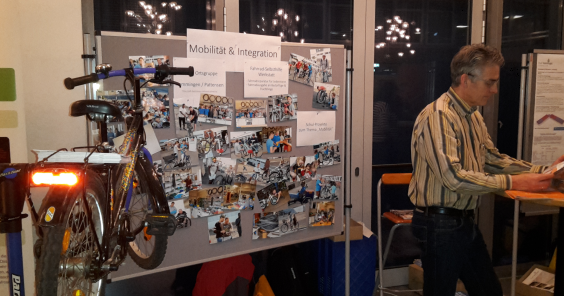

### Hemmingen ist AGFK Mitglied

Die Stadt Hemmingen ist der Arbeitsgemeinschaft Fahrradfreundlicher Kommunen Niedersachsen / Bremen e. V. (AGFK) beigetreten. Die AGFK bietet den Kommunen ein Netzwerk,
um sich gegenseitig auszutauschen und zu unterstützen. Ziel ist die Zertifizierung „Fahrradfreundliche Kommune Niedersachsen“. Zu den Aufgaben gehört es u.a.:

* das die Kommune darauf hinarbeiten, die Voraussetzungen für die Zertifizierung
„Fahrradfreundliche Kommune Niedersachsen“ zu erfüllen.
* das die Kommune bereit ist, in der AGFK mitzuarbeiten und sie zu unterstützen.

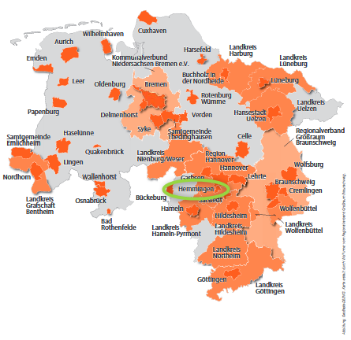

Die Stadt Hemmingen hat ihre Errungenschaften und Ziele auf Seite 15 der [Broschüre 2018 als PDF (Download)](http://www.agfk-niedersachsen.de/fileadmin/user_upload/public/Meldungen/2018_Fahrradland-Niedersachsen-Bremen.pdf) dargelegt.

### HAZ 2018-11-09-Fr
Hohe Bünte wird Fahrradstraße. Unser Antrag wurde angenommen.

### Radfahrer frei auf der Berliner Straße.

Die Empfehlung aus dem Radverkehrskonzept [(Link)](https://www.stadthemmingen.de/downloads/datei/OTA3MDAwOTYyOy07L3Vzci9sb2NhbC9odHRwZC92aHRkb2NzL2hlbW1pbmdlbi9oZW1taW5nZW4vbWVkaWVuL2Rva3VtZW50ZS8yMDE1MDIxN19yYWR2ZXJrZWhyc2tvbnplcHRfaGVtbWluZ2VuX2VuZGZhc3N1bmcucGRm/20150217_radverkehrskonzept_hemmingen_endfassung.pdf) vom Februar 2015 für Teile der Berliner Straße "die Benutzungspflicht des gemeinsamen Geh- und Radweges aufzuheben" wurde heute, am 7. November 2018, umgesetzt.

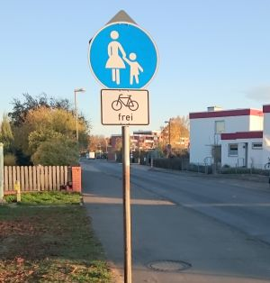 - 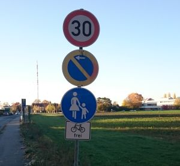

Damit ist es jetzt Radfahrende in beiden Richtungen freigestellt, den nördlichen Gehweg oder die jeweils rechte Fahrbahnseite, auf der eine Höchstgeschwindigkeit von 30 km/h erlaubt sind, zu benutzen. Radfahrende die den Gehweg benutzen, müssen sich den
Fußgängern anpassen und dürfen diese nicht gefährden.  Radfahrende müssen jederzeit rechtzeitig bremsen können, auch an unübersichtlichen Grundstücks Ein- und Ausgängen.

### Abendtour #16/18 2018-10-10-Mi.

Tourenziel       | Tiergarten und Kronsberg
---------------: | -----------------------
Datum            | 2018-10-10-Mi
Tourenrart       | Feierabend
Tourenleiter     | Dirk Härtel
Start            | Hemmingen Rathaus 17:30
Dauer [Stunden]  | ca. 1 3/4
Teilnehmerzahl   | 9
Tourenlänge [km] | 23
Wetter           | heiter bis wolkig

Die Fahrt ging durch das Ricklinger Holz zu den Maschteichen, weiter zur Döhrener Wolle, durch den Wiehbergpark zum Wülfeler Maschweg. Danach überquerten wir die Wilkenburger Strasse , fuhren am Teichhus vorbei und streiften Alt-Laatzen. Dann ging es wieder in die Leinemasch zur Harkenblecker Furt. Über Harkenbleck, Wilkenburg ging es weiter zum Arnumer See und weiter durch den Sundern nach Hemmingen. Nach flotter und schöner Fahrt, fast immer im Grünen, erreichten wir nach 23 km Hemmingen. Es war noch fast hell.

### Tagestour #5/18 2018-09-29-Sa

Tourenziel       | Rund um den Blauen See
---------------: | -----------------------
Datum            | 2018-09-29-Sa
Tourenrart       | Tagestour
Tourenleiter     | Dirk Härtel
Start            | Hemmingen, Rathausplatz 1, 10:00
Dauer [Stunden]  | ca. 6 1/2
Teilnehmerzahl   | 22
Tourenlänge [km] | 60
Wetter           | 18° Sonne + Wolken

Die Tour "Rund um den Blauen See" startete mit 22 Radlern bei guten Wetterbedingungen, Temperatur um die 18° mit Sonne und ein paar Wolken. Sie verlief streckenweise über den Grünen Ring.
Wir überquerten die neue B3 und fuhren durch Wettbergen und Empelde. Mit einer leichten Steigung ging es rauf zum Benther Berg. Von dort radelten wir weiter durch Velber, vorbei an der Gedenkstätte nach Ahlem. Danach erreichten wir den Mittellandkanal und fuhren direkt am Kanal entlang Richtung Westen, vorbei an Seelze, bis nach Lohnde. Dort überqueren wir den Kanal und die Leine und erreichen den Blauen See. Direkt am See, auf einer Aussichtsplattform, konnten wir picknicken. Nach einer kurzweiligen Pause traten wir den Rückweg an.
Es geht an Alt-Garbsen vorbei, durch die Leinewiesen zum Wasserstrassenkreuz von Leine und Mittellandkanal. Danach fuhren wir über Marienwerder, mit kurzem Stop an der Klosterkirche Marienwerder, durch den
Hinüber Garten nach Stöcken und von dort über Letter wieder an den Stichkanal mit einem kurzen Halt an der Wasserkunst.
Die nächste Pause legten wir dann am Dornröschen Biergarten ein. An Leine und Ihme entlang fuhren wir wieder zurück. Nach ca. 6 1/2 Stunden
und 60 km kamen wir gut gelaunt in Hemmingen an.   

### Abendtour #15/18 2018-09-26-Mi.

Tourenziel       | Tiergarten und Kronsberg
---------------: | -----------------------
Datum            | 2018-09-26-Mi
Tourenrart       | Feierabend
Tourenleiter     | Günther Kleinod
Start            | Hemmingen Rathaus 18:00
Dauer [Stunden]  | ca. 2 1/4
Teilnehmerzahl   | 8
Tourenlänge [km] | 28
Wetter           | heiter bis wolkig

Die Fahrt ging durch die Leinemasch zum Maschsee und Bischhofshol. Weiter durch die Eilenriede, Herrmann-Löns-Park zum Tiergarten. Über Bemerode fuhren wir zum Kronsberg. Nach einer kurzen Rast fuhren wir durch die Leinemasch zurück. Nach flotter und schöner Fahrt, fast immer im Grünen, erreichten wir nach 32 km Hemmingen.

### Abendtour #14/18 2018-09-05-Mi.

Tourenziel       | Linderte und Vörier Berg
---------------: | -----------------------
Datum            | 2018-09-05-Mi
Tourenrart       | Feierabend
Tourenleiter     | Dirk Härtel
Start            | Hemmingen Rathaus 18:00
Dauer [Stunden]  | ca. 3
Teilnehmerzahl   | 7
Tourenlänge [km] | 33
Wetter           | wolkig

Die 4. Feierabend-Radtour ging am Mittwoch den 16. Mai mit 2 Radlern, bei gutem Wetter nach Lüdersen. Wir sind über Wettbergen zur Kükenmühle geradelt, durch Ihme-Roloven nach Vörie. Danach ging es durch Holtensen und über eine kurze Steigung hinauf zum Vörier Berg. Der Rückweg ging dann über Lüdersen, Hiddesdorf und Arnum. Nach ca. 2 Stunden, 33 km und einer flotten und schönen Fahrt, erreichten wir nach ca. 33 km Hemmingen.   

### Abendtour #13/18 2018-08-29-Mi.

Tourenziel       | Giftener See
---------------: | -----------------------
Datum            | 2018-08-29-Mi
Tourenrart       | Feierabend
Tourenleiter     | Günther Kleinod
Start            | Hemmingen Rathaus 18:00
Dauer [Stunden]  | ca. 3
Teilnehmerzahl   | 7
Tourenlänge [km] | 33
Wetter           | schön warm

Die Fahrt ging vorbei am Arnumer Seen über Harkenbleck, Reden nach Koldingen. Weiter ging es durch das Calenberger Land nach Ruthe. Von da aus ging es an der Leine entlang zu den Giftener Seen. Nach einer kurzen Pause fuhren wir weiter nach Sarstedt, suchten eine Eisdiele. Zurück ging es dann über Koldingen, Harkenbleck und Wilkenburg vorbei in die Leinemasch. Nach einer flotten und schönen Fahrt, erreichten wir nach ca. 36 km Hemmingen.

### Abendtour #12/18 2018-08-22-Mi.

Tourenziel       | Julius-Trip-Ring
---------------: | -----------------------
Datum            | 2018-08-22-Mi
Tourenrart       | Feierabend
Tourenleiter     | Dirk Härtel
Start            | Hemmingen Rathaus 18:00
Dauer [Stunden]  | ca. 3
Teilnehmerzahl   | 6
Tourenlänge [km] | 32
Wetter           | sehr schön

Die Fahrt ging durch die Leinemasch zum Maschsee und Bischhofshol. Dort stiegen wir in den Julius-Trip-Ring ein. Weiter durch die Eilenriede, am Zoo vorbei, zum Lister Turm. Von dort über die Podbi auf den Pastor-Jäckel-Weg, Niedersachsenring, durch den Herrenhäuser Garten. Aufgrund der hohen Temperaturen mussten wir am Dornröschen Biergarten anhalten. Nach einer kurzen Rast fuhren wir weiter. An Leine und Ihme entlang ging es zurück. Nach flotter und schöner Fahrt, fast immer im Grünen, erreichten wir nach 32 km Hemmingen.

### Abendtour #11/18 2018-08-15-Mi.

Tourenziel       | Leine und Innerste
---------------: | -----------------------
Datum            | 2018-08-15-Mi
Tourenrart       | Feierabend
Tourenleiter     | Dirk Härtel
Start            | Hemmingen Rathaus 18:00
Dauer [Stunden]  | ca. 3
Teilnehmerzahl   | 12
Tourenlänge [km] | 33
Wetter           | schön warm

Die Fahrt ging vorbei am Arnumer Seen über Harkenbleck, Reden nach Koldingen. Weiter ging es durch das Calenberger Land nach Ruthe mit einem kurzen Abstecher zum Zusammenfluss von Leine und Innerste. Nach einer kurzen Pause fuhren wir zurück an den Koldinger Teichen vorbei in die Leinemasch. Am Wiesendachhaus wurde noch eine kurze Trinkpause eingelegt und nach einer flotten und schönen Fahrt, erreichten wir nach ca. 33 km Hemmingen.     

### Tagestour #4/18 2018-08-11-Sa

Tourenziel       | Durchs Calenberger Land
---------------: | -----------------------
Datum            | 2018-08-11-Sa
Tourenrart       | Tagestour
Tourenleiter     | Helmut Krause
Start            | Pattensen, Am Hallenbad 1, 10:00
Dauer [Stunden]  | ca. 6
Teilnehmerzahl   | 20
Tourenlänge [km] | 45
Wetter           | 18° Sonne + Wolken + Westwind.

Wir starteten mit 18 Radlern (5 Frauen und 13 Männer) bei guten Wetterbedingungen, Temperatur um die 18° Sonne + Wolken. Zu schaffen machte uns der starke Westwind
mit heftigen Böen. Diesen bekamen wir gleich am Anfang der Tour auf dem Ackerweg nach Hüpede zu spüren. Alle hielten aber tapfer durch.

Peinlich war, dass wir einen zig-mal gefahrenen Abzweig nach Hüpede verpassten. Nach ein paar hundert Metern musste die ganze Gruppe umkehren und das Stück wieder zurückfahren. Ein Teilnehmer bemerkte, dass sei positiv zu bewerten, da man erleben durfte wie es ist, wenn man den Wind im Rücken habe.

Am Rastplatz Oerier Wald legten wir eine kurze Getränkepause ein, bevor wir uns durch naheliegendes Waldstück auf einem schmalen Pfad durchschlugen. Danach ging es weiter auf dem asphaltierten Feldweg nach Gestorf. Dort machten wir einen Abstecher zum Schloss und fuhren dann am Erdbeerhof vorbei ins Hallerburger Holz. Vorher probierten wir noch das Obst entlang der Obstbaumallee.

Auf dem schönen Dorfplatz in Adensen machten wir unsere große Mittagspause und fuhren danach durch das Hallerburger Naturschutzgebiet nach Eldagsen und über Sonnenborn zum Hofcafe Mittelrode, wo wir gegen 13:30 Uhr ankamen. Dort suchten wir uns ein nettes Plätzchen im Garten und stärkten uns mit Kaffee und Kuchen. Nebenan probte eine kleine Band für eine anstehende Hochzeitsfeier. Anschließend fuhren wir zum Rittergut Bockenrode, welches wir durchquerten.

Die restlichen 20 km nach Pattensen fuhren wir entspannt mit Rückenwind über Schotter-und asphaltierte Wege.

Es gab keine körperlichen und technischen Ausfälle. Alle Teilnehmer waren sehr zufrieden. Sie fanden die Strecke sehr angenehm, da sie ausschließlich über Wirtschaftswege führte und auch landschaftlich sehr aabwechslungsreich war. Einige Teilnehmer fuhren nicht die gesamte Stecke mit, da ihr Wohnort in der Nähe lag.

Zu bemerken ist noch, dass Radler sogar aus Gehrden, Sarstedt und Hannover kamen.

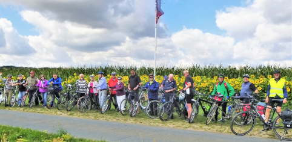

### Abendtour #10/18 2018-07-25-Mi.

Tourenziel       | Eilenriede
---------------: | -----------------------
Datum            | 2018-07-25-Mi
Tourenrart       | Feierabend
Tourenleiter     | Günther Kleinod
Start            | Hemmingen Rathaus 18:00
Dauer [Stunden]  | ca. 3
Teilnehmerzahl   | 6
Tourenlänge [km] | 25
Wetter           | sehr schön warm

Die Fahrt ging durch die Leinemasch zum Maschsee und Bischhofshol. Weiter ging es durch die Eilenriede, in den Hermann-Löns-Park zur alten Mühle. Am Annateich vorbei erreichten wir einen schönen Biergarten. Nach einer kurzen Pause fuhren wir am Tiergarten vorbei nach Bemerode. Dann ging es durch das Döhrener Flüsseviertel mit der Döhrener Wolle. Nach flotter und schöner Fahrt, fast immer im Grünen, erreichten wir nach ca. 25 km Hemmingen.

### Abendtour #9/18 2018-07-18-Mi.

Tourenziel       | Leinebogen
---------------: | -----------------------
Datum            | 2018-06-06-Mi
Tourenrart       | Feierabend
Tourenleiter     | Günther Kleinod
Start            | Hemmingen Rathaus 18:00
Dauer [Stunden]  | ca. 3
Teilnehmerzahl   | 5
Tourenlänge [km] | 32
Wetter           | sehr schön warm

Die Fahrt ging durch die Leinemasch zum Maschsee und Bischhofshol. Dort stiegen wir in den Julius-Trip-Ring ein.
Weiter durch die Eilenriede, am Zoo vorbei, zum Lister Turm. Von dort über die Podbi auf den Pastor-Jäckel-Weg,
Niedersachsenring, durch den Herrenhäuser Garten mit Sicht auf das kleine Fest. Aufgrund der hohen Temperaturen mussten wir am Dornröschen Biergarten anhalten. Nach einer kurzen Rast ging es weiter. An Leine und Ihme entlang ging es zurück. Nach flotter und schöner Fahrt, fast immer im Grünen, erreichten wir nach 32 km Hemmingen.

### RadelTreff 21

Am Montag, den 25. Juni 2018 trafen sich ca. 12 Interessierte und Mitglieder in der Begegungsstätte in Arnum.

Themen war das Stadtradeln, die anderen Touren, die Selbsthilfe Fahrrad Werkstatt, die Verkehrspolitik und wie wir mehr Helfer anwerben können. Insbesondere in der Fahrrad-Ausgabe fehlen uns Helfer. Jeder ist willkommen sie über die Aufgabe zu informieren. Handwerkliches Geschick wird nicht benötigt.

### Tagestour 3: „Von Hemmingen zum Altwarmbüchener See"

Tourenziel       | AWB-See
---------------: | -----------------------
Datum            | 2018-06-23-Sa
Tourenrart       | Tagestour
Tourenleiter     | Helmut Krause
Start            | Hemmingen, Rathausplatz 1 10.00
Dauer [Stunden]  | ca. 6
Teilnehmerzahl   | 3
Tourenlänge [km] | 55
Wetter           | 13°, bewölkt, kein Regen.

Wir starteten nach kurzer Überlegung um 10:15 am Rathausplatz in Hemmingen. Temperatur 13°, Wolken und
Sonne, kein Regen.

Es ging durch die Leinemasch zum Maschsee, wo wir einen kurzen Stop einlegten, dann rein in die Eilenriede über Buchholz und Lahe zum Altwarmbüchener See. Unterwegs konnten wir auf einem kleinen Teich Modell-Rennboote beobachten, was sehr eindrucksvoll war.

Am AWB-See, den wir umrundeten, konnten wir an der Segelschule Segler beobachten, die gerade ihre Prüfung ablegten. Am See machten wir eine längere Mittagspause. Zurück ging es dann durch den Misburger Wald runter an den Mittellandkanal, den wir in östlicher Richtung bis zur Anderter Schleuse befuhren. Wir konnten das Schleusen mehrerer Schiffe beobachten.

Von dort aus fuhren wir durch den Tierpark in Richtung Eilenriede. Im Restaurant Bischofshol genehmigten wir uns noch einen leckeren Capu und fuhren dann nonstop zum Maschsee und weiter nach Hemmingen, wo wir gegen 16:00 eintrafen.

Insgesamt war es eine gelungenen Tour trotz sehr geringer Beteiligung. Es wären sicher mehr Radler gekommen, wenn es nicht bis etwa 10:00 geregnet hätte. Während der gesamten Tour blieb es aber trocken, die Sonne schien etwa 2 Stunden.

Wir waren froh, die Tour durchgeführt zu haben.

### Abendtour #8/18 2018-06-13-Mi.

Tourenziel       | Rundkurs Oerier Wald
---------------: | -----------------------
Datum            | 2018-06-13-Mi
Tourenrart       | Feierabend
Tourenleiter     | Helmut Krause
Start            | Rathaus in Pattensen 18:30
Dauer [Stunden]  | ca. 2,5
Teilnehmerzahl   | 6
Tourenlänge [km] | 24
Wetter           | angenehme Temperaturen.

am 13.6. starteten wir um 18:30h unsere Feirabendtour am neuen Rathaus in Pattensen mit 6 Radlern (5 Männer und 1 Frau) bei angenehmen Temperaturen.

Wir fuhren einen Rundkurs südlich von Pattensen auf größtenteils asphaltierten Wirtschaftswegen.

Es ging über Hüpede zum Oerier Wald, wo wir auf dem schönen Rastplatz eine kurze Pause einlegten.

Gut gelaunt fuhren wir weiter über Vardegötzen nach Jeinsen. Wir probierten die ersten Kirschen am Wegesrand und passierten große Erdbeerfelder. Danach radelten wir entlang der Giesener Teichen nach Ruthe.

Von dort aus ging es am Versuchsgut vorbei über den "Schwarzen Busch" nach Koldingen, wo sich unsere Wege dann gegen 20:30 Uhr trennten.

Insgesamt war es eine sehr sportliche Tour über rund 24 km.

### Abendtour #7/18 2018-06-06-Mi.

Tourenziel       | Leinebogen
---------------: | -----------------------
Datum            | 2018-06-06-Mi
Tourenrart       | Feierabend
Tourenleiter     | Günther Kleinod
Start            | Hemmingen Rathaus 18:00
Dauer [Stunden]  | ca. 3
Teilnehmerzahl   | 7
Tourenlänge [km] | 35
Wetter           | sehr schön warm

Entspannte etwas flottere Tour in der Sommerhitze.
Über Wettbergen, Empelde, am Benther Berg vorbei, teilweise auf dem Grünen Ring nach Velber und Ahlem zum Mittellandkanal. Noch ein Schlenker um den Leinebogen, vorbei am Herenhäuser Garten, durch den Georgengarten zurück an die Leine. Von dort durch Limmer und Linden und nach kurzer Eis-Pause die Ihme entlang zurück nach Hemmingen

### Abendtour #6/18 2018-05-30-Mi.

Tourenziel       | Tiergarten und Kronsberg
---------------: | -----------------------
Datum            | 2018-05-30-Mi
Tourenrart       | Feierabend
Tourenleiter     | Dirk Härtel
Start            | Hemmingen Rathaus 18:00
Dauer [Stunden]  | ca. 2,5
Teilnehmerzahl   | 6
Tourenlänge [km] | 30
Wetter           | heiter und heiß

Entspannte Tour in der Sommerhitze zum Ende des Mai. Döhrener Wolle, Maschsee,Eilenriede, Döhrenerturm, Bult, Bischofhol, Herman-Löns-Park, Tiergarten, Kleefeld, Bemerrode, Kronsberg -- EIS-Essen, Kronsberg-Viertel, Expo-Gelände,Park der Sinne, Leinemasch, Aqua-Laatzium,Teichhaus, Seerundgang im Sommerabend

### Stadtradel-Tour 2018-05-27-So.

Tourenziel       | Mutter Bürmann Devese und Gehrden
---------------: | -----------------------
Datum            | 2018-05-27-So
Tourenrart       | Stadtradeltour
Tourenleiter     | Dirk Härtel
Start            | Hemmingen Rathaus 10:00
Dauer [Stunden]  | ca. 0,15
Teilnehmerzahl   | 35
Tourenlänge [km] | 3
Wetter           | heiter und heiß

Frühstück bei Mutter Bürmann

### Tagestour #2/18 2018-05-27-So Durch die Hildesheimer-Berge

Tourenziel           | Durch die Hildesheimer-Berge
-------------------: | ----------------------------
Datum                | 2018-05-27-So.
Tourenrart           | Tagestour
Tourenleiter         | Helmut Krause
Start                | Pattensen, Rewe-Center, Johann-Koch-Str.2 10:00
Dauer [Stunden]      | -
Teilnehmerzahl       | 6
Tourenlänge [km]     | 64
An- und Abstiege [m] | 430
Wetter               | Temperatur bis 28°, Sonne pur.

Es nahmen, außer zwei Tourenleiter, nur zwei Frauen und zwei Männer teil, was vielleicht auf die Stadtradel-Auftaktveranstaltung nach Gehrden zurückzuführen war. Gut gelaunt starteten wir kurz nach 10 Uhr bei Sonnenschein und noch angenehmer Temperatur durch die Feldmark, an den Pattenser Windrädern vorbei, nach Schulenburg.

Danach ging es weiter auf dem sehr holprigen Feldweg unterhalb des Schulenburger Berges nach Nordstemmen. Auf Grund der vorhergesagten hohen Temperaturen, verzichteten wir auf die Überquerung des Hildesheimer Waldes, von Haus Escherde bis Sorsum, und fuhren von Nordstemmen über Heyersum und Groß Escherde auf einer Strecke mit geringen Steigungen, nach Sorsum. Dort sahen wir eine sehr schöne Wohnanlage integriert auf einem ehemaligen Gutshof mit alten Gemäuer.

Nun kam die Bergprüfung...!  Es ging hinauf auf den Rottsberg und weiter am Waldrand bis zum OT Hi-Wald (Bosch Werke). Wir mussten bis dahin einige kurze Steigungen überwinden, was bei zunehmender Wärme ziemlich anstengend war. *Gott sei Dank* gab es auch viel Schatten. Alle hielten tapfer durch!

Dann fuhren wir hinab zum Ziesterzienser-Kloster Marienrode, wo wir am Klostersee unsere verdiente Mittagspause machten. Anschließend fuhren wir über den Steinberg am OT Ochtersum vorbei hinab ins Innerstetal. In der Nähe der Domäne Marienburg ging es dann wir auf dem Deich flussabwärts in Richtung Hildesheim. Nach ein paar Kilometern erreichten wir den Hohnensee, wo wir eine kleine Rast einlegten. Bei einer Temperatur um 28° wär eigentlich ein erfrischendes Bad angesagt. Danach radelten wir weiter, immer am Fluss entlang, zum wunderschön gelegenen Inselcafe. Dort stärkten wir uns mit Kaffee und Kuchen und kalten Getränken. Wir saßen auf der Terrasse mit Blick auf den Fluss.

Nach gut einer halben Stunde ging es immer an der Innerste entlang bis zum OT Himmelsthür und weiter durch das Naturschutzgebiet unterhalb der Giesener Berge. Das Gebiet ist sehenswert, kann aber nur zu Fluss erkundet werden. Hinter Giesen tangierten wir die Kalihalde, radelten danach auf einem asphaltierten Wirtschaftsweg nach Westen bis Giften und dann entlang an den Giftener Seen.
Wir querten die Innerste bei Schliekum und fuhren am Fluss entlang bis nach Ruthe. Dort ging es auf dem asphaltierten Feldweg nach Koldingen. Dort trennten wir uns, die Hemminger fuhren in Richtung Reden, die Pattenser über dem Wirtschaftsweg nach Pattensen zurück.

Es gab keine körperlichen und technischen Ausfälle, alle waren sehr zufrieden mit der Tour, die durch schöne Landschaften führte und sehr abwechselungsreich war.

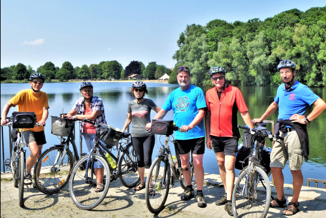

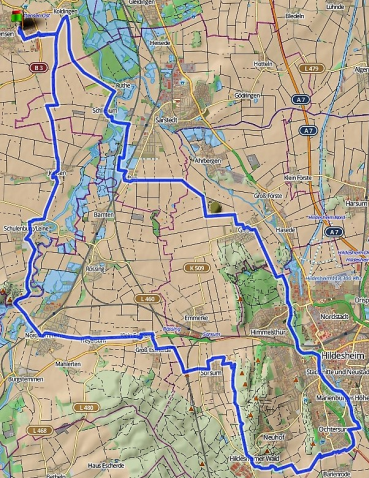

### Abendtour #5/18 2018-05-23-Mi.

Tourenziel       | Ruthe
---------------: | -----------------------
Datum            | 2018-05-23-Mi
Tourenrart       | Feierabend
Tourenleiter     | Günther Kleinod
Start            | Hemmingen Rathaus 18:00
Dauer [Stunden]  | ca. 2,5
Teilnehmerzahl   | 3
Tourenlänge [km] | 35
Wetter           | heiter bis wolkig

Die 5. Feierabend-Radtour ging am Mittwoch den 23. Mai mit 3 Radlern, bei gutem Wetter nach Ruthe. Wir sind erst durch die Leinemasch, vorbei an Laatzen, Rethen, ein paar Störchen geradelt. Danach ging es durch die Leineaue an Gleidingen und Heisede vorbei nach Ruthe. In Ruthe fuhren wir zur Einmündung der Innerste in die Leine. Der Rückweg ging dann nach einer kurzen Rast zwischen den Koldinger Teichen hindurch zur Gleidinger Hütte und von dort über Koldingen, Reden, Harkenbleck und Wilkenburg nach Hemmingen. Nach ca. 2,5 Stunden, 35 km und einer schönen Fahrt waren wir wieder zurück.

### Radtour zur Motormühle nach Klein-Blumenhagen Edemissen

Tourenziel       | Klein-Blumenhagen Edemissen
---------------: | -----------------------
Datum            | 2018-05-21-Mo
Tourenrart       | Tagestour
Tourenleiter     | Dirk Härtel
Start            | Hemmingen Rathaus 9:00
Dauer [Stunden]  | ?
Teilnehmerzahl   | 5
Tourenlänge [km] | 103,5
Wetter           | heiter mit Gegenwind

Die sportlich angekündigte Tour mit 103,50km ging mit 5 Radlern durch die Eilenride zur Bockwindmühle im Herman-Löns-Park. Nach der ersten Pause an der Mühle ging es an Anderten und Misburg vorbei, über den Eisenbahnerlängsweg nach Lehrte. Durch die Lehrter Altstadt südlich der Bahn über Ramhorst weiter Richtung Arpke. Hinter Arpke ging es durch offene aufgeräumte Bördelandschaft, gegen den schon heftigen Gegenwind (direkt von Vorn) bei ruhigem Tempo 18-20 kmh in die Fuhseniederrung bei Abbensen. Nach kurzem Stop weiter an der Landstraße auf dem Radweg durch Edemissen zur Motormühle in Klein Blumenhagen. Dort konnten wir Radler uns bei Kaffee und selbstgebackenem Kuchen oder Bockwurst stärten. (Beschreibung der Rücktour in offener Landschaft mit Rückenwind folgt)

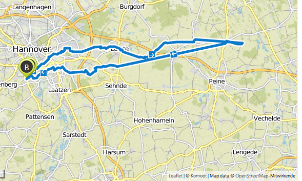

### Tolle Projekttage der Grundschule Köllnbrinkweg in der Fahrrad-Selbsthilfewerkstatt des ADFC Hemmingen/Pattensen

Das Thema der diesjährigen Projekttage der Grundschule Köllnbrinkweg in Hemmingen Westerfeld lautete „Mobilität“.

So war es naheliegend, bei der  Fahrrad-Selbsthilfewerkstatt in der Heinrich-Hertz-Stasse 23 anzufragen und an den drei Projekttagen vom 7.- 9. Mai mit jeweils 10 Schülerinnen und Schülern der 4. Klassen einen Vormittag in der Werkstatt zu verbringen. Ziel war es, den Jugendlichen die Hemmungen vor technischen Problemen zu nehmen, praktische Kniffe zu erlernen und gleichzeitig defekte Fahrräder für Bedürftige und Flüchtlinge wieder fahrtüchtig zu machen.

Das Engagement und die Begeisterung waren toll und bemerkenswert. So wurden defekte Schläuche geflickt und wieder eingesetzt, Klingeln und Reflektoren angebracht, Sättel und Lichtanlagen montiert, Radnaben eingestellt, Bremsen justiert und nicht zuletzt der notwendige Fahrrad-Check bei einer Probefahrt durchgeführt.

Somit konnten in den drei Projekttagen eine ganze Reihe von Kinder- und Erwachsen-Fahrrädern wieder für Bedürftige flott gemacht werden. Und darauf waren die Schülerinnen und Schüler mit Recht ganz besonders stolz.

Auch die ehrenamtlichen Betreuer in der Werkstatt Dirk Härtel, Michael  Maier und Axel Hengst waren gemeinsam mit den begleitenden Lehrkräften davon angetan, mit welchem Interesse und bereits vorhandenen Fähigkeiten diese jungen Menschen voller Begeisterung zu Werke gingen.

### Abendtour #4/18 2018-05-16-Mi.

Tourenziel       | Lüdersen
---------------: | -----------------------
Tourenrart       | Feierabend
Tourenleiter     | Günther Kleinod
Start            | Hemmingen Rathaus 18:00
Dauer [Stunden]  | ca. 2
Teilnehmerzahl   | 2
Tourenlänge [km] | 33
Wetter           | heiter bis wolkig

Die 4. Feierabend-Radtour ging am Mittwoch den 16. Mai mit 2 Radlern, bei gutem Wetter nach Lüdersen. Wir sind über Wettbergen zur Kükenmühle geradelt, durch Ihme-Roloven nach Vörie. Danach ging es durch Holtensen und über eine kurze Steigung hinauf zum Vörier Berg. Der Rückweg ging dann über Lüdersen, Hiddesdorf und Arnum. Nach ca. 2 Stunden, 33 km und einer schönen Fahrt waren wir wieder zurück in Hemmingen.

### Abendtour #3/18  2018-05-02-Mi.

Tourenziel       | Benthe
---------------: | -----------------------
Tourenrart       | Feierabend
Tourenleiter     | Dirk Härtel
Start            | Hemmingen Rathaus 18:00
Dauer [Stunden]  | ca. 2 1/2
Teilnehmerzahl   | 9
Tourenlänge [km] | 24
Wetter           | heiter bis wolkig

Die 48. Feierabend-Radtour ging am Mittwoch den 2. Mai mit neun Radlern (8 Herren und 1 Dame) bei gutem Wetter zum Benther Berg. Wir sind gemütlich über Wettbergen zur Kükenmühle geradelt, an Ronnenberg vorbei durch die Felder zu den sagenumwobenen Sieben Trappen bei Benthe. Danach ging es eine kurze Steigung hinauf zum Benther Berg. Der Rückweg ging dann über Empelde und Wettbergen. Nach ca. 2 1/2 Stunden, 24 km und einer schönen Fahrt waren wir wieder zurück in Hemmingen.

### Fahrrad-Selbsthilfewerkstatt-Hemmingen
Auch am 1. Maifeiertag war die *ADFC Fahrrad-Selbsthilfewerkstatt-Hemmingen* mit einer Notbesetzung von 17:30 bis 19:00 Uhr geöffnet.

### **ENTFÄLLT**

Das **21. Radeltreff - Sondertreffen zum Thema: Tempo 50 in Devese** konnte entfallen 😄

> 26. April 2018 - 21:50 Die Presse meldet, dass die Tempo-30-Regelung auf der Ortsdurchfahrt in Devese vorerst bleibt. Das Verkehrsministerium will den Sachverhalt nochmals prüfen. Mehr siehe [Hannoversche Allgemeine - Umland](http://www.haz.de/Umland/Hemmingen/Nachrichten/Tempo-30-auf-Ortsdurchfahrt-Devese-bleibt-vorerst-bestehen).
>
> Damit entfällt das geplante Sondertreffen am 3. Mai bei Mutter Buermann.

### Abendtour #2/18 2018-04-25-Mi.

Tourenziel       | Anderter Schleuse
---------------: | -----------------------
Tourenrart       | Feierabend
Tourenleiter     | Günther Kleinod
Start            | Hemmingen Rathaus 18:00
Dauer [Stunden]  | ca. 2 1/2
Teilnehmerzahl   | 7
Tourenlänge [km] | 35
Wetter           | bedeckt mit Regenschauer

Die 47. Feierabend-Radtour ging am Mittwoch den 25. April mit sieben Radlern (5 Herren und 2 Damen) durch die Leinemasch
nach Laatzen. Von dort ging es über den Kronsberg, durch Wülferode zur Anderter Schleuse.
Nach einer kurzen Pause fuhren wir zurück durch Anderten, Herrmann-Löns-Park und Eilenriede.
Vorbei am Maschsee und durchs Ricklinger Holz erreichten wir nach 2 1/2 Stunden und 35 km Hemmingen, leider war es am Ende etwas feucht.

### Abendtour #1/18 (Total #46) 2018-04-12-Do.

Tourenziel       | Lindener Berg
---------------- | -----------------------
Tourenrart       | Feierabend
Tourenleiter     | Günther Kleinod
Start            | Hemmingen Rathaus 18:00
Dauer [Stunden]  | ca. 2
Teilnehmerzahl   | 3
Tourenlänge [km] | 22
Wetter           | bedeckt

Die Tour führte zum **Lindener Berg**. Es ging durch das Ricklinger Holz, an der Ihme entlang, durch Limmer und Lindener Hafen zum Lindener Berg. Dort konnten wir noch die letzten _Skillablüten_ mit einem schönen Abendhimmel betrachten. Nach einer Pause fuhren wir weiter durch Linden zum Maschsee und wieder zurück nach Hemmingen.

<!-- Hallo Jens: Ein Foto schicke ich per Email -->

 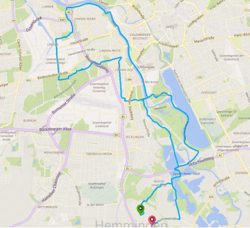

### 20\. Radeltreff - Jahreshauptversammlung 2018

Unsere Jahreshauptversammlung 2018 fand am 24\. Januar 2018 im Bürgersaal Hemmingen stattfinden. Das neue Sprecherteam ist:

Aufgabe                                   | Vertreter
----------------------------------------- | ----------------
Sprecher                                  | Jens Spille
Vertreter (Fahrrad Selbsthilfe Werkstatt) | Dirk Härtel
Vertreter (Touren)                        | Günther Kleinod
Vertreter (Pattensen)                     | Ralf Schmalkuche

### 18\. RadelTreff - Radelnde aus Hemmingen und Pattensen planten Aktionen für 2018!

Am Mittwoch, den 13\. Dezember 2017 trafen sich Radelnde im Jagdzimmer der Deveser Gaststätte Mutter Buermann. Elf Mitglieder und drei Gäste ließen das Jahr 2017 revue passieren und planten für 2018.

So hat zum Beispiel, die im Mai 2015 gegründete Ortsgruppe, zur Zeit 105 Mitglieder, davon 3 Tourenleiter. Es wurden im Jahr 2017 insgesamt 24 Touren durchgeführt. Davon 18 Abendtouren und 4 Tagestouren. Zusammen haben ca. 180 Teilnehmer rund 7500 km zurückgelegt.

Die Fahrrad-Selbsthilfe-Werkstatt hat seit seiner Gründung im November 2016, ca. 100 Fahrräder aufgearbeitet und ausgegeben. Zusätzlich wurden noch mehrere hundert Fahrräder repariert.

Verkehrspolitisch gab es ein Treffen mit der Stadt Hemmingen zum Thema gefährliche Querungen. Es gab ein Treffen mit dem Ortsbürgermeister in Jeinsen, einen Ortstermin mit der Niedersächsischen Landesbehörde für Straßenbau und Verkehr sowie der Region Hannover - Fachbereich Verkehr. Es gab viel Email Verkehr mit der Niedersächsischen Landesbehörde zum Thema Radweg an der L389.

Nächstes Jahr, am 24\. Januar im Bürgersaal, wird das Sprecherteam neu gewählt. Außerdem wird es wieder 4 Tagestouren geben und natürlich unsere Abendtouren. Auch das Stadtradeln ist wieder geplant. Außerdem werden wird unsere [Mängelkarte für Hemmingen und Pattensen](http://adfc-hemmingen-pattensen.github.io/MaengelHemPat.html) weiter vervollständigen und mit den Behörden besprechen.

### Erster Geburtstag der **ADFC Fahrrad-Selbsthilfewerkstatt-Hemmingen**

Nun besteht die Fahrrad-Selbsthilfewerkstatt und Fahrradausgabe bereits seit einem Jahr und wir haben gemeinsam in dieser Zeit erfolgreich eine Menge auf die Beine gestellt und erlebt. Das Werkstatt-Projekt wird sehr-gut angenommen und wir erhalten durchweg positive Rückmeldungen aus der Bevölkerung, von den Vertretern der Stadt und von den Flüchtlingen.

Aus diesem Grund haben wir uns am 14\. November 2017 zusammengesetzt und mit Lekkereien ein wenig gefeiert.

Wir möchten uns hiermit bei allen Geldspendern, Sachspendern, Helfern und Befürwortern bedanken. Ohne Unterstützung wäre dieses Jahr nicht so gut gelaufen.

### Abendtour #45 2017-09-20-Mi.

Karte mit unseren Touren 2017 bis Ende August. 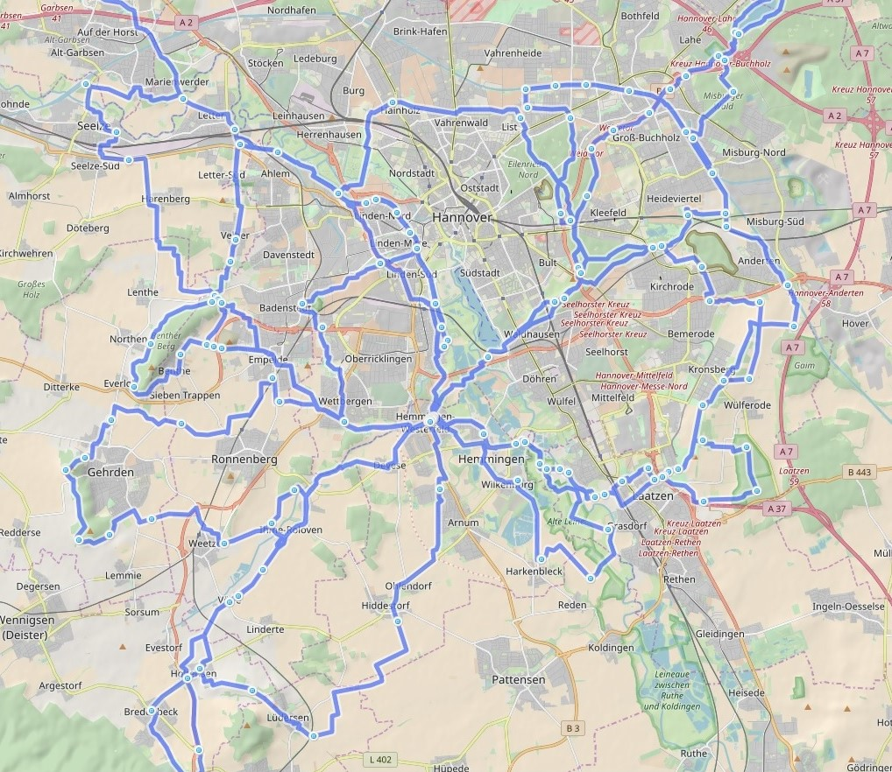

### 17\. Radel-Treff

Am Montag den 18\. September 2017 hatten wir ein kleines Arbeitstreffen in der Fahrrad-Selbsthilfe-Werkstatt. Es ging um die Vorbereitung zu der Einladung der Stadt Hemmingen am 20\. September zum Thema "Gefährliche Querungen". Das Ergebnis dieses Treffens kann man auf der [Mängelkarte für Hemmingen und Pattensen](http://adfc-hemmingen-pattensen.github.io/MaengelHemPat.html) sehen.

### Abendtour #44 2017-09-13-Mi.

> Bericht folgt

#### RADTOUR 4 „Durch das Calenberger Land"

> 10.09., Sonntag, 10 Uhr 
> Bericht folgt

### Abendtour #43 2017-09-06-Mi.

Die 43\. Feierabend-Radtour startete am Mittwoch, den 06\. September bei schwarzen Wolken mit 6 Radlern (2 Damen und 4 Herren). Die Fahrt ging am Maschsee vorbei in die Eilenriede. Durch den Herrmann-Löns-Park mit der Alten Mühle und dem Annateich fuhren wir in einem einem weiten Bogen um das Kleefelder Bad und starteten von dort den Rückweg durch die Eilenriede. Über den Maschsee und das Ricklinger Holz erreichten wir nach gut 2 Std. und ca. 30 km, bestens gelaunt, Hemmingen.

### Abendtour #42 2017-08-30-Mi.

Zum Uni-Viertel und die Südstadt - Mit 6 radelbegeisterten Fahrern ging es mal ungewöhnlich durch die Stadt Hannover, um drei unserer Gäste die Sehenswürdigkeiten unserer Nachbarstadt zu zeigen. An der Ihme entlang des Ihmecentrum ging es mal hinter die Unniversität in den Garten auf dem Schneiderberg. Über Königsworther-Platz an der Leine entlang durch die Calenberger Neustadt zum Neuen Rathaus. Leider war dieses schon geschlossen, da wir unseren Neubürgern gern die Modelle der Stadtentwicklung in Hannover und Umland gezeigt hätten. So ging es durch die Südstadt zum Braunschweiger Platz und am Bismark-Bahnhof entlang zur Eilenriede, um südlich des Maschsees wieder nach ca. 32km am Radhausplatz in Hemmingen anzukommen.

### 16\. Radel-Treff

Am Donnerstag, den 31\. August 2017 um 19:00 trafen sich sieben Radler im MOBILE e.V.; Göttinger Str. 25a; 30982 Pattensen, um über die vergangenen und zukünftigen Aktivitäten zu sprechen. Die Presse war vertreten und hat am Freitag sowie am Montag darauf im Pattenser bzw. Hemmingen HAZ Teil davon berichtet.

Der ADFC Hemmingen Pattensen ist im Jahr 2016, um vierzehn und im Jahr 2017 bis jetzt, um neun neue Mitglieder gewachsen. Somit hat die Ortsgruppe jetzt 103 Mitglieder.

Kurz angesprochen wurde die ADFC Bundesaktion "Fahrradland" das unter <https://radlandjetzt.de/> weitere Unterstützer sucht.

Die Ortsgruppe hat in diesem Jahr bis jetzt drei Tagestouren durchgeführt. Die vierte Tour folgt am Sonntag, den 10.09., ab 10 Uhr „Durch das Calenberger Land". Weiterhin wurden bis jetzt 14 Abendradtour und eine Nachmittags-Radtour veranstaltet.

Des Weiteren wurde kurz über das Treffen mit der Stadt Hemmingen, Velogold und Vertreter des ADFC Region zum Thema Lastenrad Hannah gesprochen. Die Nr. 3 steht z. Z. in Springe, die Nr. 14 in der Göttinger Str. 63 "Familienservicebüro" und kann unter folgender Adresse gebucht werden .<https://www.hannah-lastenrad.de/cb-items/hannah-14>

Dirk berichtete ausführlich über die Fahrrad-Selbsthilfewerkstatt. Bis jetzt wurden ca. 100 Fahrräder an Bedürftige ausgegeben und sage und schreibe ca. 500 Fahrräder repariert. Repariert wird vielfach draußen vor der Werkstatt weil der Andrang so groß ist.

Es wurden sich auch die Ein- und Ausgaben angesehen. Die großen Spender, die Bürgerstiftung Hemmingen, das Flüchtlingsnetzwerk Hemmingen und der Roatary-Club haben uns mit einer soliden Grundausstattung starten lassen. Die eingenommenen Spenden durch die Fahrradausgabe und die Ausgaben für Material halten sich z. Z. die Waage.

Die Fahrrad-Selbsthilfewerkstatt ist immer Dienstags von 17:30 bis 19:00 geöffnet, würde aber gerne noch an einem weiteren Tag in der Woche öffnen, dazu werden noch Ehrenamtlich Helfer gesucht, sowohl in der Ausgabe als auch in der Werkstatt.

Der Hof vor der Werkstatt soll einen Fahrrad-Parcour bekommen. Dieser muss aber mit anderen Interessenten, wie z. B. die Heuhüpfer, noch abgesprochen werden.

Das Stadtradeln 2017 war wieder ein voller Erfolg. Sowohl die KGS Hemmingen als auch eine Tour von Düsseldorf nach Barcelona zählten für Hemmingen mit insgesamt 105.002 km, aber auch die 18 Teilnehmer aus Pattensen haben sich mit 7.653,5 km kräftig ins Zeug gelegt. 2018, so der Plan, wird das Stadtradeln wiederholt.

Zum Thema Radverkehr gab es drei Berichte. Zum einen über die Infoveranstaltung zum Thema "Schutzstreifen" am 5.4.2017, zum anderen über die Abschlussveranstaltung "Vorrangnetz für den Alltagsradverkehr" am 30.5.2017 und zuletzt über die "3\. Sitzung des Ausschusses für Soziales, Kultur, Sport und Verkehr" in Hemmingen.

Die Schwerpunkte hier sind der Ausbau des Radwegs entlang der L 389, der für 2018 geplante Radweg zwischen Ronnenberg und Devese. Wir warten z. Z. auf die "Planfeststellung" um sie zu prüfen. In Planung ist auch ein Radweg entlang der Landstr. 460 (Schulenburg - B3). Die Radwegeführung über die Kreisel zwischen Hemmingen und Devese wollen die Mitglieder genau beobachten.

Des Weiteren wurde über eine doppelte Dunkel Ampel über die K221 diskutiert. Damit wird ein flüssigerer Verkehr und weniger Rotlichtverstöße erwartet.

Weiterhin wurde über die Einladung der Verwaltung Hemmingen: Gefährliche Straßenquerungen am Mittwoch, den. 20\. Sept. 2017 um 13:00 im kl. Sitzungsaal gesprochen. Hierzu wird der ADFC die zehn gefährlichsten Querungen erörtern. Die Idee ist es diese und weitere Mängel in eine Mängelkarte einzutragen und die Fortschritte zu verfolgen.

Als gefährlich werden u. a. auch abgesenkte Bankette an den Radwegen betrachtet. Auch die verdreckten Feldwege sind gefährlich, hier besteht seitens des Realverbandes eine Verkehrssicherungspflicht. Weitere Verbesserungen wären, eine Aufwertung der Leinemaschwege (zusammen mit dem ADFC Laatzen) und Ortseingangsschilder an Radwegen (z. B. zusammen mit dem Radwegeteam), wie sie z. B. der Ortsrat für Koldingen angeschafft hat.

Die Verkehrsordnung zu Fußgängerampel wurde in den letzten Jahren geändert und sind nicht allen Verkehrsteilnehmern bekannt. Vorgeschlagen wurden Aktionen mit Infoblatt, Schülerzeitung und/oder ein YouTube Video. Am besten zusammen mit den Kommunen, der Polizei und dem ADAC.

Die Mitglieder wünschen sich immer noch einen Schulradwegeplan Pattensen. Der ADFC steht mit der LGLN in Verbindung, um niedersachsenweit einen Radschulwegplaner zu installieren. Damit wird der Aufwand so klein wie möglich gehalten.

### 41\. Abendradtour

Am Mittwoch den 23\. August ab 18:00 Uhr hatten wir schöne Tour mit acht RadlerInnen zum Deisterrand. Bei "endlichmalSommer-Wetter" sind acht Abendradler gemütlich über Devesse und Weetzen in Richtung Holtensen und Bredenbeck zum Deisterrandweg geradelt. Eine kleine Pause am Deisterrand in der Abendsonne und über Steinkrug mit Besichtigung der Historischen Glashütte, ging es flott über Lüdersen und Arnum zurrück. Ein paar schöne Sonnenblumen haben auch noch die Satteltaschen verschönert, um diese Tour über 35km als herrliche Abendtour abzurunden.

### 40\. Abendradtour

Mittwoch, den 16.08.2017 um 18:00 - Bericht kommt.

### RADTOUR 2017#3 für Geübte „Durch die Hildesheimer Berge"

> 12.08., Samstag, 10 Uhr, Start: Pattensen-Rewe Center, Johann-Koch-Str.2

Es beteilgten sich 18 Personen. Bei stark bewölkten Himel ohne Niederschlag starteten wir pünktlich um 10h. Auf mehrfachen Wunsch machten wir Rast in einem Bäckerei-Cafe in Mahlerten. Gegen 13h erreichten wir das Klostergut Haus Escherde und nach einer kurzen Pause fuhren wir hinauf zum Kamm des Hildesheimer Waldes. Dann fing es sehr stark an zu regnen und wir fuhren hinab in Richtung Sorsum. Auf halber Strecke war leider der geplante Weg wegen Baumfällarbeiten gesperrt und wir mussten auf unbekannten Wegen (Ausschilderungen gab es nicht) weiterfahren. Schliesslich erreichten wir den Ort Betheln. Da der Regen nicht aufhörte, kürzten wir die Tour ab und fuhren von dort aus direkt über Burgstemmen nach Nordstemmen, wo wir auf vielfachen Wunsch in einem Italienischen Eiscafe einkehrten. Zurück ging es dann durch die Nordstemmer und Giftener Seenplatte nach Ruthe und von dort aus direkt nach Pattensen zurück.

Trotz der reduzierten Tour waren die Radler gut drauf, da es ihnen in erster Linie auf Bewegung in frischer Luft und Gesellschaft ankam. Es gab keine körperlichen und technischen Ausfälle.

Wir möchten gerne zu einem späteren Zeitpunkt die ursprünglich geplante Tour unter "normalen" Bedingungen wiederholen. Das würde dann so aussehen:

> Die ca. 60 Km lange Strecke führt uns über Jeinsen und Schulenburg nach Nordstemmen. Dann geht es über Mahlerten nach Haus Escherde. Von dort aus fahren/schieben wir den Berg hinauf zum Kammweg des Hildesheimer Waldes. Oben angekommen genießen wir die kilometerlange Abfahrt nach Sorsum. Wir fahren an den Blaupunkt Werken vorbei zum Kloster Marienrode, weiter nach Ochtersum. Wir treffen dann auf den Fluß Innerste, dessen Verlauf wir durch Hildesheim bis in Höhe der Giesener Berge folgen. Dann fahren wir über Giften durch die Seenplatte nach Jeinsen zurück. Auf dem Feldweg geht es an den Windrädern vorbei, nach Pattensen. Es ist eine landschaftlich sehr abwechselungreiche Tour! Einkehr in einem schönen Cafe am Fluß ist möglich! Dauer ca.6-7 Std., ausreichende Verpflegung bitte mitnehmen!

> Führung: Helmut Krause, Jochen Lemke (ADFC Hemmingen-Pattensen) 
> Treffpunkt: Pattensen-Rewe Center, Johann-Koch-Str.2 
> Termin noch unklar

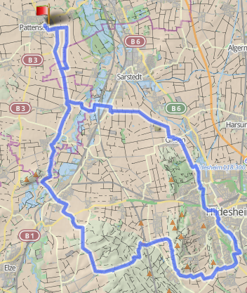

> Quelle [https://www.gpsies.com](https://www.gpsies.com/map.do?fileId=ixxrppzvyejlbbjk)

### 39\. Abendradtour

Die 39\. Feierabend-Radtour startete am Mittwoch den 9\. August mit 3 Radlern zum Julius-Trip-Ring. Die Fahrt ging durch die Leinemasch zum Maschsee. Dort stiegen wir in den Julius-Trip-Ring ein. Weiter durch die Eilenriede zum Steuerndieb. Von dort über die Podbi auf den Pastor-Jäckel-Weg, Niedersachsenring, vorbei an den Herrenhäuser Gärten. An der Wasserkunst überquerten wir die Leine, und fuhren dann an Leine und Ihme entlang zurück. Nach knapp 2 Stunden flotter und schöner Fahrt, fast immer im Grünen, erreichten wir nach 30 km Hemmingen.

### 38\. Abendradtour

Mit nur vier Radlern sind wir am 2.8.2017 über Kückenmühle und Ihme-Roloven zu den Stapelteichen zwischen Weetzen und Vörie gefahren. Nach einer kurzen Pause und Beobachtung eines Eisvogel beim Fischen, ging es über den Vörieberg und Lüdersen zuück. Im Bürgerholz vor Arnum setzte dann leichter Regen ein, der uns aber nicht den Spass an der 30km langen Tour verleiden konnte.

### 37\. Abendradtour

Die 37\. Feierabend-Radtour startete am Mittwoch den 19\. Juni mit 5 Radlern, 3 Damen und 2 Herren. Die Fahrt sollte wegen des sehr heissen Wetters durch die Eilenriede zum Altwarmbüchener See führen. Leider mussten wir die Tour in Misburg abbrechen und fuhren zurück. In Bischhofshol erwischte uns der Regen und wir legten eine Zwangspause ein. Nach ca. 3 Std. und 30 km erreichten wir, nicht mehr ganz trocken, Hemmingen.

### 36\. Abendradtour

Am 05.07.2017 sind wir zu viert eine schöne fotte Tour zum Wasserstassenkreuz nordlich von Seelze gefahren. Am Ihmegraben und Leine entlang ging es an der Leineschleuse vorbei durch Letter und die Leinemasch zum Kolster Marienwerder. Nach kurzer Pause im Hinüberschen Garten lief es weiter zum Brückenbauwerk des Mittellandkanales über die Leine. Die Trogbrücke wurde erklommen und der Mittellandkanal unterquert um weiter über Seelze zum Eisessen zuradeln. Dann über Landstrassen und Feldwegen vorbei am Bentherberg und Bornum haben wir 40km in gut 3 Stunden zurückgelegt.

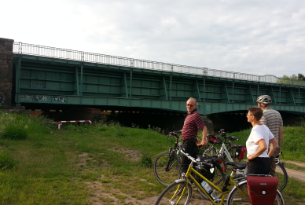

### 35\. Abendradtour

Die 35\. Feierabend-Radtour startete am Mittwoch den 28\. Juni mit 3 Radlern, 1 Dame und 2 Herren, und sollte zum Wasserstrassenkreuz in Garbsen gehen. Die Fahrt ging über Wettbergen, Empelde, rechts am Benther Berg vorbei, durch Velber an den Mittellandkanal. Nach einer kurzen Beratung und einem Blick in die Wolken entschlossen wir uns umzukehren. Daher fuhren wir nach einer kurzen Pause über Ahlem, an Leine und Ihme entlang, zurück. Nach ca. 2 Std. und 30 km erreichten wir, immer noch trocken, Hemmingen.

### 34\. Abendradtour

Die 34\. Feierabend-Radtour startete am Donnerstag den 22\. Juni bei sehr gutem Wetter mit 6 Radlern (3 Damen und 3 Herren). Die Fahrt ging am Maschsee vorbei in die Eilenriede, 
über die Podbi und durch die List bis zum Lister Bad, immer auf guten Fahrradwegen. Danach fuhren wir am Mittellandkanal entlang Richtung Osten bis nach Misburg. Von dort ging es 
am Tiergarten vorbei, durch den Herrmann-Löns-Park in die Eilenriede und zum Maschsee. Nach gut 2 Std. und 35 km erreichten wir nach einer flotten Fahrt Hemmingen, die drohenden Gewitterwolken haben uns wohl beflügelt, aber nicht erreicht.

### Stadtradeln beendet.

Die gefahrenen Kilometer können noch eine Woche lang nachgetragen werden. NICHT VERGESSEN! [https://www.stadtradeln.de/](https://www.stadtradeln.de/home/)

Die ADFC Ortgruppe hat zusammen 7.569,0 km zu den insgesamt 58.671,2 km für Hemmingen beigetragen. Pattensen hat dieses Jahr 27.727 km geschafft. Stand 2017-06-18-So_22h23\. Aber nächstes Jahr schlagen wir Wenningsen.

### Hannah im Mai und Juni in Pattensen

Das Lastenfahrrad Hannah kann im Mai für maximal drei Tage über das Online-Portal [www.hannah-lastenrad.de](http://www.hannah-lastenrad.de/) kostenlos ausgeliehen werden. Es ist zur Zeit stationiert beim

> REWE Center 
> Johann-Koch-Straße 2 
> 30982 Pattensen 
> [Radfahrerkarte](https://www.openstreetmap.org/?mlat=52.2646&mlon=9.7705#map=16/52.2646/9.7705&layers=C)

In dem Markt im Calenberger Center wird das E-Bike Lastenrad über Nacht aufgeladen. Mit dem Lastenfahrrad können zum Beispiel zwei kleine Kinder, der Einkauf, die Grünabfälle oder auch drei Kisten Bier transportiert werden. Das Rad ist ab Dienstag den 2\. Mai im Rewe-Markt stationiert.

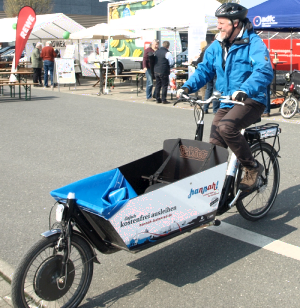

### 33\. Feierabend-Radtour

Die 33\. Feierabend-Radtour startete am Mittwoch den 14\. Juni bei sehr gutem Wetter mit rekordverdächtigen 13 Radlern (5 Damen und 8 Herren). Die Fahrt ging über Empelde, an Ronnenberg vorbei am Benther Berg. An den Sieben Trappen machten wir eine kurze Pause. Anschliessend fuhren wir durch die Felder nach Gehrden. Nach einem kurzen aber sehr steilen Anstieg kamen wir auf einen sehr schönen Rundweg, mit sehr guter Aussicht auf den Deister. Nach einer kurzen Rast mit Fotoshooting fuhren wir um den Gehrdener Berg und zurück über Weetzen, Vörie und Ihme-Roloven. Nach ca. 3 Std. und 35 km erreichten wir Hemmingen.

#### RADTOUR 2 „Im großen Bogen um Pattensen herum"

Am Sonntag den 11.06.2017 gab es die Tour „Im großen Bogen um Pattensen herum". Teilgenommen haben ca. 35 Personen. Angeboten wurden eine ca. 50 Km lange Stecke und auf Wunsch eine kürzere Strecke für Familien. Die Tour führte zunächst aus Pattensen über Arnum nach Devese zum stärkenden Radler-Frühstück bei Mutter Buermann in Devese.

Auch aus Hemmingen wurde vom Treffpunkt Rathausplatz zuerst dorthin gefahren. Nach einer Stärkung und netten Frühstücks-Schnack ging es gemeinsam los. Die Strecke führte zunächst durch das Bürgerholz, nach Ihme-Roloven. In Holtensen durchquerten wir einen Naturerlebnispfad und fuhren aufwärts zu den Windrädern hoch. Hier hatten wir einen herrlichen Ausblick über das Calenberger Land bis nach Hannover. Weiter ging es über Gestorf nach Thiedenwiese und Jeinsen. Dort fuhren wir über die Leinebrücke durch die herrliche Seenlandschaft nach Ruthe. Wir machen einen Abstecher zum Zusammenfluß der Innerste/Leine. Am Versuchsgut vorbei ging es weiter zum gemeinsamen Endpunkt der Tour am Sportlerheim des SV Koldingen am Fußballplatz in Koldingen. Dort gab es die Möglichkeit sich zu stärken und sich bei Imker Könnecke über Bienen und die Imkerei zu informieren. Im Anschluss gab es geführte Rückfahrten durch das Fuchsbachtal zurück nach Pattensen oder über Reden nach Hemmingen zum Rathausplatz. Dauer ca.5-6 Std.

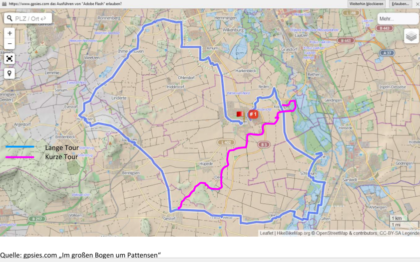 Details siehe <https://www.gpsies.com/> Entdecken/Suche nach "Im großen Bogen um Pattensen".

### 32\. Feierabend-Radtour

Weitere 32 Kilometer fürs Stadtradeln. Zu zweit wurde am 07.06.2017 ab 18:00 Uhr eine nette Tour mit 16,5 km gefahren. Bei Stürmischen Winden und Regen am Horizont sind wir über die neue Brücke nach Devese durch das Bürgerholz nach Ihme-Rolloven und über die Kückmühle nach Wettbergen mit einem Schlenger über Devese zurück zum Radhausplatz gefahren. Also 16 km ohne Pause in gut einer Stunde gemütlich durch die Hemminger Landschaft.

### 31\. Feierabend-Radtour

Die 31\. Feierabend-Radtour startete am Mittwoch den 31\. Mai mit fünf Radlern (2 Damen und 3 Herren). Wir fuhren Richtung Maschsee, dann ging es in die Eilenriede. Über Bischhofshol und den Herrmann-Löns-Park kamen wir zum Tierpark. Der Rückweg ging über den Kronsberg und weiter durch die Leinemasch. Nach ca. 3 Std. und 30 km erreichten wir wieder Hemmingen.

### Stadtradeln gestartet - Sternfahrt war ein Erfolg

Rund 50 Teilnehmer machten am Sonntag, den 28\. Mai bei der Sternfahrt von Hemmingen nach Hannover mit und sammelten Kilometer für das Stadtradeln. Bis zum 17\. Juni kann jeder Kilometer unter [https://www.stadtradeln.de/](https://www.stadtradeln.de/home/) eingetragen werden. Egal ob für Hemmingen oder Pattensen, jeder Kilometer zählt für den Umweltschutz. Lassen Sie das Auto stehen und fahren Sie mit dem Fahrrad zu Arbeit. Morgens munter ankommen und Abends den Stress wegstrampeln. Über 550 Hemminger und Pattenser Radfahren radelten 2016 zusammen mehr als 130000 km!

Fahrrad defekt? Kein Platz zum Schrauben? Werkzeug fehlt? **Ausreden zählen nicht!** Kein Problem. Unsere Fahrrad-Selbsthilfe-Werkstatt Hemmingen in der [Heinrich-Hertz-Straße 23, 30966 Hemmingen](https://www.openstreetmap.org/#map=16/52.3195/9.7241&layers=C) ist jeden Dienstag von 17:30 bis 19:00 geöffnet.

Lasten zu groß? **Keine Ausrede** Leihen Sie sich kostenlos eine Hannah unter <http://www.hannah-lastenrad.de/>. Im Mai und Juni sind unsere Hannahs, mit Elektromotor, stationniert in:

> [Hannah 14](http://www.hannah-lastenrad.de/cb-items/hannah-14): Heinrich-Hertz-Str. 23 30966 Hemmingen, und 
> [Hannah 3](http://www.hannah-lastenrad.de/cb-items/hannah-3): REWE Center Johann-Koch-Straße 2 30982 Pattensen

### 30\. Feierabend-Radtour

Die 30\. Feierabend-Radtour ging am Mittwoch den 17\. Mai mit drei Radlern (2 Herren und 1 Dame) bei sehr gutem Fahrradwetter rund um den Benther Berg. Wir sind gemütlich über Wettbergen zur Kükenmühle geradelt, an Ronnenberg vorbei zu den sagenumwobenen Sieben Trappen bei Benthe. Danach ging es eine kurze Steigung hinauf zum Benther Berg, den wir auf einem schönen Weg umrundeten. Auf der Rückseite hatten wir eine sehr schöne Aussicht über den Gehrdene Berg und den Deister. Anschliessend ging es dann über Empelde und Wettbergen zurück. Nach ca. 2 1/2 Stunden und 28 km waren wir wieder zurück in Hemmingen.

### 29\. Feierabend-Radtour

Die 29\. Feierabend-Radtour startete am Donnerstag den 11\. Mai mit 5 Radlern (2 Damen und 3 Herren). Es wurde eine "tierisch" schöne Fahrt durch die Leinemasch, mit der Beobachtung einer Biberburg in der alten Leine, sowie Störchen, Fischreihern und alles was die Natur so zeigt. Aufgrund bedrohlich aussehender dunkler Wolken verkürzten wir unsere Tour, und waren nach ca. 2 Std. und 24 km wieder in Hemmingen.

#### RADTOUR 1 „Zum Kaliberg Giesen" oder _"mit Rückenwind nach Giesen"_

> 30.04., Sonntag, 14 Uhr, Start am Hallenbad Pattensen

Wir starteten pünktlich um 14 Uhr mit 25 Teilnehmern aus der Region Hannover bei strahlenden Sonnenschein und Windstärke 4 in Böen um 6...! Die Rundtour wurde entgegen der Plannung im Uhrzeigersinn gestartet. Wir fuhren im Zickzackkurs gegen den Nord-Ost-Ost-Wind an und kamen somit, ohne große Anstengungen, gut voran.

Zuerst durchfuhren wir das sonnige Fuchsbachtal, tangierten Reden und überquerten in Koldingen die B443\. Auf der anderen Seite ging es dann auf dem asphaltierten Wirtschaftsweg zum Hopfenberg nach Ruthe. Vom Hopfenberg fuhren wir weiter nach Schliekum und überquerten dort die alte Leinebrücke und machten unterhalb von Schliekum, an einem sehr schönen großen Rastplatz eine 1/2-stündige Pause, wo sich die Radler stärken konnten.

Dann überquerten wir die Leinebrücke und fuhren in Richtung Sarstedter Bahnhof, den wir rollend im Zickzackkurs durch den neuen Bahntunnel unterquerten. Ein Vergnügen! Wir fuhren ein kurzes Stück durch die Altstadt und bogen dann auf einem sehr schönen Radwanderweg an der Innerste ab. Wir sahen einige Kilometer eine wunderschöne Flußlandschaft, kamen am Wehr des Industriedenkmals "Mühle Malzfeldt" vorbei und tangierten die Ortschaft Ahrbergen.

Dann sahen eine kleine Feldsteinkirche in der Landschaft und erreichten bald den Westhang des Kalibergs.

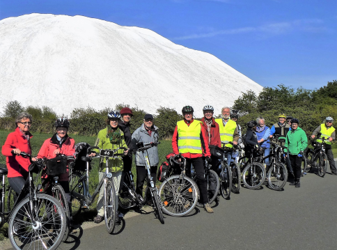

Da wir nun ungeschützt in östlicher Richtung den Berg umrunden mussten, boten wir der Gruppe an, auf die Umrundung zu verzichten und am Rastplatz auf die Radler zu warten, die sich die Strapazen der Umrundung zutrauten. Fast alle wollten aber an der Umrundung teilnehmen. Es war für alle sicher eine große Herausforderung wegen des starken Windes, der nun direkt von vorne kam. Als wir dann in südlicher Richtung und etwas später in westlicher Richtung fuhren, war vom Wind nichts mehr zu spüren.

Wir fuhren dann auf einen westlichen Kurs _mit Rückenwind nach Giesen_, es rollte wie von alleine. Dann fuhren wir über den Giesener Bahnübergang zu den Giesener Teichen, wo viele Ausflügler ihre Würstchen grillten. Nach ein paar hundert Metern machten wir an einem schönen Aussichtspunkt, der auf einer Anhöhe lag, einen Zwischenstopp. Dort hatten die Radler eine Rundumblick über die Giftener Seenplatte und wir sahen auch große Schwärme von Graugänsen, die im Formationflug an uns vorbei flogen.

Über Schliekum ging es dann wieder auf aspaltierten Wirtschaftswegen, an Windrädern und blühenden Rapsfeldern vorbei, zum Ausgangspunkt Pattensen. Vorher machten wir noch einen kurzen Stopp auf dem Wiesenweg der Paten-Obstbaumallee, auf dem "Bürgermeister" Bötger-Rastplatz.

Um 18h kamen wir am Ziel an. Es gab keine technischen und körperlichen Ausfälle.

### 28\. Abendradtour

Die insgesamt 28te oder auch 1ste Abendradtour 2017 fand am 22\. März statt. Wir waren 7 Radler die in der herlichen Abendsonne zum Lindenerberg fuhren. Drei Damen und vier Herren legten jeweils 17,2 km vom Radhausplatz zurück. Die Czillablütte auf dem alten Friedhof ist in vollem Blau bis zum Horizont, das ware eine schöne Auftakttour zum Sasionstart.

### 15\. RadlerTreff am 15\. März 2017

< Bericht folgt>

### 14\. RadlerTreff am 21\. Febr. 2017

< Bericht folgt>

### Die Stadt Hemmingen hat jetzt eine eigene hannah

Matthias Peuker vom ADFC Vorstand war bei der Übergabe mit dabei. Er hat auch die Bilder gemacht. Die ADFC Fahrrad-Selbsthilfe-Werkstatt übernimmt die Wartung.

 Zu buchen ist die hannah Nr. 14 unter <http://www.hannah-lastenrad.de/cb-items/hannah-14> Station Hemmingen Rathaus. Jetzt gibt es keine Entschuldigung mehr; auch der große Einkauf und das Entsorgen der Gartenabfälle geht mit dem Rad.

> Die Hoffnung, dass sich Hannah zu einem „kleinen Leuchtturmprojekt" für das Thema E-Mobilität in Hemmingen entwickeln werde, hegt auch Bürgermeister Claus Schacht. Das Lastenfahrrad, ist er sich mit Axel Schedler einig, habe ein positives Image, von dem Hemmingen profitieren könne. „Nun wünsche ich mir, dass Hannah von den Hemmingern auch ordentlich genutzt wird", sagte der Bürgermeister.

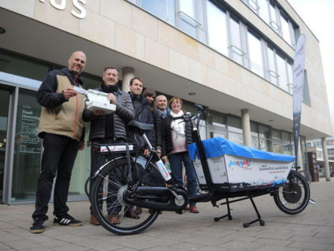

### 15\. Nov. 2016 Fahrrad-Selbsthilfe-Werkstatt Hemmingen ist eröffnet

Die Fahrrad-Selbsthilfe-Werkstatt für Jedermann auf dem Gelände der Flüchtlingsunterkunft in der Heinrich-Hertz-Straße 23 des ADFC Hemmingen / Pattensen ist eröffnet. Mit vielen Besuchern, inklusive Bürgermeister Claus-Dieter Schacht-Gaida, Vertretern der Verwaltung, der Bürgerstiftung Hemmingen, des Flüchtlingsnetzwerks Hemmingen, des ADFC Region Hannover e.V., der Fahrradwerkstatt des Flüchtlingsnetzwerks Pattensen, die uns tatkräftig unterstützt haben, und vielen mehr. Ein Dank geht auch an den Spendern die uns Fahrräder, Sach- und Geldspenden überreicht haben.

Die ersten sechs gespendeten und anschließend reparierten Räder konnten gegen einen Materialkostenbeitrag an Geflüchtete und Inhaber des Hemminger „Aktiv-Passes" ausgegeben werden und eine handvoll Räder konnten vor Ort zusammen mit den Besitzern repariert werden. Im Wochenrhythmus, jeden **Dienstag von 17.30 und 19.00 Uhr** soll es weiter gehen.

Auch in Zukunft werden nicht mehr benötigte Fahrräder, Fahrradwerkzeug, Zubehör, Ersatzteile, Schlösser, Helme und Kindersitze gebraucht. Natürlich freuen wir uns auch über ehrenamtliche Mitarbeit - ob bei der Fahrradausgabe, Organisation oder in der Werkstatt, und ebenso über finanzielle Unterstützung.

Ermöglicht wurde der Start durch Förderung seitens der Bürgerstiftung Hemmingen, des Flüchtlingsnetzwerks Hemmingen, der Stadt Hemmingen sowie durch die Hemminger Fahrradhändler Carsten Hische vom Zweirad-Fachwerk und Axel Rauer von Radsport Arnum und Spenden seitens Zubehörhersteller.

Kontakt:

- Mailadresse: [Fahrrad-Selbsthilfewerkstatt-Hemmingen@web.de](mailto:Fahrrad-Selbsthilfewerkstatt-Hemmingen@web.de)

  <!--- Dirk Härtel: 0511-4104749 (mit AB)-->
  - Michael Maier: 0511-429234 (mit AB) oder 0177-3087040 (mit AB)
  - Udo Scherer: 0152-09800808 (nach 17.00 Uhr)

- Konto: IBAN DE97 2509 0500 0000 9205 50, BIC GENODEF1S09, Sparda Bank Hannover e.G., **Verwendungszweck: ADFC Selbsthilfewerkstatt Hemmingen** und Anschrift (für eine Spendenbescheinigung)

- **Presseartikel**: [ADFC Region](http://www.adfc-hannover.de/adfc-fahrrad-selbsthilfe-werkstatt-in-hemmingen/)

### Fahrrad-Selbsthilfe-Werkstatt Hemmingen auf dem Weg

Der ADFC Hemmingen / Pattensen wird mit Unterstützung der Stadt Hemmingen eine Fahrrad-Selbsthilfe-Werkstatt für Jedermann auf dem Gelände der Flüchtlingsunterkunft in der Heinrich-Hertz-Straße 23 aufbauen. Der Nutzungsvertrag ist unterschrieben und die Vorbereitungen für die Werkstatteinrichtung sind gestartet. Die Ortsgruppe möchte allen interessierten Bürgerinnen und Bürgern, insbesondere den Geflüchteten eine Unterstützung bei der Wartung, Reparatur und Aufbereitung von Fahrrädern bieten und die Stadt möchte die vorhandenen Räumlichkeiten in der Heinrich-Hertz-Straße sinnvoll genutzt wissen. Sie stellt sie dem ADFC kostenlos zur Verfügung. Zunächst werden die Räume hergerichtet und dann sollen dringend benötigte Spenden-Fahrräder eingesammelt, aufbereitet und an Bedürftige gegen einen kleinen Materialkostenbeitrag weitergeben werden. Die Ehrenamtlichen ADFC-Mitglieder arbeiten dabei eng mit der Fahrradwerkstatt des Flüchtlingsnetzwerks Pattensen zusammen und werden die dortigen Erfahrungen auch in Hemmingen umsetzen.

Gemeinsam haben Stadt Hemmingen und der ADFC das Projekt jetzt auf den Weg gebracht und nach der offiziellen Schlüsselübergabe soll das Projekt zügig anlaufen.

Ermöglicht wird der Start bislang durch Förderung seitens der _Bürgerstiftung Hemmingen_, des _Flüchtlingsnetzwerks Hemmingen_, bei dem der ADFC mitarbeitet sowie durch die Hemminger Fahrradhändler Carsten Hische vom _Zweirad-Fachwerk_ und Axel Rauer von _Radsport Arnum_ sowie Spenden seitens _Zubehörhersteller_. Einige Spendenfahrräder sind schon da und der ADFC bedankt sich bei allen, die zum Erfolg beitragen. Perspektivisch sollen auch die Geflüchteten intensiv in die Arbeit eingebunden werden.

Schon am **Dienstag, 15\. November, von 17.30 Uhr bis 19.00 Uhr** wollen die Aktiven die Tore öffnen. Dann soll es im Wochenrhythmus jeden Dienstag weitergehen.

Damit das funktioniert, werden nicht mehr benötigte Fahrräder gesucht, die von Bürgern gerne in der Heinrich-Hertz-Straße 23 zu den Öffnungszeiten abgegeben werden können. Falls ein Transport nicht möglich ist, können diese auch abgeholt werden. Auch Fahrradwerkzeug oder Zubehör und Ersatzteile können gerne abgegeben werden.

Die Ehrenamtlichen der ADFC Ortgruppe freuen sich auch über engagierte Menschen, die sich bei der Fahrradausgabe, der Organisation oder der technischen Aufbereitung der Räder einbringen wollen. Alle sind willkommen. Wer die Materialbeschaffung und den Betrieb finanziell unterstützen möchte kann dies auch gerne tun. Der gemeinnützige Verein stellt auch gerne Spendenquittungen aus.

Kontakt:

- Mailadresse: [Fahrrad-Selbsthilfewerkstatt-Hemmingen@web.de](mailto:Fahrrad-Selbsthilfewerkstatt-Hemmingen@web.de)

  <!-- Dirk Härtel: 0511-4104749 (mit AB) -->
  - Michael Maier: 0511-429234 (mit AB) oder 0177-3087040 (mit AB)
  - Udo Scherer: 0152-09800808 (nach 17.00 Uhr)

- Geldspenden werden gern angenommen unter der IBAN DE97 2509 0500 0000 9205 50, BIC GENODEF1S09, Sparda Bank Hannover, **Verwendungszweck: "ADFC Selbsthilfewerkstatt Hemmingen"** und Anschrift (für eine Spendenbescheinigung)

- **Presseartikel**: [Leine Nachrichten](pdf/161021_LKLN_VP_01-1.pdf)

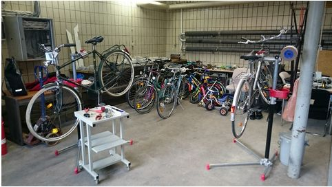

Wer Lust hat beim Herrichten der Räume und Spendenfahrräder mitzuarbeiten oder das Team bei der Fahrradausgabe zu unterstützen, kann sich am Besten bei den Kontaktpersonen melden. Ab sofort werde die Dienstage 17:30 bis 19:00 Uhr (oder länger) dazu. **Dazu brauchen wir Menschen, die uns unterstützen** bei:

- _Fahrradschrauben_ - Dienstags zu den Öffnungszeiten in Pannen zusammen mit den Fahrradeigentümern beheben oder zu einem anderen Tag in Ruhe und Gelassenheit Spendenfahrräder aufbereiten.
- _Ausgabe der Räder organisieren_, Buchführung und KassenwartIn - die Aktiven aus Pattensen zeigen uns geduldig, wie es gehen kann und auch im Trubel der Überblick bewahrt bleibt.
- _Beratung_: Mit den Interessenten ein passendes Fahrrad aussuchen, Testfahrt beobachten und die Entscheidungsfindung unterstützen. Verkehrsregeln für Fahrradfahrer in verschiedenen Sprachen gibt es beim Bistum in Trier zum [Download](http://www.bistum-trier.de/willkommens-netzde/service-grafik-weitere-informationen-fuer-die-praxis/informationsmaterial-zum-download/?L=0)
- _Fahrradtransporte_: Ob mit Fahrradanhänger oder PkW, Spendenfahrräder können meist nicht von den Spendern zu uns gebracht werden und müssen abgeholt werden

### Hat unsere Stadt ein Herz fürs Rad?

Macht das Radfahren in unserer Stadt Spaß oder Stress? Bewertet mit wenig Aufwand die Fahrradfreundlichkeit in Ihrer Stadt – und gebt der Politik und Verwaltung eine wichtige Rückmeldung aus Sicht der „Alltagsexperten“.

Noch bis zum 30. November 2016 auf [ADFC-FAHRRADKLIMA-TEST 2016](http://www.fahrradklima-test.de/)

### 30. Oktober 2016 - 5. Sonntagstour - Radtour „Pattensen - Kleiner Deister - Osterwald“

Am Sonntag den 30.10. starteten wir mit leichter Verspätung. An der Tour nahmen diesmal 2 Damen und 6 Herren teil. Alle Teilnehmer waren sehr gut drauf und wir starteten bei bedeckten Himmel, ohne
Regen und wenig Wind, erwartungsvoll in die weite Landschaft des Calenberger Landes.
Nach einer knappen Stunde erreichten wir einen sehr schönen Aussichtsberg im
Bereich der Giftener Seen und des SCS (Segelclub Sarstedt).
Wir konnten rastende Zugvögel beobachten!

Danach durchquerten wir das dörflich stark geprägte Barnten mit seinem schönen
Dorfplatz und vielen restaurierten Fachwerkhäusern. Sehenswert dieses Dorf,
besonders das Cafe in einem restaurierten Fachwerkhaus (s.Foto).
Die Zeit reichte leider nicht um dort einzukehren!

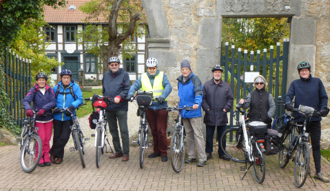

In Nordstemmen machten wir unsere erste längere Rast und stärkten uns in einem
gemütlichen Eiscafe mit großen Eisbechern und Cappucino.

Von dort ging es weiter durch die Nordstemmer Seenplatte zur Klosterkirche
Wittenburg, wo wir einen ziemlichen Anstieg zu bewältigen hatten.
Dafür wurden wir mit der schönen Aussicht, die bis zum Giesener Kalkberg reichte,
belohnt!

Nun ging es im zügigen Tempo abwärts in Richtung Osterwald zum Klostergut
Wülfinghausen, auf asphaltierten Wirtschaftswegen an Apfelbaumalleen vorbei, und so
mancher Apfel landete in den Packtaschen der Radler!
Herrlich anzusehen war auch der herbstlich gefärbte Laubwald.

Die 2.längere Rast machten wir im Cafe Am Waldkater, wo wir leckere frisch gegrillte
Bratwürste verspeisten und Obstsäfte tranken.
Nun hatten wir  die richtige Power um die paar vor uns liegenden Steigungen im
Kleinen Deister zu bewältigen.
Wir fuhren dann in den Saupark hinein und innerhalb der kilometerlangen über
hundert Jahre alten Mauer hinunter zum Wisentgehäge. Dort fand gerade das                         Hubertusfest statt, so weit das Auge reichte, nur tausende parkende Autos.

Die letzte Etappe war mit kurzen Trinkstops, schnell bewältigt. Gegen 17h trafen
wir wieder am Ausgangspunkt Hallenbad Pattensen ein, **Tourlänge 60 km!**
Es gab keine körperlichen und technischen Ausfälle, da alle Beteilgten sich gut
vorbereitet hatten! So macht das Ganze Spass!

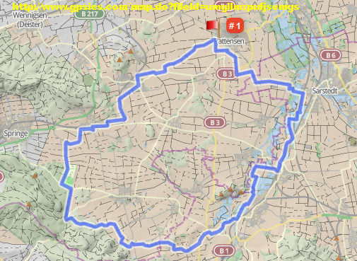

### 02. Oktober 4. Sonntagstour - Radtour „Durch das Calenberger Land“

Mit kurzer Verspätung starteten wir bei bedeckten Himmel, aber trocken, in südlicher
Richtung nach Hüpede, wo wir uns die schöne Jahrhunderte alte Dorfkirche anschauten.
Dann fuhren wir weiter nach Oerie, durchquerten den Oerier Wald und machten am
idyllischen Rastplatz unseren ersten Zwischenstop.

Nun zeigte sich auch noch die &#x2600; Sonne und bestens gelaunt ging es auf einem etwas abenteuerlichen
Pfad durch das Jeinser Holz! Wir sahen sogar 4 Rehe am Waldrand. Anschließend fuhren wir weiter                     auf einem asphaltierten Wirtschaftsweg nach Gestorf. Dort schauten wir uns das ca.750 Jahre alte Schloss an.

Anschließend fuhren wir über den Gestorfer Erdbeerhof weiter in Richtung Hallerburger Holz.
Entlang des Weges gab es viele Obstbäume und wir stärkten uns mit den leckeren und reifen
Früchten! Danach durchquerten das Naturshutzgebiet Hallerburger Holz und kamen an weiteren
Obstbaumalleen vorbei, bis nach Adensen. Dort fuhren wir zur uralten Stein-Dorfkirche, die
besichtigt werden konnte.

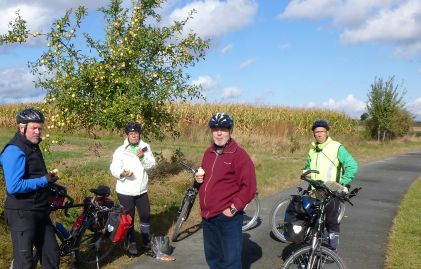

Mit gemächlichen Tempo ging es dann weiter über Hallerburg, Sonnenborn bis nach Eldagsen.
Dort fand gerade das Kürbisfest statt, welches wir besuchten.
Von dort fuhren wir weiter auf guten Wegen nach Mittelrode, wo wir unsere Mittagspause
bei Kaffee und leckeren Kuchen im Garten des Hofcafes verbrachten!
Wir schauten uns auch noch das freilaufende "Glücksschwein" im hinteren Teil des Gartens an, bevor wir uns         
in Richtung Rittergut Bockerode auf den Weg machten, welches wir durchquerten.
Danach ging es weiter in nördlicher Richtung nach Bennigsen.

Wir konnten wegen der klaren Sicht ringsherum örtliche Regenschauer ausmachen, die uns aber
nicht trafen und so kamen wir fast trocken in Lüdersen an. Von dort ging es auf dem Calenberger
Ackerweg weiter in Richtung Pattensen. Bei einem kurzen Zwischenstop stellten wir fest, dass
die gute Fernsicht bis zum Brocken reichte.

Gegen 15:30 kamen wir wieder am Ausgangspunkt in Pattensen an. Es gab keine körperlichen
und technischen Ausfälle. Die Teilnehmer waren sehr zufrieden mit der durchgeführten Tour und werden
uns weiter empfehlen. Wir fuhren insgesamt ein sehr moderates Tempo mit einigen Zusatzstops, was aber
gut bei den Teilnehmern ankam. Es war eine sehr abwechslungsreiche Tour!

### 14. August 3. Sonntagstour

Mit leichter Verspätung, starteten
wir mit 7 Herren und 3 Damen bei allerbestem Wetter, durch die Feldmark, an Windrädern
vorbei nach Jeinsen, wo wir den schönen Dorplatz überquerten und weiter nach
Schulenburg fuhren. Wir schauten uns das ehemalige und vorbildlich restaurierte
Gut von Ernst-August von Hannover, von außen an.

Hinter Schulenburg fuhren wir auf dem Leine-Heide-Radweg in Richtung Nordstemmen,
das Schloß Marienburg immer im Blick. Hinter Burgstemmen gab es die erste "Bergprüfung", die
4 E-Bike-Radler zogen zügig den Berg hinauf, aber auch die anderen schoben ihr Radl nicht.

Dann ging es weiter zum kleinen Örtchen Haus Escherde, am Rande des Hildesheimer
Waldes. Dort schauten wir uns das aus dem 12.JH stammende Klostergut an. Hier gab es
auch eine Einkehrmöglichjkeit in der historischen Gaststätte Klosterstuben.
Nach dem wir uns gestärkt hatten, begann die 2. Bergprüfung. Es ging ca. 2KM hinauf
zum Escherberg. Oben angekommen wurden wir mit einer entspannenden Abfahrt in
Richtung Sorsum belohnt! Unten angekommen ging es natürlich wieder aufwärts,
zum Rottsberg und weiter zu den Bosch-Blaupunkt Werken!
Hier mussten wir eine Radlerin, die Probleme mit Ihrem E-Bike hatte, verabschieden!
Sie wurde dann kurz danach mit dem PKW abgeholt!

Dann wieder eine rasante Abfahrt zum Kloster Marienrode (12.JH). Wir schauten uns die
beeindruckende Anlage an und gingen auch in eine der beiden Klosterkirchen!

Von dort aus fuhren wir durch eine landschaftlich sehr schöne Gegend hinauf zum
Steinberg, wo sich eine empfehlenswerte historische Gaststätte mit Wildgehege befindet.
Von dort aus ging es dann nur noch bergab ins Innerstetal zwischen Marienburg und Hildesheim.

Nach ein paar Kilometer Fahrt am Fluss entlang, kehrten wir in das Inselcafe in Hildesheim ein, und genossen
auf der Terrasse Kaffee und Kuchen und konnte sogar im Wildwasser-Parcour die Kanufahrer beobachten,
wie sie kenterten!

Von dort aus ging es im zügigen Tempo weiter über Giesen nach Giften, an den Giftener Teichen vorbei
zurück nach Jeinsen und Pattensen, wo sich der Kreis schloss!

Es gab, bis auf das technische Problem mit dem E-Bike, keine körperlichen Ausfälle, alle
Radler waren von der Vielfäftigkeit der Strecke begeistert und rundum zufrieden!

### 10. August: 25. Feierabendtour
Die 25. Feierabend-Radtour startete am Mittwoch den 10. August mit 7 Radlern (2 Damen und 5 Herren). Die Fahrt ging über Empelde, an Ronnenberg vorbei nach Gehrden. Von dort ging es auf einem sehr schönen Rundweg mit guter Aussicht auf den Deister, um den Gehrdener Berg. Zurück fuhren wir über Weetzen, Vörie und Ihme-Roloven. Nach ca. 3 Std. und 35 km erreichten wir Hemmingen.

### 3. August: 24. Feierabendtour

Die 24. Feierabend-Radtour startete am Mittwoch den 3. August mit vier Radlern.
Die Fahrt ging über Empelde, am Benther Berg vorbei, durch Velber an den Mittellandkanal.
Von dort fuhren wir nach einer kurzen Pause über Ahlem, an der Leine und Ihme zurück.
Nach ca. 2 Std. und 30 km erreichten wir, immer noch trocken, Hemmingen.

### Hannah, das Lastenrad, stand im Juli zum kostenlosen Ausleihen in Pattensen beriet.

Ein original „Bakfiets“ aus den Niederlanden ist diese Hannah. Die darf maximal 180kg beladen, inklusive Fahrer/in, beladen werden. Auf der Sitzbank können zwei Kleinkinder sitzen, die mit den Dreipunktgurten sicher angeschnallt werden.
Diese Hannah ist mit Elektromotor ausgestattet und besonders leicht zu fahren! Der volle Akku bringt dich bis zu 90km durch die Region.

Vom 1. Juli 2016 - 31. Juli 2016 konnte Hannah während der Öffnungszeiten an der Verleihstation kostenlos ausgeliehen werden. Vorher musste Hannah über [Hannahs Webseite](http://www.hannah-lastenrad.de/cb_items/hannah-4) gebucht werden.

    REWE Lutz Ahlers OHG
    Johann-Koch-Straße 2
    30982 Pattensen

    Öffnungszeiten: Mo-Sa 07:00-22:00 Uhr

### 28. Juli: 23. Feierabendtour

Die 23. Feierabendtour startete diesmal am Donnerstag, den 23. Juli wieder von Pattensen aus!

Mit einer Damen und drei Herren, alle aus Pattensen, mit bedeckten Himmel und angenehmer Temperatur von 21° C startete die Gruppe in südlicher Richtung. Es ging auf dem "Oerier Wald und Flurweg" zum Rastplatz am Oerier Wald.

Von dort aus fuhren wir über einen schmalen Waldpfad durch das Jeinser Holz,
weiter zum Gestorfer Erdbeehof, wo wir uns die Anlage anschauten.

Von dort aus fuhren wir an der Obstbaumallee vorbei ins Hallerburger Holz.
Auf dem schönen Adenser Dorfplatz legten wir eine kurze Pause ein und fuhren
dann hinauf zum Marienberg. Oben angekommen, fuhren wir auf einem
abenteuerlichen Pfad am Waldrand wieder den Berg hinunter nach Schulenburg.

Ziel war der schöne Biergarten in Jeinsen, wo wir die verdiente Currywurst samt
Weizenbier zu uns nahmen! Nach einem kurzen Wolkenbruch machten wir
uns auf den Heimweg nach Pattensen!

### Die ersten Fahrradstraßen in Hemmingen wurden eingerichtet  
&#x1f6B2; Der Köllbrinkweg, der Klewertweg und in Abschnitten der Straßen "Börie" und "Im Dorffeld" sind jetzt **Fahrradstaßen**. Fahrradstraße? Was bedeutet das? [Hier bekommen Sie alle Informationen!](https://www.stadthemmingen.de/portal/meldungen/hier-haben-radfahrer-jetzt-vorrang-907000467-22500.html?rubrik=907000001)

### 20. Juli: 22. Feierabendtour

Die 22. Feierabend-Radtour startete am Mittwoch den 20. Juli mit fünf Radlern (1 Dame und
4 Herren). Bei ca. 30 ° im Schatten war klar, möglichst viel im Wald zu fahren. Es ging
in die Eilenriede, vorbei am Zoo, Steuerndieb und Herrmann-Löns-Park kamen wir zum Tierpark.
Der Rückweg ging nach einer kurzen Rast vorbei am Kronsberg und durch die Leinemasch.
Nach ca. 3 Std. und 35 km erreichten wir wieder Hemmingen.

### 13. Juli: 21. Feierabendtour
Die 21. Feierabend-Radtour sollte zu den Giftener Seen führen. Trotz dicker, schwarzer Wolken
starten vier unentwegte Radler gen Süden. Über Harkenbleck und Koldingen ging es nach Ruthe.
An der Versuchsantalt der Uni Hannover beschlossen wir, nach einem Blick zum Himmel, die Tour
abzukürzen und fuhren an den Koldinger Teichen vorbei, zurück in die Leinemasch. Der Rückweg
wurde durch eine halbstündige Regenpause unterbrochen. Wir erreichten Hemmingen nach
ca. 30 km nicht mehr so ganz trocken.

### 6. Juli: 20. Feierabendtour
Die 20. Feierabend-Radtour ging am Mittwoch den 6. Juli bei trockenem und windigem Wetter mit einigen kurzen Zwischenstopps mit 5 Radlern und knappen 28 Kilometern gegen 20:30 Uhr zu Ende.

### 29. Juni: 19. Feierabendtour
Die 19. Feierabend-Radtour ging am Mittwoch den 29. Juni mit 4 Damen und 5 Herren auf eine Radrundreise ins südlichen Calenberger Land. Vom Rathaus in Pattensen ging es durch die schöne Pattenser Altstadt mit Gegenwind in Richtung Hüpede. Mit moderatem Tempo weiter durch eine leicht hügelige Landschaft mit sehr guter Fernsicht, in Richtung Bennigsen. Am Rittergut [Bockerode](http://www.bockvonwuelfingen.info/) erlaubte der Besitzer uns auf einer gemütlichen Rundbank unter einem großen Baum eine Pause einzulegen. Über Hallerburg und Gestorf ging es wieder zum Ausgangspunkt Pattensen.

### 22. Juni: 18. Feierabendtour
Die 18. Feierabend-Radtour ging am Mittwoch den 22. Juni mit sechs Radlern (4 Herren und 2 Damen)
bei sehr gutem Wetter, auf vielfachen Wunsch nochmals durch die Eilenriede und den Herrmann-Löns-Park zur
Anderter Schleuse. Nach einer kurzen Rast ging es auf den höchsten Punkt des Kronsbergs (118 m ü. NN).
Die schöne Aussicht über Hannover und bis zum Brocken entschädigte für den letzten steilen Anstieg.
Nach ca. 3 Std. und 35 km erreichten wir wieder Hemmingen.

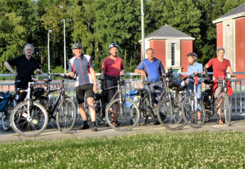

### Der 13. RadlerTreff
Der 13. RadlerTreff fand am **16. Juni 2016 um 19:00 im Bürgersaal** Hemmingen (Im Rathaus, EG) statt. Themen waren u.a. Stadtradeln und Berichte über diverse Sitzungen.

### 15. Juni: 17. Feierabendtour
Die 17. Feierabendtour, mit 22 km Länge, verlief am 15. Juni mit 4 Personen über Wettbergen, Bornum, Lindener Berg, Linden, Maschsee und Döhrener Wolle.

### 8. Juni: 16. Feierabendtour
Die 16. Feierabendtour ging an 8. Juni mit 3 Damen und 3 Herren, bei schönem Wetter, gemütlich durch die Leine-Marsch. Nach einem Besuch des Park der Sinne und 25 km Strecke ging die Tour zu Ende.

### 5. Juni:  „Im großen Bogen um Pattensen herum“
Mit 40 TeilnehmerInnen und jeweils 52 gefahrenen Kilometern und insgesamt 2080 km haben wir einen wundervollen Tag verbracht und danken als ADFC allen, die das ermöglicht haben und insbesondere den Mitgestalterinnen und unseren Tourenleitern und natürlich allen TeilnehmerInnen, denen es sehr gut gefallen hat. Und das, obwohl die kalte Dusche des Gewitterschauers auf den letzten Kilometern einige doch noch bis auf die Haut durchnässt hat.

Die ca. 50 Km lange Stecke führte uns über Arnum durch das Bürgerholz zum Radlerfrühstück nach Devese zu Mutter Buermann. Gestärkt ging es weiter über Ihme-Roloven nach Holtensen und aufwärts zu den Windrädern bei Lüdersen hoch. Weiter geht es über Gestorf nach Thiedenwiese und Jeinsen. Dort fuhren wir über die Leinebrücke durch die herrliche Seenlandschaft nach Ruthe. Am Versuchsgut vorbei geht es weiter nach Koldingen, und durch das Fuchsbachtal zurück
nach Pattensen zu dem Erlebnistag am Calenberg-Center.

Mehr Eindrücke von unserem Stadtradelstar [hier](https://www.stadtradeln.de/index.php?L=1&id=2520&sr_post_id=231).

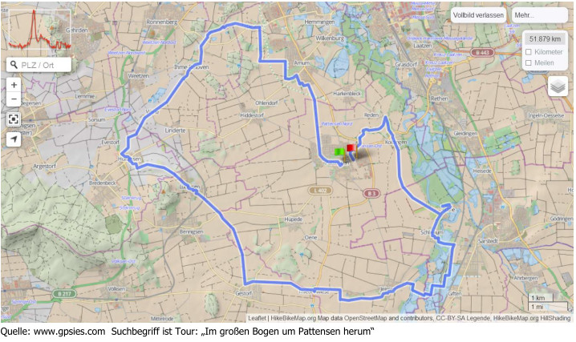

### 2. Juni: Die feuchtfröhlichen 15. Feierabend-Radtour
Die 15. Feierabend-Radtour ging am Donnerstag den 2. Juni mit fünf Radlern (3 Herren und 2 Damen)
bei anfangs gutem Wetter rund um den Benther Berg. Wir sind gemütlich über Wettbergen zur
Kükenmühle geradelt, an Ronnenberg vorbei zu den sagenumwobenen Sieben Trappen bei Benthe.
Danach ging es eine kurze Steigung hinauf zum Benther Berg, den wir auf einem schönen Weg umrundeten.
Leider zog plötzlich ein Gewitter auf, und es begann heftig zu regnen. In Benthe fanden wir einen Unterschlupf.
Nach einer kappen halben Stunde war der Spuk vorbei und wir konnten unsere Fahrt fortsetzen.
Auf schnellstem Weg ging es dann über Empelde und Wettbergen zurück. Nach ca. 2 1/2 Stunden,
28 km und einer feuchtfröhlichen Fahrt waren wir wieder zurück in Hemmingen.

### 29. Mai: Unser Start zur Sternfahrt
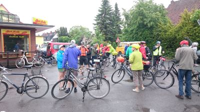
Mit Kaffee und Brötchen starteten viele Pattenser und Hemminger um 11:15 zur Sternfahrt.

### Am 12.06.2012 fand der diesjährige Rad-Wander-Tag statt
Am 12. Juni 2016 veranstaltet der ADFC Region Hannover
in Kooperation mit der AOK Hannover, der Region
Hannover und der Hannoverschen Allgemeinen Zeitung
eine ganztätige Radtour in und um Hannover.
Der [RAD-WANDER-TAG](http://www.adfc-hannover.de/3-adfc-rad-wander-tag/) war eingebunden in den Wettbewerb
„Stadtradeln“, der vom 29. Mai - 18. Juni 2015 stattfand.

### Die 14. Abendradtour
Die 14. Feierabend-Radtour ging am Mittwoch den 25. Mai mit fünf Radlern (3 Herren und 2 Damen) bei gutem Wetter
zum Süllberg bei Lüdersen. Wir sind gemütlich über Wettbergen zur Kükenmühle geradelt, auf einem Rundweg um Ihme-Roloven, weiter nach Vörie und Holtensen. Hinter der Kirche haben wir einen Naturlehrpfad durchfahren Danach ging es ziemlich steil den Süllberg hinauf. An einem Windrad haben wir Rast gemacht und hatten einen schönen Rundumblick auf Deister, Gehrden, Benter Berg und Hannover. Leider war es etwas diesig. Danach konnten wir die Abfahrt nach Lüdersen genießen. Im Bereich Pattensen befuhren wir u.a. den "Calenberger Ackerweg" den das Wegeteam vor kurzem mit Hinweisschildern, über die auf den Feldern angebauten Getreidesorten und Feldfrüchte, versehen hat. Dann ging es weiter durch Hiddesdorf und Arnum. Nach ca. 2 1/2 Stunden, 28 km und einer sehr schönen Fahrt waren wir wieder zurück in Hemmingen.

### Werbung für das Stadtradeln
Am Do. den 12. Mai gab es einen Stand auf dem Hemminger Wochenmarkt um das Stadtradeln bekannt zu machen.
Organisiert wurde der Stand von der Stadt Hemmingen, der Region Hannover und dem ADFC.
Anmelden kann sich jeder unter [Stadtradeln.de](https://www.stadtradeln.de/home.html).
Die Stadt Hemmingen ist das erste Mal dabei. Jeder Bürger, Vereine, Schulklassen und Firmen können sich beteiligen und die gefahrenen Fahrradkilometer im Zeitraum vom 29. Mai bis 18. Juni einbringen. Als Stadtradel-Star wird Alexandra Jaeger in den drei Wochen ihr Auto gegen Hannah, das Lastenrad-Pedelec des ADFC tauschen.

### Die 13. Abendradtour
Die 13. Feierabend-Radtour ging am Mittwoch den 11. Mai mit vier Radlern (3 Herren und eine Dame) bei herrlichem Sonnenschein zur Anderter Schleuse. Wir sind in knapp 3 Stunden gemütlich an den Hemminger Teichen vorbei zum Maschsee, dann durch die Eilenriede Richtung Bischofshol, den Herrmann-Löns-Park, bis zum Mittellandkanal gefahren. An der Anderter Schleuse haben wir eine kurze Rast eingelegt und konnten die Schleuse in Betrieb sehen. Der Rückweg ging dann über den Kronsberg mit schöner Aussicht über Hannover, am Expo-Gelände vorbei, durch Laatzen und die Leinemasch. Nach gut 32 km und einer abwechslungsreichen, kurzweiligen Fahrt waren wir pünktlich zum Sonnenuntergang zurück in Hemmingen.

### 1. Sonntags Radtour zum Kaliberg Giesen
Am **24. April 2016** ist eine Gruppe von Radlern zum Kaliberg Giesen gefahren. Gegen 14:15 hörte der Schneeregen auf und die Sonne kam durch. Die Radler waren, entsprechend der Witterung, gekleidet, und haben einstimmig beschlossen die Tour zu fahren. Über die Calenberger Ackerwege und Schliekum, fuhren sie durch die schöne frühlingshafte Seenlandschaft bei Giften. Weiter ging es über Feldwege in Richtung des schon sichtbaren Kalibergs. Nach dem Studium der Schautafeln über das ehemalige Kalibergwerk und eine Umrundung des Kalibergs ging es weiter über die Innerste, den romantischen Innerste-Heide-Radweg entlang, an Technikdenkmälern vorbei bis nach Sarstedt hinein! Anschließend ging es am landwirtschaftlichen Lehrgut vorbei nach Koldingen. Zwischendurch gab es viele kleine und große Pausen mit Besichtigungen. Alle waren bester Laune und alle waren sehr zufrieden mit der 38 km langen Tour!

### Frühlingsauftakt - 12. Abendradtour
Die erste &#x1f6B2; Frühlingsauftagtradtour am Donnerstag den 14.April hat mit fünf Radlern
(4 Herren und eine Dame) über den Lindenerberg geführt. Wir sind in gut 2
Stunden gemütlich über die Kückmühle, an Mühlenberg vorbei durch die blühenden
Schrebergärten in Bornum auf den Lindenerberg gefahren. Nach einer kurzen Pause
im Garten auf dem Friedhof, mit einem kleinem Rest von Scilla-Blüten ging es im
Zickzack durch Linden. An der Bettfedernfabrik vorbei, an der Ihme und durch die
Leinemarsch zurück zum Rathausplatz. Nach gut 24 km und netten Gesprächen im
herrlichen Sonnenschein eine schöne Feierabend-Radtour.

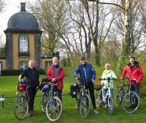

### Koordinierungskreis
Am Montag, den 11. April wurde in Hemmingen der **Koordinierungskreis des '[Hemminger Netzwerk für Flüchtlinge](http://www.fluechtlinge-hemmingen.de/)'** gegründet. Mitglieder sind Vertreter der Arbeitsgruppen wie. z.B. die Deutschgruppen, das interkulturelle Kreativ-Kaffee, Patenschaften und die ADFC Ortsgruppe Hemmingen/Pattensen &#x1F527;.

### Info-Stand
Am verkaufsoffenen Sonntag, den 10. April 2016 am Rewe-Center, hatte der **ADFC einen Infostand** aufgebaut. 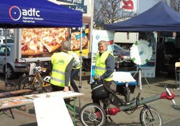. Links und rechts neben dem ADFC-Stand gab es Informationen vom Wegeteam, Netzwerk für Flüchtlinge und zum Thema Stadtradeln &#x1f6B2;.  
Auf dem ADFC-Stand gab es Informationen rund um das Lastenrad "Hannah", die geplanten Radtouren und einen Stadtplan auf dem Besucher mithilfe von Klebepunkten positive und auch kritische Radwegeführungen in Pattensen markieren konnten. 

### 12. RadlerTreff
Der **12. RadlerTreff fand am 6. April um 19:00** in den Räumlichkeiten **Villa MitMensch** des Bundesverband Selbsthilfe Körperbehinderter e.V. in Pattensen statt. Besprochen wurden Aktionen zum fairen Umgang aller Verkehrsteilnehmer im Straßenverkehr. Das geplante Fahrradkompetenztraining "Train the Trainer" in Zusammenarbeit mit den Flüchtlingsnetzwerkern aus Pattensen. Veranstaltungen zum [Stadtradeln 2016](https://www.stadtradeln.de/home.html), das dieses Jahr vom 29. Mai bis 18. Juni stattfindet. Der ADFC wird eine gemeinsame Tour zur Auftaktveranstalltung "Fahrradsternfahrt" am 29.05.2016 (über die Schnellwege) von Pattensen, über Harkenbleck, Wilkenburg und Hemmingen Dorf anbieten. Weiterhin wurde die Organisation des ADFC-Infostandes am verkaufsoffenen Sonntag, den 10. April am Rewe Center besprochen. Weitere Themen waren die geplanten Touren, der Schulwegplan Pattensen und vieles mehr.

Am Mittwoch den 24. Februar 2016, um 19:00 im Bürgersaal Hemmingen, fand die **erste Jahreshauptversammlung nach der Gründung** der Ortsgruppe am 19. Mai 2015 statt.

Anwesend waren 13 Personen, davon 7 Wahlberechtigte. Nach dem Rechenschaftsbericht wurden die bisherigen Sprecher durch eine Neuwahl bestätigt.

Seit der Gründung wurden zehn Abendradtouren durchgeführt, diese Webseite eingerichtet und einige Presseartikel veröffentlicht. Wir beteiligen uns an der Fahrradwerkstatt vom Flüchlingsnetzwerk Pattensen, wir waren beim Erörterungstermin zum Planfeststellungsverfahren der Stadtbahn dabei und wir haben für 6 Wochen das Lastenrad Hannah kostenlos verliehen.

Zur Zeit begleiten wir die Initiative zur Erstellung eines Schulwegplans für Pattensen, knüpfen Kontakte für ein Fahrradtraining für Flüchtlinge, planen vier große Radtouren im Raum Pattensen, viele neue Abendtouren in Hemmingen und vieles mehr.

Im Anschluss gab es einen Vortrag über das Projekt OpenStreetMap (OSM). Was ist OSM und wie kann man mitmachen? http://www.openstreetmap.org/

**Studenten stellten ihre Arbeit vor** , u. a. ein Radverkehrskonzept für die Göttinger- , die Hiddesdorfer- , und Liebigstr. in Pattensen. Termin war Montag, den 25. Jan. 2016 um 18:30 in der Aula der Grundschule Pattensen.

Der 10. RadlerTreff fand am Mittwoch den **20. Januar 2016**, um 19.00 Uhr im Calenberger Hof in Pattensen statt.
Sechzehn interessierte Radlerinnen und Radler u. a. aus der Politik, der Verwaltung und dem Flüchtlings-Hilfswerk lauschten interessiert den Vorschlägen von Charlotte Niebuhr zum Thema Radfahrtraining u. a. für Flüchtlinge.
Es ging zum einen um einen vollständigen Kurs für AnfängerInnen und zum anderen um das Verhalten auf der Straße für Neuankömmlinge. Es bildete sich eine Gruppe von Freiwilligen die das Wissen erlernen und weitergeben möchten.

> Ingo Laskowski aus Wennigsen, unterstützt von Julia Stock aus der Geschäftsstelle, hielt einen spannenden Vortrag über die Erstellung eines (Rad)-Schulwegplans. Die Ortsgruppe Wenningsen / Barsinghausen hat im Jahr 2014 zusammen mit der Gemeinde, den Schulen und der Polizei einen (Rad)-Schulwegplan ausgearbeitet.
Das Vorgehen u. a. mit Schülerfragebogen und Einbindung der Schulen, Verwaltung, Politik,
Polizei und Verkehrswacht fand viel Zustimmung und soll in Pattensen umgesetzt werden.

> In 2016 wird es vier größere Radtouren im Raum Pattensen geben, die ausgearbeiteten Touren sollen in dem
Programmheft *Grünes Hannover 2016* aufgenommen werden. In Hemmingen wird es weiterhin die Mittwochabend-Touren geben.

> Pattensen wird sich dieses Jahr am [Stadtradeln](https://www.stadtradeln.de/) 2016 beteiligen. Im letzen Jahr nahmen über 300 Kommunen teil und die registrieren Radfahrer erradelten mehr als 20 Millionen Kilometer in 5 Monaten.

Die **11. Abendradtour** fand am 6.12.2016 mit 3 Teilnehmern statt. Es ging über 40 km in 2 Stunden durch die Eilenriede, am Weidetor vorbei zum Altwarmbüchner See und über Misburg zurück.

Das &#x1f6B2; **E-Lastenrad Hannah** stand bis zum 10. Dezember 2015 beim Zweirad-Fachwerk Händler Hische - Kapellenweg 6 - 30966 Hemmingen zum ausgeliehen bereit. Danach ging es weiter nach Hannover zum Tannenbäume transportieren <b> &#x1f384; </b>.

Fünfzehn aktive Radler und Radlerinnen trafen sich am 2. Dez. 2015 zum **9. Radlertreff** im 'mobile' in Pattensen. Aktuell plante die Ortsgruppe die Aktivitäten für 2016, beispielsweise um die Radverkehrspolitik in Pattensen zu stärken, Radtouren auszuweiten und mit Hemmingen beim Stadtradeln mitzumachen

> Besprochen wurde ein mögliches Radverkehrskonzept für Pattensen. Nachdem Hemmingen ein solches Konzept besitzt und die Punkte nach und nach abgearbeitet werden, strebt der ADFC ein solches Radverkehrskonzept auch für Pattensen an. Dieses Konzept sollte dann auch gleich einen Schulwegeplan enthalten. Gespräche mit Politikern, Verwaltung, Schulen, Klimaschutzmanagerin, dem Wegeteam und benachbarten Gemeinden werden angestrebt, um eine breite Unterstützung und Zustimmung zu erhalten.

> In 2016 wird es nicht nur in Hemmingen, sondern auch in Pattensen, geführte Fahrradtouren geben. Bei diesen Touren sollen auch Schwachpunkte im Radweg-Netz gesammelt und in eine Mängelkarte eingepflegt werden.

> Weiterhin wurde von der Fahrradwerkstatt vom Flüchtlingsnetzwerk das Thema Fahrradkurse und Material für die Verkehrserziehung angesprochen und diskutiert. Wir werden in den anderen Ortsgruppen fragen, welche Hilfe hier möglich ist.

> Ein weiteres Ziel ist es, die Veranstaltung [Stadtradeln](https://www.stadtradeln.de/) 2016, zu unterstützen. Ein Vorbereitungtreffen wird am 9. Dez. stattfinden. In diesem Jahr nahmen über 300 Kommunen teil und die registrieren Radfahrer erradelten mehr als 20 Millionen Kilometer in 5 Monaten.

**Hannah** - das **E-Lastenrad des ADFC Region Hannover** ist Anfang November in Hemmingen angekommen und konnte bis Ende November bei Zweirad-Fachwerk-Hische - Kapellenweg 6 - 30966 Hemmingen ausgeliehen werden. Das Rad konnte über die Web-Seite <http://www.hannah-lastenrad.de/cb_items/hannah-3> gebucht werden. Das [Ausleih-Formular](pdf\Hannah_Ausleih-Formular-1.pdf) wurde vom Nutzer nach der Online-Buchung zusammen mit der Bestätigungsemail ausgedruckt und am Ausleih-Tag ausgefüllt zur Station mitgebracht. Hannah konnte bis zu drei Tage von jeder Person – egal ob privat oder geschäftlich – ausgeliehen werden.

Ein Team von vier ADFC'lern ist am Samstag den 31. Oktober 2015 bei mildem Herbstwetter und Rückenwind von Hemmingen nach Wennigsen geradelt, um **hannah** dort abzuholen. Dort angekommen wurde eines der mitgebrachten Räder zusammengefaltet und in die Lastenbox verfrachtet. Mit dem Faltrad im Gepäck und voller Batterie-Ladung ging es dann die 15 km zurück zum Verleih-Standort.

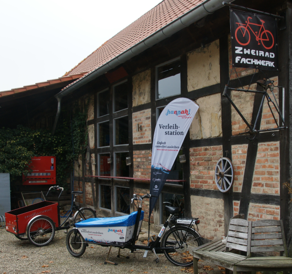

In dem Artikel zur Berliner Straße vom 21. Oktober 2015 ist uns ein kleiner Kommunikationsfehler unterlaufen. Wir hatten beschlossen und meinen wir es auch so, dass der nördliche gemeinsame Fuß- und Radweg der Berliner Straße (zum Sender hin) mit dem "Zeichen 239" Gehweg, und dem Zusatzschild „Radfahrer frei“ in beiden Richtungen ausgeschildert wird. Leider wurde "beidseitig" statt "nördlich" kommuniziert.

>  Die ADFC Ortsgruppe Hemmingen Pattensen setzt sich für die durchgehende Beschilderung des nördlichen gemeinsamen Fuß- und Radweg der Berliner Straße in Hemmingen mit dem "Zeichen 239" Gehweg,  und dem Zusatzschild „Radfahrer frei“ in beiden Richtungen ein. Damit gibt es keine Änderungen der Gewohnheiten. Auf Gehwegen  mit  dem  Zusatzschild  „Radfahrer frei“ ist das Radfahren erlaubt – aber nicht vorgeschrieben.  Selbstverständlich dürfen Fußgänger keinesfalls  behindert  oder gefährdet  werden. Ein Schutzstreifen auf der südlichen Seite der Berliner Straße ist nicht erforderlich, dadurch gibt es auch keinen Wegfall von Parkplätzen. Radfahrende Menschen die sich mit Fußgängern den Weg nicht teilen möchten, können auf der jeweils rechten Straßenseite fahren sind unter diesen Bedingungen keine "Verkehrssünder" mehr.

Ein Team von vier ADFC'lern ist am Samstag den 31. Oktober 2015 bei mildem Herbstwetter und Rückenwind von Hemmingen nach Wennigsen geradelt, um **hannah** dort abzuholen. Dort angekommen wurde eines der mitgebrachten Räder zusammengefaltet und in die Lastenbox verfrachtet. Mit dem Faltrad im Gepäck und voller Batterie-Ladung ging es dann die 15 km zurück zum Verleih-Standort.

<!-- Gab es eine **11. Abendtour** am 14. Okt? -->

Der **8. Radlertreff**, der 2. Öffentliche nach der Ortsgruppen Gründung, fand am 7. Oktober 2015 in der Begegnungsstätte Arnum statt. Sieben interessierte Teilnehmer diskutierten zweieinhalb Stunden über die Rad-Verkehrspolitik in Pattensen und Hemmingen. Auf der Tagesordnung standen Themen wie, die Erörterung des Planfeststellungsverfahrens der Verlängerung der Stadtbahn nach Hemmingen Westerfeld die am gleichen Tag statt fand und an der wir teilgenommen haben, die Bürgersprechstunde zum Thema Verkehrsanbindung in Devese, die zeitgleich statt fand und von einem weiterem ADFC Mitglied besucht wurde.

Anlässlich des Bürgertreffs wurde die Radwegverbindung von und nach Hemmingen thematisiert. Aus Sicht des ADFC müssen für die in der Verlängerung der K221 geplante Radwegverbindung insbesondere sichere Querungen der Fahrbahnen berücksichtigt werden.

Es gab ein Bericht über die letzten fünft Radtouren, ein Bericht über die Fahrrad-Erkundungstour in Pattensen, die von Bündnis 90 / DIE GRÜNEN organisiert wurde. Das Ergebnis wurde diskutiert. Eine Mängelkarte Hemmingen-Pattensen soll demnächst auf unserer Web-Seite eingerichtet werden, außerdem wurde die Begleitung eines Radschulwegplans (KGS-Pattensen) durch einem ADFC Fachmann erörtert. Zur Zeit werden drei weiterführende Schulen in der Region Hannover begleitet. Im nächsten Jahr könnte auch Pattensen unterstützt werden.

Dann gab es noch einen Bericht über die Aktivitäten des Flüchtlingsnetzwerks in Pattensen. Durch unsere Ankündigung zum Radlertreff wurde ein weiteres Damenrad angeboten. In diesem Zusammenhang wurde auch über das Interesse an einer Selbsthilfewerkstatt für Jedermann diskutiert.

Ein weiteres Thema war die Radweg Beschilderung an der Berliner-Straße in Hemmingen.

>  Die ADFC Ortsgruppe Hemmingen Pattensen setzt sich für die durchgehende Beschilderung des nördlichen gemeinsamen Fuß- und Radweg der Berliner Straße in Hemmingen mit dem "Zeichen 239" Gehweg,  und dem Zusatzschild „Radfahrer frei“ in beiden Richtungen ein. Damit gibt es keine Änderungen der Gewohnheiten. Auf Gehwegen  mit  dem  Zusatzschild  „Radfahrer frei“ ist das Radfahren erlaubt – aber nicht vorgeschrieben.  Selbstverständlich dürfen Fußgänger keinesfalls  behindert  oder gefährdet  werden. Ein Schutzstreifen auf der südlichen Seite der Berliner Straße ist nicht erforderlich, dadurch gibt es auch keinen Wegfall von Parkplätzen. Radfahrende Menschen die sich mit Fußgängern den Weg nicht teilen möchten, können auf der jeweils rechten Straßenseite fahren sind unter diesen Bedingungen keine "Verkehrssünder" mehr.

Weiterhin wurde unsere Einwendung zum Kiesabbau Wilkenburg bestätigt.

Die Organisation des *kostenlosen E-Lastenrad Verleihs* wurde besprochen. Ein E-Lastenrad des ADFC Region Hannover wird vom 2. November für einen Monat in Hemmingen zum kostenlosen Ausleihen bereit stehen. Ort: Zweirad-Fachwerk-Hische - Kapellenweg 6 - 30966 Hemmingen. Das Rad kann schon jetzt über die Web-Seite <http://www.hannah-lastenrad.de/cb_items/hannah-3> gebucht werden.

Diskutiert wurde auch über mögliche Vorträge in den Wintermonaten, Möglich wäre ein Vortrag über Drahtesel, eine Tour durch west Afrika oder eine Einführung in die Erstellung und Nutzung einer [openstreetmap](http://www.openstreetmap.org/#map=12/52.2979/9.7490) Karte.

Weiterhin wurde beschlossen, dass wir in Zukunft drei E-Mail Listen führen werden. Eine Liste für Verkehrspolitische Themen, eine Liste für Tourenpläne und eine allgemeine Liste für Ankündigungen. Wer auf einer der Listen stehen möchte, möge sich bitte mit uns über die üblichen Kontakte in Verbindung setzen.

Der nächste Radlertreff ist für Ende November im Mehr Generationen Haus (Mobile) in Pattensen geplant.

Die **Firma Holcim plant einen Kiesabbau** südwestlich von Wilkenburg. Die Planungsunterlagen des Planfestellungsverfahren lagen bis zum 18.09.2015 im Rathaus Hemmingen aus. Die Zufahrt geschieht über die Wülfeler Straße (L 389) zwischen Arnum und Wilkenburg. Der östliche Verbindungsweg, Arnum-Süd bis Wilkenburg wird tangiert. Der im Plan eingezeichnete Alternativ-Weg existiert nicht mehr. Wir haben Einwendungen erhoben.

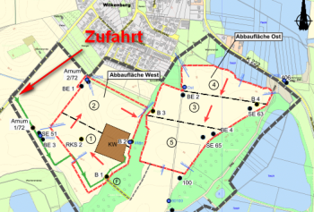

<iframe width="100%" height="300px" frameBorder="0" src="http://umap.openstreetmap.fr/de/map/adfc-hemmingen-pattensen_52057?scaleControl=false&miniMap=false&scrollWheelZoom=false&zoomControl=true&allowEdit=false&moreControl=true&datalayersControl=true&onLoadPanel=undefined&captionBar=false"></iframe>

*Bitte Stecknadeln anklicken*

Die **10. Abendradtour** wurde von vier Herren gefahren. Wir sind über Wettbergen und Empelde am Bentherberg vorbei über Davenstedt und Bornum, Wettbergen und Devese gefahren. Alles ohne Pannen aber in schöner Abendsonne ca. 27km von 18:15 bis 19:45Uhr.

Die **9. Abendradtour** am Mittwoch den 16.09.2015 begann mit einer Felgenpanne, das kann passieren. Danach wurde es doch noch eine ordentliche Tour.

Die **8. Abendradtour** am Mittwoch den 02.09.2015 war, mit 5 Teilnehmern, 34,1 km lang. Wir sind mit einer Dame und vier Herren über Hemmingen Altes-Dorf, Wilkenburg, Reden, Koldingen bis Ruthe an den Zusammenfluss der Innerste und Leine geradelt. Nach einer kleinen Pause auf der Route durch die Koldinger Teiche durch die Leinemasch zurück in der Abendsonne zum Rathausplatz.

Die Region hat die **Aufstellung des Vorrangnetzes** (Alltagsradverkehr) im August 2015 abgeschlossen. Die Abschlussveranstaltung des Projekts "Vorrangnetz für den Alltagsradverkehr" wird im Herbst 2015 stattfinden. Hier der [Link](http://www.pgv-hannover.de/Download/A-RN011-Netzbedeutung/A-RN%20011%20-%20Plan%203%20-%20Netzbedeutung_020715.pdf) zum aktuellen Plan.

Eine **Fahrrad-Erkundungstour in Pattensen** fand am Samstag, 15.08.2015 um 10 Uhr statt! Bündnis 90 / DIE GRÜNEN trafen sich um 10 Uhr
am Ratskeller in Pattensen, um gemeinsam Pattensen aus Sicht eines
Fahrradfahrers zu erkunden. Ziel dieser Tour war es, die Gefahren- und
Schwachstellen aufzunehmen und zu dokumentieren. Diese
Auflistung wollen Bündnis 90 / DIE GRÜNEN der Stadt Pattensen als **Maßnahmenvorschlag**
überreichen. Ein zukünftiges Mitglied des ADFCs war mit dabei.

Am 05. August fand **eine weitere, die 7. schöne Tour** durch die Eilenriede bis zur Schleuse in Anderten und über den Kronsberg und Leinemasch bei herrlichem Sonnenschein ca. 34 km mit drei Herren und einer Dame. Dieses mal sogar mit Einkehr im Biergarten am Annateich zur Apfelschorle.

Die sechste **Radtour** fand am Mittwoch den 22.07.2015 mit Start vom Rathausplatz in Hemmingen statt. Die Tour ging mit 5 Leuten und 28 km rund um den Bentherberg.

Am 21.07.2015 hatte der ADFC einen ersten Kontakt zum **Tiefbauamt in Pattensen**. Es war ein sehr kooperatives Gespräch, das auf eine gute Zusammenarbeit in der Zukunft schließen lässt. Als fahrradfreundlichen Hinweis haben wir erfahren, das es auf dem zukünftigen Marktplatz Fahrradbügel geben wird.

14 Hemminger und Pattenser Radfahrerinnen und Radfahrer trafen sich am Dienstag, 14. Juli, um 19:00 Uhr im [mobile](http://mobile-pattensen.de/) in Pattensen, um sich über Radverkehrsthemen auszutauschen.
Gastrednerin war Dagmar Moldehn, die [Klimaschutzmanagerin](http://www.pattensen.de/Default.aspx?tabid=7070) der Stadt Pattensen, die ihre geplanten Aktivitäten rund um klimaneutrale Mobilität vorgestellt hat.

Die Bündnesgrünen und der BUND wollen ein Kataster für Pattensens Fahrradwegenetz erstellen. Eine Besichtigungstour wird demnächst stattfinden. Mängel sind zum Beispiel fehlende Fahrradbügel am ZOB und auf dem Marktplatz.  Der ADFC möchte eine enge Zusammenarbeit mit dem der Verwaltung, insbesondere dem Tiefbauamt aufbauen, nur so lassen sich kleinere Probleme zeitnah lösen. Die Klimaschutzmanagerin möchte zusammen mit dem Schulen, der Polizei und dem ADFC Schulwegpläne erstellen, um einen sicheren Radweg auszuweisen.
*Siehe auch Leine Nachrichten vom 16.07.2015.*

**B3 - Bauphase** - Stadt und Land legten am 8. Juli um 18:00 in der Carl-Friedrich-Gauß-Schule den Fahrplan für B3 Sperrungen vor. Die gute Nachricht: Wenn die K 221 wegen des Kreiselbaus gesperrt wird, bleibt der nördliche liegende Fuß- und Radweg geöffnet.

**Die fünfte Radtour** mit fünf Leuten, eine Dame und vier Herren fand am 08.07.2015 bei kühler Witterung statt. Eine Strecke von 28,9km über Bornum und Bentherberg und KZ-Gedenkstätte Ahlem bis zur Historischen Ziegelei (Willy Spahn -Park).

**Das Netzwerk Flüchtlingshilfe** bot eine weitere Fahrradwerkstatt am 2. Juli in Pattensen an.

**Vierte Radtour** führte am 24.06.2051 bei schönem Sonnenschein zum Bentherberg.

Vom 08.05.2015 bis 08.06.2015 lagen in der Stadt Pattensen das **[Planfeststellungsverfahren](http://www.hannover.de/Leben-in-der-Region-Hannover/Verwaltungen-Kommunen/Bekanntmachungen-Ausschreibungen/Amtliche-Bekanntmachungen/Planfeststellungsverfahrens-f%C3%BCr-den-Umbau-des-Knotenpunkts-B-3-K-203-Wirtschaftsweg-%C3%B6stlich-Oerie-im-Zuge-der-B-3-Stadt-Pattensen) für den Umbau des Knotenpunkts B 3 / K 203 / Wirtschaftsweg** östlich Oerie im Zuge der B 3 (Stadt Pattensen) zur allgemeinen Einsichtnahme aus.

- Nach erster Durchsicht fehlt eine Querungshilfe in Richtung Oerie.  
- Stellungsnahmen waren bis 24.06.2015 möglich und wurden von uns eingereicht. Danke an die Nachbar OG Gehrden / Ronnenberg.
    - 04.08.2015: Der **Knotenpunkts B 3 / K 203 / Wirtschaftsweg** östlich Oerie bekommt nach dem Umbau keine Querungshilfe.

**Dritte Radtour** war am 17.06.2015 um 19 Uhr mit einer Strecke von 27 km.

**Das Netzwerk Flüchtlingshilfe** bot die erste Fahrradwerkstatt am 11. Juni in Pattensen an. Wir waren dabei.
Die Fahrradwerkstatt wird bis zu den Sommerferien immer donnerstags ab 18 Uhr vor dem Rathaus Pattensen aufgebaut.

**Zweite Radtour** war am 03.06.2015 um 19 Uhr mit Start am Rathausplatz in Hemmingen.

**Erste Radtour** war am 27.05.2015 um 19 Uhr mit Start am Rathausplatz in Hemmingen.

**Sechstes Treffen** war am 28.05.2015 um 19 Uhr bei Mutter Buermann - Devese.

-  Thema war die Besprechung unserer Einwendungen zu dem Planfeststellungsverfahren - Planänderung - Oberirdische Stadtbahnverlängerung nach Hemmingen  im Bereich der Stadtbahnstrecke A-Süd  
- Die schriftlichen Einwendung wurden am 03.06.2015 bei der Niedersächsischen Landesbehörde für Straßenbau und Verkehr eingereicht.

**Die Ortsgruppengründung** fand am 19.05.2015 im Hemminger Bürgersaal Rathaus statt. Ankündigung stand in der [rings um uns](img/2015-05-13 LN AnkOrtsgruppengründung.pdf) und in der [HannoRad 1|2015](http://www.adfc-hannover.de/hannorad/) auf Seite 28.

Das **vierte Treffen** fand am 11.03.2015 bei Mutter Buermann statt. Thema war die Vorbereitung zur Ortsgruppengründung und Übersicht über die politschen Ereignisse. U. a.

- Status unsere Einwendungen Stadtbahnverlängerung
- Zweirichtungsradweg an der Brückstraße
- Pictrogramme auf der L 389
- Verteilung der HannoRad
- Antrag der CDU u. Grünen über Fahrradstraßen
- Antrag über Planungskostenvorstreckung für Radweg an der L 389
- Entgültiges SHP Radverkehrskonzept
- Erfahrungen zu den LED Markern

Am 03.12.2015 wurde von SHP das **[Radverkehrskonzept](https://www.stadthemmingen.de/stadt-gestalten/verkehrsplanung-fuer-hemmingen/radverkehr/) vorgestellt**. Der ADFC hat unter anderem eigene Vorschläge eingebracht.

Am 01.12.2014 wurde der ADFC zur Regionalkonferenz von der Planungsgemeinschaft Verkehr eingeladen. Tagesordnungspunkt  war die **Abstimmung des "Vorrangnetz"**. Der ADFC Hemmingen Pattensen konnte hier eine optional Route von Pattensen bis Döhren durchsetzen.

Am 24.10.2014 gab es das **3. Treffen**. Themen waren u. a.

- Berichte aus den Ausschusses für Stadtentwicklung
- Fahrradstraße (Von Klapperweg bis Köllnbringweg)
- Auswirkung der B3 Neu auf den Radverkehr
- Radwegebenutzungspflicht

Am 23.07.2014 haben wir zur **Großen Runde** eingeladen. Die Einladung geschah per Brief an alle Mitglieder. Auch das Wegeteam Pattensen war eingeladen und gekommen. Themen waren u. a.:

- Das Radverkehrskonzept
- Einwendungen zu dem Planfeststellungsverfahren - Oberirdische Stadtbahnverlängerung nach Hemmingen  im Bereich der Stadtbahnstrecke A-Süd
    - Die Einwendungen wurden Ende Juli termingerecht eingereicht.

Am 17.02.2014 gab es die **erste Kontaktaufnahme zum Tiefbauamt in Hemmingen**.

Am 21.11.2013 wurde der ADFC Hemmingen in der Stadtverwaltung Hemmingen
zur gemeinsam Erörterung des SHP-Gutachtens „**Radwegebenutzungspflicht im Bereich Hemmingen**“ eingeladen.

**Erste Kontaktaufnahme mit dem ADFC Region Hannover** fand am 30.10.2013 bei Mutter Buermann statt. Anwesend waren Vertreter des Regions Vorstandes und der Ortsgruppe Gehrden/Ronnenberg  

----
Letzte Aenderung: LetzteAenderung
